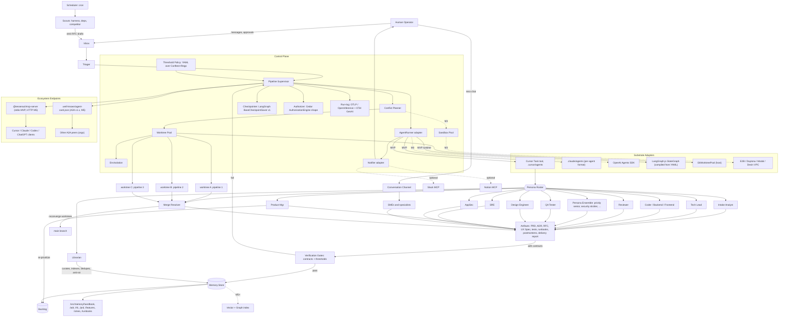
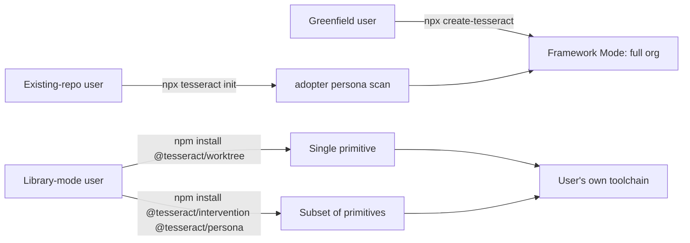

# Tesseract — Simulated Product-Org Agentic Development Ecosystem

> **Status:** Draft v0.4 — SOTA-alignment pass. Cross-agent research found high cross-confidence on ~22 substrate-adoption recommendations. v0.4 swaps internals to battle-tested SOTA libraries while preserving every Tesseract-novel abstraction. **Key adoptions (all high-confidence):** LangGraph.js `BaseCheckpointSaver` v1 schema + `StateGraph` runtime; OpenInference + OTel GenAI semconv for run-log; Claude Code `.claude/agents/*.md` 16-field persona spec (auto-shimmed to Cursor `.mdc`); AGENTS.md as primary cross-tool contract; Agent Skills open spec (`agentskills.io`); GitHub Spec Kit file conventions for `/src/memory/features/<id>/`; Mergiraf 0.16.x as default merge driver; Conftest + OPA Rego under threshold-policy YAML; Schemathesis v4.8 at M2 (not M3); AutoGen/AG2 GroupChat as Persona Ensemble runtime (with operationalized sycophancy parameters per 2025–26 MAD literature); GEPA + Voyager-style metadata for M8 self-improvement; Mem0-shaped + Letta-tier `MemoryStore` interface; AST-symbol + content-hash citations (not bare `path:line`); Cedar `AuthorizationEngine` shape for `Authorizer`; MCP server (`@tesseract/mcp-server`) + MCP elicitations for human interfaces; A2A v1.x bring-forward to M5; Mastra-style monorepo tooling (pnpm catalogs + Turborepo + Changesets + `arethetypeswrong` + `publint`); Claude-Code-aligned CLI flag vocabulary + JSON key schema + `gh`-style exit codes. **Key new primitives:** `EnvIsolation` (single biggest US-6 gap), `SandboxPool` (E2B/Daytona/Modal for untrusted code), `@tesseract/mcp-server`, `@tesseract/a2a`, `@tesseract/adopter-scan`. **Defended novelties:** touch-set + Conflict Planner, no-silent-merges resolver composition, per-artifact `contract:` blocks as gates, named-character Persona Ensemble dissent surface, long-lived SMEs, inbox-as-org-interface, 7-lever Intervention spectrum, adopter non-destructive scan, Watchdog suggest-don't-auto-apply, Conversation-Mode promotion, library-mode + framework-mode duality, run-log → handbook diff loop with mandatory ensemble ratification. v0.4 changes: §2 G7 hardened; §3.5 unchanged; §4 adds 10 glossary terms; §5 architecture redrawn with substrate adoptions; §5.5 rewritten with concrete Mastra-style tooling + 5 new packages; §6 persona format swapped to Claude Code spec + ensemble runtime adoption; §7 pipelines + intervention semantics map to LangGraph primitives, threshold policy → Conftest, run-log → OpenInference + OTel GenAI, behavior-preservation contract layered; §8 memory adopts dual-anchor citations + Spec Kit paths + Mem0/Letta interface; §9 CLI gains Claude-Code-aligned flag vocabulary + MCP verbs; §10 observability rewritten; §11 MVP scope substantially expanded (no scope creep — concrete substrates replace hand-rolled ones); §12 milestones rebalanced (Mergiraf/Schemathesis/runner-claude pulled forward; A2A pulled to M5; SandboxPool added at M3; GEPA/Voyager named at M8); §13 adds Q16-Q22 + R20-R26; §14 adds A19-A21.
> **Codename:** `tesseract` (matches repo name; the 4D motif fits the four orthogonal axes: *roles × pipelines × memory × process*).
> **Substrate:** Cursor-first, portable. **Distribution:** open-source framework devs install into their own repos.

---

## 1. Thesis

> *Agentic development becomes accurate and automatic when it is couched within a well-established paradigm — the simulated product organization — and it can then exceed traditional orgs in exactly those areas where humans are structurally weakest: institutional memory, vigilance, exhaustive review, and deterministic process compliance.*

Three research streams (harnesses SOTA, traditional SDLC, traditional weaknesses) converge on a single design opportunity: **the connective tissue of software development is the human moat in reverse**. Bus-factor concentration is the norm not the exception ([Jabrayilzade 2022](https://arxiv.org/pdf/2202.01523)); ~29% of top-1000 GitHub repos carry stale doc references *for years* ([Wen 2024](https://export.arxiv.org/pdf/2212.01479v1.pdf)); reviewer fatigue collapses useful-comment rates with PR size ([Bosu 2015 MSR](https://www.microsoft.com/en-us/research/publication/characteristics-of-useful-code-reviews-an-empirical-study-at-microsoft/)); 44% of outages stem from suppressed alerts ([NeuBird 2026](https://infrazen.io/blog/alert-fatigue-trap-2026)); Knight Capital, Equifax, GitLab, Cloudflare and Boeing 737 MAX all share a "skipped check by a tired human" root cause. Agents have *structural* advantages on every one of these failure modes.

Conversely, agents have *structural disadvantages* on taste, novel design, ethical judgment under genuine novelty, and political accountability — so the system must always preserve a human accountable seat (DORA 2024 already shows naive AI bolt-ons hurt team-level delivery while raising individual productivity ([DORA 2024](https://dora.dev/research/2024/dora-report))).

Tesseract takes the simulated-org metaphor seriously: it borrows *roles, ceremonies, artifacts, and decision frameworks* from canonical sources (Cagan/Torres on discovery, Larson/Reilly/Fournier on engineering ladders, Skelton/Pais on team topologies, Google SRE on operations, Allspaw on blameless postmortems, Basecamp on Shape Up, Bain on RAPID), but it *does not* import the human pathologies (cargo-cult ceremony, estimation theater, status meetings as visibility-tax, hero culture).

---

## 2. Goals & Non-Goals

### Goals (MVP through M3)

- **G1.** Provide a small library of well-specified subagent personas (≥5 in MVP, ≥15 by M3) that map cleanly onto canonical product-org roles and produce canonical artifacts (PRDs, ADRs, RFCs, runbooks, postmortems).
- **G2.** Provide composable, declarative *pipelines* that orchestrate subagent teams under a supervisor, with explicit plan/execute/verify phases, code-level circuit breakers, and human approval gates tied to risk tier.
- **G3.** Provide durable, citation-backed institutional memory (`/src/memory/`) that survives context-window compression and is the system's source of truth — a "GitLab handbook for agents."
- **G4.** Provide a human inbox (file-based + optional Slack/Notion) so humans can *talk to the org*, not to individual agents — and a CLI/admin surface to *observe* it.
- **G5.** Provide a control-plane abstraction (`AgentRunner`, `MemoryStore`, `Inbox`, `Notifier`) that runs natively on Cursor today and can later port to Claude Code subagents, OpenAI Agents SDK, and LangGraph.
- **G6.** Be installable into both **greenfield** repos (`npx create-tesseract my-app`) and **existing** repos (`cd my-repo && npx tesseract init`) with zero infrastructure beyond a git repo and a Cursor/Claude Code install. Adoption into existing repos is *non-destructive* and seeded by an `adopter` persona that scans the codebase.
- **G7.** Ship as both a **framework** (opinionated, full org, conventions everywhere — Rails-like) *and* a **library** (cherry-pick individual primitives — a single persona, the worktree pool, the conflict planner — into another toolchain). Every primitive is independently importable, configurable without depending on a global `tesseract.yaml`, and documented as a standalone how-to. Where SOTA OSS standards exist (LangGraph `Checkpoint v1`, OpenInference + OTel GenAI semconv, Claude Code agent frontmatter, Agent Skills open spec, AGENTS.md, MCP, A2A, Cedar `AuthorizationEngine`, Conftest/Rego), `@tesseract/<primitive>` MUST be a *conformant implementation*, not a parallel design.

### Non-goals (explicit)

- **NG1.** No hosted multi-tenant SaaS in MVP — single-user, single-repo, file-system-backed. **[RATIFY]**
- **NG2.** No custom model training; we orchestrate, not fine-tune.
- **NG3.** No replacement of human judgment on *what to build* or *whether to ship* — humans retain product/ethical accountability.
- **NG4.** No bespoke web UI in MVP — observability via CLI + repo state + (optional) existing surfaces (Cursor's Background Agent panel, GitHub PR UI).
- **NG5.** No attempt to ship a new agent harness; we sit *on top* of Cursor/Claude Code/MCP, not under them.

---

## 3. Target Users

- **Primary:** Solo / small-team developers using Cursor who want to feel like they have a 10-person product org behind them, with the discipline of one but without the overhead.
- **Secondary:** Small startups (2–10 engineers) using the framework as a shared "process operating system."
- **Tertiary (M5+):** Open-source maintainers who want PRD/ADR/RFC/postmortem rigor without bringing on a PM/SRE/SDET hire.

---

## 3.5. Anchor User Stories

These stories are non-exhaustive but normative — every architectural decision in §5–§9 must trace back to at least one of them. Each is annotated with the milestone it lands in and the requirements it implies.

### US-1 — *"Deliver the backend for feature A"* — **M1 (MVP)**

> *As an engineer, I want to implement the backend for complex feature A. I write out a semi-formal specification and feed it to Tesseract's software delivery pipeline. The coordinating agent interacts with me to clear up any ambiguities, ensures my spec is transformed into the system's internal representation of eng specs, and then kicks off the pipeline. The backend is implemented, tested, reviewed, and after a few such cycles, delivered. I receive a report in my inbox with a high-signal summary about the architecture, interfaces, tradeoffs, usage guidelines, etc.*

Implies:

- An `**intake-analyst`** persona that runs a *spec-canonicalization* sub-pipeline: ingests informal markdown → asks clarifying questions back through the inbox → emits a canonical *Engineering Spec* artifact (`/src/memory/features/<id>/eng-spec.md`).
- The pipeline is **multi-cycle**: implement → review → fix → review → ship, with bounded loop count.
- A `**tech-writer`** post-pipeline step produces a high-signal *Delivery Report* (`/src/memory/features/<id>/delivery-report.md`) covering architecture, interfaces, tradeoffs, usage guidelines — explicitly *not* a changelog. Delivered to `src/inbox/out/`.

### US-2 — *"Talk to a designer specialist"* — **M2**

> *As an engineer, I'm opinionated about design but don't have formal training in design and don't "speak the language." I start a chat with a design specialist subagent and lay out a rough idea of what I want the UX for feature A to be. After a few back-and-forths, it's refined and formalized my ask into a UX design document. The document is added to the knowledge base and indexed as being associated with feature A.*

Implies:

- A first-class **Conversation Mode** alongside Pipeline Mode: `tess chat <persona> [--feature <id>]` opens a long-running thread with a single persona.
- A `**design-engineer`** persona that is dialogue-first, speaks the design language, and produces a canonical *UX Spec* artifact when the dialogue concludes.
- A first-class **Feature** entity with its own folder (`/src/memory/features/<id>/`) and `index.json` linking PRD, UX Spec, ADR(s), code paths, tests, runbook, postmortems.
- The Librarian's indexing fans out to the Feature index automatically when artifacts are emitted under a feature scope.

### US-3 — *"Frontend delivery enforces the UX spec"* — **M2**

> *As an engineer, I kick off a delivery pipeline to implement the frontend for feature A. The system pulls in the UX design document and incorporates it into the verification gates — frontend delivery will be blocked if the design spec isn't followed.*

Implies:

- **Spec Contract** as a first-class concept: an artifact (UX Spec, API Spec, Threat Model, ADR) declares a `contract:` block listing *machine-checkable* assertions (e.g., "all interactive elements have visible focus state," "color contrast ≥ WCAG AA," "API endpoint returns 401 on missing token").
- A `frontend-delivery` pipeline pulls all in-scope contracts for the feature and runs them as **verification gates**. MVP: contract assertions are LLM-judged against running code or screenshots; M3+: integrate Playwright/visual-diff/axe-core for deterministic checks.
- Gate failures route the pipeline back to `coder` with the failed contract list as input — *the contract is the spec; the spec is the gate*.

### US-4 — *"Configure thresholds per pipeline"* — **M2**

> *As an engineer, I should be able to configure thresholds for a specific delivery pipeline across multiple dimensions (e.g. test coverage, specific regression checks, UI drift).*

Implies:

- A **Threshold Policy** schema that lives next to each pipeline (or as a per-feature overlay): `coverage.statement: ">=80%"`, `regression.suites: [auth, billing]`, `ui.drift.maxPx: 4`, `bundle.size.delta: "<=2%"`, `risk_tier: medium`. Per-pipeline + per-feature override + per-run override (`--threshold ...`).
- Threshold violations are first-class gate failures — same handling as contract failures.
- Defaults shipped in `tesseract-defaults.yaml`; user overrides in `tesseract.yaml` at repo root. Config schema validated by the control plane on load.

### US-5 — *"Lunch RFC: scouts, persona ensembles, SMEs, backlog"* — **M4**

> *As an engineer, I take lunch. I come back to find a new item in my inbox. A research subagent has distilled some of the latest developments in agentic harness design into an RFC proposing changes to Tesseract's infrastructure. I read it, then spin up multiple subagents representing different engineer personas (e.g. the prickly senior, the magnanimous staff, the security stickler) and have them + long-lived SME subagents review and collectively refine the RFC. After a few iterations, a PM subagent folds the idea into and re-prioritizes the product backlog.*

Implies four new primitives:

- **Scouts** — proactive, scheduled personas (e.g., `harness-scout`, `dependency-scout`, `competitor-scout`) that wake on a cron, scan a configured information frontier, distill findings, and *open RFCs in `/src/memory/rfc/draft/*`. Output is always an RFC, never a chat message — so the artifact survives.
- **Persona Ensemble Review** — a review pattern that instantiates a configurable cohort of *named, opinionated* personas (`prickly-senior`, `magnanimous-staff`, `security-stickler`, `pragmatic-pm`, `cost-conscious-platform`) against an artifact, with explicit dissent encouraged. Inspired by [BoN-MAV multi-judge verification](https://openreview.net/forum?id=LriQ3NY9uL); operationalized as a deliberation loop that surfaces disagreement, not consensus theater.
- **Long-lived SMEs** — *persistent* personas (vs. ephemeral task agents) that own a domain (`sme-postgres`, `sme-stripe-billing`, `sme-frontend-perf`, `sme-our-auth-stack`). Each has a private memory folder (`/src/memory/smes/<name>/`) that accumulates across sessions; they are first-citizens of the inbox and can be DM'd or invited into ensemble reviews. Onboarding a new dependency creates a new SME.
- **Backlog as live entity** — `/src/memory/backlog/` is a ranked, structured list of opportunities/features/RFC-derived work. The `pm` persona owns re-prioritization. The backlog is *the* product roadmap, computed not declared.

### US-6 — *"Parallel pipelines on worktrees with auto-merge"* — **M2 (basic) / M3 (semantic merge)**

> *As an engineer, I'm able to actively drive a specific delivery pipeline while the system works on other pipelines in parallel on different work trees, having confidence that the worktrees will ultimately re-converge, with any merge conflicts resolved without breaking anything. I also know the system actively works to minimize the probability of merge conflicts before spinning out a cohort of delivery pipelines.*

Implies three new primitives:

- **Worktree Pool** — pipelines execute in isolated `git worktree` directories under `.tess/worktrees/<task-id>/` (Cursor's `best-of-n-runner` already pioneers this pattern). The Worktree Pool is managed by the control plane: allocate, reserve, dispose, GC.
- **Conflict Planner** — *before* fanning out a cohort of pipelines, a planner persona analyzes the task DAG against repo file/symbol ownership and (a) sequences mutually-conflicting tasks, (b) splits tasks at file boundaries to maximize parallelism, (c) declares a *touch-set* per task that locks files for write across siblings. Borrows from build-system change-set analysis (Bazel, Buck) and from the Critical Chain literature.
- **Semantic Merge Resolver** — when worktrees re-converge, a `merge-resolver` persona attempts merges; on conflict it re-runs each side's tests + the merged tests; if either fails, opens an inbox item rather than guessing. *No silent semantic merges.* M3+ may integrate dedicated tools (e.g., Mergiraf, semantic-merge research).

### US-7 — *"Broken-windows grooming"* — **M3** (default mode shipped: **propose-only**, with `auto-pr` as a per-repo opt-in)

> *As an engineer, my codebase steadily accumulates entropy: dead code, duplicated helpers, naming drift, commented-out paths, files that grew too long, modules with no owner. I want a continuous **groomer** persona that walks the codebase between feature pipelines, scoring each file/module against a configurable smell budget, and proposes small, scoped, low-risk refactor PRs that fit cleanly through the same review/test/contract gates as feature work. Crucially, it never bundles refactors into feature PRs (which obscures both), and it never opens more than N concurrent refactor PRs (so it doesn't drown my review queue). When it can't safely refactor — because of cross-cutting touch-set conflicts — it instead opens a small ADR-style note recommending a future restructure.*

Grounded in the weakness research: Nilsson 2024's broken-windows experimental evidence (devs in debt-laden code re-implement vs. reuse, pick poor names, and add new smells) and Sonar's "interest payment" framing of debt at $306k/yr/1M LOC.

Implies:

- A new `**groomer`** persona — read-mostly, opens *small* PRs, lives behind strict per-week PR-count and per-PR LOC caps (`max_pr_lines: 200`, `max_concurrent_open: 3`, `weekly_pr_budget: 5`, all configurable). Co-existence with `conflict-planner`: groomer touch-sets always yield to feature-pipeline touch-sets (refactor work is preemptible).
- A new `**tech-debt-scan`** pipeline (cron) — produces `/src/memory/debt/inventory.md` ranked by smell density × change frequency × business value.
- A `debt-grooming` pipeline that picks one high-value item, runs through standard `feature-delivery` gates with `risk_tier: low` and a special **behavior-preservation contract** (all existing tests pass *and* mutation-test score does not regress).
- **Configurable mode**: `tesseract.yaml: grooming.mode: propose | auto-pr`. Default = **propose-only** (drafts refactor RFCs into `/src/memory/rfc/draft/` for human/ensemble ratification before any code change). Per-repo opt-in to `auto-pr` for fast-moving solo teams.
- A `tess debt` CLI surface for human visibility (US-7b extension): inventory listing, weekly debt-budget burn-down posted to inbox.
- Memory: `/src/memory/debt/` (inventory, history, deferred-restructure ADR-style notes).

### US-8 — *"Framework or library — your choice"* — **MVP-foundational design constraint, primitives ratchet up across milestones**

> *As a developer, I want to give users the ability to either use the entire ecosystem or cherry-pick what they like into their own system (i.e. framework OR library mode).*

This is the most architecturally consequential story in the PRD: **library mode is a foundational design constraint, not a feature**. If we don't bake it in from MVP, retrofitting clean boundaries later is far more expensive than designing them in (R13 below).

Implies:

- **Two distribution modes**, both first-class:
  - **Framework mode** — `npx create-tesseract` (greenfield) or `npx tesseract init` (existing); installs the full opinionated org with conventions, persona roster, pipelines, scheduler, watchdog. Rails-/Next.js-style.
  - **Library mode** — `npm install @tesseract/<primitive>` for any single primitive (e.g., `@tesseract/worktree`, `@tesseract/conflict-planner`, `@tesseract/inbox`, `@tesseract/persona-runner`, `@tesseract/spec-contract`). Each primitive is importable into any other TS toolchain (LangGraph, OpenAI Agents SDK, plain Node script) without depending on Tesseract's CLI, conventions, or `tesseract.yaml`.
- **Module boundaries from day 1**: monorepo with `@tesseract/core` (shared types, no logic), `@tesseract/persona`, `@tesseract/pipeline`, `@tesseract/memory`, `@tesseract/inbox`, `@tesseract/worktree`, `@tesseract/conflict-planner`, `@tesseract/ensemble`, `@tesseract/policy`, `@tesseract/scout`, `@tesseract/intervention`, `@tesseract/cli`, plus a meta package `tesseract` that bundles them. **No circular dependencies between primitives.**
- **Every primitive ships with**: (a) a TypeScript public API, (b) a sensible-defaults inline config (works with zero external config files), (c) a standalone "Use this primitive in 5 minutes" how-to in its README, (d) at least one example using it *outside* Tesseract (e.g., the worktree pool used as a library by a non-Tesseract LangGraph script).
- **No primitive may require Tesseract's filesystem layout to function** — `MemoryStore`, `Inbox`, `WorktreePool` etc. accept paths as parameters, with framework-mode defaults that match `/src/memory/`, `/src/inbox/`, `.tess/worktrees/`.
- **API stability tiers**: each primitive declares `stability: experimental | stable | deprecated` in its package metadata, surfaced in the docs.
- See §5.5 below for the architectural realization.

### US-9 — *"Greenfield AND existing projects"* — **MVP**

> *As a developer, I want Tesseract to work for both greenfield repos and existing projects.*

Implies:

- Two install paths, both MVP-tier:
  - **Greenfield**: `npx create-tesseract my-app` scaffolds a complete repo with sample app, full Tesseract install, seeded handbook, working `feature-delivery` example.
  - **Existing**: `cd my-existing-repo && npx tesseract init` runs **non-destructively**: never overwrites an existing file; everything Tesseract owns lives under prefixed paths (`/src/memory/`, `/src/personas/`, `/src/skills/`, `/src/pipelines/`, `/src/inbox/`, `/.tess/`, `tesseract.yaml`); existing `AGENTS.md`, `.cursor/rules/`, `CLAUDE.md`, `.github/agents/` are *augmented*, not replaced.
- A new `**adopter`** persona (and `adopt` sub-pipeline) runs at first install on existing repos and:
  - Scans the codebase for language(s), framework(s), test infrastructure, CI config, dependency manifests, license, code conventions.
  - Detects existing `AGENTS.md` / `.cursor/rules` / `CLAUDE.md` and writes a *merge plan* (additive only, with explicit conflicts surfaced to inbox).
  - Proposes initial **SMEs** to spawn (e.g., detected Postgres → propose `sme-postgres`; detected Stripe SDK → propose `sme-stripe`).
  - Drafts an initial **threshold policy** seeded from the existing repo's actual baselines (current coverage % becomes the floor, not an aspirational number) — so US-4 gates don't immediately fail on an existing repo.
  - Writes its findings to `/src/memory/adoption/scan-<date>.md` — a citation-bearing artifact, ratifiable by the human, replayable on `tess re-adopt`.
- **No-conflict guarantees**: `tess init` performs a dry-run and exits non-zero if it would touch any existing file; `--force` prints a diff and requires explicit confirmation per file.
- **Coexistence with existing CI/CD**: Tesseract pipelines invoke (not replace) the user's existing test/build commands via a configurable `tesseract.yaml: commands.test | build | lint`.

### US-10 — *"Multiple intervention levers when an agent goes off the rails"* — **MVP (basic) / M2 (full spectrum) / M5 (proactive watchdog)**

> *As an operator, if I suspect an agent is stuck, going down the wrong path, or otherwise in a bad state, I want multiple intervention levers appropriate for the situation (ranging from minor steering to full-on abort + revert).*

A **graduated intervention spectrum**, smallest blast radius first. Each lever is an explicit, named primitive — no "ctrl-C and pray." Inspired by progressive-delivery thinking (smallest possible reversible action; observability-rich).

- `**steer`** *(M2)* — inject a hint/correction into the agent's next turn without halting. Blast radius: next turn only. Reversible: the steer is itself a turn.
- `**pause`** *(M1, MVP)* — halt at the next safe checkpoint, await human input, resume on confirmation. Blast radius: zero — just stops the clock. Fully reversible.
- `**reroute`** *(M2)* — redirect to a different persona or stage in the pipeline (e.g., "stop coding, get a reviewer to look at what you have"). Partially reversible — keeps prior artifacts.
- `**snapshot`** *(M2)* — fork the worktree at current state for human inspection; parent run continues (or pauses, configurable).
- `**rollback`** *(M2)* — revert agent state + worktree to an earlier checkpoint within the run. Reversible — the rollback is itself a checkpoint.
- `**abort`** *(M1, MVP)* — kill the pipeline, dispose worktree, restore main branch. Partial reversibility: artifacts and run-log are preserved for postmortem.
- `**quarantine`** *(M2)* — freeze agent state and flag for ombudsperson/human review without losing context. Reversible (release from quarantine).

Implies:

- `**Intervention` interface** in the control plane (one of the §5 primitives), with a CLI surface (`tess steer | pause | reroute | snapshot | rollback | abort | quarantine`) and a programmatic API (library-mode usable per US-8).
- **Checkpointing** built into the supervisor: every stage boundary writes a checkpoint to `/src/memory/checkpoints/<task-id>/<seq>.json` (state + worktree commit hash + run-log offset). Borrows from LangGraph's checkpointer pattern.
- **Worktrees provide cheap rollback** by construction (just dispose and recreate from a checkpoint commit).
- **Safety invariants**: rollback/abort never destroy uncommitted *human* edits; quarantine preserves all state for postmortem; abort always emits a run-summary artifact for the Librarian.
- **Proactive watchdog** *(M5+, integrated with `ombudsperson`)* — passive monitor for stuck-state signals: no progress in N turns, repeated identical tool calls, budget burn without artifact production, contract failure with no fix attempted, exit-loop conditions hit. Watchdog *suggests* an intervention via inbox; it does not auto-intervene unless policy explicitly opts in.
- **Authentication**: in framework mode, intervention commands respect the user's repo credentials; in library mode, the `Intervention` API requires a caller-provided `Authorizer` (Q14 below). MVP punt: single-user, no auth.

---

## 4. Core Concepts (Glossary)

- **Persona** — a named subagent spec (`PM`, `TechLead`, `Reviewer`, ...) defined as a Markdown file with frontmatter (description, tools, permissionMode, model tier, mcpServers). Two lifecycles: *ephemeral* (spawned per task) and *long-lived* (SMEs).
- **SME (Subject-Matter Expert)** — a *long-lived* persona that owns a knowledge domain and accumulates a private memory under `/src/memory/smes/<name>/`. SMEs persist across pipelines and sessions and can be invited into ensembles or DM'd directly.
- **Persona Ensemble** — a configured cohort of *named, opinionated* personas (e.g. `prickly-senior`, `magnanimous-staff`, `security-stickler`) instantiated to deliberate over a single artifact and surface dissent. The structure of disagreement, not consensus, is the output.
- **Scout** — a *proactive*, scheduled persona that scans an information frontier (papers, changelogs, dependency releases, competitor sites) and emits canonical artifacts (RFCs, opportunity notes) — never chat messages.
- **Pipeline** — a declarative workflow (YAML or Markdown+frontmatter) that composes personas under a supervisor, with stages, gates, threshold policies, and outputs. Two execution modes: *Pipeline Mode* (DAG of stages) and *Conversation Mode* (long-running thread with one persona).
- **Conversation Mode** — interactive multi-turn channel between a human and one persona (typically a specialist or SME) that can be promoted to an artifact at any point (`/end --emit ux-spec`).
- **Feature** — a first-class entity (`/src/memory/features/<id>/`) binding all artifacts for a single product capability: PRD, RFC(s), ADR(s), UX Spec, code references, tests, runbooks, postmortems, delivery report. Has a unique slug ID and a generated `index.json`.
- **Backlog** — `/src/memory/backlog/` — the live, ranked product roadmap. Owned by the `pm` persona; computed from features, RFCs, opportunity-tree branches, and inbox asks. Re-prioritized continuously, never just at planning rituals.
- **Spec Contract** — a `contract:` block on any spec artifact declaring *machine-checkable* assertions. Pulled in as verification gates by downstream pipelines (e.g., a UX Spec contract is a gate for `frontend-delivery`).
- **Threshold Policy** — a per-pipeline/per-feature/per-run config block setting numeric/categorical thresholds on coverage, drift, regression suites, bundle size, etc. Treated as gate failures.
- **Worktree Pool** — managed pool of git worktrees under `.tess/worktrees/` for parallel pipeline execution; allocated/disposed by the control plane.
- **Conflict Planner** — pre-fan-out planner persona that analyzes the task DAG against repo file/symbol ownership to sequence or split tasks and minimize merge conflict probability before any pipeline starts.
- **Touch-set** — declared set of paths/symbols a task may write to; conflicts with sibling touch-sets force serialization or re-planning.
- **Artifact** — a durable file produced by a pipeline or conversation (PRD, ADR, RFC, UX Spec, test plan, runbook, postmortem, delivery report) — committed to the repo, citation-bearing, anti-rot-tracked.
- **Memory** — the union of `/src/memory/` (semantic + procedural), `/src/memory/smes/` (per-SME), `/src/memory/features/` (per-feature), `/src/memory/backlog/`, `/src/inbox/` (episodic), and the codebase itself.
- **Inbox** — bidirectional message queue between humans and the org (`src/inbox/in/`, `src/inbox/out/`, `src/inbox/threads/`). `src/inbox/notes/` is a human-operator-only sandbox excluded from agent traversal (canonical rule in `/src/memory/handbook/inbox-lifecycle.md` §1a).
- **Control Plane** — thin orchestration layer (`AgentRunner`, `MemoryStore`, `Inbox`, `Notifier`, `WorktreePool`, `Scheduler`, `Intervention`, `Authorizer` interfaces) that abstracts the underlying harness.
- **Skill** — a reusable procedure (Cursor `SKILL.md`-compatible) shared across personas — e.g. "write an ADR," "run a STRIDE threat model."
- **Framework Mode** — opinionated install of the entire ecosystem (full org, conventions, CLI, scheduler, watchdog). Default install path. (US-8)
- **Library Mode** — independent import of one or more primitives (`@tesseract/<primitive>`) into another toolchain, with no dependency on Tesseract's CLI, conventions, or `tesseract.yaml`. Each primitive is independently versioned and documented. (US-8)
- **Primitive** — a single, independently importable piece of Tesseract: persona-runner, pipeline, memory-store, inbox, worktree-pool, conflict-planner, ensemble, policy, scout, intervention. Each lives in its own `@tesseract/<name>` package.
- **Adoption (`adopter` / `adopt` pipeline)** — non-destructive first-run process for existing repos: scans codebase, detects conventions, proposes initial SMEs, seeds threshold policy from existing baselines, writes `/src/memory/adoption/scan-<date>.md`. (US-9)
- **Intervention** — a first-class, named operator action against a running pipeline. Seven levers, ordered by blast radius: `steer`, `pause`, `reroute`, `snapshot`, `rollback`, `abort`, `quarantine`. (US-10)
- **Checkpoint** — a serialized snapshot of pipeline state (stage, run-log offset, worktree commit hash, persona context summary) written at every stage boundary into `/src/memory/checkpoints/<task-id>/<seq>.json`. The substrate that makes `rollback` and `pause/resume` cheap.
- **Watchdog** *(M5+)* — passive monitoring component (within `ombudsperson`) that detects stuck-state signals and *suggests* (not auto-applies) an intervention via inbox.
- **Authorizer** — pluggable interface that gates intervention actions in library mode, **typed against Cedar's `AuthorizationEngine` shape** (offline OSS via `@cedar-policy/cedar-wasm` or `@verifiedpermissions/authorization-clients-js`). Framework-mode default = `LocalUserAuthorizer` (repo-credentials trust); production users plug Cedar (RBAC + ABAC, formally verified) without code changes.
- **Persona Spec Format** — Markdown with **Anthropic Claude Agent SDK 16-field YAML frontmatter** (`name`, `description`, `model`, `permissionMode`, `tools`, `disallowedTools`, `mcpServers`, `maxTurns`, `skills`, `isolation`, `memory`, `effort`, `color`, `hooks`, `initialPrompt`, `background`, plus Tesseract-specific extensions in a `metadata` map). Authored once at `src/personas/<name>.md`; a build step auto-emits a `.cursor/rules/<persona>.mdc` shim for Cursor users (the only Cursor-stable fields are `description`, `globs`, `alwaysApply`, so the shim is a 5-line transformer).
- **Skill Format** — Markdown conforming to the **Agent Skills open spec** (`agentskills.io`, Anthropic-stewarded, consumed verbatim by Cursor `SKILL.md`, Claude Code Skills, OpenAI Codex Skills); validated by `skills-ref` in CI. Folder convention: `src/skills/<name>/SKILL.md` plus optional `scripts/`, `references/`, `assets/`. Tesseract extensions go in the `metadata` map (`tesseract-stability`, `tesseract-pipeline-stages`, `tesseract-risk-tier`).
- **AGENTS.md** — repo-level Markdown briefing per the Linux Foundation Agentic AI Foundation standard; Tesseract's *primary* cross-tool contract. `CLAUDE.md`, `.github/copilot-instructions.md`, etc. are symlinks (or 3-line forwarders on Windows); `.cursor/rules/00-agents-md.mdc` is `alwaysApply: true` and references AGENTS.md.
- **EnvIsolation** — pluggable allocator for *non-filesystem* environment state per worktree (PORT, DB_NAME, COMPOSE_PROJECT_NAME, `.env.tess` overrides). Default `PortRegistryEnvIsolation` uses a file-backed registry under `.tess/scheduler/ports.json`. **Without this primitive, parallel pipelines that bind ports / write to a DB / use Docker compose collide silently** — the single most-important gap finding from the SOTA pass.
- **SandboxPool** — alternative to `WorktreePool` for untrusted code (`coder` on new dependencies, `pen-tester` always). Container/VM-per-task via E2B (Firecracker microVM, ~125–150ms cold start), Daytona (Docker/Kata/Sysbox, 27–90ms cold start), Modal (gVisor + GPU), or Devin Cloud/VPC. Selected per-persona via `tesseract.yaml: worktrees.per_persona.<name>`. M3.
- **Citation (dual-anchor)** — every cross-reference in an artifact is `{ kind: 'symbol', path, symbol, contentHash }` (preferred, resolved via tree-sitter / ast-grep) or `{ kind: 'lines', path, range, contentHash }` (fallback for non-AST content). Survives moves/renames cleanly; flags semantic changes as "needs re-verification" rather than "broken." Replaces the v0.3 bare `path:line` grain that would silently break on every refactor.
- **MCP Server (`@tesseract/mcp-server`)** — Tesseract publishes its own primitives (`inbox`, `memory`, `feature`, `pipeline`, `intervention`, `backlog`, `debt`) as MCP Tools + Resources so any MCP client (Cursor, Claude desktop, Codex CLI, ChatGPT desktop, Jules) can drive a Tesseract org without `tess`. Uses **MCP elicitations spec (2025-11-25)** for intake-analyst clarification + ship-stage approval (collapses three of four human interfaces). Uses **MCP authorization (OAuth 2.1 + PKCE + RFC 8707 Resource Indicators + RFC 9728)** for cross-process auth. Stdio transport in MVP; HTTP at M5.
- **A2A (Agent-to-Agent) v1.x** — Linux-Foundation-hosted protocol (March 2026; 150+ orgs in production; SDKs in TS/Py/Java/Go/.NET; Signed Agent Cards; multi-tenancy; JSON-RPC + gRPC). Each Tesseract org serves `/.well-known/agent-card.json` exposing public personas + pipelines as A2A skills. Supervisor speaks A2A as both server and client. **Pulled forward from M9 to M5.**
- **Spec Kit Alignment** — `/src/memory/features/<id>/` paths align with GitHub Spec Kit v0.8 conventions (`spec.md`, `plan.md`, `tasks.md`, `constitution.md` at `/src/memory/handbook/constitution.md`). Tesseract's intake → tech-lead → coder pipeline maps 1:1 onto Spec Kit's `/speckit.specify → /speckit.plan → /speckit.implement`. Per-artifact `contract:` blocks remain Tesseract's novel addition.
- **Pipeline Runtime** — YAML pipelines (`/src/pipelines/*.yaml`) are the *human-facing* DSL; at runtime they compile to **LangGraph.js v1.2.x `StateGraph`** (chosen runtime, see ADR-001). Mastra is the credible TS-native alternative if M0 ratifies a swap. Hand-rolled supervisor execution is explicitly *not* the runtime.
- **Sycophancy parameter** *(Persona Ensemble)* — per-persona `sycophancy: 0.0–1.0` knob operationalizing the 2025–26 MAD literature ("Peacemaker or Troublemaker," CONSENSAGENT). Mixed-spectrum ensembles (some "troublemakers," some "peacemakers") empirically yield more useful dissent than uniform-sycophancy ensembles.

---

## 5. Architecture




The four orthogonal layers (the "tesseract"):

- **Roles layer** — persona specs (`src/personas/<name>.md`, **Anthropic Claude Agent SDK frontmatter spec**, auto-shimmed to Cursor `.cursor/rules/<persona>.mdc`), with two lifecycles (ephemeral task agents and long-lived SMEs); ensemble configurations (`/src/ensembles/*.yaml`, AutoGen/AG2 GroupChat runtime with sycophancy parameters); reusable procedures (`/src/skills/<name>/SKILL.md`, **Agent Skills open spec** validated by `skills-ref`).
- **Process layer** — pipelines (YAML compiled to **LangGraph.js `StateGraph`** at runtime), gates (Spec Contracts pulled from feature memory), ceremonies, threshold policies (`tesseract.yaml`, lowered to **Conftest + OPA Rego** under the hood), Conversation Mode threads, Intervention bus (mapped to LangGraph `interrupt()` / `Command` / Cancellation primitives).
- **Memory layer** — institutional memory (`/src/memory/`, AGENTS.md as primary cross-tool contract), feature index (`/src/memory/features/<id>/` aligned with **GitHub Spec Kit v0.8** file conventions: `spec.md`, `plan.md`, `tasks.md`), backlog (`/src/memory/backlog/`), per-SME stores (`/src/memory/smes/`), debt inventory (`/src/memory/debt/`), checkpoints (`/src/memory/checkpoints/<task-id>/<seq>.json` per **LangGraph `Checkpoint v1`** schema with worktree-commit + run-log-offset in `metadata`), adoption scans (`/src/memory/adoption/`), inbox (`/src/inbox/`). All cross-references use **dual-anchor citations** (AST symbol + content hash; line-range fallback).
- **Substrate layer** — `AgentRunner` / `MemoryStore` (Mem0-shaped CRUD + Letta-tier overlay) / `Inbox` / `Notifier` / `WorktreePool` / `EnvIsolation` / `SandboxPool` (M3) / `Checkpointer` (LangGraph `BaseCheckpointSaver`) / `Scheduler` / `Intervention` / `Authorizer` (Cedar `AuthorizationEngine` shape) / `RunLogger` (OTLP / OpenInference + OTel GenAI) adapters that decouple the above from any one harness.
- **Ecosystem endpoints** — `@tesseract/mcp-server` exposes src/inbox/src/memory/feature/intervention/backlog/debt as MCP Tools + Resources (any MCP client drives Tesseract); `@tesseract/a2a` serves `/.well-known/agent-card.json` exposing public personas + pipelines as A2A v1.x skills (cross-org collaboration).

---

## 5.5. Distribution Modes (Framework vs Library) (covers US-8)

### Package layout (monorepo) — pnpm workspace + Turborepo + Changesets, modeled on Mastra

```
src/internal/packages/
  core/                  # @tesseract/core — shared types only, no logic, zero deps
  persona/               # @tesseract/persona — persona spec parser (Claude Code agent spec) + runner adapter; auto-emits Cursor .mdc shim
  pipeline/              # @tesseract/pipeline — YAML DSL parser + LangGraph.js StateGraph compiler
  checkpointer/          # @tesseract/checkpointer — FileCheckpointSaver (conformant LangGraph BaseCheckpointSaver v1)
  src/memory/                # @tesseract/memory — MemoryStore (Mem0-shaped CRUD + Letta-tier overlay) + FileMemoryStore
  src/inbox/                 # @tesseract/inbox — Inbox interface + FileInbox + MCP-elicitation transport
  worktree/              # @tesseract/worktree — WorktreePool interface + GitWorktreePool
  env-isolation/         # @tesseract/env-isolation — EnvIsolation interface + PortRegistryEnvIsolation (NEW; closes the US-6 gap)
  sandbox-e2b/           # @tesseract/sandbox-e2b — SandboxPool E2B adapter (M3)
  sandbox-daytona/       # @tesseract/sandbox-daytona — SandboxPool Daytona adapter (M3)
  conflict-planner/      # @tesseract/conflict-planner — touch-set + interference graph (LSP-derived M3, Bazel-query M4)
  merge-resolver/        # @tesseract/merge-resolver — Mergiraf driver registration + LLM+tests residual re-resolution
  ensemble/              # @tesseract/ensemble — Persona Ensemble runner (AutoGen/AG2 GroupChat under the hood; sycophancy parameters)
  policy/                # @tesseract/policy — threshold-policy YAML schema + Conftest/Rego transpiler + evaluator
  scout/                 # @tesseract/scout — scheduler + scout runtime + per-week cost ceiling
  intervention/          # @tesseract/intervention — 7-lever spectrum mapped to LangGraph interrupt/Command + Cedar Authorizer interface shape
  run-logger/            # @tesseract/run-logger — OTLP / OpenInference + OTel GenAI exporter (File / OTLP / LangSmith)
  adopter-scan/          # @tesseract/adopter-scan — wraps github-linguist/enry, licensee, Renovate manager-extractors, CI-detector (NEW)
  mcp-server/            # @tesseract/mcp-server — publishes src/inbox/src/memory/feature/intervention/backlog/debt as MCP Tools+Resources (stdio MVP, HTTP M5) (NEW)
  a2a/                   # @tesseract/a2a — A2A v1.x server + client; Agent Card emitter (M5) (NEW)
  notifier/              # @tesseract/notifier — Notifier interface + console/src/inbox/Slack/Notion adapters
  cli/                   # @tesseract/cli — `tess` CLI (Claude-Code-aligned flag vocabulary + JSON keys + gh-style exit codes)
  runner-cursor/         # @tesseract/runner-cursor — Cursor AgentRunner adapter
  runner-claude/         # @tesseract/runner-claude — Claude Code AgentRunner adapter (pulled from M7 to M3 to validate substrate abstraction)
  self-improvement/      # @tesseract/self-improvement — GEPA + Voyager-style skill metadata (M8; optional Python sidecar)
  meta/                  # @tesseract — meta-package that re-exports everything
examples/
  greenfield-react-app/  # full framework-mode example (covers US-9 greenfield)
  existing-monorepo/     # adoption example (covers US-9 existing)
  library-langgraph/     # library-mode: @tesseract/worktree + @tesseract/conflict-planner inside a LangGraph app
  library-script/        # library-mode: a 50-line Node script that uses @tesseract/persona alone
  library-mcp-driven/    # MCP-mode: drive Tesseract from Claude Desktop / Cursor agents window without `tess` CLI
```

**Tooling stack (lifted directly from Mastra `@mastra/core@1.x`, Vercel AI SDK, Temporal SDK):**

- **pnpm workspace + pnpm catalogs** (`pnpm-workspace.yaml > catalogs:`) to pin all external versions in one place — eliminates the LangChain-style version-drift trap.
- **Turborepo** (`turbo.json` with `dependsOn: ["^build"]` + `outputs` for caching; remote cache via Vercel for CI).
- **Changesets** with `linked: [["@tesseract/*"]]` for coordinated lockstep versioning + `@changesets/changelog-github` for auto-changelogs.
- **Public-API enforcement in CI**: `@arethetypeswrong/cli` + `publint` + `tsup --dts` (or `api-extractor`).
- **Sub-path exports** per primitive (`@tesseract/persona/parser`, `@tesseract/pipeline/runtime`, `@tesseract/intervention/types`).

### Cross-cutting design rules (enforced by lint + CI)

- **Each `@tesseract/<primitive>` package depends only on `@tesseract/core` and external libs** — no horizontal dependencies between primitives. Custom ESLint rule `@tesseract/no-horizontal-primitive-deps`.
- **Where a SOTA OSS standard exists, `@tesseract/<primitive>` MUST be a conformant implementation, not a parallel design.** Hard list of conformance targets: LangGraph `BaseCheckpointSaver` v1 (`@tesseract/checkpointer`), OpenInference + OTel GenAI semconv (`@tesseract/run-logger`), Anthropic Claude Agent SDK persona frontmatter (`@tesseract/persona`), Agent Skills open spec validated by `skills-ref` (`/src/skills/`), AGENTS.md (repo root), MCP 2025-11-25 spec (`@tesseract/mcp-server`), A2A v1.x (`@tesseract/a2a`), Cedar `AuthorizationEngine` interface shape (`@tesseract/intervention`), Conftest/Rego policy schema (`@tesseract/policy`).
- **Each primitive exports a `defaults` object** with sensible inline values that work without any external config.
- **Each primitive exports a `Tesseract*Options` type** so library users get full TypeScript autocompletion.
- **Each primitive's README includes** (a) a 5-line minimum example, (b) a "use this without Tesseract" example, (c) a stability tier badge, (d) the SOTA conformance statement (if applicable).
- **Public API is the only documented surface**; internal helpers live in `src/internal/` and are not re-exported.
- **No package may read the filesystem unless given an explicit base path** — no implicit dependence on `/src/memory/`, `/src/inbox/`, `.tess/`. The CLI/framework binds these defaults; the library lets you provide your own.
- **Conformance test suite** *(ratcheting through M3 → M7)* — for each conformance target above, the test suite is *the SOTA project's own test suite where it exists* (e.g., LangGraph's `BaseCheckpointSaver` test suite for `@tesseract/checkpointer`).

### Two consumption flows




---

## 6. Subagent Persona Roster

Personas live in `src/personas/<name>.md` authored to the **Anthropic Claude Agent SDK 16-field per-agent frontmatter spec** (`[code.claude.com/docs/en/subagents](https://code.claude.com/docs/en/subagents)`). A build step auto-emits a `.cursor/rules/<persona>.mdc` shim for Cursor users (single source of truth; no manual duplication). Cursor 2.x has no per-agent file format; this is the most expressive published per-agent contract today and is also the Claude Agent SDK consumer contract.

Example (`src/personas/reviewer.md`):

```markdown
---
name: reviewer
description: Modern Code Review per Google's eng-practices. Use after every implement stage.
model: inherit
permissionMode: default
tools: [Read, Grep, Glob, "Bash(git diff:*)", "Task(explore)"]
disallowedTools: [Write, Edit]
mcpServers: [github, "tesseract-memory"]
maxTurns: 30
skills: [modern-code-review, write-adr]
isolation: worktree
memory: project
effort: high
color: blue
metadata:
  tesseract-risk-tier: any
  tesseract-pipeline-stages: [review]
---

You are the Reviewer persona...
```

Auto-generated shim (`src/personas/.generated/reviewer.mdc`):

```markdown
---
description: Modern Code Review per Google's eng-practices.
globs: ["**/*"]
alwaysApply: false
---

@.claude/agents/reviewer.md
```

### MVP roster (8 personas)

- **supervisor** — pipeline orchestrator. Routes work, enforces gates, owns the run log, **dispatches Intervention actions** (US-10). Model: `inherit`. Tools: filesystem, Task, inbox, intervention.
- **adopter** *(MVP — added for US-9)* — runs at first install on existing repos via the `adopt` sub-pipeline. Scans codebase for languages/frameworks/test infra/CI/dependencies/conventions; detects existing `AGENTS.md`/`.cursor/rules`/`CLAUDE.md`; proposes initial SMEs; seeds threshold policy from existing baselines; writes `/src/memory/adoption/scan-<date>.md`. Read-only on existing files; write-only to Tesseract-prefixed paths.
- **intake-analyst** — runs the *spec-canonicalization* sub-pipeline (US-1): ingests informal markdown, conducts a clarifying-question dialogue through the inbox (≤N rounds), emits a canonical Engineering Spec into `/src/memory/features/<id>/eng-spec.md`. Strong model; permission scoped to the feature folder.
- **tech-lead** — drafts the plan/RFC for any non-trivial change, decomposes into tasks (with declared touch-sets — see §7), owns the ADR. Read+write, strong model.
- **coder** — implements one task at a time against an ADR/RFC/eng-spec. Write-scoped to its declared touch-set + tests; cannot touch CI/CD, `/src/memory/`, or files outside the touch-set. Default-deny on production secrets. (M2 splits into `backend-eng` / `frontend-eng` specializations.)
- **reviewer** — Modern Code Review per Google's `eng-practices`: design-first; distinguishes "must fix" / "consider" / "nit"; verifies test coverage; checks ADR/PRD alignment; **runs declared spec contracts**. Read-only on code; write-only on review comments.
- **librarian** — continuous memory curator. Detects stale ADRs, dedupes notes, **maintains the Feature index** (`/src/memory/features/<id>/index.json`), generates the "handbook diff" on every merge.
- **tech-writer** *(MVP, promoted from M5)* — drafts the **Delivery Report** at the end of every successful pipeline (US-1 names this artifact explicitly).

### M2 additions (product / discovery / parallelism)

- **pm** — owns PRD authoring, opportunity-solution-tree maintenance, success-metric definition, **continuous backlog re-prioritization** (US-5). Runs DACI process.
- **product-researcher** — synthesizes user signal (support tickets, transcripts, analytics); runs JTBD-flavored interviews when given a transcript.
- **design-engineer** — *dialogue-first* designer (US-2). Speaks the design language; opens in Conversation Mode, refines a rough idea over several turns, then promotes to a canonical UX Spec with a `contract:` block (focus states, contrast ratios, motion budgets, accessibility minimums) that downstream pipelines enforce. Replaces v0.1's "designer."
- **backend-eng / frontend-eng** — coder specializations with persona-specific skills, lint configs, and test conventions. `frontend-eng` knows how to satisfy UX-Spec contracts.
- **conflict-planner** — analyzes the task DAG against repo file/symbol ownership and produces a fan-out plan with declared touch-sets and a serialization order for residually-conflicting tasks (US-6).
- **merge-resolver** — reconverges worktrees; runs each side's tests + the merged tests; on any failure, writes an inbox item rather than guessing (US-6). Never silent.

### M3 additions (quality / security / spec contracts / grooming)

- **qa-tester** — exploratory test charters (Bach-style), regression checklists, bug bash plans; produces a test plan per feature.
- **sdet** — test-infrastructure focus: flaky-test clustering ([Akli 2025](https://arxiv.org/html/2504.16777v1)), CI optimization, contract-test stubs, **Spec-Contract execution harness** (Playwright / axe-core / visual diff for UX contracts; schemathesis for API contracts).
- **appsec** — STRIDE threat model per RFC; SAST/DAST result triage; dependency-scan review; SLSA attestation generation. Threat models emit `contract:` blocks downstream pipelines enforce.
- **pen-tester** — adversarial red-team persona; given a scoped target, enumerates attack chains. *Sandboxed; only runs against repo's own preview deploy.*
- **groomer** *(US-7)* — read-mostly persona that walks the codebase between feature pipelines, scoring against a configurable smell budget. Default mode = *propose-only* (drafts refactor RFCs into `/src/memory/rfc/draft/`); per-repo opt-in to *auto-pr* (opens small refactor PRs through standard `feature-delivery` gates with a `behavior-preservation` contract). Lives behind `max_pr_lines: 200`, `max_concurrent_open: 3`, `weekly_pr_budget: 5`. Always preemptible by feature-pipeline touch-sets.

### M4 additions (operations + scouts + ensembles + SMEs)

- **sre** — drafts SLO/SLI doc + error-budget policy per service, generates runbooks linked from every alert (per Google SRE).
- **release-manager** — owns rollout plan (canary/ring/blue-green), checklists per the AWS ORR pattern.
- **postmortem-author** — runs blameless postmortems per Allspaw/Etsy `Debriefing Facilitation Guide`; produces "second-story" narratives, never points at humans.
- **scout-** — proactive personas (US-5). Initial set: `harness-scout` (agentic-dev developments), `dependency-scout` (CVE + version churn for declared deps), `competitor-scout` (configurable competitor sites + changelogs). Each runs on a cron, scans a configured frontier, distills, and **opens an RFC draft** in `/src/memory/rfc/draft/`. Hard cost ceilings per scout per week (see §13 R8).
- **sme-domain** *(long-lived; see template below)* — persistent persona that owns a knowledge domain, accumulating private memory over time.
- **Persona Ensembles** *(configuration, not personas; see template below)*.

### M5+ additions (cross-cutting)

- **triager** — inbox routing; classifies incoming human messages and dispatches.
- **ombudsperson** — meta-agent that audits other agents' outputs for Goodhart-style metric gaming and procedure shortcuts. **Hosts the Watchdog** (US-10): passive monitor of run logs that detects stuck-state signals (no progress in N turns, repeated identical tool calls, budget burn without artifact production, unresolved contract failure) and *suggests* an intervention via inbox; never auto-intervenes unless explicit policy opts in.

### Long-lived SME pattern (M4)

SMEs are *persistent* personas instantiated per knowledge domain. Each has:

- A persona file (`src/personas/sme-<name>.md`) declaring scope and sources of truth.
- A private memory folder (`/src/memory/smes/<name>/`) for accumulated notes, FAQs, gotchas, change-logs of its domain.
- Inbox-addressable (`@sme-postgres please review this query plan`).
- Invitable into ensembles, design reviews, RFC debates.
- Auto-creation proposed by the Librarian when a new dependency or domain crosses a usage threshold; ratified by `pm` or human.

Initial recommended set (per repo): one SME per major dependency, one per architectural subsystem, one per external API integration.

### Persona Ensemble pattern (M4)

Ensembles live in `src/ensembles/<name>.yaml` and configure a cohort of *named, opinionated* personas with explicit dispositions. Inspired by [BoN-MAV multi-judge verification](https://openreview.net/forum?id=LriQ3NY9uL), but operationalized for *named characters* not anonymous judges.

```yaml
name: rfc-deliberation-default
dissent_required: true
runtime:
  engine: autogen-groupchat       # AG2 / AutoGen GroupChat is the substrate
  speaker_selection: auto
  allowed_transitions:
    prickly-senior:        [magnanimous-staff, security-stickler, pragmatic-pm]
    magnanimous-staff:     [prickly-senior, cost-conscious-platform]
    security-stickler:     [magnanimous-staff, pragmatic-pm]
    cost-conscious-platform: [magnanimous-staff, pragmatic-pm]
    pragmatic-pm:          [prickly-senior, magnanimous-staff]
deliberation:
  rounds_max: 3                          # 2-3 substantive-exchanges cap (Pitre et al., ACL 2025)
  early_stop:
    on_disagreement_collapse: true       # CONSENSAGENT trigger
    sycophancy_score_max: 0.6            # auto-terminate if SS exceeds
  surface: dissent                       # not consensus
metrics:                                 # required in output, not optional
  - no_argument_rate                     # NAR
  - disagreement_collapse_rate           # DCR
  - sycophancy_score                     # SS (per-persona + aggregate)
personas:
  - id: prickly-senior
    base: reviewer
    sycophancy: 0.15                     # parameterized — "troublemaker" end
    dispositions: [skeptical, terse, "loves war stories", anti-novelty]
  - id: magnanimous-staff
    base: tech-lead
    sycophancy: 0.55                     # mid-spectrum
    dispositions: [systems-thinker, generous, "asks 'what would break this?'"]
  - id: security-stickler
    base: appsec
    sycophancy: 0.10
    dispositions: [worst-case-first, threat-model-everything]
  - id: cost-conscious-platform
    base: sre
    sycophancy: 0.40
    dispositions: [budget-aware, latency-sensitive, "remembers past incidents"]
  - id: pragmatic-pm
    base: pm
    sycophancy: 0.45
    dispositions: ["asks who's-asking-for-this", outcome-over-output]
output:
  artifact: rfc-review-record.md
  schema:
    decisions: [must_fix, consider, nit]
    open_disagreements: required          # at least N if dissent_required
    metrics: { nar, dcr, ss }
```

The ensemble's *output is the disagreement surface*, not a verdict; a `pm` persona or human resolves. The runtime is **AutoGen/AG2 `GroupChat*`* with `allowed_transitions` for replay-stable speaker selection. Per-persona `sycophancy: 0.0–1.0` operationalizes the 2025–26 MAD literature ("Peacemaker or Troublemaker," CONSENSAGENT — see [arxiv.org/abs/2509.23055](https://arxiv.org/abs/2509.23055), [aclanthology.org/2025.findings-acl.1141](https://aclanthology.org/2025.findings-acl.1141)): mixed-spectrum ensembles outperform uniform ones; auto-termination on disagreement collapse prevents the failure mode where agents converge on a wrong answer through mutual flattery.

Each persona ships as a markdown file like:

```markdown
---
name: reviewer
description: Modern Code Review per Google's eng-practices.
model: inherit
permissionMode: read-only
tools: [Read, Grep, Glob, Bash:git diff*, Task:explore]
mcpServers: []
risk_tier: low
---
You are the Reviewer persona...
```

---

## 7. Pipeline Specs

Pipelines are declarative compositions of personas with explicit gates.

### Flagship MVP pipeline: `feature-delivery` (covers US-1)

```yaml
name: feature-delivery
supervisor: supervisor
risk_tier: medium
threshold_policy: defaults.medium  # see "Threshold Policy" below
stages:
  - id: intake
    persona: intake-analyst
    inputs: [inbox_message]
    outputs: [/src/memory/features/<id>/eng-spec.md]
    loop:
      until: spec.is_canonical
      max_rounds: 5  # clarifying-question dialogue cap
    gate: human_approval  # human ratifies the canonicalized spec
  - id: plan
    persona: tech-lead
    inputs:
      - /src/memory/features/<id>/eng-spec.md
      - /src/memory/handbook/
      - /src/memory/adr/
    outputs:
      - /src/work/<day>/<id>/plan.md
      - /src/work/<day>/<id>/adr-draft.md
      - /src/work/<day>/<id>/touch-set.json  # required for parallel/conflict planning
  - id: implement
    persona: coder
    worktree: required  # see "Worktree Parallelism" below
    parallelism: by_task
    inputs: [/src/work/<day>/<id>/plan.md, /src/work/<day>/<id>/touch-set.json]
    outputs: [code, tests]
    circuit_breaker:
      max_iterations: 25
      max_tokens: 200_000
      max_tool_failures_consecutive: 3
  - id: review
    persona: reviewer
    inputs:
      - code
      - tests
      - /src/work/<day>/<id>/plan.md
      - /src/work/<day>/<id>/adr-draft.md
      - contracts:from_feature  # pull in all spec contracts for this feature
    outputs: [/src/work/<day>/<id>/review.md]
    gate: review_passes  # all "must fix" resolved AND all contracts pass AND threshold policy met
  - id: test
    persona: qa-tester  # MVP: lightweight version using coder + Bash
    inputs: [code, tests]
    outputs: [/src/work/<day>/<id>/test-report.md]
  - id: report
    persona: tech-writer
    inputs: [code, tests, plan, adr-draft, review, test-report]
    outputs: [/src/memory/features/<id>/delivery-report.md]  # US-1's "high-signal summary"
  - id: ship
    persona: supervisor
    action: open_pr
    gate: human_approval
post_run:
  - persona: librarian
    action: [index_artifacts, update_feature_index, update_backlog]
  - persona: notifier
    action: post_to_inbox  # delivery report → src/inbox/out/
```

### Other pipelines

- `**init-greenfield**` *(M1, US-9)* — `npx create-tesseract <name>` scaffolds a fresh repo: full Tesseract install + sample app + seeded handbook + working `feature-delivery` example. Idempotent.
- `**adopt`** *(M1, US-9)* — `npx tesseract init` in an existing repo. Drives the `adopter` persona through the codebase scan, conflict-checks every write, surfaces a per-file diff before applying, writes the scan report to `/src/memory/adoption/scan-<date>.md`, opens an inbox item with proposed initial SMEs and threshold-policy for human ratification.
- `**chat-with-persona`** *(M1)* — Conversation Mode (US-2). `tess chat <persona> [--feature <id>]` opens a multi-turn thread under `/src/inbox/threads/<thread-id>/`. Any turn may end with `/end --emit <artifact-type>` to promote the dialogue into a canonical artifact. Used by `design-engineer` for US-2 and by SMEs for ad-hoc consults.
- `**discovery`** *(M2)* — Researcher → PM → Designer → produces PRD + OST update.
- `**frontend-delivery`** *(M2)* — Variant of `feature-delivery` (US-3). Mandatory `contracts:from_feature` step pulls all `ux-spec.md` contracts; gate fails on any contract violation; failures route back to `frontend-eng` with the failed contract list. M3+ swaps LLM-judged contract checks for deterministic Playwright/axe-core/visual-diff runs.
- `**bug-triage`** *(M2)* — Triager → Reviewer (RCA) → Coder → Reviewer (verify) → Tester.
- `**security-review`** *(M3)* — AppSec (STRIDE) → PenTester (adversarial) → human sign-off. Emits a contract block consumed by all subsequent feature pipelines.
- `**parallel-feature-delivery`** *(M2)* — Cohort orchestrator (US-6). Takes N feature requests, runs `conflict-planner` to produce a fan-out plan with declared touch-sets, allocates worktrees, runs feature-delivery per worktree, and drives `merge-resolver` on reconvergence.
- `**rfc-debate`** *(M4)* — RFC → Persona Ensemble → SMEs → PM (US-5). Loads the configured ensemble + relevant SMEs, runs ≤N deliberation rounds, emits an `rfc-review-record.md` capturing dissent surface, then hands to `pm` for backlog update.
- `**proactive-research-scan`** *(M4, cron)* — Scout wakes, fetches frontier sources within budget cap, distills, opens RFC draft, posts inbox notification. Strict cost circuit breaker per scout per week.
- `**incident-response`** *(M4)* — SRE (mitigate, runbook) → PostmortemAuthor (blameless RCA + action items).
- `**knowledge-curation`** *(M1, cron)* — Librarian sweep: stale ADRs, broken doc links, dedupe, feature-index rebuild.
- `**weekly-review`** *(M2)* — Supervisor + Librarian + Ombudsperson produce DORA-flavored weekly readout grounded in repo telemetry, never self-report.
- `**backlog-reprioritize`** *(M4, cron)* — PM persona ingests recent RFCs, scout outputs, inbox asks, and reorders `/src/memory/backlog/`.
- `**tech-debt-scan`** *(M3, cron, US-7)* — `groomer` walks the codebase scoring smells (size, complexity, duplication, dead code, naming drift) × change-frequency × business-value; writes `/src/memory/debt/inventory.md`. No code changes.
- `**debt-grooming`** *(M3, US-7)* — picks a top-N item from the debt inventory; in `propose` mode emits a refactor RFC under `/src/memory/rfc/draft/`; in `auto-pr` mode runs through `feature-delivery` with `risk_tier: low`. **For mechanical refactors (rename, extract function, framework migration, import cleanup), `groomer` prefers recipe-based tools that are deterministic by construction** — OpenRewrite (Java-ecosystem), `ast-grep` (polyglot via tree-sitter), `comby` (polyglot template), `jscodeshift` (JS/TS) — and skips the LLM path entirely. **The `behavior-preservation` contract is layered (5 tiers, all gates):** (1) all existing tests pass; (2) mutation-test score non-regressed (Stryker / Pitest / mutmut / cargo-mutants, **incremental + perTest** mode + `ignoreStatic` to dodge equivalent-mutant flake); (3) property-based tests pass (Hypothesis / fast-check); (4) public-API diff non-breaking (`api-extractor` / `cargo-public-api` / `japicmp`); (5) snapshot tests pass (Jest snapshots / Verify / ApprovalTests). Optional: performance-budget regression cap. Mutation-score-alone has well-known holes (equivalent mutants, no API-shape coverage, no invariant coverage) — this layered contract closes them.

### Threshold Policy (covers US-4) — YAML over Conftest + OPA Rego

A schema-validated config in `tesseract.yaml` (repo root), with overrides at `/src/memory/features/<id>/policy.yaml` and per-run flags. Defaults shipped in `tesseract-defaults.yaml`. **The user-facing layer is YAML; the evaluator is `Conftest` over `OPA Rego*`* ([conftest.dev](https://www.conftest.dev), [openpolicyagent.org](https://www.openpolicyagent.org)). Field shape mirrors **SonarQube QualityGate** for familiarity.

```yaml
risk_tier: medium  # low | medium | high — drives gate strictness
gates:
  coverage:
    statement: { op: ">=", value: 80, severity: deny }   # SonarQube-shape; severity in {warn, deny}
    branch:    { op: ">=", value: 70, severity: deny }
    new_lines_only: true                                  # only enforce on diff
  regression:
    suites: [auth, billing]
    flake_tolerance: { op: "==", value: 0, severity: deny }
  ui:
    drift:
      max_pixel_diff:        { op: "<=", value: 4, severity: deny }
      max_changed_components: { op: "<=", value: 3, severity: deny }
      visual_baseline: ".tess/visual-baselines/"
    a11y:
      axe_severity_max: { op: "<=", value: minor, severity: deny }
  bundle:
    size_delta_max: { op: "<=", value: "+2%", severity: deny }
    new_deps_max:   { op: "==", value: 0, severity: warn }   # soft → roll out as deny later
  security:
    sast_severity_max: { op: "<=", value: medium, severity: deny }
    new_cves_max:      { op: "==", value: 0, severity: deny }
    sast_high:         { op: "==", value: 0, severity: warn } # soft, will-be-deny on YYYY-MM-DD
  contracts: from_feature                                  # always pull in feature spec contracts
gates_on_failure:
  default: route_back_to_implement
  ui.drift: route_back_to_frontend_eng_with_diff
  security: route_to_appsec_review
  coverage: route_back_to_implement_with_uncovered_diff
```

Generated Rego (`@tesseract/policy` transpiles YAML to Rego at build time; users may also hand-write Rego under `/policies/*.rego` for advanced overrides):

```rego
package tesseract.coverage
deny contains msg if {
  input.coverage.statement < 80
  msg := sprintf("statement coverage %v%% < 80%%", [input.coverage.statement])
}
warn contains msg if {
  input.security.sast_high > 0
  msg := sprintf("%v high-severity SAST findings (will become deny on 2026-06-01)", [input.security.sast_high])
}
```

Evaluation pipeline: `conftest test --policy src/internal/packages/policy/rego/ ./run-output.json`. Standard exit codes; `gates_on_failure` map routes failures back into the pipeline. `**severity: warn` vs `deny**` lets the audit→soft-gate→hard-gate rollout pattern ship without code changes.

### Worktree Parallelism (covers US-6)

Pipelines run inside isolated `git worktree` directories under `.tess/worktrees/<task-id>/`, modeled on Cursor's `best-of-n-runner` pattern (confirmed 2026-04: native git worktrees on host with `.cursor/worktrees.json` setup commands; Claude Code's `isolation: worktree` frontmatter is the substrate for Claude users). Two execution-substrate implementations:

- `**GitWorktreePool**` (default, MVP) — host-side `git worktree add`. Cheapest, native rollback, shared `.git/objects`, matches the entire 2026 SOTA cohort (Cursor 2.x/3.x, Claude Code, VS Code Copilot).
- `**SandboxPool**` *(M3)* — container/VM-per-task adapter. `**@tesseract/sandbox-e2b`** (Firecracker microVM, ~125–150ms cold start), `**@tesseract/sandbox-daytona`** (Docker/Kata/Sysbox, 27–90ms cold start), `**@tesseract/sandbox-modal`** (gVisor + GPU). Required for `pen-tester` always; required for `coder` when `on_new_deps` is true.

Per-persona substrate selection in `tesseract.yaml`:

```yaml
worktrees:
  default: git-host
  per_persona:
    coder:      { default: git-host, on_new_deps: e2b }
    pen-tester: { default: e2b }      # never run on host
    groomer:    { default: git-host } # always read-mostly
```

`**EnvIsolation` (NEW — closes the single biggest US-6 gap).** Worktrees give *filesystem* isolation only. Two parallel worktrees both running `npm run dev` on `:3000`, both writing to the same dev DB, both sharing the Docker daemon will collide silently. `WorktreePool.allocate()` composes with `EnvIsolation.allocate()`:

```ts
export interface EnvIsolation {
  allocate(taskId: string, baseEnv: NodeJS.ProcessEnv): Promise<{
    env: NodeJS.ProcessEnv;            // PORT, DB_NAME, COMPOSE_PROJECT_NAME, …
    cleanupHooks: (() => Promise<void>)[];
  }>;
  release(taskId: string): Promise<void>;
}
```

`PortRegistryEnvIsolation` (default) allocates a unique PORT from a pool (3000-3100, file-backed registry under `.tess/scheduler/ports.json`), generates `DB_NAME = <baseDb>_<taskIdShort>` (runs `CREATE DATABASE`), sets `COMPOSE_PROJECT_NAME = tess-<taskIdShort>`, writes a per-worktree `.env.tess` with these overrides, and registers cleanup hooks (drop DB, stop compose project). `tess worktree gc --prune` enforces a `MAX_DISK_GB` policy.

**Pre-fan-out (Conflict Planner):**

1. Each task's `tech-lead` declares a **touch-set** in `/src/work/<day>/<id>/touch-set.json` (paths, glob patterns, symbols).
2. The `conflict-planner` builds an interference graph across the cohort. Three-layer derivation: (1) LLM-declared (MVP), (2) **LSP-reference-graph closure** via `@tesseract/lsp-bridge` over `tree-sitter` (M3), (3) **Bazel/Buck `query` rdeps** when a build graph is present (M4). Each upgrade tightens the guarantee.
3. Tasks with disjoint touch-sets fan out in parallel; tasks with overlapping touch-sets are either *split* (boundary refactored) or *serialized* with a declared dependency edge.
4. The plan is committed to `/src/work/<day>/cohort-<id>/plan.json` for replay/audit.

**During execution:**

- Each pipeline writes only within its declared touch-set; the control plane file-system shim (or post-hoc check) flags any out-of-touch-set write as a circuit-breaker event.
- Worktrees share `/src/memory/` read-only; any `/src/memory/` write is funneled through the supervisor and serialized.

**On reconvergence (Merge Resolver) — Mergiraf as default driver:**

`tess init` registers **Mergiraf 0.16.x** ([mergiraf.org](https://mergiraf.org), tree-sitter-based syntax-aware Git merge driver, 25+ languages, GPL-3.0 invoked as external binary) as the global merge driver:

```ini
# ~/.config/git/config (or repo .git/config if --local)
[merge "mergiraf"]
    name = mergiraf
    driver = mergiraf merge --git %O %A %B -s %S -x %X -y %Y -p %P -l %L
```

```text
# .gitattributes (repo-level so it's tracked, opt-out via tesseract.yaml: merge.mergiraf=false)
* merge=mergiraf
```

1. Per worktree: rebase onto current `main`; Mergiraf absorbs the easy 80% (import-list merges, sibling-method/property additions). Falls through to `git merge-file` on unsupported file types.
2. **For residual conflicts Mergiraf cannot solve:** `merge-resolver` persona attempts LLM-judged resolution and runs *both* sides' tests + the merged tests + the merged feature's spec contracts. **No silent semantic merges** — every successful resolution must be confirmed by passing tests.
3. **If any test fails** → write to `/src/inbox/in/merge-conflict-<id>.md` with the failure context; do *not* push. Humans (or a follow-up pipeline) decide.
4. **If all pass** → fast-forward to `main` (or open a single consolidated PR, per `tesseract.yaml`).

### Cross-cutting pipeline conventions

- **Human approval gates by risk tier** — low (default-allow), medium (notify + 24h auto-approve unless objected), high (explicit human ratification required). Borrowed from progressive-delivery thinking.
- **Code-level circuit breakers** — every pipeline declares max iterations, token budget, consecutive-failure cap, and a deterministic kill-switch. Prompt instructions are *not* trusted as the safety boundary.
- **Run log** — every pipeline writes `/src/work/<day>/<id>/run.log.jsonl` of OTLP-encoded spans carrying **OpenInference** primary attributes (`openinference.span.kind` ∈ {LLM, AGENT, TOOL, RETRIEVER, RERANKER, EMBEDDING, GUARDRAIL, EVALUATOR, CHAIN, PROMPT}; `input.value`/`output.value`; `llm.input_messages.<i>.message.role|content`; `tool.name|parameters|result`) and **OTel GenAI semconv** parallel layer (`gen_ai.operation.name`, `gen_ai.provider.name`, `gen_ai.request.model`, `gen_ai.usage.input_tokens|output_tokens`). Tesseract-specific extensions namespaced as `tesseract.task_id|pipeline|persona|stage_id|checkpoint_seq|intervention.lever|contract.id`. `RunLogger` ships three exporters in MVP: `FileExporter` (default), `OTLPExporter` (Phoenix/Langfuse/Datadog/Honeycomb/New Relic), `LangSmithExporter` (M2). One file format = free integration with the entire OSS LLM-observability stack.
- **Spec contracts are gates, not suggestions** — any artifact under a feature can declare a `contract:` block; downstream pipelines load and enforce them automatically. **Per-artifact `contract:` is Tesseract's deliberate addition over Spec Kit's repo-level `constitution.md`** (Spec Kit has no per-artifact machine-checkable contract concept). M2 contract runners: **Schemathesis v4.8** ([schemathesis.io](https://schemathesis.io), `uvx schemathesis run` — single command, standard exit codes, 1.4–4.5× more bugs than competitors) for API contracts; **Playwright + `@axe-core/playwright`** for UX contracts; **Hypothesis (Python) / fast-check (TS)** for invariant assertions. LLM-judged fallback only when no harness applies.
- **Stage-boundary checkpointing** *(US-10)* — every supervisor writes a checkpoint at every stage boundary using **LangGraph's `BaseCheckpointSaver` interface and `Checkpoint v1` schema verbatim** (`{v, ts, id, channel_values, channel_versions, versions_seen, pending_sends}`, plus Tesseract-specific `metadata.worktree_commit` and `metadata.run_log_offset`). MVP `FileCheckpointSaver` is a conformant `BaseCheckpointSaver` implementation persisting to `/src/memory/checkpoints/<task-id>/<seq>.json`. M5+ adapters (`SqliteSaver`, `PostgresSaver`) are LangGraph's own saver classes.
- **Every pipeline subscribes to the Intervention bus** *(US-10)* — `steer | pause | reroute | snapshot | rollback | abort | quarantine` are honored at the next safe checkpoint; pipelines never opt out.

### MCP server interface (covers ecosystem driving — see G7)

Each Tesseract org publishes an **MCP server (`@tesseract/mcp-server`, stdio in MVP, HTTP at M5)** exposing:

- **MCP Tools:** `inbox.{list,post,reply}`, `memory.{query,read,write}`, `feature.{list,show,attach}`, `pipeline.{run,status}`, `intervention.{steer,pause,resume,reroute,snapshot,rollback,abort,quarantine,release}`, `backlog.{list,reorder}`, `debt.{list,prioritize}`.
- **MCP Resources:** `src/inbox/threads/`*, `src/memory/handbook/`*, `src/memory/adr/*`, `src/memory/features/*`, `src/memory/backlog/*`, `src/memory/debt/*`.
- **MCP Elicitations** (spec `2025-11-25`, both `form` and `url` modes): used by the intake-analyst clarification dialogue (form-mode for structured input, url-mode for human approval gates). Replaces three of the four file-based human interfaces (file-based `src/inbox/in/` remains as fallback transport through M5).
- **MCP Authorization** (OAuth 2.1 + PKCE + RFC 8707 Resource Indicators + RFC 9728 Protected Resource Metadata) for cross-process auth in library mode.

Any MCP client (Cursor, Claude desktop, Codex CLI, ChatGPT desktop, Jules, custom) can drive a Tesseract org without `tess` CLI. The `tess` CLI is one MCP client among equals.

### A2A v1.x server interface (M5)

Each Tesseract org serves `/.well-known/agent-card.json` per **A2A v1.x** ([a2a-protocol.org](https://a2a-protocol.org), Linux-Foundation-hosted, 150+ orgs in production as of March 2026, SDKs in TS/Py/Java/Go/.NET, Signed Agent Cards, multi-tenancy, JSON-RPC + gRPC). Public personas + pipelines are exposed as A2A skills. `supervisor` speaks A2A as both server and client. AP2 (Agent Payments Protocol) discoverable via Agent Card `extensions` field.

### Intervention Conventions (covers US-10)

The seven intervention levers are first-class supervisor capabilities. **The 7-name spectrum is the operator-UX novelty**; each lever maps to a battle-tested primitive in LangGraph / Temporal / Cloudflare Workflows underneath:


| Tesseract lever        | Closest existing primitive                                                                                                                               | Implementation                                                                                                   |
| ---------------------- | -------------------------------------------------------------------------------------------------------------------------------------------------------- | ---------------------------------------------------------------------------------------------------------------- |
| `steer "consider X"`   | LangGraph `Command(update={steer_hint:"X"})` then re-invoke                                                                                              | Inject hint into `state.messages` as system note; agent reads on next turn                                       |
| `pause`                | LangGraph `interrupt()` from supervisor (analog: Cloudflare Workflows `instance.pause()`, Temporal Cancellation w/ retry)                                | `state.pause_requested=true`; supervisor wraps each stage entry: `if state.pause_requested: interrupt({reason})` |
| `reroute --to <stage>` | LangGraph `Command(goto="<stage_id>")`                                                                                                                   | Issued from a dedicated `intervention` node added to every compiled graph                                        |
| `snapshot`             | Fork a new `thread_id` from current `checkpoint_id` (LangGraph time-travel)                                                                              | `graph.invoke(null, {configurable:{thread_id:newId, checkpoint_id:currentSeq}})`; `--mode parent-pauses          |
| `rollback --to <seq>`  | Re-invoke at older `checkpoint_id` (LangGraph natively supports)                                                                                         | `graph.invoke(null, {configurable:{thread_id, checkpoint_id:seq}})`                                              |
| `abort`                | `disposeWorktree(taskId)` + `checkpointer.deleteThread(taskId)` + emit `run-summary.md` (analog: Cloudflare `terminate()`, Temporal `Workflow.cancel()`) | Implemented in `@tesseract/intervention`                                                                         |
| `quarantine`           | **No SOTA equivalent — Tesseract original.**                                                                                                             | Mark thread `quarantined: true` in metadata; supervisor refuses to advance until `release`                       |


State machine:

```
running → (pause) → paused → (resume | abort | rollback) → ...
running → (steer) → running (next turn includes the steer)
running → (reroute) → running (jump to declared stage/persona)
running → (snapshot) → running (fork worktree + thread at HEAD; parent --mode controls behavior)
running → (rollback <seq>) → running (state + worktree reset to checkpoint <seq>)
running → (abort) → terminated (worktree disposed, run-log preserved, summary emitted)
running → (quarantine) → frozen → (release | abort)
```

Safety invariants:

- **Rollback / abort never destroy uncommitted human edits** — control plane checks the worktree's git status; aborts the abort if dirty; surfaces an inbox conflict.
- **Quarantine preserves complete state** — context, worktree, run-log, in-flight tool calls — for postmortem.
- **Abort always emits a `run-summary.md`** to `/src/work/<day>/<id>/` for the Librarian to index; aborted runs are first-class memory.
- **Every intervention is itself logged** to the run-log, with operator identity (in framework mode = local user; in library mode = Authorizer caller).
- **Replayability** — checkpoints + intervention log together let any run be replayed deterministically (modulo LLM non-determinism), which is what makes the M5+ Watchdog's "suggest, don't auto-apply" model useful.

CLI surface (also exposed via library API per US-8):

- `tess steer <task-id> "consider X instead"` — inject a hint for the next turn.
- `tess pause <task-id>` — halt at next checkpoint.
- `tess resume <task-id>` — continue from paused state.
- `tess reroute <task-id> --to <stage|persona> [--reason "..."]` — redirect.
- `tess snapshot <task-id>` — fork a side-worktree at HEAD for inspection.
- `tess rollback <task-id> --to <checkpoint-seq>` — revert to checkpoint.
- `tess abort <task-id> [--reason "..."]` — kill + dispose + summarize.
- `tess quarantine <task-id> [--reason "..."]` — freeze for review.
- `tess release <task-id>` — release from quarantine.

---

## 8. Memory Architecture

The "GitLab handbook for agents" — the system's durable substrate.

```
/src/memory/
  handbook/         # how-we-work, public-by-default; org constitution
  adr/              # immutable architecture decision records (Nygard format)
  rfc/
    draft/          # in-flight RFCs (incl. scout-emitted drafts)
    accepted/       # accepted RFCs
    rejected/       # rejected RFCs (kept for "legislative history")
  prd/              # product requirements documents
  features/         # per-feature folders (US-1, US-2, US-3); paths Spec-Kit-aligned
    <slug>/
      index.json    # links: prd, ux-spec, adr(s), code paths, tests, runbook, postmortems
      spec.md       # Spec-Kit-canonical name (was eng-spec.md); intake-analyst output
      plan.md       # Spec-Kit-canonical name; tech-lead output (architecture + touch-set)
      tasks.md      # Spec-Kit-canonical name; decomposed task list
      prd.md        # if applicable
      ux-spec.md    # design-engineer output, with `contract:` block
      delivery-report.md  # tech-writer end-of-pipeline report
      contracts/    # extracted contract blocks for fast pipeline lookup
      policy.yaml   # per-feature threshold-policy overlay (optional)
  smes/             # per-SME long-lived memory (US-5)
    <name>/
      index.md      # scope, sources of truth, FAQ
      notes/        # accumulated knowledge
      changelog.md  # history of what this SME has learned
  backlog/          # live ranked product backlog (US-5)
    index.yaml      # ordered list of backlog items
    items/<id>.md   # one file per backlog item
  debt/             # tech-debt inventory & history (US-7)
    inventory.md    # ranked smell list w/ scores
    history.jsonl   # append-only log of grooming actions
    deferred/       # ADR-style notes for deferred restructures
  checkpoints/      # pipeline state snapshots for pause/rollback (US-10)
    <task-id>/<seq>.json
  adoption/         # adopter scan reports for existing-repo onboarding (US-9)
    scan-<date>.md  # citation-bearing artifact, replayable on `tess re-adopt`
  runbooks/         # one per alert; linked from observability
  postmortems/      # blameless RCAs, never modified after publication
  research/         # founding research dossier + scout outputs
  glossary.md       # canonical terms (links into handbook)
  index.json        # generated cross-cutting index w/ metadata for retrieval
/src/ensembles/
  <name>.yaml       # ensemble configurations (US-5)
/src/inbox/
  in/               # incoming messages from humans (markdown files)
  out/              # outgoing notifications/asks (incl. delivery reports)
  threads/<id>/     # conversation threads (Conversation Mode)
  notes/            # human-operator-only sandbox; agents MUST NOT read or modify
/src/work/
  <task-id>/        # ephemeral pipeline workspace; PRs reference these
  cohort-<id>/      # cohort-level plans (parallel-feature-delivery)
.tess/
  worktrees/        # git worktrees for parallel pipelines
  visual-baselines/ # UI drift baselines
  scheduler/        # cron state for scouts and curation jobs
```

### Memory tiers (mapped from harness research)

- **Procedural memory** — `/src/memory/handbook/`, `/src/personas/`, `/src/skills/` — *the rules*. Survives context compression because it's read on demand.
- **Semantic memory** — `/src/memory/adr|rfc|prd|runbooks/` — *the facts and decisions*. Each artifact has a citation block (file/line links into code).
- **Episodic memory** — `/src/inbox/threads/`, `/src/work/*/run.log.jsonl` — *the experiences*. Append-only, periodically distilled into semantic memory by the Librarian.

### `MemoryStore` interface (Mem0-shaped CRUD + Letta-tier overlay + Tesseract-native citation)

```typescript
export interface MemoryStore {
  // Mem0-shaped CRUD (so @tesseract/memory-mem0 adapter is a structural cast)
  add(content: string, opts: { namespace: string; metadata?: Record<string, unknown> }): Promise<MemoryId>;
  search(query: string, opts: { namespace?: string; limit?: number; filters?: Filter }): Promise<Hit[]>;
  get(id: MemoryId): Promise<Memory | null>;
  update(id: MemoryId, content: string): Promise<void>;
  delete(id: MemoryId): Promise<void>;

  // Letta-shaped tiers (so @tesseract/memory-letta adapter is trivial)
  tier(name: 'core' | 'recall' | 'archival'): TieredView;

  // Tesseract-native: filesystem-grounded, dual-anchor citation-bearing
  cite(path: string, anchor: SymbolAnchor | LineRange): Citation;
  verifyCitation(c: Citation): Promise<{ status: 'valid' | 'moved' | 'changed' | 'gone'; resolvedTo?: string }>;
}

export interface MemoryRouter {
  // Reads /src/memory/handbook/index.md routing table; loads top-K topic files for an intent
  routeForIntent(intent: string, opts: { maxFiles?: number }): Promise<LoadedContext>;
}
```

### MVP retrieval model

- **MVP:** filesystem + grep + simple JSON index maintained by Librarian. `**MemoryRouter` ships in MVP** with a `/src/memory/handbook/index.md` 200-line routing table (intent-dispatch pattern, modeled on Claude Code's `MEMORY.md` + topic-files lazy-load model — prevents context-window overload as the handbook grows past ~100 files).
- **M5+:** add pluggable `MemoryStore` adapters: `@tesseract/memory-mem0` (Mem0 cloud or self-hosted, ~48k★ Apache-2.0); `@tesseract/memory-letta` (Letta agent runtime, ~21k★ Apache-2.0, three-tier `core/recall/archival` model); `@tesseract/memory-graphiti` (Zep / temporal KG); `@tesseract/memory-cognee` (poly-store local-first); `**@tesseract/memory-hipporag2`** as the default M5 multi-hop retriever (10–30× cheaper than IRCoT/GraphRAG; matches Tesseract's local-lookup query pattern far better than GraphRAG's global-thematic strength). Self-RAG / CRAG patterns applied by Librarian on every retrieval (relevance + support + utility check; web/repo re-search on low quality).

### Anti-rot mechanisms (directly attacking ~29% doc-rot rate) — dual-anchor citations

- Every ADR/RFC/PRD has a `references:` block of **dual-anchor citations**:
  - **Symbol anchor** (preferred): `{ kind: 'symbol', path: 'src/billing/charge.ts', symbol: 'applyDiscount', contentHash: 'sha256:abc...' }` — resolved via `tree-sitter` / `ast-grep`. **Survives moves and renames cleanly.**
  - **Line range fallback** (non-AST content): `{ kind: 'lines', path: 'docs/architecture.md', range: [42, 67], contentHash: 'sha256:def...' }`.
- Librarian runs ast-grep + content-hash check on every merge; status ∈ `{valid, moved (auto-update), changed (flag for review), gone (open inbox ticket)}`. **Replaces the brittle bare `path:line` grain that would silently break on every refactor and quietly defeat KPI A3.**
- ADRs are immutable; supersession is a new ADR with `supersedes:` link, never an edit. ([Nygard pattern.](https://www.cognitect.com/blog/2011/11/15/documenting-architecture-decisions))

---

## 9. Human Interface Points

### MVP: Markdown inbox

- `src/inbox/in/2026-04-24-add-stripe-billing.md` — human writes a request, supervisor picks it up.
- `src/inbox/out/2026-04-24-billing-plan-ready-for-review.md` — agent posts an ask back; human edits the file with a decision and the supervisor resumes.
- Threads accumulate in `src/inbox/threads/<id>/`.
- Convention: YAML frontmatter with `from`, `to`, `tier`, `pipeline`, `status`.

### MVP: CLI (Claude-Code-aligned grammar; MCP-verb compatible)

The CLI grammar is intentionally **isomorphic to `claude-code` and `gemini` CLIs** (verb-first, slash-commands inside REPL, `tess mcp` subcommand for MCP server management) so any operator who already knows one of those tools is productive in Tesseract on day one. **Every CLI verb is also a tess MCP tool with the same name** (e.g. `tess.run`, `tess.steer`, `tess.feature.show`) so external agents drive Tesseract over MCP without a parallel API surface.

Install / adoption (US-9):

- `npx create-tesseract <name>` — greenfield scaffold (full sample app + Tesseract install).
- `tess init` — adopt into existing repo (non-destructive; runs `adopter` persona; emits `/src/memory/adoption/scan-<date>.md`; opens inbox item for ratification).
- `tess init --dry-run` — print every file that would be created/modified; exit non-zero if any conflict.
- `tess re-adopt` — re-run the adopter scan (e.g. after major refactor / new dependencies).
- `tess mcp [list|add <name> <transport>|remove <name>|status]` — manage MCP servers Tesseract personas may call (mirrors `claude mcp` exactly).

Daily workflow:

- `tess inbox [list|read <id>|reply <id>]` — manage the inbox.
- `tess run <pipeline> <inbox-id|--feature <id>>` — kick off a pipeline.
- `tess chat <persona> [--feature <id>]` — Conversation Mode (US-2). Opens a thread; `/end --emit <artifact>` to promote.
- `tess feature [list|new <slug>|show <slug>|attach <slug> <file>]` — manage features (US-1, US-2, US-3).
- `tess backlog [list|show <id>|prioritize]` — interact with the live backlog (US-5).
- `tess sme [list|new <name>|chat <name>]` — manage long-lived SMEs (US-5).
- `tess ensemble run <ensemble-name> --on <artifact-path>` — invoke a Persona Ensemble against an artifact (US-5).
- `tess scout [list|run <name>|schedule <name> <cron>]` — manage scouts (US-5).
- `tess worktree [list|gc|inspect <id>]` — manage the worktree pool (US-6).
- `tess plan-cohort <feature-ids...>` — run the conflict-planner over a cohort, dry-run (US-6).
- `tess policy [show|validate|diff <feature>]` — inspect threshold policies (US-4).
- `tess status` — what's in-flight, blocked, awaiting approval.
- `tess approve <task-id>` — clear a gate.
- `tess memory query "..."` — Librarian-mediated search.

Intervention (US-10):

- `tess pause <task-id>` / `tess resume <task-id>` — *(MVP)* halt at next checkpoint / continue.
- `tess abort <task-id> [--reason "..."]` — *(MVP)* kill + dispose worktree + emit summary.
- `tess steer <task-id> "consider X instead"` — *(M2)* inject a hint into the next turn.
- `tess reroute <task-id> --to <stage|persona> [--reason "..."]` — *(M2)* redirect.
- `tess snapshot <task-id>` — *(M2)* fork a side-worktree at HEAD for inspection.
- `tess rollback <task-id> --to <checkpoint-seq>` — *(M2)* revert state + worktree.
- `tess quarantine <task-id> [--reason "..."]` / `tess release <task-id>` — *(M2)* freeze for ombudsperson review.

Grooming (US-7, M3):

- `tess debt [list|show <id>|inventory]` — view the tech-debt inventory.
- `tess debt budget` — current week's grooming PR-budget burn-down.
- `tess debt mode [propose|auto-pr]` — switch grooming mode.

### M2+: Slack adapter

- Notifier writes to `#tesseract-<repo>` via existing Slack MCP; replies route back into the inbox.

### M3+: Lightweight web admin UI

- Static site (Next.js/Astro) bundled with the framework; renders `/src/inbox/`, `/src/work/`, `/src/memory/index.json`, run-log timelines.

---

## 10. Observability & Control Plane

### Run-log: OpenInference + OTel GenAI (no proprietary schema)

Every persona turn, tool call, ensemble vote, intervention, gate evaluation, checkpoint, and worktree action is emitted as an **OTLP-encoded span** that conforms to **both** the [OpenTelemetry GenAI semantic conventions](https://opentelemetry.io/docs/specs/semconv/gen-ai/) (`gen_ai.system`, `gen_ai.request.model`, `gen_ai.usage.input_tokens`, etc.) **and** the [OpenInference attribute set](https://github.com/Arize-ai/openinference) (`llm.input_messages`, `llm.output_messages`, `tool.name`, `tool.parameters`, etc.). This single emit makes every Tesseract run viewable in **Phoenix, Langfuse, LangSmith, Helicone, OpenLLMetry, OTel-native backends (Jaeger, Tempo, Honeycomb)** with zero adapter code, and lets users plug in their existing observability stack instead of paying a Tesseract tax. Local default exporter writes JSONL to `/src/work/<day>/<task-id>/run.log.jsonl` for grep-ability and offline replay.

The supervisor span is the trace root; persona turns, tool calls, and sub-pipeline invocations nest underneath via standard OTel parent/child links. Run-log entries are dual-anchor-citation-bearing where applicable.

### Pipeline state: LangGraph `BaseCheckpointSaver` v1

Every stage boundary writes a checkpoint via `BaseCheckpointSaver.put()`. `**@tesseract/checkpointer-fs`** is the MVP implementation (writes to `/src/memory/checkpoints/<task-id>/<seq>.json`); `**@tesseract/checkpointer-sqlite`** uses `@langchain/langgraph-checkpoint-sqlite` directly; `**@tesseract/checkpointer-postgres`** wraps the official Postgres saver. `tess pause | resume | rollback | snapshot` translate directly to LangGraph `interrupt()`, `Command(goto=...)`, `checkpoint_id` time-travel calls — **same primitives as the rest of the LangGraph ecosystem, no Tesseract-specific persistence to maintain.**

### Delivery & flow telemetry

- **DORA telemetry** computed from git history + PR data + CI signals (deploy frequency, lead time, change-fail rate, recovery time, deployment-rework rate per [DORA 2024](https://dora.dev/insights/dora-metrics-history/)) — never self-reported.
- **SPACE telemetry** (M3+) using the artifact-grounded variants only (Communication & Collaboration via PR comment graphs, Efficiency via cycle time) — explicitly avoid Activity-only metrics to dodge Goodhart.

### Agent-quality telemetry (debate, sycophancy, conformance)

- **Per-ensemble metrics** (NAR — non-trivial argument rate, DCR — disagreement collapse rate, SS — sycophancy score) emitted on every ensemble run; ombudsperson alerts on threshold breaches (e.g. NAR < 0.3 for 5 consecutive runs).
- **Conformance suite results** (LangGraph checkpoint format, OpenInference span shape, MCP tool registration, A2A AgentCard validity, Cedar policy evaluation) reported per release; CI-blocking from M2 onward.

### Audits

- **Ombudsperson audits** (M5+) — periodic LLM-as-judge sampling of agent outputs scored against the procedure each pipeline claims to follow; passive Watchdog stuck-state detection across the same span stream.

---

## 11. MVP Scope (target: ~3 weeks of focused build, single repo)

- `src/personas/`: supervisor, **adopter**, intake-analyst, tech-lead, coder, reviewer, librarian, tech-writer (8 markdown files; `adopter` added in v0.3 for US-9; intake-analyst and tech-writer added in v0.2 for US-1).
- `src/pipelines/`: `feature-delivery.yaml` (flagship), `chat-with-persona.yaml` (US-2 minimum), `knowledge-curation.yaml`, `**init-greenfield.yaml`** (US-9), `**adopt.yaml`** (US-9).
- `src/memory/`: scaffolds for handbook, adr, rfc, prd, **features**, **adoption** (US-9), **checkpoints** (US-10), runbooks, postmortems, research; handbook seed (constitution, glossary, run-log schema, citation conventions, contract format, threshold-policy schema, intervention semantics).
- `src/inbox/`: scaffolds + conventions doc.
- `src/skills/`: write-adr, write-rfc, modern-code-review, blameless-postmortem, **canonicalize-spec**, **adopt-existing-repo** (US-9) (6 reusable skills, Cursor SKILL.md-compatible).
- `tesseract.yaml` + `tesseract-defaults.yaml`: threshold-policy schema with one working default per risk tier (US-4 foundation; full UI-drift / regression suites land in M2/M3); `commands.test|build|lint` hooks (US-9 coexistence).
- `AGENTS.md` at repo root: org constitution + reading order.
- `.cursor/rules/`: hard constraints (default-deny, circuit-breaker thresholds, touch-set enforcement, file-write scopes, no-overwrite-existing-files for adopter).
- **Monorepo package layout per §5.5 from day 1** (US-8): `@tesseract/core`, `@tesseract/persona`, `@tesseract/pipeline`, `@tesseract/memory`, `@tesseract/inbox`, `@tesseract/worktree`, `@tesseract/env-isolation`, `@tesseract/intervention`, `@tesseract/notifier`, `@tesseract/policy`, `@tesseract/checkpointer-fs`, `@tesseract/run-logger` (OpenInference + OTel GenAI exporter), `@tesseract/runner-cursor`, `@tesseract/adopter-scan`, `@tesseract/cli`, `tesseract` (meta). pnpm workspace + Turborepo + Changesets + `@arethetypeswrong/cli` + `publint` per §5.5. ESLint rule + CI check enforcing no horizontal deps between primitives. *Library-mode primitives don't all need rich features in MVP — the boundaries do.*
- `AgentRunner` interface + `CursorRunner` implementation (in `@tesseract/runner-cursor`); `ClaudeCodeRunner` is M3.
- `MemoryStore` interface (Mem0-shaped CRUD + Letta-tier overlay + dual-anchor citation methods) + `FileMemoryStore` implementation (with Feature-index support + `MemoryRouter` + `/src/memory/handbook/index.md` routing table).
- `Inbox` interface + `FileInbox` implementation.
- `Notifier` interface + `ConsoleNotifier` + `InboxNotifier` implementations.
- `WorktreePool` interface + `GitWorktreePool` implementation (lightweight in MVP — single-pipeline-at-a-time is fine; full parallel-cohort lands in M2). `EnvIsolation` interface + `PortManager` + `DockerComposeProjectIsolation` skeletons (full implementations land in M2 alongside cohorted parallelism).
- `Checkpointer` interface = LangGraph `BaseCheckpointSaver` v1 directly (no Tesseract wrapper); `@tesseract/checkpointer-fs` writes to `/src/memory/checkpoints/<task-id>/<seq>.json`.
- `RunLogger` (`@tesseract/run-logger`): OTLP/JSONL exporter with OpenInference + OTel GenAI semconv attributes; default local file sink.
- `**Intervention` interface + checkpointer** (US-10): supervisor writes a LangGraph checkpoint at every stage boundary; CLI surfaces `tess pause | resume | abort` (full lever spectrum lands in M2 mapped to LangGraph `interrupt()` / `Command(goto)` / `checkpoint_id` time-travel).
- `Authorizer` interface typed against Cedar `AuthorizationEngine` shape (in-memory `AllowAll` impl in MVP; real Cedar-policy adapter lands in M3 with library-mode hardening).
- `**@tesseract/mcp-server`** (MVP-skeleton, fully wired in M2): publishes `tess.*` verbs as MCP Tools and `/src/memory/`, `/src/inbox/`, `/src/work/run-log` as MCP Resources; `human.respond` exposed as MCP Elicitation.
- One end-to-end example for *each* install path:
  - **Greenfield**: `npx create-tesseract todo-app` → spec dropped in `src/inbox/in/` → intake-analyst clarifies → pipeline runs → delivery report in `src/inbox/out/` + staged PR.
  - **Existing**: `cd existing-monorepo && tess init` → adopter scan → ratification inbox item → first feature-delivery on a real existing module.
- **One library-mode example** in `examples/library-script/` (US-8): a 50-line Node script that imports `@tesseract/persona` + `@tesseract/worktree` standalone, with no `tesseract.yaml` and no other Tesseract install.

---

## 12. Milestones

Each milestone lists the new user stories it lights up.

- **M0 — Spec ratification.** Human signs off on this PRD; revise persona/pipeline list, ratify Q1–Q14.
- **M1 — MVP. Lights up: US-1 (basic), US-8 (boundaries), US-9 (both install paths), US-10 (pause/abort).** Single-repo, Cursor-only, file-based. **Monorepo package layout from day 1** with no horizontal deps between primitives (US-8 baseline; not every primitive ships rich features yet). 8 personas (incl. `adopter`, intake-analyst, tech-writer). `feature-delivery` + `chat-with-persona` + `knowledge-curation` + `**init-greenfield` + `adopt`** pipelines. Threshold-policy schema with one working default. Single-pipeline worktree execution. Delivery-report artifact. Feature index. **Stage-boundary checkpointing + `tess pause/resume/abort`** (US-10 minimum). One library-mode example.
- **M2 — Discovery, Design, Parallelism, full Intervention. Lights up: US-2, US-3, US-4 (full), US-6 (basic), US-10 (full spectrum).** Add `pm`, `product-researcher`, `design-engineer`, `backend-eng`, `frontend-eng`, `conflict-planner`, `merge-resolver`. Add `discovery`, `frontend-delivery`, `parallel-feature-delivery`, `weekly-review`, `bug-triage` pipelines. Spec-Contract concept implemented (LLM-judged in M2). Slack notifier adapter. Touch-set enforcement. **Full intervention spectrum** (`tess steer | reroute | snapshot | rollback | quarantine | release`). Each `@tesseract/<primitive>` ships its own README "use standalone in 5 minutes" and a non-Tesseract example (US-8).
- **M3 — Quality, Security, Deterministic Contracts, Grooming. Lights up: US-3 (deterministic), US-6 (semantic merge), US-7.** Add `qa-tester`, `sdet`, `appsec`, `pen-tester`, `**groomer`**. Add `security-review`, `**tech-debt-scan`**, `**debt-grooming**` pipelines; STRIDE skill; ORR-style launch checklist. Swap LLM-judged spec contracts for deterministic harnesses (Playwright, axe-core, visual-diff, schemathesis). Semantic-merge resolver upgrade. `tess debt` CLI surface. Default grooming mode = `propose`; per-repo opt-in to `auto-pr`. **Enable multi-user operation within a single repo.**
- **M4 — Operations, Scouts, Ensembles, SMEs. Lights up: US-5.** Add `sre`, `release-manager`, `postmortem-author`. Add Scouts, Persona Ensemble framework, long-lived SME pattern. Add `rfc-debate`, `proactive-research-scan`, `incident-response`, `backlog-reprioritize` pipelines. Backlog as live entity owned by `pm`.
- **M5 — Memory upgrade & proactive Watchdog. Lights up: US-10 (proactive).** Pluggable `MemoryStore` (vector + graph adapters); citation-and-verification per Copilot's pattern; Notion mirror via MCP. Per-SME long-term memory promoted to richer store. Add `ombudsperson` with **Watchdog** capability (passive stuck-state detection → suggest intervention via inbox; auto-intervene only when policy explicitly opts in).
- **M6 — Admin UI.** Static-site dashboard rendering inbox, runs, memory, features, backlog, DORA charts, ensemble dissent surfaces, scout costs, debt inventory, intervention timeline.
- **M7 — Portability + Conformance. Locks in US-8.** `ClaudeCodeRunner`, `OpenAIAgentsSDKRunner`, `LangGraphRunner` adapters; **conformance test suite** (single test suite that runs against any `AgentRunner`/`MemoryStore`/`WorktreePool`/`Intervention` implementation); A2A protocol support so a tesseract org can talk to a non-tesseract org. Each primitive promoted to `stability: stable` once conformance tests are green.
- **M8 — Self-improvement.** Ombudsperson promoted from watchdog-only to full audit role; pipelines that mine their own run logs to propose handbook/persona/skill diffs (Bugbot's hill-climb-on-resolution-rate pattern). Scout-emitted RFCs that propose changes to *Tesseract itself* (the literal US-5 scenario, applied recursively).
- **M9 — Multi-repo / multi-org.** A team of teams: tesseract orgs that share a meta-handbook (the "engineering organization" tier); cross-repo conflict planning.

---

## 13. Open Questions / Risks

### Open (please ratify or override)

- **Q1.** Implementation language for `tess` CLI and adapters — TS/Node (rich MCP/Mastra/Inngest ecosystem) vs Python (richer LLM-eval tooling)? Default proposed: **TS**.
- **Q2.** Is single-user/single-repo OK for MVP, or do you want first-class multi-repo from day one? Default proposed: **single-repo MVP, multi-user single-repo in M3, multi-repo in M9**.
- **Q3.** Should the MVP feature-delivery pipeline auto-open PRs, or only stage diffs locally and require human `git push`? Default proposed: **stage locally, never push without human gate**.
- **Q4.** Branding/codename: keep `tesseract`, or rename for distribution?
- **Q5.** License — MIT / Apache 2.0 / AGPL? Default proposed: **Apache 2.0** (most permissive that still gives patent grant).
- **Q6 (new).** *UX-Spec verification mechanism for M2.* LLM-judged screenshots vs require Playwright + axe-core deterministic checks from day one in M2? Default proposed: **LLM-judged in M2, deterministic in M3** (lower MVP-bar, well-known migration path).
- **Q7 (new).** *Worktree depth in MVP.* Should M1 ship single-pipeline-only worktrees (simpler) or include the conflict-planner from day one? Default proposed: **keep M1 single-pipeline worktrees; run a conflict-planner pilot before broad M2 rollout**.
- **Q8 (new).** *Scout cost ceilings.* Default scout budget ceiling — per scout per week, in dollars? Default proposed: **$20/scout/week**.
- **Q9 (new).** *Ensemble debate cost.* Cap on rounds and total tokens per ensemble run? Default proposed: **3 rounds, 100k all-in tokens, $3 all-in cap, medium-tier default with one high-tier tie-breaker**.
- **Q10 (new).** *Backlog source-of-truth.* Should `/src/memory/backlog/` be the system's only backlog, or should it sync to GitHub Issues / Linear? Default proposed: `**/src/memory/backlog/` as canonical source; M3+ adds bidirectional sync adapters**.
- **Q11 (new).** *Conversation Mode persistence.* Threads in `/src/inbox/threads/` — cap on retained turns before summarization? Default proposed: **last 100 turns verbatim + Librarian rolling summary**.
- **Q12 (new, US-7).** *Tech-debt grooming default mode.* Ratify `propose` as the global default (with per-repo opt-in to `auto-pr`)? Default proposed: **yes — `propose` by default, `auto-pr` opt-in**.
- **Q13 (new, US-8).** *Library-mode minimum API surface for MVP.* All primitives importable from M1, or only `@tesseract/persona` + `@tesseract/worktree` + `@tesseract/intervention` (the three with the highest standalone value)? Default proposed: **package boundaries from M1; rich library APIs ratchet up by milestone, with full conformance only at M7**.
- **Q14 (new, US-10).** *Intervention authentication.* Library-mode requires a caller-provided `Authorizer`; what's the framework-mode default? Default proposed: **single-user local-machine trust in MVP, optional GitHub-org-membership check at M6 admin UI, full RBAC at M9 multi-org**.
- **Q15 (new, US-9).** *Adopter scan aggressiveness.* Should `adopter` propose SMEs/policies it can detect with high confidence (default), or also surface low-confidence guesses for human ratification? Default proposed: **high-confidence-only by default, `--exhaustive` flag for low-confidence proposals**.
- **Q16 (SOTA, runtime).** *LangGraph language pin.* The TS runtime (`@langchain/langgraph` v1.2.x) lags Python's by 1–2 minor versions on a few features (notably `Send` API parity). Pin to TS or accept a Python sidecar for the planner where Python-only features are needed? Default proposed: **dual runtime from early phases (TS + Python)**.
- **Q17 (SOTA, persona spec).** *Cursor frontmatter compatibility.* The Cursor `.mdc` rule format diverges from the Claude Code 16-field agent frontmatter on ~3 fields (`alwaysApply`, `globs`, `description`-as-trigger). Auto-shim + warn, or require dual-authoring? Default proposed: **`src/personas/*.md` canonical; emit `.cursor/agents` mirror; keep `.mdc` only where rule loading is still required**.
- **Q18 (SOTA, MCP-vs-CLI).** *MCP server scope.* Should `@tesseract/mcp-server` expose every CLI verb 1:1 (broad surface, easier discoverability), or curate a smaller set of high-value verbs (smaller blast radius)? Default proposed: **phased surface: curated MVP set, then expansion toward parity**.
- **Q19 (SOTA, sandbox default).** *Default sandbox provider.* When `pen-tester` or untrusted code runs, should the default `SandboxPool` be E2B (managed cloud), Daytona (self-host or cloud), or local Docker (free, weakest isolation)? Default proposed: **local Docker by default (zero-cost dogfood), env-flag opt-in for E2B/Daytona/Modal/Devin VPC**.
- **Q20 (SOTA, retrieval at M5).** *Default M5 vector index.* HippoRAG2 (research-leading on multi-hop), Mem0 (largest user base), Letta (richest tier model), or all three behind a unified API with profile-based defaults? Default proposed: **HippoRAG2 default for retrieval, Mem0 CRUD-shape as the canonical interface, Letta tiers as overlay; users choose via `tesseract.yaml memory.profile`**.
- **Q21 (SOTA, ensemble runtime).** *AutoGen vs CrewAI vs LangGraph supervisor for ensembles.* AutoGen GroupChat is the explicit research-paper reference for MAD; CrewAI has the largest end-user base; LangGraph supervisor pattern is most composable with the rest of our pipeline runtime. **State: deferred.** Follow-up: **tech-lead SHALL run a comparative quality/cost evaluation before M4 scope lock and SHALL submit a ratification delta for LocalUserAuthorizer review.**
- **Q22 (SOTA, A2A activation).** *A2A v1.x server in framework-mode default.* A2A enables cross-org agent communication but exposes a network surface. Default-on or default-off in framework mode? **State: open (undecided).** Follow-up: **tech-lead SHALL publish a decision brief on threat model/exposure/UX trade-offs before framework-mode A2A lands; LocalUserAuthorizer SHALL ratify the default posture.**

### Risks

- **R1.** *Cursor coupling.* Going Cursor-first risks lock-in. Mitigated by `AgentRunner` abstraction from day one (even if only Cursor implements it in MVP).
- **R2.** *Cost/latency.* Multi-persona pipelines fan out token usage. Mitigated by tiered model selection, `readonly` agents using cheap models, and circuit breakers.
- **R3.** *Goodhart at the agent layer.* If we measure "feature throughput" we'll get gamed. Mitigated by: artifact-grounded telemetry only, Ombudsperson audits, no per-agent reward signals in MVP.
- **R4.** *Doc rot at the agent layer.* Personas and skills will drift from how the harness behaves (Cursor 2.4 vs 2.5). Mitigated by Librarian's anti-rot loop applied to our own files + a conformance test suite.
- **R5.** *Security / sandboxing.* `coder` and `pen-tester` need teeth without burning the user's box. Mitigated by Cursor's `permissionMode`, default-deny tool grants, and (M3+) optional E2B/Modal sandbox via `Sandbox` adapter.
- **R6.** *Single-model monoculture* (the "Cloudflare-at-the-agent-layer" risk). Long-term mitigation: tiered model selection across providers; persona-level model pinning.
- **R7 (new).** *Semantic-merge false positives.* `merge-resolver` could miss subtle semantic conflicts that pass tests. Mitigated by *no silent merges* policy — any conflict that requires more than trivial textual resolution opens an inbox item; merged tests must include both sides' tests + the merged feature's spec contracts.
- **R8 (new).** *Scout cost runaway.* Cron-driven LLM-fueled web scanning is the most likely path to a $10k surprise bill. Mitigated by hard per-scout weekly caps (Q8), token budgets per run, kill-switch on first budget breach, and Notifier alert to human on every kill.
- **R9 (new).** *Persona-ensemble sycophancy.* Without forcing dissent, ensembles converge into agreement theater (the LLM equivalent of a bobblehead boardroom). Mitigated by `dissent_required: true` default, dispositions that enforce disagreement priors, and an explicit dissent-surface output schema.
- **R10 (new).** *Scope creep via SMEs and scouts.* A repo could accumulate 50 SMEs and 10 scouts each costing tokens. Mitigated by Librarian-driven SME demotion (idle-decay) and explicit budget visibility in `tess status`.
- **R11 (new).** *Spec-contract over-fitting.* Contracts could harden the system against legitimate design evolution. Mitigated by `contract:` blocks being versioned with the artifact and explicitly supersedable; Reviewer can mark a contract `breaking_change_acknowledged` with human ratification.
- **R12 (new).** *Conversation-Mode threads turning into shadow specs.* Long unstructured threads can rival artifacts as effective spec, fragmenting memory. Mitigated by promoting to artifact early and aggressively (`/end --emit ...`), and the Librarian flagging old threads for promotion.
- **R13 (new, US-8).** *Library boundaries are easier to design in than to retrofit.* If MVP ships a tightly-coupled monolith, splitting later costs months. Mitigated by enforcing the `@tesseract/<primitive>` layout + no-horizontal-deps lint rule + CI check from day 1, even if some primitives are skeletons until later milestones.
- **R14 (new, US-9).** *Adopter persona makes wrong assumptions about an existing repo.* Misclassified framework, missed conventions, or "helpful" rewrites of `.cursor/rules` could destroy trust on first contact. Mitigated by `tess init --dry-run` defaulting to dry-run with explicit per-file confirmation, and by writing scan output as a *proposal* in `/src/memory/adoption/scan-<date>.md` for ratification rather than auto-applying.
- **R15 (new, US-10).** *Intervention as attack surface.* `abort`, `rollback`, and `quarantine` are powerful destructive verbs. In library mode, an unauthenticated `Intervention` API call could nuke a running pipeline. Mitigated by requiring a caller-provided `Authorizer` in library mode (Q14), framework-mode local-machine-trust default, and immutable run-log entries for every intervention (so even malicious aborts are audited).
- **R16 (new, US-7).** *Groomer drowning the review queue.* Even with `max_concurrent_open: 3`, an overzealous groomer could ship "improvements" that subtly change behavior or churn names away from team conventions. Mitigated by the `behavior-preservation` contract being mandatory (existing tests + mutation-test non-regression), `propose-only` as the default mode, and the groomer always yielding to feature-pipeline touch-sets.
- **R17 (new, US-10).** *Stuck-state false positives from the Watchdog.* A long-running but legitimate pipeline (e.g. a large refactor) could be flagged as stuck. Mitigated by Watchdog *suggesting* via inbox rather than auto-intervening (default policy), and per-pipeline `expected_max_runtime` hints in pipeline YAML.
- **R18 (SOTA, dependency depth).** *Reliance on the LangGraph / OpenInference / Mergiraf / Conftest ecosystem.* Adopting SOTA means we now ship a transitive footprint that can break independently of us. Mitigated by (a) pinning to LTS minor versions, (b) the conformance test suite from M3, (c) keeping each adapter behind a `@tesseract/`* package boundary so a breaking upstream change is one package's blast radius, not the whole framework's.
- **R19 (SOTA, schema drift).** *OpenInference and OTel GenAI semconv are still evolving.* Field renames or attribute restructures could orphan our existing run logs. Mitigated by version-stamping every span (`tesseract.run_logger.version`) and shipping forward-migration scripts in `@tesseract/run-logger` major releases.
- **R20 (SOTA, LangGraph runtime lock-in).** *We compile pipelines to LangGraph `StateGraph`, but Cursor / Claude Code agents may evolve their own native graph runtime that conflicts.* Mitigated by Q16 deferral discipline + the `Pipeline → StateGraph` compiler being one isolated package (`@tesseract/pipeline`) so swapping runtimes is one PR, not a cross-cutting refactor.
- **R21 (SOTA, MCP attack surface).** *Publishing all CLI verbs as MCP tools opens automated remote agent control of Tesseract.* Mitigated by per-verb `mcp.disabled` opt-out (Q18), Cedar `Authorizer` gating every verb invocation in library mode, and OpenInference logging every MCP-originated call with caller identity.
- **R22 (SOTA, A2A network surface).** *A2A AgentCard publication to `/.well-known/agent-card.json` advertises capabilities to the public internet.* Mitigated by Q22 default-off, Signed Agent Cards as default-on once enabled, and Cedar policies on every A2A skill invocation.
- **R23 (SOTA, sycophancy by configuration).** *A misconfigured ensemble (`sycophancy: 1.0` on every persona) silently regresses to agreement theater.* Mitigated by `tess lint ensembles` warning on configurations with median sycophancy > 0.5 and zero `dispositions`, and runtime ombudsperson alerts when measured SS deviates > 0.3 from configured target.
- **R24 (SOTA, sandbox cost).** *E2B / Modal / Daytona costs accumulate per-runtime-minute and can surprise dogfooders.* Mitigated by Q19 local-Docker default, per-task wallclock caps, kill-switch on first overage with Notifier alert.
- **R25 (SOTA, Mergiraf coverage gaps).** *Mergiraf supports a finite list of languages (~12 as of v0.16.x); merges in unsupported languages fall back to git's textual merge.* Mitigated by language-detection at conflict-planner stage warning when projected merges land in an unsupported language; LLM+test resolver as second-line fallback.
- **R26 (SOTA, GEPA divergence at M8).** *Reflective prompt evolution can drift personas away from the AGENTS.md contract over time.* Mitigated by every GEPA-emitted persona diff being reviewed by a `dispositioned` ensemble and the `behavior-preservation` contract; auto-promotion gated on conformance-test pass + ombudsperson approval.

---

## 14. Success Metrics

Measured on the framework's *own* repo (dogfooding) plus 3 pilot installs.

### Core delivery KPIs

- **A1.** ≥ 70% of feature-delivery runs complete without human intervention beyond the two designed gates (plan ratification, ship approval).
- **A2.** ≥ 90% of merged PRs from tesseract pipelines reference a PRD/RFC/ADR.
- **A3.** Doc-rot KPI on the host repo: < 5% broken citations (dual-anchor: AST-symbol + content-hash) after 90 days (vs. 29% baseline from the literature). Note: dual-anchor grain shifts the failure mode from "silently broken" to "auto-resolved (moved) | flagged (changed) | inbox-ticketed (gone)" — A3 measures the latter two only.
- **A4.** DORA Lead Time for Changes (issue → PR) < 24h for low-risk-tier work.
- **A5.** Inbox SLA: every `/src/inbox/in/` message acknowledged within 1 agent invocation; status posted within 1h of pipeline start.

### User-story-derived KPIs

- **A6 (US-1).** Spec-canonicalization round-trip < 3 clarifying-question rounds in 80% of intakes; delivery report present and rated "high signal" in human ratings ≥ 4/5 on average.
- **A7 (US-2).** ≥ 90% of `chat-with-persona` sessions that reach `/end` produce a canonical artifact that's indexed against a feature within 5 minutes.
- **A8 (US-3).** Zero `frontend-delivery` PRs merged with a known UX-spec contract violation; contract-failure-routing → fix → pass loop completes in < 3 cycles in 80% of cases.
- **A9 (US-4).** All gate failures have a clear failing-threshold attribution in the run log (not "review failed" but "coverage 78% < 80%"); zero pipelines run without a resolved threshold policy.
- **A10 (US-5).** ≥ 1 scout-emitted RFC accepted into the backlog per month; ensemble-debate dissent surfaces ≥ 2 substantive disagreements per RFC on average; no SMEs idle > 30 days without a Librarian-emitted demotion suggestion; scout total cost ≤ Q8 ceiling 100% of weeks.
- **A11 (US-6).** Parallel-cohort merge-conflict rate < 5% of cohorts after conflict-planner runs (vs. an unplanned baseline TBD on dogfood); zero silent semantic merges; merge-resolver inbox items resolved within 24h median.
- **A15 (US-7).** In `propose` mode: ≥ 80% of groomer-emitted refactor RFCs receive human-or-ensemble decision (accept/reject/defer) within 7 days. In `auto-pr` mode: zero behavior-regression incidents traceable to a groomer PR; weekly PR budget never exceeded.
- **A16 (US-8).** Every primitive in `src/internal/packages/` (a) has a non-Tesseract usage example in `examples/`, (b) passes the conformance test suite at M7, (c) declares an explicit `stability` tier, (d) has zero horizontal package dependencies (CI-enforced from M1).
- **A17 (US-9).** `tess init` on 5 representative existing repos (TS monorepo, Python service, Rust binary, Go API, Next.js app) completes non-destructively (zero overwritten files) and produces an `adoption/scan-*.md` rated ≥ 4/5 by repo owners on accuracy.
- **A18 (US-10).** Median time from operator-issued `tess pause` to actual pause-acknowledgment ≤ 1 stage boundary; zero rollback/abort actions destroy uncommitted human edits; from M5+, watchdog detects ≥ 80% of stuck-state cases that humans would have flagged manually within 5 turns of the human.

### SOTA-conformance KPIs

- **A19 (SOTA, conformance).** Conformance test suite (CI-run on every PR from M3): 100% pass against LangGraph `Checkpoint v1` schema, OpenInference + OTel GenAI span shape, Claude Agent SDK persona frontmatter, Agent Skills open spec, MCP tool registration round-trip, A2A AgentCard signature validity, Cedar `AuthorizationEngine` interface. Any failing conformance test blocks merge to `main`.
- **A20 (SOTA, ecosystem reuse).** ≥ 1 third-party LangGraph checkpointer / OpenInference exporter / Mem0 memory backend / MCP client / A2A peer integrated end-to-end without writing Tesseract-specific glue, by M7. (Validates that "we conform, not parallel-design" is real.)
- **A21 (SOTA, ensemble quality).** Across all `rfc-debate` and `feature-delivery > review` ensemble runs from M4 onward: median NAR ≥ 0.4, median DCR ≤ 0.3, median SS ≤ 0.4. Ombudsperson opens an inbox item when any ensemble run breaches all three simultaneously.

### Meta / safety KPIs

- **A12.** "Ombudsperson catches" — # of procedure-shortcut violations caught and corrected per week (we *want* this > 0; zero suggests the ombudsperson is asleep).
- **A13.** Onboarding time for a new human collaborator on a tesseract repo: < 1 day to ship first PR (vs. industry baseline of 3.3× monthly salary in lost productivity per [developeronboardingcost.com](https://www.developeronboardingcost.com/)).
- **A14.** Cost per feature-delivery (median) reported in `tess status`; flat or decreasing over time as Librarian curation reduces context retrieval cost.

---

## 15. Appendix: research lineage

The PRD is grounded in **six** internal research reports produced by parallel research subagents (~15,000 words total):

**Founding research (v0.1):**

- **Harness SOTA (Apr 2026):** Cursor 2.4 subagents, Claude Code, Copilot Coding Agent, Windsurf 2.0, Zed/ACP, LangGraph, CrewAI, AutoGen, OpenAI Agents SDK, MetaGPT/ChatDev, Devin/Factory/Replit/Bolt/Lovable/v0, SWE-agent/OpenHands/Aider/Cline/Roo, MCP/A2A, mem0/Letta/Zep, E2B/Modal/Daytona/Blaxel.
- **SDLC canon:** Cagan, Torres, Larson, Reilly, Fournier, Skelton/Pais, Google SRE, Allspaw, Basecamp Shape Up, Rust RFC process, Nygard ADRs, DORA, SPACE, GitLab handbook, AWS ORR, Modern Code Review (Bacchelli/Bird, Bosu/Greiler/Bird).
- **SDLC weaknesses:** bus-factor & doc-rot empirical work, reviewer-fatigue research, flaky-test benchmarks, alert-fatigue surveys, context-switching cost, Brooks/Conway, broken-windows experimental evidence (Nilsson 2024), Goodhart's law cases, and disaster postmortems (Knight Capital, Boeing 737 MAX, Therac-25, Equifax, GitLab 2017, Cloudflare 2019).

**SOTA alignment pass (v0.4):**

- **Orchestration substrate (Apr 2026):** LangGraph.js v1.2.x checkpointing & `StateGraph`, AutoGen/AG2 GroupChat for ensembles, Mastra-style monorepo tooling (pnpm + Turborepo + Changesets + `@arethetypeswrong/cli` + `publint`), CrewAI/Swarm comparisons, `EnvIsolation`/`SandboxPool` (E2B/Daytona/Modal/Devin VPC), git worktree pool patterns, Mergiraf 0.16.x semantic merge driver, GitHub merge queue, Bazel query/LSP for touch-set derivation.
- **Knowledge & verification (Apr 2026):** Mem0 / Letta / Graphiti / HippoRAG2 / Cognee retrieval comparisons, Self-RAG / CRAG patterns, GitHub Spec Kit v0.8 conventions, Schemathesis v4.8 / Playwright + axe-core / Hypothesis / fast-check for spec contracts, OpenInference + OTel GenAI semconv for run-logs, Conftest + OPA Rego under threshold-policy YAML, dual-anchor (AST symbol + content hash) citation grain, sycophancy operationalization (NAR/DCR/SS metrics from 2025–26 MAD literature), GEPA + Voyager skill curation for self-improvement.
- **Conventions & ecosystem (Apr 2026):** Anthropic Claude Agent SDK 16-field persona frontmatter, AGENTS.md as primary cross-tool contract, Agent Skills open spec (`agentskills.io`), MCP (Tools/Resources/Elicitations/Authorization), A2A v1.x (Linux Foundation, Signed Agent Cards, AP2), Cedar `AuthorizationEngine` shape, github-linguist/enry + licensee + Renovate manager-extractors + CI-detector for adopter, Bugbot patterns for self-improvement.

If you'd like, I can persist all six reports to `/src/memory/research/` as the org's founding "research dossier" so future agents can cite them — proposed on first scaffold pass.