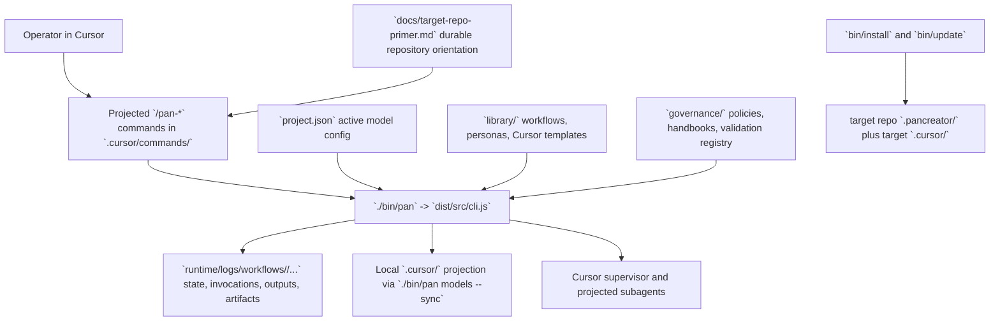

# Target repository primer

<!-- pancreator-primer-status: ready -->
<!-- generated-at: 2026-06-30T02:39:45Z -->
<!-- source-head: unavailable -->

## Summary

Pancreator is a Cursor-native workflow harness implemented in TypeScript and shell scripts. In this self-development checkout, the repository is both the product source and the authoring environment: `./bin/pan` compiles and runs the CLI, `library/` holds canonical workflows/personas/Cursor projection sources, `governance/` defines policies and validation registries, `docs/target-repo-primer.md` provides durable repository orientation, and `runtime/` stores generated workflow state. The repository has no npm runtime dependencies; TypeScript and Prettier are development-only tools, and embedded installs are produced by `bin/install` into a target repository's `.pancreator/`.

## Administrative commands

### Install

- `npm install` installs the development toolchain declared in `package.json`.
- `./bin/pan models --sync` renders the canonical Cursor projection into the local ignored `.cursor/` tree after cloning or after changing `project.json`.
- `./bin/install --target /path/to/target-repository` installs the harness into a target repository for embedded validation.

### Build

- `npm run build` compiles `src/` into `dist/`.
- `npm run typecheck` runs `tsc --noEmit`.
- `./bin/pan doctor` implicitly rebuilds first because `bin/pan` runs `npm run build --silent` before invoking `dist/src/cli.js`.

### Test

- `npm test` runs the compiled test suite.
- `npm run test:unit` runs unit tests under `dist/tests/unit/`.
- `npm run test:integration` runs integration tests under `dist/tests/integration/`.
- `npm run test:regression` runs regression tests under `dist/tests/regression/`.
- `npm run test:coverage` runs Node test coverage with repository thresholds.
- `./bin/install --smoke` runs the installer smoke harness.

### Other

- `npm run format` and `npm run format:check` apply or verify Prettier formatting.
- `npm run lint` runs the repository lint wrapper.
- `npm run validate` runs repository validation through the CLI.
- `npm run check` runs the aggregate quiet check script.
- `./bin/pan status <run-id>` inspects a workflow run, and `./bin/pan list` lists runs.
- `./bin/pan init --workflow dev --request runtime/inbox/request.md` starts a governed workflow run in this self-development checkout.
- `./bin/pan requirements run --persona librarian --workflow standalone --stage build-docs --kind documentation --registry TARGET-REPO-PRIMER-VALIDATE-001 --target docs/target-repo-primer.md --json` validates this primer artifact.
- `./bin/update --target /path/to/target-repository` fast-forwards an embedded installation from an indexed release.

## Architecture

## Project structure

- `AGENTS.md`: repository-wide operating card and authority boundaries.
- `README.md`: top-level product overview, quick start, runtime layout, and embedded-installation summary.
- `bin/`: executable entrypoints and wrappers, including `pan`, `install`, `install-support`, `update`, `build`, `check`, `lint`, and `validate-chat-markdown`.
- `src/cli.ts`: primary CLI entrypoint; dispatches run lifecycle, validation, projection, workspace, and requirements commands.
- `src/lib/`: core runtime modules for workflow orchestration, policy resolution, validation, projection, workspace tracking, and installer support.
- `docs/`: durable operator and authoring documentation, including this target-repository primer, `embedded-installation.md`, `operator-guide.md`, `workflow-authoring.md`, and `validation-framework.md`.
- `governance/policies/`: policy contracts such as `PRIMER-001`, `WORK-001`, and workflow-stage rules.
- `governance/registries/`: canonical registries such as `projection_manifest.json` and `validation_registry.json`.
- `library/workflows/`: canonical workflow definitions; `library/workflows/dev/` is the main delivery workflow.
- `library/personas/`: canonical persona instructions consumed by projected Cursor agents.
- `library/cursor/`: canonical sources for projected Cursor agents, commands, and rules.
- `library/templates/`: templates for embedded installation assets and bootstrap artifacts.
- `runtime/`: generated self-development workflow state, inbox/backlog, and logs; durable documentation does not live here.
- `release/`: version-to-commit index used by embedded update logic.
- `tests/`: unit, integration, migration, and regression coverage for the harness.

## Public interfaces

- `./bin/pan` is the primary programmatic/operator interface. Verified top-level commands include `init`, `prepare`, `submit`, `assess`, `decide`, `pause`, `resume`, `set-stage`, `accept-change`, `waive-gate`, `abort`, `changes`, `workspace`, `workflow`, `status`, `list`, `models`, `validation-map`, `governance`, `requirements`, `output`, `assessment`, `spotfix`, `validate`, and `doctor`.
- `library/cursor/commands/` defines the public Cursor command surface that gets projected into `.cursor/commands/`, including `/pan-start`, `/pan-resume`, `/pan-debug`, `/pan-repair`, `/pan-decompose`, `/pan-build-docs`, `/pan-release`, `/pan-spotfix`, `/pan-status`, and `/pan-validate`.
- `bin/install` and `bin/update` are the supported embedded-installation interfaces for initial install, repair/clean refresh, smoke validation, and indexed fast-forward updates.
- `project.json` is the public model-configuration surface for this checkout. `active_config` selects a named persona-to-model mapping, and `./bin/pan models --sync` projects that mapping into local Cursor agent frontmatter.
- `library/workflows/<slug>/workflow.json`, `library/workflows/<slug>/stages/*.json`, and `library/workflows/<slug>/prompts/*.md` form the canonical workflow authoring surface consumed by the CLI.
- `runtime/logs/workflows/<run-id>/` is a durable operator-facing artifact surface for run state, invocation cards, outputs, assessments, evidence, and finalized artifacts, even though generated state files inside it must not be hand-edited.

## Gotchas

- `.cursor/` is disposable local projection, not source of truth. Canonical Cursor content lives under `library/cursor/`, and projection drift is resolved with `./bin/pan models --sync`.
- Missing or unbuilt `docs/target-repo-primer.md` blocks substantive repository exploration for non-librarian agents; `/pan-build-docs` creates or regenerates it from current code, scripts, manifests, history, and useful target-owned documentation.
- `runtime/logs/workflows/<run-id>/state.json`, `events.jsonl`, and related generated workflow records are harness-owned and must not be edited by hand.
- `pan changes begin|commit|cancel` remains a compatibility no-op; current mutation safety relies on declared stage scope, accepted workspace indexes, fingerprints, evidence, and read-only-stage guards.
- Embedded installations use two path spaces: filesystem references move under `.pancreator/`, including `.pancreator/docs/target-repo-primer.md`, while CLI request and output arguments remain harness-relative such as `runtime/inbox/request.md` and `docs/target-repo-primer.md`.
- Release metadata has a two-commit protocol: the release steward updates `VERSION`, npm metadata, `CHANGELOG.md`, and current-version README/docs references during self-development ship or `/pan-release`; the operator creates the release commit; `release/index.json` maps that immutable commit later; and `./bin/update` only works from clean indexed releases.
- Recent Git history is concentrated in installer/projection and workflow-validation surfaces, so those areas are actively evolving; prefer current scripts and docs over older assumptions.
