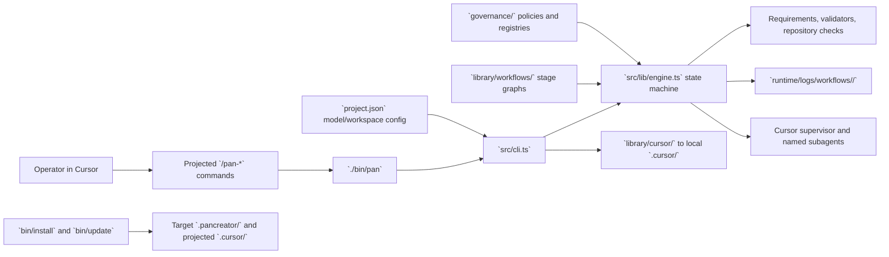

# Target repository primer

<!-- pancreator-primer-status: ready -->
<!-- generated-at: 2026-07-20T04:47:53Z -->
<!-- source-head: e0ddcdba2c217834b36771274347483ecc952eca -->

## Summary

Pancreator is a Cursor-native workflow harness implemented in strict TypeScript and Bash. Cursor supplies model execution and MCP access; the dependency-free Node.js CLI owns workflow snapshots, state transitions, deterministic checks, retries, validation evidence, and audit records. In this self-development checkout, `library/` is the canonical source for workflows, personas, skills, Cursor projections, schemas, and templates; `governance/` defines policies and registries; and generated run state lives under `runtime/`. `bin/install` packages the harness into another repository's `.pancreator/` while leaving that target repository in control of application source and Git state.

## Administrative commands

### Install

- Node.js 22 or newer, npm, Git, and Cursor with project commands and subagents are required.
- `npm ci` installs the locked TypeScript, Node type, and Prettier development toolchain.
- `./bin/pan models --sync` renders the active model mapping and canonical Cursor assets into the ignored local `.cursor/` tree.
- `./bin/install --target /path/to/target-repository` builds and installs an embedded harness; `--yes`, `--repair`, and `--clean` provide explicit refresh and recovery modes.

### Build

- `npm run build` compiles `src/` into `dist/`.
- `npm run typecheck` runs `tsc --noEmit`.
- Every `./bin/pan ...` invocation runs a quiet build before executing `dist/src/cli.js`.

### Test

- `npm test` is the default compiled suite and includes all tests under `tests/`.
- `npm run test:unit` runs unit tests under `dist/tests/unit/`.
- `npm run test:migrations` runs migration tests under `dist/tests/migrations/`.
- `npm run test:integration` runs integration tests under `dist/tests/integration/`.
- `npm run test:regression` runs regression tests under `dist/tests/regression/`.
- `npm run test:coverage` enforces 80% line/function and 70% branch coverage over `dist/src/lib/**`.
- `./bin/install --smoke` runs the deterministic embedded-installer smoke harness.

### Other

- `npm run format` and `npm run format:check` apply or verify Prettier formatting.
- `npm run lint` combines formatting, strict type checking, and Bash syntax checks; `npm run check` runs lint, build, repository validation, and the default test suite.
- `npm run validate` checks workflows, policies, registries, release metadata, model configuration, projection drift, repository-check configuration, and operator briefs.
- `./bin/pan doctor` adds Node, Git, active-model, dependency, and supported-integration diagnostics.
- `./bin/pan init --workflow <dev|design|preflight> --request runtime/inbox/request.md` starts a run; `status`, `list`, `pause`, `resume`, and `archive` provide routine lifecycle and maintenance operations.
- `./bin/pan repository-check <profile>` runs a configured verification profile, and `./bin/pan repository-check validate --json` validates the profile file without running its commands.
- `./bin/pan briefs build|validate|render` manages schema-backed operator briefs; `/pan-build-briefs` delegates target-specific project semantics to the librarian.
- `./bin/pan requirements run --persona librarian --workflow standalone --stage build-docs --kind documentation --registry TARGET-REPO-PRIMER-VALIDATE-001 --target docs/target-repo-primer.md --json` validates this primer artifact.
- `./bin/update --target /path/to/target-repository` fast-forwards an embedded installation from an indexed release.

## Architecture

## Project structure

- `AGENTS.md`: repository-wide authority, workflow, safety, mutation, and validation boundaries.
- `README.md`, `CHANGELOG.md`, and `docs/`: product overview, release history, operator procedures, runtime protocol, workflow authoring, validation architecture, embedded installation, output behavior, and operator briefs.
- `package.json`, `package-lock.json`, `tsconfig.json`, and `prettier.config.js`: Node toolchain, scripts, strict TypeScript compilation, and formatting contracts.
- `bin/`: shell and Node entrypoints for the CLI, builds, quiet checks, installation, updates, and chat-Markdown validation.
- `src/cli.ts`: public CLI parser and dispatcher.
- `src/lib/engine.ts`, `workflow.ts`, `state.ts`, and `context.ts`: workflow assembly, orchestration, persistence, and bounded invocation context.
- `src/lib/requirements/`, `validation.ts`, and `validators/`: policy-bound requirement resolution and deterministic validation.
- `src/lib/repository-checks.ts`, `git.ts`, and `workspace/`: target-authoritative checks, Git-visible fingerprints, root resolution, and protected-path boundaries.
- `src/lib/projection.ts`, `pipeline-config.ts`, and `cursor-content.ts`: model selection and canonical-to-local Cursor projection.
- `src/lib/briefs.ts` and `library/operator-briefs/`: operator-brief registry, validation, rendering, and shared presentation.
- `library/workflows/`: canonical `dev`, `design`, and `preflight` stage graphs, definitions, and prompts.
- `library/personas/`, `library/skills/`, `library/cursor/`, `library/schemas/`, and `library/templates/`: worker contracts, reusable procedures, projected Cursor sources, JSON schemas, and installation/bootstrap templates.
- `governance/policies/`, `governance/registries/`, `governance/criteria/`, and `governance/handbooks/`: enforceable policy metadata, validation/projection lookup data, criterion definitions, and durable guidance.
- `tests/`: unit, integration, migration, and regression coverage compiled alongside source.
- `runtime/`: generated inbox, backlog, check configuration, run state, evidence, outputs, assessments, and artifacts; generated workflow records are harness-owned.
- `release/`: the version-to-immutable-commit index used by embedded updates.

## Public interfaces

- `./bin/pan` is the primary programmatic/operator interface. Its verified top-level commands are `init`, `prepare`, `submit`, `assess`, `decide`, `pause`, `resume`, `set-stage`, `waive-gate`, `abort`, `technologies`, `repository-check`, `status`, `list`, `archive`, `models`, `briefs`, `validation-map`, `governance`, `requirements`, `output`, `assessment`, `spotfix`, `validate`, and `doctor`.
- `library/cursor/commands/` defines the projected user commands: `/pan-start`, `/pan-resume`, `/pan-status`, `/pan-validate`, `/pan-debug`, `/pan-repair`, `/pan-decompose`, `/pan-spotfix`, `/pan-build-docs`, `/pan-build-briefs`, `/pan-summarize-context`, `/pan-release`, and `/pan-write-pr`.
- `bin/install` and `bin/update` are the supported embedded-installation interfaces for initial install, repair/clean refresh, smoke validation, and indexed fast-forward updates.
- `project.json` is the public workspace and persona-model configuration surface. Shared `defaults` merge with the selected `active_config`; `./bin/pan models --sync` projects the effective mapping into Cursor agent frontmatter.
- `library/workflows/<slug>/workflow.json`, `library/workflows/<slug>/stages/*.json`, and `library/workflows/<slug>/prompts/*.md` form the canonical workflow authoring surface consumed by the CLI.
- `governance/policies/*.json` plus `governance/registries/validation_registry.json` form the public policy-bound automation/validation authoring surface.
- JSON operator briefs, semantic registries, and project CSS are the narrative-artifact interface; the harness renders self-contained HTML and validates stage-declared paths.
- `runtime/logs/workflows/<run-id>/` is the durable operator-facing run surface for state, snapshots, invocation cards, outputs, assessments, validation evidence, and finalized artifacts, but its generated records must not be hand-edited.

## Gotchas

- `.cursor/` is disposable local projection, not source of truth. Canonical Cursor content lives under `library/cursor/`, and projection drift is resolved with `./bin/pan models --sync`.
- `./bin/pan` always rebuilds before dispatch. Verification scripts are silent on success through `bin/run-quiet`; set `PAN_VERBOSE=1` to stream output while diagnosing a failure.
- Repository commands and checked-in lock data use npm, although `package.json` currently declares a pnpm `packageManager`; use the documented npm entrypoints until that metadata discrepancy is resolved.
- Missing or unbuilt `docs/target-repo-primer.md` blocks substantive exploration for non-librarian agents. `/pan-build-docs` is the bounded regeneration path and also owns `runtime/repository-checks.json`.
- `runtime/logs/workflows/<run-id>/state.json`, `events.jsonl`, snapshots, invocation records, and generated artifacts are harness-owned. Run lifecycle and maintenance through `./bin/pan`, not direct edits.
- Pancreator fingerprints Git-visible source without recursively indexing the workspace. Compiled output, caches, virtual environments, dependency/package trees, and third-party code are outside agent remit.
- A non-trivial UI/UX delivery uses a separate `design` workflow first; only its ratified handoff is then referenced by a new `dev` run.
- Embedded installations use two path spaces: filesystem references move under `.pancreator/`, including `.pancreator/docs/target-repo-primer.md`, while CLI request and output arguments remain harness-relative such as `runtime/inbox/request.md` and `docs/target-repo-primer.md`.
- Release publication is a two-commit protocol: prepare synchronized version metadata, create the immutable release commit, then map that hash in `release/index.json`. The current `2.16.0` checkout is intentionally unindexed, so automatic embedded updates remain unavailable until publication.
- `docs/runtime-protocol.md` still mentions `npm run finalize:workflow-artifacts`, but `package.json` defines no such script. Current code finalizes terminal runs automatically; use `./bin/pan archive` for supported runtime maintenance.
- Recent history materially changed design workflow support, model-config inheritance, embedded projection, language detection, repository checks, and runtime archiving. Prefer current executable sources and manifests when older narrative text conflicts.
