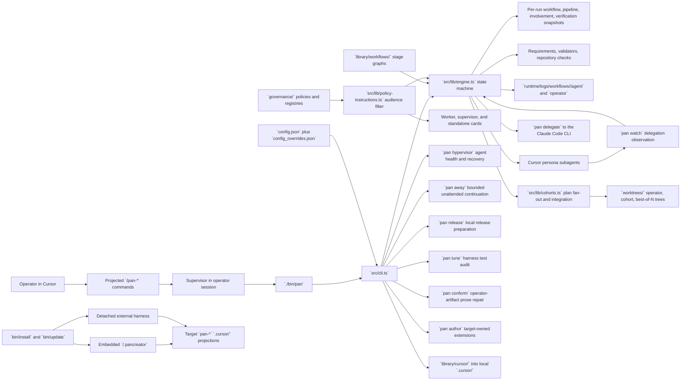

# Target repository primer

<!-- pancreator-primer-status: ready -->
<!-- generated-at: 2026-09-09T02:40:03Z -->
<!-- source-head: 6e5ee2c086711a1a4dce46df74144a85327a6f61 -->

## Summary

Pancreator is a Cursor-native workflow harness written in strict TypeScript and Bash. Cursor supplies model execution and MCP access; the dependency-free Node.js CLI owns workflow snapshots, state transitions, deterministic gates, retries, validation evidence, and audit records. This checkout is the self-development source (`config.json.installation_mode: self_development`, version `5.17.0`). `library/` is canonical for workflows, personas, skills, Cursor projections, schemas, and templates; `governance/` holds policies, registries, criteria, and durable handbooks; `runtime/` holds generated run state and evidence, and `worktrees/` holds operator, cohort, and best-of-N checkouts. `/pan-start` and `/pan-resume` adopt the supervisor brief in the operator's session and advance one run at a time; `/pan-cohort` supervises a fan-out of chunk runs. The supervisor delegates each worker stage to a named persona subagent, or to the Claude Code CLI when the persona mapping carries the `claude-code:` executor prefix. `planning` is the default workflow and the entry point for delivery work: it runs one `plan` stage behind one operator gate, and approving that gate routes the work automatically into either one `delivery` run or a cohort of parallel `delivery-chunk` runs followed by one release run. Each run snapshots its own workflow graph, persona-model mapping, operator-involvement profile, review mode, and verification level at creation, so later configuration edits never change a run in flight. A run also renders a supervisor governance card that the supervisor must attest, and the supervisor must observe every delegated worker through `pan watch` before the harness accepts a submission. Every policy instruction carries an audience, so a worker card, a supervisor card, and the harness-only audit snapshot each receive only the instructions written for them, and a delegated supervisor procedure points at per-policy section digests instead of repeating policy bodies. Optional `pan hypervisor` and `pan away` subsystems add agent-health recovery and bounded unattended continuation; away mode is disabled in `config.json`. Standalone command-backed modes cover authoring target extensions (`pan author`), auditing the harness test suite (`pan tune`), local release preparation (`pan release`), and Simplified Technical English repair of operator-timed prose (`pan conform`). `bin/install` packages the harness into another repository in embedded or detached mode while leaving that target the owner of application source, tracked files, existing agentic tooling, and Git state. The harness test suite is self-development-only and is not part of an installed payload. Repository validation is installation-scoped for the same reason: the audits that describe Pancreator's own source authoring run only when `config.json.installation_mode` is `self_development`, so a fresh embedded install reports zero validation errors and zero warnings.

## Administrative commands

### Install

- Node.js 22 or newer, npm, and Git are required; `package.json` declares `engines.node >= 22.0.0`. Cursor needs project commands and subagents enabled.
- `npm ci` installs the locked development toolchain (TypeScript, Node types, Prettier). There are no runtime dependencies. It is also the workspace bootstrap recorded in the `setup` array of `runtime/repository-checks.json`, because a fresh worktree carries no installed dependencies.
- `./bin/pan models --sync` renders canonical Cursor assets and the active model mapping into the ignored local `.cursor/` tree. Run it after cloning and after any `active_config` or mapped-model change.
- `./bin/install --target /path/to/target-repository` builds an embedded harness at `<target>/.pancreator`; add `--harness-dir /outside/path` for a detached installation, which must sit outside the target tree.
- `--yes`, `--repair`, `--clean`, and `--smoke` provide idempotent refresh, in-place repair, full reinstall, and the deterministic installer smoke harness. Installation writes the target's clone-local `.git/info/exclude` and never modifies a target-tracked file or the target `.gitignore`.
- The installed payload excludes `tests/` and `dist/tests/`, and `bin/install-support strip-harness-test-scripts` removes every `test` and `test:*` script from the staged `package.json`. `tests` is a retired payload entry: a refresh from an older installation deletes only the files whose recorded release digest still matches, backs up and retains anything changed or target-added, and reports both sets.
- Installation also appends a guarded `pan` shell function to the operator's Bash and Zsh rc files. `--skip-shell-alias` suppresses that step, and the installer smoke harness always passes it.
- `./bin/update --target /path/to/target-repository [--harness-dir /outside/path] [--skip-shell-alias]` fast-forwards an installation from an indexed release.

### Build

- `npm run build` calls `./bin/run-built --build-only`, which serializes builds on a per-root lock and delegates to `bin/build`. `bin/build` compares a fingerprint stamp of `tsconfig.json`, `package.json`, `package-lock.json`, and every `src/` and `tests/` TypeScript file against `dist/.build-stamp`, and rebuilds by removing `dist/` and running `tsc` only when the stamp is stale.
- A stale stamp compiles into a private `dist.build-<pid>` staging directory and swaps it into place with two renames, so `dist/` is never absent or half-written and a build never waits for a running consumer. A long-lived `pan watch` therefore cannot delay a build on its root.
- `./bin/build --stamp-fresh` reports whether `dist/` already matches its inputs, and `npm run typecheck` runs `tsc --noEmit`.
- Every `./bin/pan ...` invocation goes through `bin/run-built`, which builds when needed under a per-root lock held only for the compile, and then dispatches `dist/src/cli.js`. A caller that waits more than `PANCREATOR_BUILD_LOCK_NOTICE_SECONDS` (default 5) for that lock prints one notice naming the holder pid.

### Test

- `npm test` is the documented default suite: it builds, then runs `node --test` over the compiled `unit`, `integration`, and `regression` lanes only. Every test script routes through `bin/run-tests` and the compiled `tests/reporters/failures-only.ts` reporter, so a passing run prints almost nothing.
- `npm run test:unit`, `npm run test:integration`, and `npm run test:regression` run the individual compiled subsets. `npm run test:secondary` runs the `tests/secondary/` lane, which owns the installer suites and is outside `npm test`.
- `./bin/pan tests impacted [--changed <ref> | --staged | --worktree-dirty] [--file <path>]... [--include <glob>]... [--depth <n>] [--list] [--json] [--advisory-ratio <0..1>]` (equivalently `npm run test:impacted`) is self-development only. It builds the runtime import graph of `src/` and `tests/`, selects the mainline lane tests the changed files reach, and runs them with the failures-only reporter. It is the iteration profile (`impacted` in `runtime/repository-checks.json`) and never a gate; it appends each run to `runtime/cache/test-impact.jsonl` and advises using `fast` instead once the selection reaches 60% of the lane.
- `npm run test:coverage` runs every compiled lane, including `secondary`, and enforces 80% line and function coverage and 70% branch coverage over `dist/src/lib/**`. Because it covers every lane once, the `full` profile pairs it with `npm run check` rather than re-running `npm test`.
- `./bin/install --smoke` runs the deterministic embedded-installer smoke harness. It also asserts that a fresh install carries no `tests/`, no `dist/tests/`, and no test scripts, and that a refresh removes an unmodified retired `tests/` payload.
- `tests/secondary/embedded-installation.test.ts` is the self-development leakage guard. It installs an embedded harness, runs `pan doctor` inside it, and asserts `validation.ok` with empty `errors` and `warnings`. A new check that only makes sense for Pancreator's own source must therefore be installation-scoped, or that suite fails. Run it through `npm run test:secondary`, not `npm test`.
- `TEST-001` and `governance/handbooks/eng/testing.md` define when a self-development test earns its place in the suite. `./bin/pan tune prepare|finalize|validate-audit` runs the standalone audit of that suite and writes ranked records under `runtime/tune-harness/` without editing any test.
- `npm run test:migrations` is still declared, but no `tests/migrations/` directory exists, so the script matches nothing.
- `PAN_TEST_PROFILE=<path>` makes the reporter write per-test and per-file durations to that JSON path. The harness sets it for exactly one `full`-profile gate before ship, and the result is advisory rather than a gate.

### Other

- `npm run format` and `npm run format:check` apply or verify Prettier formatting.
- `npm run lint` runs `format:check`, then `bash -n` over every Bash script in `bin/`. It runs `typecheck` only when `bin/build --stamp-fresh` reports a stale build stamp; a fresh stamp proves the emitting build already type-checked the same program.
- `npm run check` runs `build`, `lint`, and `validate` in that order through `bin/check`, so the fresh build stamp lets `lint` skip its own `typecheck`. Test execution belongs to the profile commands (`npm run test:coverage`, `./bin/install --smoke`), so a passing check never runs the suite.
- `npm run validate` (equivalently `./bin/pan validate`) checks required files, workflows, stage graphs, policies and the policy lookup table, registries, release metadata, model configuration and projection drift, repository-check configuration, question-tool access, canonical-command governance, eval scenarios, and operator briefs. It also runs three registry-integrity checks that fail when a policy reaches no card: policy-to-lookup-row coverage, per-row instruction delivery at that row's card audience, and audience-to-card-producer delivery. Parts of the sweep are self-development-only: `validateRepository` runs the directive-ownership and context-disposition audit behind an `isSelfDevelopmentInstallation` check, and the same scope adds `docs/operator-briefs/project.json`, `docs/operator-briefs/project.css`, and `library/skills/review-squad-pancreator.md` to the required-file list.
- `npm run validate:chat-markdown` validates fenced Markdown intended for Cursor chat, from stdin or a file path.
- `./bin/pan doctor [--worktree <name>] [--json]` reports Node support, workspace and worktree resolution, Git availability, browser-automation readiness, Cursor authentication and its `.env` source, the active pipeline mapping, gate-cache state, repository-check probe coverage, and repository validation.
- Deterministic shell gates accept a recorded clean pass of the identical command at an unchanged Git workspace fingerprint for 24 hours (`DEV-001`); the cache lives at `runtime/cache/gate-results.json`, a result so accepted is marked `cached`, and `PAN_GATE_CACHE=0` forces every gate to execute. The cache is harness-owned, so agents must not set or clear that variable.
- `./bin/pan init --request runtime/inbox/<file>.md [--workflow planning|delivery|prototype|design] [--no-autostart] [--max-parallel <n>] [--involvement <profile>] [--verification <level>] [--worktree <name>] [--context-reference <file>]` starts a run; the default workflow is `planning`. `prepare`, `delegate`, `submit`, `assess`, `decide`, `status`, `list`, `pause`, `resume`, `set-stage`, `waive-gate`, `abort`, and `archive` cover the rest of the lifecycle.
- `./bin/pan cohort init|start|status|integrate|release|abandon|clean|route` drives the plan fan-out. `start` creates one worktree and one `delivery-chunk` run per unstarted chunk of the next cohort, `integrate` performs the one merge the operator asks for, `release` is the merge-free retry of the release continuation, and `route` is the idempotent retry of a failed plan route.
- `./bin/pan watch <run-id> [--invocation <id>] [--cadence-seconds <n>] [--stall-wakes <n>] [--timeout-seconds <n>] [--mark-background] [--agent-state running|completed]` is the harness-owned worker timer. It records every arming and wake to `agent/evidence/<invocation-id>-watch.jsonl` and exits `0` on a present output, `2` on a stall, `3` at the timeout, and `4` when the completion is unverified. `--agent-state` reports what the supervisor saw when it inspected the launched agent, because the watch reads files and cannot see a worker that is still writing. `./bin/pan watch <run-id> --foreground-returned [--launched-at <iso-8601>]` records a returned foreground launch instead.
- `./bin/pan status <run-id> --redline --occasion <pan-start|pan-resume>` writes the platform-guidance redline record the supervisor owes at every start and resume.
- `./bin/pan inbox [--json]` lists the request files under `runtime/inbox/`. `./bin/pan context digest <file>` prints the trimmed-content digest an audited context reference states.
- `./bin/pan hypervisor start|run|tick|status|stop [--json]` runs the agent-health loop that reconciles the agent registry and drives bounded recovery. `./bin/pan away status|evaluate|apply <run-id> [--decision <id>]` drives bounded unattended continuation under `AWAY-001`.
- `./bin/pan release sync|continue|finalize --worktree <name>` performs local release preparation: checkpoint, rebase onto a fetched main, and finalized release commits. Publication stays an operator action.
- `./bin/pan author apply --input <draft-json>` and `./bin/pan author validate [--extension <id>]` install and check target-owned commands, skills, and personas against `library/schemas/target-authoring.schema.json`. Both refuse a self-development installation.
- `./bin/pan eval list|run|grade` executes the on-demand harness evals over the JSON scenarios in `evals/scenarios/`; see `docs/evals.md`.
- `./bin/pan pr-description context [--worktree <name>] [--json]` collects the branch facts a pull-request description needs.
- `./bin/pan involvement`, `./bin/pan verification [<run-id>]`, and `./bin/pan verification <run-id> set <level>` inspect gate profiles and verification levels, and change the level of a run already in flight.
- `./bin/pan repository-check <profile> [--timeout-ms <ms>] [--workspace <dir|worktree> | --worktree <name>] [--run <run-id>]` runs a configured verification profile; `./bin/pan repository-check validate --json` validates the profile file without executing its commands. The resolved bound is one budget for the whole profile: probes and commands share a single deadline, and the first entry that exhausts it stops the rest.
- `./bin/pan conform scan|checkpoint [--since <ref> | --all] [--worktree <name>] [--json]` selects the operator artifacts that `STE-001` covers and reports their Simplified Technical English issues. The harness-owned `docs/issues/**/*.md` and `runtime/pr-descriptions/*.md` are editable; rendered `runtime/logs/workflows/**/operator/*.html` is report-only, and so is `CHANGELOG.md`, which a ship stage and `/pan-release` own and which is scanned only in self-development. No target-tracked path is editable. `scan` honors the selection flags and compares each file against `runtime/cache/conform.json`. Without a checkpoint the bare scan inspects the complete eligible set, so it agrees with `checkpoint` on its input. `checkpoint` always inspects the complete eligible set, returns `blocked` without writing while any editable file still has issues, and writes that checkpoint once the set is clean. Both subcommands exit `1` on a non-passing status. Conform is an installation-root mode: every editable artifact resolves against the harness root, so `--worktree` shifts only the report-only `CHANGELOG.md` lookup.
- `./bin/pan technologies detect --json` reports detected target languages and unsupported evidence from Git-tracked paths.
- `./bin/pan worktree create|resolve|list|remove|reconcile` manages operator worktrees under `worktrees/operator/`.
- `./bin/pan best-of-n init|status|refresh-agents|abandon|consolidate|clean|prune` manages a best-of-N session.
- `./bin/pan governance card --mode <author|best-of-n|build-briefs|build-docs|decomposition|investigation|pair|qa-workflow|release|repair|review|shepherd|spotfix|supervisor|target|tune-harness|unbound|write-pr>` generates the governance card every non-workflow mode requires; `--mode supervisor --run <run-id>` refreshes a run's supervisor card. `--mode review` also accepts `--base <ref>` and `--dimensions <a,b,c>`. `./bin/pan governance attest-supervisor <run-id> --sha256 <digest>` records the supervisor's attestation, `./bin/pan governance review-scope --target <ref>` reports a review target's conflicts of interest by tier, and `./bin/pan governance audit-directives` reports normative directives that no policy owns.
- `./bin/pan models [--sync] [--force] [--probe] [--migrate-from <previous-config.json>] [--json]` resolves and projects the active mapping; `--force` with `--sync` projects configured specs when the local catalog is stale or incomplete; `--probe` launches one minimal `cursor-agent` call per distinct model spec and needs that CLI plus credentials. `./bin/pan models evidence --run <run-id> --role supervisor --effective-model <model> --source <source>` records the supervisor's own effective model.
- `./bin/pan briefs build|validate|render|generate`, `./bin/pan validation-map`, `./bin/pan requirements resolve|run`, `./bin/pan output scaffold|validate`, `./bin/pan assessment scaffold`, and `./bin/pan spotfix scaffold-escalation` cover briefs, validation auditing, and artifact scaffolding.
- `./bin/pan requirements run --persona librarian --workflow standalone --stage build-docs --kind documentation --registry TARGET-REPO-PRIMER-VALIDATE-001 --target docs/target-repo-primer.md --json` validates this primer.

## Architecture

```mermaid
flowchart LR
  Operator[Operator in Cursor] --> Commands[Projected `/pan-*` commands]
  Commands --> Supervisor[Supervisor in operator session]
  Supervisor --> Pan[`./bin/pan`]
  Pan --> CLI[`src/cli.ts`]
  CLI --> Engine[`src/lib/engine.ts` state machine]
  Config[`config.json` plus `config_overrides.json`] --> CLI
  Workflows[`library/workflows/` stage graphs] --> Engine
  Governance[`governance/` policies and registries] --> Audience[`src/lib/policy-instructions.ts` audience filter]
  Audience --> Engine
  Audience --> Cards[Worker, supervisor, and standalone cards]
  Engine --> Snapshots[Per-run workflow, pipeline, involvement, verification snapshots]
  Engine --> Requirements[Requirements, validators, repository checks]
  Engine --> Runtime[`runtime/logs/workflows/<run-id>/agent` and `operator`]
  Engine --> CursorWorkers[Cursor persona subagents]
  Engine --> External[`pan delegate` to the Claude Code CLI]
  CursorWorkers --> Watch[`pan watch` delegation observation]
  Watch --> Engine
  Engine --> Cohorts[`src/lib/cohorts.ts` plan fan-out and integration]
  Cohorts --> Worktrees[`worktrees/` operator, cohort, best-of-N trees]
  CLI --> Hypervisor[`pan hypervisor` agent health and recovery]
  CLI --> Away[`pan away` bounded unattended continuation]
  CLI --> Release[`pan release` local release preparation]
  CLI --> Tune[`pan tune` harness test audit]
  CLI --> Conform[`pan conform` operator-artifact prose repair]
  CLI --> Author[`pan author` target-owned extensions]
  CLI --> Projection[`library/cursor/` into local `.cursor/`]
  Installer[`bin/install` and `bin/update`] --> Embedded[Embedded `<target>/.pancreator`]
  Installer --> Detached[Detached external harness]
  Embedded --> TargetCursor[Target `pan-*` `.cursor/` projections]
  Detached --> TargetCursor
```

## Project structure

- `AGENTS.md`: repository-wide authority order, run roles, operating loop, safety, mutation, and validation boundaries.
- `README.md`, `CHANGELOG.md`, `VERSION`, and `docs/`: product overview, Common Changelog history, harness version, and operator/authoring documentation. `docs/` holds `operator-guide.md`, `runtime-protocol.md`, `workflow-authoring.md`, `validation-framework.md`, `validation-report.md`, `embedded-installation.md`, `best-of-n.md`, `evals.md`, `output-verbosity.md`, `operator-brief-system.md`, `operator-briefs/`, `issues/`, and this primer. `docs/issues/` is the durable intake and out-of-band-adjustment directory and currently holds only `.gitkeep`.
- `package.json`, `package-lock.json`, `tsconfig.json`, `prettier.config.js`, and `.npmrc`: toolchain, scripts, strict compilation, formatting, and quiet npm output.
- `config.json`: the tracked workspace, model-alias, persona-model, involvement, verification, and away-mode configuration. The untracked `config_overrides.json` merges over it. `best-of-n-config.json` sits beside them at the repository root but is operator-local rather than repository content: it is untracked, listed in `.git/info/exclude` alongside `config_overrides.json` and `detached/`, and no command generates or refreshes it. `library/templates/best-of-n-config.example.json` is the committed starting point an operator copies to that path by hand. `pan best-of-n init --configs <path>` requires an explicit path with no default, so that filename is only the conventional choice.
- `bin/`: `pan`, `build`, `run-built`, `run-tests`, `check`, `lint`, `run-quiet`, `install`, `install-support`, `update`, and `validate-chat-markdown`.
- `src/cli.ts` and `src/runtime-maintenance-cli.ts`: the public CLI dispatcher and the standalone runtime-maintenance entrypoint used during installation.
- `src/lib/engine.ts`, `workflow.ts`, `state.ts`, `context.ts`, `render.ts`, and `run-layout.ts`: stage orchestration, graph assembly, persistence, bounded invocation context, card rendering, and layout v1/v2 path resolution.
- `src/lib/cohorts.ts` and `src/lib/validators/cohort-plan.ts`: the plan fan-out, chunk-run creation, integration merges, release continuation, and the cohort-plan and child-specification validators.
- `src/lib/verification.ts`, `waivers.ts`, `operator-involvement.ts`, `gate-cache.ts`, `suite-profile.ts`, and `naming.ts`: verification-level resolution, operator gate waivers and workspace-fingerprint ratification, gate profiles, the fingerprinted gate-result cache, the advisory suite duration profile, and sortable run naming.
- `src/lib/watch.ts`, `hypervisor.ts`, `away-mode.ts`, and `inbox.ts`: the worker watch with its agent-state terminal basis, foreground-return attestation, and platform-guidance redline records; the agent registry with health verdicts and bounded recovery; the away-mode option evaluator and immutable decision ledger; and the request-inbox listing.
- `src/lib/governance/supervisor-card.ts`, `command-coverage.ts`, `audit-directives.ts`, and `context-audit.ts`: the per-run supervisor governance card and its attestation state, the canonical-command governance guard, directive-ownership auditing, and context-bloat dispositions.
- `src/lib/requirements/`, `validation.ts`, and `validators/`: policy-bound requirement resolution, repository validation, and deterministic validators including `target-repo-primer.ts`, `target-language-handbooks.ts`, `stage-validators.ts`, `autonomy-state.ts`, `tune-record.ts`, and `simplified-english.ts`.
- `src/lib/policy-instructions.ts` and `src/lib/conform.ts`: the policy-instruction audience model with its per-card filter, and the operator-artifact conformance scanner with its eligible-path rules, checkpoint cache, and checksum comparison.
- `src/lib/repository-checks.ts`, `setup-commands.ts`, `technologies.ts`, `git.ts`, `worktrees.ts`, and `workspace/`: target-authoritative verification profiles with their `setup` bootstrap and capture handling, worktree preparation commands, language detection, Git-visible fingerprints, worktree management, root resolution, and protected paths.
- `src/lib/executors/`, `pipeline-config.ts`, `pipeline-config-migration.ts`, `projection.ts`, `cursor-content.ts`, `cursor-sdk-logging.ts`, and `shell-alias.ts`: executor mapping, Cursor authentication and probing, the optional account-local Cursor model catalog with its compact codec, the Claude Code adapter, model resolution and migration, canonical-to-local Cursor projection, and the guarded `pan` shell function.
- `src/lib/best-of-n.ts`, `governance-card.ts`, `review-scope.ts`, `review-dimensions.ts`, `policies.ts`, `policy-guidance.ts`, `briefs.ts`, `operator-artifacts.ts`, `operator-artifact-generation.ts`, and `operator-artifact-profiles.ts`: best-of-N sessions, standalone-mode cards, review conflict-of-interest scoping and dimension selection, policy resolution and progressive disclosure, operator briefs, artifact generation, and per-artifact heading profiles.
- `src/lib/release-preparation.ts`, `target-authoring.ts`, `test-tuning.ts`, `test-impact.ts`, `test-scratch-audit.ts`, and `evals/`: local release checkpoint/rebase/finalize, target-owned command and persona authoring, the harness test-tuning session, the import-graph test selector, the test scratch-directory audit, and the eval scenario runner and graders.
- `src/lib/pr-description.ts`, `target-instructions.ts`, `browser-readiness.ts`, and `project-config.ts`: pull-request description context, target-instruction resolution, browser-automation readiness reporting, and project configuration loading.
- `src/lib/json-merge-patch.ts`, `markdown.ts`, `io.ts`, `errors.ts`, `types.ts`, and `versioning.ts`: RFC 7386 stage-output revision patching, bounded Markdown parsing, filesystem/JSON helpers, invariants, shared types, and Semantic Versioning release-metadata rules.
- `library/workflows/`: `planning`, `delivery`, `delivery-chunk`, `prototype`, `design`, `delivery-candidate`, `metacritic`, and `preflight` stage graphs with stage definitions and prompts. `planning` owns the single `plan` stage; `delivery` runs implement, verify, remediate, ship; `delivery-chunk` runs implement, verify, remediate and is created only by the cohort fan-out.
- `library/personas/`, `library/skills/`, `library/cursor/`, `library/schemas/`, `library/operator-briefs/`, and `library/templates/`: worker contracts, reusable procedures, canonical Cursor sources, JSON schemas, shared brief presentation, and installation/bootstrap templates. `library/templates/` also holds the operator-copied `best-of-n-config.example.json` and both repository-check seed files.
- `governance/policies/`, `governance/registries/`, `governance/criteria/`, and `governance/handbooks/`: enforceable policy metadata, validation/projection/lookup/exemption registries, criterion definitions, and durable engineering, language, design, testing, and writing guidance. `governance/handbooks/target/` and `governance/policies/LANG-001.json` are generated per detected target language, and `governance/registries/cursor_model_catalog.json` is an untracked account-local file rather than repository content.
- `tests/unit/`, `tests/integration/`, `tests/regression/`, `tests/secondary/`, `tests/fixtures/`, `tests/reporters/`, `tests/helpers.ts`, and `tests/temp.ts`: compiled coverage alongside source, with the installer suites isolated in `secondary`, the failures-only and inventory reporters, and the one sanctioned fixture scratch allocator, which `bin/run-tests` scopes to a per-run directory under `runtime/tmp/tests/`. This tree is self-development only and is not installed into a target.
- `evals/scenarios/` and `evals/fixtures/toy-node/`: the operator-run harness eval scenarios and the toy target repository they drive.
- `runtime/`: `inbox/`, `logs/`, `cache/`, `pr-descriptions/`, `build/`, `tmp/`, `tune-harness/`, and `repository-checks.json`. `runtime/cache/` holds `gate-results.json`, `test-impact.jsonl`, and the `conform.json` checkpoint; `runtime/build/` holds the build lock; `runtime/tmp/` holds `run-quiet` capture files and the per-run test scratch directories. The whole tree is Git-ignored, and generated workflow records in it are harness-owned.
- `worktrees/`: operator worktrees under `worktrees/operator/`, cohort chunk and release worktrees, and best-of-N candidate trees under `worktrees/<bon-id>/`. Legacy installations may still hold data under `runtime/worktrees/`.
- `release/index.json`: the version-to-immutable-commit index used by embedded updates.

## Public interfaces

- `./bin/pan` is the primary operator and programmatic interface. Its verified top-level commands are `init`, `prepare`, `delegate`, `watch`, `submit`, `assess`, `decide`, `pause`, `resume`, `set-stage`, `waive-gate`, `abort`, `hypervisor`, `away`, `technologies`, `repository-check`, `conform`, `tests`, `release`, `author`, `tune`, `worktree`, `status`, `list`, `inbox`, `archive`, `models`, `validate`, `eval`, `doctor`, `requirements`, `pr-description`, `output`, `assessment`, `governance`, `best-of-n`, `cohort`, `context`, `briefs`, `validation-map`, `involvement`, `verification`, `spotfix`, and `help`.
- `library/cursor/commands/` defines the projected operator commands: `/pan-start`, `/pan-resume`, `/pan-cohort`, `/pan-status`, `/pan-validate`, `/pan-debug`, `/pan-repair`, `/pan-decompose`, `/pan-spotfix`, `/pan-pair`, `/pan-shepherd`, `/pan-review`, `/pan-build-docs`, `/pan-build-briefs`, `/pan-summarize-context`, `/pan-qa-workflow`, `/pan-conform`, `/pan-release`, `/pan-write-pr`, `/pan-augment`, `/pan-author`, and `/pan-tune-harness`. Best-of-N is entered by invoking the projected `pan-meta-orchestrator` agent rather than a command.
- `bin/install` and `bin/update` are the supported installation interfaces for initial install, repair/clean refresh, smoke validation, and indexed fast-forward update.
- `config.json` is the public workspace and persona-model configuration surface. Shared `defaults` merge with the selected `active_config`, `operator_involvement` declares gate profiles, `verification` declares levels, `away_mode.enabled` arms bounded unattended continuation, `worktrees.setup` declares per-worktree preparation commands, and a persona value MAY carry the `claude-code:` executor prefix. An empty persona string in a named config inherits the `defaults` entry; an empty `defaults` entry is rejected. `config.json` carries four top-level model alias maps named `anthropic`, `oai`, `open`, and `cursor`. Each map accepts the optional keys `balanced`, `advanced`, and `ultra`, and each value MUST be an explicit cursor-executor model spec. A persona mapping MAY reference a tier alias in the form `<family>:<tier>`. Pancreator expands that alias before it snapshots a run, projects a Cursor agent, or delegates to an executor. A named configuration carries its persona keys flat beside `summary`. The nested `personas` object remains compatibility input, and a nested entry wins over a flat key for the same persona. Pancreator emits only the flat shape. `library/schemas/config.schema.json` documents the shape.
- `library/workflows/<slug>/workflow.json`, `stages/*.json`, and `prompts/*.md` form the canonical workflow authoring surface; `library/schemas/` documents their shapes while `src/lib/workflow.ts` is the enforcer.
- `governance/policies/*.json` plus `governance/registries/validation_registry.json` and `governance/registries/policy_lookup_table.json` form the public policy-bound automation and validation authoring surface. An entry in a policy's `instructions[]` is either a plain string, which means audience `agent`, or an object `{ "text": <non-empty>, "audience": [...] }` drawn from `agent`, `supervisor`, `harness`, and `operator`. Worker and standalone cards render `agent`, supervisor cards render `agent` and `supervisor`, `operator` renders only for an operator audience, and `harness` never renders on a card while staying in the invocation JSON snapshot for audit. `harness` and `operator` are exclusive: neither may be combined with a second audience, because the filter would then render the instruction nowhere. `docs/workflow-authoring.md` and `docs/validation-framework.md` document the rules; `src/lib/policy-instructions.ts` is the enforcer.
- `governance/registries/projection_manifest.json` declares every canonical-to-`.cursor/` projection, including the `pan-browser-isolation.mdc` rule generated from `governance/policies/BROWSER-001.json` and the self-development-only `mcp.json`.
- `governance/registries/cursor_model_catalog.json` is the optional account-local Cursor model catalog. It holds a `Cursor.models.list()` result in `models[]`, in either the verbatim form or the lossless compact codec form. When the file is present, `config.json` persona specs are validated against it at config load, projection, and probing; when it is absent, validation stays grammar-only. `governance/registries/directive_exemptions.json` records the normative directives excluded from ownership auditing.
- `governance/registries/command_governance.json` declares which canonical commands are read-only or supervisor-owned, and `pan validate` fails a command that runs no registered card mode. `governance/registries/context_bloat_dispositions.json` records the reviewed duplication the repository keeps on purpose, such as the installer's mirrored projection renderers and the cohort routing rule's several surfaces.
- `library/schemas/target-authoring.schema.json` is the target-extension authoring surface for `pan author`, and `library/schemas/tune-record.schema.json` is the record surface for `pan tune`.
- `evals/scenarios/*.json` is the eval authoring surface, validated by `pan validate` against `library/schemas/eval-scenario.schema.json`. Eval reports land under `runtime/logs/evals/<eval-id>/`.
- JSON operator briefs plus `library/operator-briefs/` and `docs/operator-briefs/` are the narrative-artifact interface; the harness renders self-contained HTML and validates stage-declared paths.
- `runtime/repository-checks.json` is the deterministic verification contract with a top-level `setup` bootstrap array and `configuration`, `static`, `fast`, `impacted`, `secondary`, and `full` profiles. Each profile MAY declare `probes`, `environment_probes`, and a `timeout_ms` budget between 1000 and 86400000 milliseconds; identical non-empty `fast` and `full` command lists are rejected, and a superset profile's `timeout_ms` MUST be at least that of any profile whose commands it contains. `library/templates/repository-checks.json` and `library/templates/repository-checks.self-development.json` are the installed and self-development sources for that file.
- `runtime/logs/workflows/<run-id>/` is the durable run surface. New runs split machine records under `agent/` and operator-readable HTML, request, PR description, and QA files under `operator/`; generated records must not be hand-edited. `runtime/logs/hypervisor/` holds the agent registry and hypervisor events, `runtime/logs/away-mode/` holds the append-only away decision ledger, and `runtime/logs/worktrees/reconcile.jsonl` holds worktree reconcile history.

## Gotchas

- `.cursor/` is disposable local projection, not source of truth. Canonical content lives under `library/cursor/`, and drift is resolved with `./bin/pan models --sync`.
- The tracked `config.json` ships every `defaults` persona as an empty string, and an empty `defaults` entry is rejected at load. This checkout therefore depends on an untracked `config_overrides.json` that supplies the effective persona models; `./bin/pan doctor` reports the resolved mapping it actually loaded. The installer merges the source checkout's overrides so an install ships effective specs even though the tracked file is blank.
- Cursor model availability is account-specific, so `governance/registries/cursor_model_catalog.json` stays on the operator's disk and out of shared history. `.gitignore` ignores it and `bin/install` deletes it from the staging payload, so it never reaches a target installation. The catalog is optional: with it present, an unknown model, parameter, value, or variant combination fails config loading loudly; without it, persona specs are checked for grammar only. Repository validation does not list it as a required file.
- `./bin/pan` builds before dispatch, but `bin/build` skips `tsc` when `dist/.build-stamp` still matches the TypeScript inputs, so a rebuild is not proof that compilation just ran. Verification scripts are silent on success through `bin/run-quiet`; set `PAN_VERBOSE=1` to stream output while diagnosing a failure.
- A supervisor session is gated twice. `pan prepare` and `pan submit` fail with `SUPERVISOR_CARD_UNATTESTED` until `pan governance attest-supervisor` records the current `agent/supervisor-card.md` digest, and with `REDLINE_MISSING` until `pan status <run-id> --redline` writes a declaration for the current session generation. Every attestation opens a new generation, so a resume needs a fresh redline even when the digest did not change.
- `pan submit` refuses a Cursor worker output with `DELEGATION_UNOBSERVED` unless a completed `pan watch` record or a `--foreground-returned` attestation proves the worker reached a terminal state. A watch that ends `unverified` (exit `4`) does not satisfy that requirement: an output already present at the first observation, less than one cadence after the launch, needs `--agent-state completed` to record a terminal basis. Stages that `pan delegate` runs through an external executor are exempt only when the delegation-execution record names the run and invocation.
- `pan help` still says `--timeout-ms raises the effective bound only` for `pan repository-check`, but `resolveTimeout` in `src/lib/repository-checks.ts` returns an explicit request unchanged, so the flag can also lower the bound below the profile's own timeout. The resolved bound is one budget for the whole profile rather than a per-command limit, so the `delivery`, `delivery-chunk`, and `delivery-candidate` `full` gate criteria that pass `timeout_ms: 1200000` give all three `full` commands twenty minutes together. Treat `src/lib/repository-checks.ts` as authoritative and the help text as stale.
- `runtime/repository-checks.json` declares `setup: ["npm ci --no-audit --no-fund --loglevel=error", "npm run build"]`. The harness runs that sequence once per worktree-targeted run, at the first prepare of any stage, before baseline capture, and records the outcome on the run as `workspace_setup`. A fresh worktree carries no `node_modules/` and no `dist/`, so profile commands fail there without it. Runs whose workflow has no source stage, shell criterion, or evidence worker skip it. Neither `library/templates/repository-checks.json` nor the self-development template declares `setup`, so this array is live workspace configuration rather than template output.
- The `$operator` block in `runtime/repository-checks.json` is an operator customization preserved verbatim across regenerations. Its `note` still records the last operator reverification as 2026-08-31 at `source_head` `77b7279b`, while the file's own `source_head` records the current head `6e5ee2c0`. That anchor is the one part of the block that fresh detection contradicts, and a regeneration leaves it alone because only the operator can reverify. Every profile command the note describes is unchanged and still matches the file and `package.json`, so the note is stale only in its date and hash.
- The suite profile is advisory. `PAN_TEST_PROFILE` is set for one `full`-profile gate before ship, its artifact lands in the run evidence, and no test count or duration gates anything.
- Away mode is disabled in `config.json` (`away_mode.enabled: false`), and a run reads that setting from its own snapshot. Away mode never runs commit, push, merge, publication, deployment, branch-deletion, or gate-waiver actions; the `COHORT-001` plan route may still create branches and worktrees under an away-mode approval, and `pan validate` rejects a by-id cross-reference between the two policies because no lookup row co-loads them.
- Repository commands and the checked-in lock file use npm, although `package.json` declares a pnpm `packageManager`. Use the documented npm entrypoints until that metadata discrepancy is resolved.
- `package.json` still names the project `pancreator-v2-prototype` while `VERSION` reports `5.17.0`. Treat `VERSION` as authoritative for the version and the npm `name` field as legacy metadata.
- Missing or unbuilt `docs/target-repo-primer.md` blocks substantive exploration for non-librarian agents. `/pan-build-docs` is the bounded regeneration path and also owns `runtime/repository-checks.json`.
- Run state, `events.jsonl`, snapshots, invocation records, and generated artifacts are harness-owned. Resolve a run path from the active invocation card rather than a fixed literal, because layout v1 runs keep a flat tree while layout v2 runs split `agent/` and `operator/`.
- Run directory names are descending-sortable UTC identifiers anchored on a future date, so the newest run sorts first and the prefix is not a date to read directly. `RUNTIME-001` reserves renaming and archival to the harness, and `./bin/pan archive` is the supported retention command.
- `runtime/logs/` also holds `orchestrator/events.jsonl`, `sessions/`, and `best-of-n/` alongside `workflows/`. A best-of-N session spans several run directories plus its own session record.
- Pancreator fingerprints Git-visible source without recursively indexing the workspace. Compiled output, caches, virtual environments, dependency trees, and third-party code are outside agent remit. Operator, cohort, and best-of-N worktrees are full checkouts that contain their own `node_modules/` and `dist/`.
- Every non-workflow mode takes its governance from `./bin/pan governance card --mode <mode>`, including the command-backed modes (`author`, `build-briefs`, `build-docs`, `conform`, `qa-workflow`, `release`, `tune-harness`, `write-pr`) alongside `best-of-n`, `decomposition`, `investigation`, `pair`, `repair`, `review`, `shepherd`, `spotfix`, `supervisor`, `target`, and `unbound`. Do not hand-assemble policy text from `governance/policies/`.
- Conform's `--worktree` surface is inconsistent across three files, and the CLI is the lenient one. `pan help` still advertises `[--worktree <name>]` and `acceptsWorktreeOption` still accepts it for the whole `conform` family, but `/pan-conform` no longer passes it and `governance/registries/command_governance.json` no longer registers conform for worktree forwarding. Because every editable artifact resolves against the harness root, the option cannot change what a session repairs. Treat the installation-root scope as the decision and the help text as stale.
- `STE-001` excludes source code, code comments, commit messages, `README.md`, `governance/`, and `docs/` from its writing rules, with one carve-out: `docs/issues/` stays governed, because the conform boundary requires repairing those intake records. This primer therefore sits outside the writing rules while the intake directory beside it does not.
- `./bin/pan init --workflow` accepts any workflow slug that resolves, including `delivery-candidate`, `metacritic`, and `preflight`. Governance restricts `delivery-candidate` and `metacritic` to a best-of-N session, so only `planning` (the default), `prototype`, and `design` are ordinary starting points; `delivery` is an explicit escape hatch for an operator who brings a ratified specification, and `delivery-chunk` is created only by the cohort fan-out.
- Approving the `planning` plan gate is the routing point, not a separate operator choice. A plan of one chunk starts one `delivery` run; a plan of two or more chunks opens a cohort session. `pan cohort integrate` is the one merge the operator asks for, and a failed route or release continuation is retried with `pan cohort route --plan-run <id>` or `pan cohort release <cohort-id>` rather than by hand.
- A non-trivial UI/UX delivery runs the `design` workflow first; only its ratified handoff is referenced by a separately started `delivery` run.
- A run snapshots its workflow graph, persona mapping, involvement profile, and verification level at creation. Editing `config.json` never changes a run in flight; `./bin/pan verification <run-id> set <level>` is the only supported in-flight change.
- The `full` repository-check profile runs only as a submission gate: once at verify on a passing verdict and once at remediate when the repair is ready to ship, after which the returning verify gate accepts the recorded pass from the gate cache. Agents never run `full`, run `fast` at most once each as validation, and iterate on blast-radius tests or the `impacted` profile; the consolidating verifier runs neither. `full` is never baselined before implementation, so it is judged on its own result rather than by delta.
- Target installations use two path spaces: embedded filesystem references live under `.pancreator/`, detached projections use the absolute harness path, and CLI request/output arguments stay harness-relative such as `runtime/inbox/request.md`. Detached root discovery from the target needs an absolute harness command or `PANCREATOR_ROOT`.
- An installed harness carries no `tests/`, no `dist/tests/`, and no `test` or `test:*` package scripts, so `./bin/pan tests impacted`, `./bin/pan tune`, and the harness suites exist only in this checkout. A target's `fast`, `secondary`, and `full` profiles must name that target's own commands. Refreshing an installation from a release that still shipped `tests/` removes only unmodified release-owned files and retains, backs up, and reports anything changed or target-added.
- `pan author` is the inverse boundary: it refuses a self-development installation and writes target-owned commands, skills, and personas only in an embedded or detached install.
- Target `.cursor/` projections are namespaced (`pan-*` or `pancreator.*`) and coexist with target-owned `AGENTS.md`, `CLAUDE.md`, `.claude/`, `.cursorrules`, Copilot instructions, MCP settings, and non-conflicting Cursor files. Installation reports but never modifies or removes those surfaces.
- Installation edits operator shell rc files to add a guarded `pan` function unless `--skip-shell-alias` is passed. That is the one installer side effect outside the target repository and the harness directory.
- Browser inspection rules live only in `BROWSER-001`. Read the policy on the active card and the procedure it references; personas, prompts, and docs deliberately do not duplicate it. `library/cursor/mcp.json` still starts `chrome-devtools-mcp@latest --isolated` without `--executablePath`, so `./bin/pan doctor` reports browser automation as not ready even when Chrome for Testing is installed.
- Release publication is a two-commit protocol: prepare synchronized version metadata, create the immutable release commit, then map that hash in `release/index.json`. `VERSION`, `package.json`, and `package-lock.json` agree on `5.17.0`. `release/index.json` maps 4.0.0 through 5.17.0 to their release commits. The 5.17.0 entry landed in the index commit `6e5ee2c0`, one commit after the release commit `77e7c5f7`, which is the same two-commit shape the 5.16.0 pair (`a9b1b767` after `f37721b7`) used.
- `package.json` retains a `test:migrations` entrypoint while no `tests/migrations/` directory exists. Do not treat it as an active suite.
- The `5.3.0` CHANGELOG entry links two `docs/issues/` records that were resolved and deleted, so those links are dead. `docs/issues/` is currently empty apart from `.gitkeep`.
- Harness evals (`./bin/pan eval list|run|grade`, scenarios under `evals/scenarios/`, toy fixtures under `evals/fixtures/`) are operator-run and never part of `npm test` or any repository-check profile. `pan eval run` drives only harness-owned steps and `claude-code:` executor stages; it stops with operator steps when a Cursor persona is next. See `docs/evals.md`.
- `README.md` omits `/pan-status`, `/pan-pair`, `/pan-shepherd`, `/pan-decompose`, `/pan-qa-workflow`, `/pan-review`, `/pan-cohort`, `/pan-conform`, `/pan-augment`, `/pan-author`, `/pan-tune-harness`, and the best-of-N entry point from its command lists. Treat `library/cursor/commands/` and `AGENTS.md` as the current command inventory.
- `AGENTS.md` no longer carries the policy-authoring, projection, and writing-policy rules inline. It points at `docs/workflow-authoring.md`, which now owns them together with the instruction-audience rules. Its shell-and-chat section points at `/pan-conform` instead of naming the `rtk` wrapper and `npm run validate:chat-markdown`; that script still exists and still works, but the command-backed conform mode is the documented path.
- `docs/validation-report.md` records a one-time migration validation dated 2026-06-22 against Node.js 22.16.0. It is a historical record, not a current statement of repository state.
- Invocation cards use progressive policy disclosure: policy summaries, instructions, requirements, inputs, outputs, and boundaries are inline, while handbook and skill guidance arrives as an audited reference carrying source path, selected range, content digest, and read trigger. Digests cover the selection after surrounding whitespace is trimmed, and stage output must attest each referenced read or the reason it was skipped. Cards prepared before this change keep inline guidance bodies, and validation accepts both shapes.
- Reading a policy JSON file is not the same as reading the card. Of 592 instructions across the 52 policies, 58 are audience-tagged objects rather than plain strings, covering 27 `supervisor`, 25 `harness`, and 6 `agent` audiences. Only five policies carry a `harness` instruction: `BRIEF-001`, `CONTRACT-001`, `OUTPUT-001`, `RUNTIME-001`, and `VALID-001`. No policy currently carries an `operator` audience. A `harness` instruction never reaches a worker card, so an agent that greps `governance/policies/` sees rules that its own card deliberately withholds. `bin/install-support` mirrors the same filter for the generated `.cursor/` policy rules, because it runs before the harness is built and cannot import `src/lib/policy-instructions.ts`.
- `harness` and `operator` are exclusive audiences. Each suppresses an instruction at every other audience, so `normalizePolicyInstruction` rejects either one paired with a second audience rather than letting the card filter render the instruction nowhere.
- `pan validate` now fails when a policy reaches no card. Three ungated registry-integrity checks run in every installation: every catalog policy must be named by at least one lookup row, no lookup row may resolve a policy whose filtered instruction list is empty at that row's card audience, and no policy may carry an audience with no card producer. The producers are derived from the mode table and the card filter rather than restated.
- Every `harness` instruction must name a requirement id from its own policy or cite coverage in the exact `` `tests/<path>::<test name>` `` form. A bare `tests/` path is rejected, one citation must not stand in for two rules, and the cited name must open a `test(` or `it(` call at the start of a line, so an import specifier or a fixture literal inside a string no longer satisfies it. Like the directive-ownership audit, this check runs only under `isSelfDevelopmentInstallation`, so an installed target never reports it.
- A delegated supervisor procedure no longer inlines delivery-policy bodies. `renderSupervisorProcedureBody` emits one `` `<POLICY-ID>`: `sha256:<digest>` `` pointer per policy from `supervisor_card.policy_sections`, and validation checks the pointer instead of the instruction text. The supervisor reads the full text from its own governance card. A run whose recorded card state predates `policy_sections` falls back to the older inline shape, and validation accepts both.
- `PRIMER-001` was split. It now holds only the four bounded-orientation instructions every agent obeys, while the librarian's authoring duties, the deterministic section labels, and the primer and language-handbook validator requirements moved to the new `LIBRARIAN-001`. The `librarian/standalone/build-docs` lookup row resolves `LIBRARIAN-001` and `REPO-001`; `PRIMER-001` still arrives through a broader row. Cite `LIBRARIAN-001` for authoring rules and `PRIMER-001` for reading rules.
- A stage retry MAY submit an RFC 7386 merge patch instead of a whole document. The harness applies the patch and validates the merged result exactly as a full submission, so a partial patch that drops a required field still fails.
- `./bin/pan validate` reports unowned advisory directives as warnings rather than errors, and only in this checkout. The `validateRepository` sweep calls `auditDirectives` only under `isSelfDevelopmentInstallation`, so an installed target sees neither the `unowned advisory directive` warnings nor the `stale disposition evidence` errors from `pan validate` or `pan doctor`. The `./bin/pan governance audit-directives` command and the `directiveAuditHandler` requirement validator stay ungated and still report in any installation. `governance/registries/directive_exemptions.json` records intentional exclusions.
- `docs/embedded-installation.md` still documents target context-bloat dispositions under `governance/registries/context_bloat_dispositions.d/<extension-id>.json`. That target-owned mechanism still exists and `pan governance audit-directives` still evaluates it, but a target's `pan validate` sweep no longer does. Treat `src/lib/validation.ts` as authoritative for which checks an installation actually runs and run the focused command explicitly when a target needs that report.
- `governance/handbooks/target/<language>/style-guide.md`, `governance/policies/LANG-001.json`, and the `generated_by: pancreator-target-language-handbooks` lookup rows are generated by `/pan-build-docs`. Do not hand-edit them; regenerate the bundle when detected languages or target conventions change. They are intentionally absent from the hand-maintained `governance/policies/index.md` and `governance/handbooks/index.md`.
- `validateTargetLanguageHandbooks` returns `passed` immediately when the root is not a target installation, so the bundle's coverage is not deterministically enforced in this self-development checkout even though the bundle exists here.
- `bin/install` copies `governance/` wholesale into the target staging tree, so a fresh install carries this checkout's JavaScript and TypeScript handbooks until `/pan-build-docs` regenerates them against the real target. `preserveLanguageGovernance` in `bin/install-support` keeps a complete marked target bundle across refresh and discards a malformed one for rebuild.
