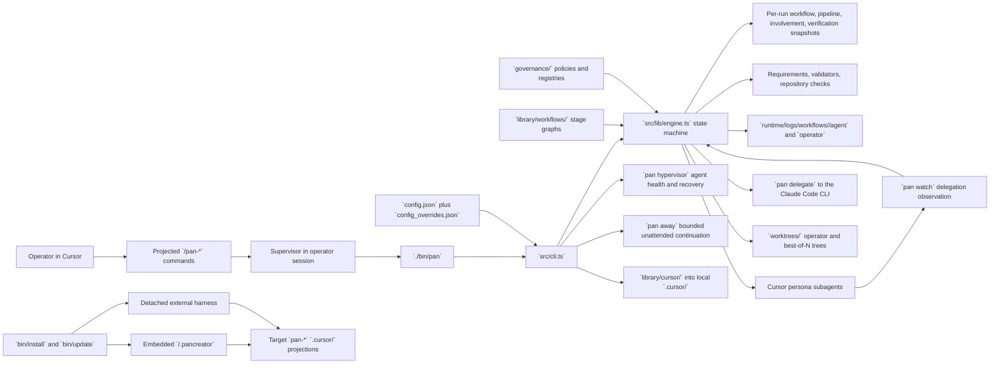

# Target repository primer

<!-- pancreator-primer-status: ready -->
<!-- generated-at: 2026-08-30T02:47:45Z -->
<!-- source-head: ad3795b39a0a4c118e06148f88260a2bd07e4e89 -->

## Summary

Pancreator is a Cursor-native workflow harness written in strict TypeScript and Bash. Cursor supplies model execution and MCP access; the dependency-free Node.js CLI owns workflow snapshots, state transitions, deterministic gates, retries, validation evidence, and audit records. This checkout is the self-development source (`config.json.installation_mode: self_development`, version `5.2.0`). `library/` is canonical for workflows, personas, skills, Cursor projections, schemas, and templates; `governance/` holds policies, registries, criteria, and durable handbooks; `runtime/` holds generated run state, worktrees, and evidence. `/pan-start` and `/pan-resume` adopt the supervisor brief in the operator's session and advance one run at a time. The supervisor delegates each worker stage to a named persona subagent, or to the Claude Code CLI when the persona mapping carries the `claude-code:` executor prefix. Each run snapshots its own workflow graph, persona-model mapping, operator-involvement profile, review mode, and verification level at creation, so later configuration edits never change a run in flight. A run also renders a supervisor governance card that the supervisor must attest, and the supervisor must observe every delegated worker through `pan watch` before the harness accepts a submission. Optional `pan hypervisor` and `pan away` subsystems add agent-health recovery and bounded unattended continuation; away mode is disabled in `config.json`. `bin/install` packages the harness into another repository in embedded or detached mode while leaving that target the owner of application source, tracked files, existing agentic tooling, and Git state.

## Administrative commands

### Install

- Node.js 22 or newer, npm, and Git are required; `package.json` declares `engines.node >= 22.0.0`. Cursor needs project commands and subagents enabled.
- `npm ci` installs the locked development toolchain (TypeScript, Node types, Prettier). There are no runtime dependencies.
- `./bin/pan models --sync` renders canonical Cursor assets and the active model mapping into the ignored local `.cursor/` tree. Run it after cloning and after any `active_config` or mapped-model change.
- `./bin/install --target /path/to/target-repository` builds an embedded harness at `<target>/.pancreator`; add `--harness-dir /outside/path` for a detached installation, which must sit outside the target tree.
- `--yes`, `--repair`, `--clean`, and `--smoke` provide idempotent refresh, in-place repair, full reinstall, and the deterministic installer smoke harness. Installation writes the target's clone-local `.git/info/exclude` and never modifies a target-tracked file or the target `.gitignore`.
- Installation also appends a guarded `pan` shell function to the operator's Bash and Zsh rc files. `--skip-shell-alias` suppresses that step, and the installer smoke harness always passes it.
- `./bin/update --target /path/to/target-repository [--harness-dir /outside/path] [--skip-shell-alias]` fast-forwards an installation from an indexed release.

### Build

- `npm run build` calls `./bin/run-built --build-only`, which serializes builds on a per-root lock and delegates to `bin/build`. `bin/build` compares a fingerprint stamp of `tsconfig.json`, `package.json`, `package-lock.json`, and every `src/` and `tests/` TypeScript file against `dist/.build-stamp`, and rebuilds by removing `dist/` and running `tsc` only when the stamp is stale.
- `./bin/build --stamp-fresh` reports whether `dist/` already matches its inputs, and `npm run typecheck` runs `tsc --noEmit`.
- Every `./bin/pan ...` invocation goes through `bin/run-built`, which builds when needed, registers the wrapped process as a live `dist/` reader so a concurrent build waits for it, and then dispatches `dist/src/cli.js`.

### Test

- `npm test` is the documented default suite: it builds, then runs `node --test` over the compiled `unit`, `integration`, and `regression` lanes only. Every test script uses the compiled `tests/reporters/failures-only.ts` reporter, so a passing run prints almost nothing.
- `npm run test:unit`, `npm run test:integration`, and `npm run test:regression` run the individual compiled subsets. `npm run test:secondary` runs the `tests/secondary/` lane, which owns the installer suites and is outside `npm test`.
- `./bin/pan tests impacted [--changed <ref> | --staged] [--file <path>]... [--include <glob>]... [--depth <n>] [--list] [--json]` (equivalently `npm run test:impacted`) builds the runtime import graph of `src/` and `tests/`, selects the mainline lane tests the changed files reach, and runs them with the failures-only reporter. It is the iteration profile (`impacted` in `runtime/repository-checks.json`) and never a gate; it appends each run to `runtime/cache/test-impact.jsonl`.
- `npm run test:coverage` runs every compiled lane, including `secondary`, and enforces 80% line and function coverage and 70% branch coverage over `dist/src/lib/**`.
- `./bin/install --smoke` runs the deterministic embedded-installer smoke harness.
- `npm run test:migrations` is still declared, but no `tests/migrations/` source directory exists.
- `PAN_TEST_PROFILE=<path>` makes the reporter write per-test and per-file durations to that JSON path. The harness sets it for exactly one `full`-profile gate before ship, and the result is advisory rather than a gate.

### Other

- `npm run format` and `npm run format:check` apply or verify Prettier formatting.
- `npm run lint` runs `format:check`, then `bash -n` over every Bash script in `bin/`. It runs `typecheck` only when `bin/build --stamp-fresh` reports a stale build stamp; a fresh stamp proves the emitting build already type-checked the same program.
- `npm run check` runs `build`, `lint`, and `validate` in that order through `bin/check`, so the fresh build stamp lets `lint` skip its own `typecheck`. Test execution belongs to the profile commands (`npm test`, `npm run test:coverage`), so a passing check never runs the suite.
- `npm run validate` (equivalently `./bin/pan validate`) checks required files, workflows, stage graphs, policies and the policy lookup table, registries, release metadata, model configuration and projection drift, repository-check configuration, question-tool access, directive ownership, canonical-command governance, eval scenarios, and operator briefs.
- `npm run validate:chat-markdown` validates fenced Markdown intended for Cursor chat, from stdin or a file path.
- `./bin/pan governance review-scope --target <ref> [--base <ref>] [--json]` reports a review target's conflicts of interest by tier — instrument paths the squad must not grade, conduct policies on the reviewer's own card (derived from the card), and verification substrate that taints findings — plus a per-policy standards delta of removed and added instructions. `pan governance card --mode review --base <ref>` renders the base text of each conduct policy the target changes.
- `./bin/pan doctor [--worktree <name>] [--json]` reports Node support, workspace and worktree resolution, Git availability, browser-automation readiness, the active pipeline mapping, gate-cache state, repository-check probe coverage, and repository validation.
- Deterministic shell gates accept a recorded clean pass of the identical command at an unchanged Git workspace fingerprint for 24 hours (`DEV-001`); the cache lives at `runtime/cache/gate-results.json`, a result so accepted is marked `cached`, and `PAN_GATE_CACHE=0` forces every gate to execute.
- `./bin/pan init --request runtime/inbox/<file>.md [--workflow delivery|prototype|design] [--involvement <profile>] [--verification <level>] [--worktree <name>]` starts a run; `prepare`, `delegate`, `submit`, `assess`, `decide`, `status`, `list`, `pause`, `resume`, `set-stage`, `waive-gate`, `abort`, and `archive` cover the rest of the lifecycle.
- `./bin/pan watch <run-id> [--invocation <id>] [--cadence-seconds <n>] [--stall-wakes <n>] [--timeout-seconds <n>] [--mark-background]` is the harness-owned worker timer. It records every arming and wake to `agent/evidence/<invocation-id>-watch.jsonl` and exits `0` on a present output, `2` on a stall, and `3` at the timeout. `./bin/pan watch <run-id> --foreground-returned [--launched-at <iso-8601>]` records a returned foreground launch instead.
- `./bin/pan status <run-id> --redline --occasion <pan-start|pan-resume>` writes the platform-guidance redline record the supervisor owes at every start and resume.
- `./bin/pan inbox [--json]` lists the request files under `runtime/inbox/`.
- `./bin/pan hypervisor start|run|tick|status|stop [--json]` runs the agent-health loop that reconciles the agent registry and drives bounded recovery. `./bin/pan away status|evaluate|apply <run-id> [--decision <id>]` drives bounded unattended continuation under `AWAY-001`.
- `./bin/pan eval list|run|grade` executes the on-demand harness evals over the JSON scenarios in `evals/scenarios/`; see `docs/evals.md`.
- `./bin/pan pr-description context [--worktree <name>] [--json]` collects the branch facts a pull-request description needs.
- `./bin/pan involvement`, `./bin/pan verification [<run-id>]`, and `./bin/pan verification <run-id> set <level>` inspect gate profiles and verification levels, and change the level of a run already in flight.
- `./bin/pan repository-check <profile> [--timeout-ms <ms>] [--worktree <name>]` runs a configured verification profile; `./bin/pan repository-check validate --json` validates the profile file without executing its commands.
- `./bin/pan technologies detect --json` reports detected target languages and unsupported evidence from Git-tracked paths.
- `./bin/pan worktree create|resolve|list|remove|reconcile` manages operator worktrees under `worktrees/operator/`.
- `./bin/pan best-of-n init|status|refresh-agents|abandon|consolidate|clean|prune` manages a best-of-N session.
- `./bin/pan governance card --mode <best-of-n|build-briefs|build-docs|decomposition|investigation|pair|qa-workflow|release|repair|review|shepherd|spotfix|supervisor|unbound|write-pr>` generates the governance card every non-workflow mode requires; `--mode supervisor --run <run-id>` refreshes a run's supervisor card. `./bin/pan governance attest-supervisor <run-id> --sha256 <digest>` records the supervisor's attestation of that card, and `./bin/pan governance audit-directives` reports normative directives that no policy owns.
- `./bin/pan models [--sync] [--probe] [--json]` resolves and projects the active mapping; `--probe` launches one minimal `cursor-agent` call per distinct model spec and needs that CLI plus credentials.
- `./bin/pan briefs build|validate|render|generate`, `./bin/pan validation-map`, `./bin/pan requirements resolve|run`, `./bin/pan output scaffold|validate`, `./bin/pan assessment scaffold`, and `./bin/pan spotfix scaffold-escalation` cover briefs, validation auditing, and artifact scaffolding.
- `./bin/pan requirements run --persona librarian --workflow standalone --stage build-docs --kind documentation --registry TARGET-REPO-PRIMER-VALIDATE-001 --target docs/target-repo-primer.md --json` validates this primer.

## Architecture

```mermaid
flowchart LR
  Operator[Operator in Cursor] --> Commands[Projected `/pan-*` commands]
  Commands --> Supervisor[Supervisor in operator session]
  Supervisor --> Pan[`./bin/pan`]
  Pan --> CLI[`src/cli.ts`]
  CLI --> Engine[`src/lib/engine.ts` state machine]
  Config[`config.json` plus `config_overrides.json`] --> CLI
  Workflows[`library/workflows/` stage graphs] --> Engine
  Governance[`governance/` policies and registries] --> Engine
  Engine --> Snapshots[Per-run workflow, pipeline, involvement, verification snapshots]
  Engine --> Requirements[Requirements, validators, repository checks]
  Engine --> Runtime[`runtime/logs/workflows/<run-id>/agent` and `operator`]
  Engine --> CursorWorkers[Cursor persona subagents]
  Engine --> External[`pan delegate` to the Claude Code CLI]
  CursorWorkers --> Watch[`pan watch` delegation observation]
  Watch --> Engine
  CLI --> Hypervisor[`pan hypervisor` agent health and recovery]
  CLI --> Away[`pan away` bounded unattended continuation]
  Engine --> Worktrees[`worktrees/` operator and best-of-N trees]
  CLI --> Projection[`library/cursor/` into local `.cursor/`]
  Installer[`bin/install` and `bin/update`] --> Embedded[Embedded `<target>/.pancreator`]
  Installer --> Detached[Detached external harness]
  Embedded --> TargetCursor[Target `pan-*` `.cursor/` projections]
  Detached --> TargetCursor
```

## Project structure

- `AGENTS.md`: repository-wide authority order, run roles, operating loop, safety, mutation, and validation boundaries.
- `README.md`, `CHANGELOG.md`, `VERSION`, and `docs/`: product overview, Common Changelog history, harness version, and operator/authoring documentation. `docs/` holds `operator-guide.md`, `runtime-protocol.md`, `workflow-authoring.md`, `validation-framework.md`, `validation-report.md`, `embedded-installation.md`, `best-of-n.md`, `evals.md`, `output-verbosity.md`, `operator-brief-system.md`, and this primer.
- `package.json`, `package-lock.json`, `tsconfig.json`, `prettier.config.js`, and `.npmrc`: toolchain, scripts, strict compilation, formatting, and quiet npm output.
- `config.json` and `best-of-n-config.json`: workspace, persona-model, involvement, verification, and best-of-N session configuration. The untracked `config_overrides.json` merges over `config.json`.
- `bin/`: `pan`, `build`, `run-built`, `check`, `lint`, `run-quiet`, `install`, `install-support`, `update`, and `validate-chat-markdown`.
- `src/cli.ts` and `src/runtime-maintenance-cli.ts`: the public CLI dispatcher and the standalone runtime-maintenance entrypoint used during installation.
- `src/lib/engine.ts`, `workflow.ts`, `state.ts`, `context.ts`, `render.ts`, and `run-layout.ts`: stage orchestration, graph assembly, persistence, bounded invocation context, card rendering, and layout v1/v2 path resolution.
- `src/lib/verification.ts`, `waivers.ts`, `operator-involvement.ts`, `gate-cache.ts`, `suite-profile.ts`, and `naming.ts`: verification-level resolution, operator gate waivers and workspace-fingerprint ratification, gate profiles, the fingerprinted gate-result cache, the advisory suite duration profile, and sortable run naming.
- `src/lib/watch.ts`, `hypervisor.ts`, `away-mode.ts`, and `inbox.ts`: the worker watch, foreground-return attestation, and platform-guidance redline records; the agent registry with health verdicts and bounded recovery; the away-mode option evaluator and immutable decision ledger; and the request-inbox listing.
- `src/lib/governance/supervisor-card.ts`, `command-coverage.ts`, `audit-directives.ts`, and `context-audit.ts`: the per-run supervisor governance card and its attestation state, the canonical-command governance guard, directive-ownership auditing, and context-bloat dispositions.
- `src/lib/requirements/`, `validation.ts`, and `validators/`: policy-bound requirement resolution, repository validation, and deterministic validators including `target-repo-primer.ts`, `target-language-handbooks.ts`, and `simplified-english.ts`.
- `src/lib/repository-checks.ts`, `setup-commands.ts`, `technologies.ts`, `git.ts`, `worktrees.ts`, and `workspace/`: target-authoritative verification profiles, declared workspace bootstrap, language detection, Git-visible fingerprints, worktree management, root resolution, and protected paths.
- `src/lib/executors/`, `pipeline-config.ts`, `projection.ts`, `cursor-content.ts`, and `shell-alias.ts`: executor mapping, the optional account-local Cursor model catalog with its compact codec and live probe, the Claude Code adapter, model resolution, canonical-to-local Cursor projection, and the guarded `pan` shell function.
- `src/lib/best-of-n.ts`, `governance-card.ts`, `review-scope.ts`, `policies.ts`, `policy-guidance.ts`, `briefs.ts`, `operator-artifacts.ts`, `operator-artifact-generation.ts`, and `operator-artifact-profiles.ts`: best-of-N sessions, standalone-mode cards, review conflict-of-interest scoping, policy resolution and progressive disclosure, operator briefs, artifact generation, and per-artifact heading profiles.
- `src/lib/test-impact.ts`, `evals/`, `pr-description.ts`, `target-instructions.ts`, `browser-readiness.ts`, and `project-config.ts`: the import-graph test selector, the eval scenario runner and graders, pull-request description context, target-instruction resolution, browser-automation readiness reporting, and project configuration loading.
- `src/lib/json-merge-patch.ts`, `markdown.ts`, `io.ts`, `errors.ts`, `types.ts`, and `versioning.ts`: RFC 7386 stage-output revision patching, bounded Markdown parsing, filesystem/JSON helpers, invariants, shared types, and Semantic Versioning release-metadata rules.
- `library/workflows/`: `delivery`, `prototype`, `design`, `delivery-candidate`, `metacritic`, and `preflight` stage graphs with stage definitions and prompts.
- `library/personas/`, `library/skills/`, `library/cursor/`, `library/schemas/`, `library/operator-briefs/`, and `library/templates/`: worker contracts, reusable procedures, canonical Cursor sources, JSON schemas, shared brief presentation, and installation/bootstrap templates.
- `governance/policies/`, `governance/registries/`, `governance/criteria/`, and `governance/handbooks/`: enforceable policy metadata, validation/projection/lookup/exemption registries, criterion definitions, and durable engineering, language, design, and writing guidance. `governance/handbooks/target/` and `governance/policies/LANG-001.json` are generated per detected target language, and `governance/registries/cursor_model_catalog.json` is an untracked account-local file rather than repository content.
- `tests/unit/`, `tests/integration/`, `tests/regression/`, `tests/secondary/`, `tests/fixtures/`, `tests/reporters/failures-only.ts`, and `tests/helpers.ts`: compiled coverage alongside source, with the installer suites isolated in `secondary` and the shared failures-only reporter.
- `evals/scenarios/` and `evals/fixtures/toy-node/`: the operator-run harness eval scenarios and the toy target repository they drive.
- `runtime/`: `inbox/`, `logs/`, `cache/`, `pr-descriptions/`, and `repository-checks.json`. `runtime/cache/` holds `gate-results.json` and `test-impact.jsonl`. Generated workflow records here are harness-owned.
- `worktrees/`: operator worktrees under `worktrees/operator/` and best-of-N candidate trees under `worktrees/<bon-id>/`. Legacy installations may still hold data under `runtime/worktrees/`.
- `release/index.json`: the version-to-immutable-commit index used by embedded updates.

## Public interfaces

- `./bin/pan` is the primary operator and programmatic interface. Its verified top-level commands are `init`, `prepare`, `delegate`, `watch`, `submit`, `assess`, `decide`, `involvement`, `verification`, `pause`, `resume`, `set-stage`, `waive-gate`, `abort`, `hypervisor`, `away`, `technologies`, `repository-check`, `tests`, `worktree`, `status`, `list`, `inbox`, `archive`, `models`, `briefs`, `validation-map`, `governance`, `best-of-n`, `pr-description`, `requirements`, `output`, `assessment`, `spotfix`, `eval`, `validate`, `doctor`, and `help`.
- `library/cursor/commands/` defines the projected operator commands: `/pan-start`, `/pan-resume`, `/pan-status`, `/pan-validate`, `/pan-debug`, `/pan-repair`, `/pan-decompose`, `/pan-spotfix`, `/pan-pair`, `/pan-shepherd`, `/pan-review`, `/pan-build-docs`, `/pan-build-briefs`, `/pan-summarize-context`, `/pan-qa-workflow`, `/pan-release`, and `/pan-write-pr`. Best-of-N is entered by invoking the projected `pan-meta-orchestrator` agent rather than a command.
- `bin/install` and `bin/update` are the supported installation interfaces for initial install, repair/clean refresh, smoke validation, and indexed fast-forward update.
- `config.json` is the public workspace and persona-model configuration surface. Shared `defaults` merge with the selected `active_config`, `operator_involvement` declares gate profiles, `verification` declares levels, `away_mode.enabled` arms bounded unattended continuation, and a persona value MAY carry the `claude-code:` executor prefix. `library/schemas/config.schema.json` documents the shape.
- `library/workflows/<slug>/workflow.json`, `stages/*.json`, and `prompts/*.md` form the canonical workflow authoring surface; `library/schemas/` documents their shapes while `src/lib/workflow.ts` is the enforcer.
- `governance/policies/*.json` plus `governance/registries/validation_registry.json` and `governance/registries/policy_lookup_table.json` form the public policy-bound automation and validation authoring surface.
- `governance/registries/projection_manifest.json` declares every canonical-to-`.cursor/` projection, including the `pan-browser-isolation.mdc` rule generated from `governance/policies/BROWSER-001.json` and the self-development-only `mcp.json`.
- `governance/registries/cursor_model_catalog.json` is the optional account-local Cursor model catalog. It holds a `Cursor.models.list()` result in `models[]`, in either the verbatim form or the lossless compact codec form. When the file is present, `config.json` persona specs are validated against it at config load, projection, and probing; when it is absent, validation stays grammar-only. `governance/registries/directive_exemptions.json` records the normative directives excluded from ownership auditing.
- `governance/registries/command_governance.json` declares which canonical commands are read-only or supervisor-owned, and `pan validate` fails a command that runs no registered card mode. `governance/registries/context_bloat_dispositions.json` records the reviewed duplication the repository keeps on purpose, such as the installer's mirrored projection renderers.
- `evals/scenarios/*.json` is the eval authoring surface, validated by `pan validate` against `library/schemas/eval-scenario.schema.json`. Eval reports land under `runtime/logs/evals/<eval-id>/`.
- JSON operator briefs plus `library/operator-briefs/` and `docs/operator-briefs/` are the narrative-artifact interface; the harness renders self-contained HTML and validates stage-declared paths.
- `runtime/repository-checks.json` is the deterministic verification contract with a top-level `setup` bootstrap array and `configuration`, `static`, `fast`, `impacted`, `secondary`, and `full` profiles. `library/templates/repository-checks.json` and `library/templates/repository-checks.self-development.json` are the installed and self-development sources for that file.
- `runtime/logs/workflows/<run-id>/` is the durable run surface. New runs split machine records under `agent/` and operator-readable HTML, request, PR description, and QA files under `operator/`; generated records must not be hand-edited. `runtime/logs/hypervisor/` holds the agent registry and hypervisor events, and `runtime/logs/away-mode/` holds the append-only away decision ledger.

## Gotchas

- `.cursor/` is disposable local projection, not source of truth. Canonical content lives under `library/cursor/`, and drift is resolved with `./bin/pan models --sync`.
- Cursor model availability is account-specific, so `governance/registries/cursor_model_catalog.json` stays on the operator's disk and out of shared history. `.gitignore` ignores it and `bin/install` deletes it from the staging payload, so it never reaches a target installation. The catalog is optional: with it present, an unknown model, parameter, value, or variant combination fails config loading loudly; without it, persona specs are checked for grammar only. Repository validation does not list it as a required file.
- `./bin/pan` builds before dispatch, but `bin/build` skips `tsc` when `dist/.build-stamp` still matches the TypeScript inputs, so a rebuild is not proof that compilation just ran. Verification scripts are silent on success through `bin/run-quiet`; set `PAN_VERBOSE=1` to stream output while diagnosing a failure.
- A supervisor session is gated twice. `pan prepare` and `pan submit` fail with `SUPERVISOR_CARD_UNATTESTED` until `pan governance attest-supervisor` records the current `agent/supervisor-card.md` digest, and with `REDLINE_MISSING` until `pan status <run-id> --redline` writes a declaration for the current session generation. Every attestation opens a new generation, so a resume needs a fresh redline even when the digest did not change.
- `pan submit` refuses a Cursor worker output with `DELEGATION_UNOBSERVED` unless a completed `pan watch` record or a `--foreground-returned` attestation proves the worker reached a terminal state. Stages that `pan delegate` runs through an external executor are exempt only when the delegation-execution record names the run and invocation.
- The suite profile is advisory. `PAN_TEST_PROFILE` is set for one `full`-profile gate before ship, its artifact lands in the run evidence, and no test count or duration gates anything.
- Away mode is disabled in `config.json` (`away_mode.enabled: false`), and a run reads that setting from its own snapshot. Away mode never runs source-control, publication, deployment, branch-deletion, or gate-waiver actions.
- Repository commands and the checked-in lock file use npm, although `package.json` declares a pnpm `packageManager`. Use the documented npm entrypoints until that metadata discrepancy is resolved.
- `package.json` still names the project `pancreator-v2-prototype` while `VERSION` reports `5.2.0`. Treat `VERSION` as authoritative for the version and the npm `name` field as legacy metadata.
- Missing or unbuilt `docs/target-repo-primer.md` blocks substantive exploration for non-librarian agents. `/pan-build-docs` is the bounded regeneration path and also owns `runtime/repository-checks.json`.
- Run state, `events.jsonl`, snapshots, invocation records, and generated artifacts are harness-owned. Resolve a run path from the active invocation card rather than a fixed literal, because layout v1 runs keep a flat tree while layout v2 runs split `agent/` and `operator/`.
- Run directory names are descending-sortable UTC identifiers anchored on a future date, so the newest run sorts first and the prefix is not a date to read directly. `RUNTIME-001` reserves renaming and archival to the harness, and `./bin/pan archive` is the supported retention command.
- `runtime/logs/` also holds `orchestrator/events.jsonl`, `sessions/`, and `best-of-n/` alongside `workflows/`. A best-of-N session spans several run directories plus its own session record.
- Pancreator fingerprints Git-visible source without recursively indexing the workspace. Compiled output, caches, virtual environments, dependency trees, and third-party code are outside agent remit. Operator worktrees under `worktrees/operator/<name>/` are full checkouts that contain their own `node_modules/` and `dist/`.
- Every non-workflow mode takes its governance from `./bin/pan governance card --mode <mode>`, including the command-backed modes (`build-briefs`, `build-docs`, `qa-workflow`, `release`, `write-pr`) alongside `best-of-n`, `decomposition`, `investigation`, `pair`, `repair`, `review`, `shepherd`, `spotfix`, and `unbound`. Do not hand-assemble policy text from `governance/policies/`.
- `./bin/pan init --workflow` accepts any workflow slug that resolves, including `delivery-candidate`, `metacritic`, and `preflight`. Governance restricts `delivery-candidate` and `metacritic` to a best-of-N session, so only `delivery`, `prototype`, and `design` are ordinary starting points.
- A non-trivial UI/UX delivery runs the `design` workflow first; only its ratified handoff is referenced by a separately started `delivery` run.
- A run snapshots its workflow graph, persona mapping, involvement profile, and verification level at creation. Editing `config.json` never changes a run in flight; `./bin/pan verification <run-id> set <level>` is the only supported in-flight change.
- The `full` repository-check profile runs only as a submission gate: once at verify on a passing verdict and once at remediate when the repair is ready to ship, after which the returning verify gate accepts the recorded pass from the gate cache. Agents never run `full`, run `fast` at most once each as validation, and iterate on blast-radius tests; the consolidating verifier runs neither. `full` is never baselined before implementation, so it is judged on its own result rather than by delta.
- Target installations use two path spaces: embedded filesystem references live under `.pancreator/`, detached projections use the absolute harness path, and CLI request/output arguments stay harness-relative such as `runtime/inbox/request.md`. Detached root discovery from the target needs an absolute harness command or `PANCREATOR_ROOT`.
- Target `.cursor/` projections are namespaced (`pan-*` or `pancreator.*`) and coexist with target-owned `AGENTS.md`, `CLAUDE.md`, `.claude/`, `.cursorrules`, Copilot instructions, MCP settings, and non-conflicting Cursor files. Installation reports but never modifies or removes those surfaces.
- Installation edits operator shell rc files to add a guarded `pan` function unless `--skip-shell-alias` is passed. That is the one installer side effect outside the target repository and the harness directory.
- Browser inspection rules live only in `BROWSER-001`. Read the policy on the active card and the procedure it references; personas, prompts, and docs deliberately do not duplicate it. `./bin/pan doctor` currently advises that the projected `chrome-devtools` MCP server omits `--executablePath` even though Chrome for Testing is installed.
- Release publication is a two-commit protocol: prepare synchronized version metadata, create the immutable release commit, then map that hash in `release/index.json`. `VERSION`, `package.json`, and `package-lock.json` agree on `5.2.0`. `release/index.json` maps only 4.0.0, 5.0.0, and 5.0.1 to their release commits. The 5.1.0 mapping (release commit `733ad2eb`) and the 5.2.0 mapping (release commit `17a698ab`) still wait for the index commit, so an embedded `bin/update` cannot fast-forward to either version yet.
- `package.json` retains a `test:migrations` entrypoint while `tests/migrations/` does not exist. Do not treat it as an active suite.
- Harness evals (`./bin/pan eval list|run|grade`, scenarios under `evals/scenarios/`, toy fixtures under `evals/fixtures/`) are operator-run and never part of `npm test` or any repository-check profile. `pan eval run` drives only harness-owned steps and `claude-code:` executor stages; it stops with operator steps when a Cursor persona is next. See `docs/evals.md`.
- `README.md` omits `/pan-status`, `/pan-pair`, `/pan-shepherd`, `/pan-decompose`, `/pan-qa-workflow`, `/pan-review`, and the best-of-N entry point from its command lists. Treat `library/cursor/commands/` and `AGENTS.md` as the current command inventory.
- Invocation cards use progressive policy disclosure: policy summaries, instructions, requirements, inputs, outputs, and boundaries are inline, while handbook and skill guidance arrives as an audited reference carrying source path, selected range, content digest, and read trigger. Digests cover the selection after surrounding whitespace is trimmed, and stage output must attest each referenced read or the reason it was skipped. Cards prepared before this change keep inline guidance bodies, and validation accepts both shapes.
- A stage retry MAY submit an RFC 7386 merge patch instead of a whole document. The harness applies the patch and validates the merged result exactly as a full submission, so a partial patch that drops a required field still fails.
- `./bin/pan validate` reports unowned advisory directives as warnings rather than errors. `./bin/pan governance audit-directives` is the focused report, and `governance/registries/directive_exemptions.json` records intentional exclusions.
- `governance/handbooks/target/<language>/style-guide.md`, `governance/policies/LANG-001.json`, and the `generated_by: pancreator-target-language-handbooks` lookup rows are generated by `/pan-build-docs`. Do not hand-edit them; regenerate the bundle when detected languages or target conventions change. They are intentionally absent from the hand-maintained `governance/policies/index.md` and `governance/handbooks/index.md`.
- `validateTargetLanguageHandbooks` returns `passed` immediately when the root is not a target installation, so the bundle's coverage is not deterministically enforced in this self-development checkout even though the bundle exists here.
- `bin/install` copies `governance/` wholesale into the target staging tree, so a fresh install carries this checkout's JavaScript and TypeScript handbooks until `/pan-build-docs` regenerates them against the real target. `preserveLanguageGovernance` in `bin/install-support` keeps a complete marked target bundle across refresh and discards a malformed one for rebuild.
