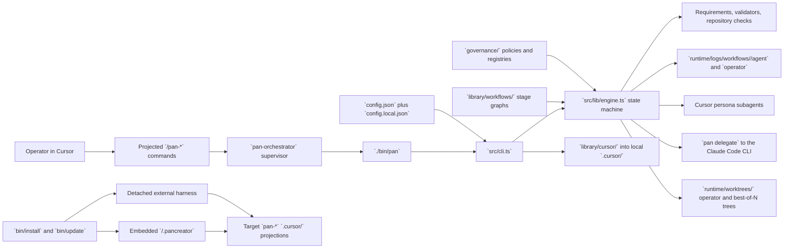

# Target repository primer

<!-- pancreator-primer-status: ready -->
<!-- generated-at: 2026-08-14T15:02:52Z -->
<!-- source-head: f3fb5d3d68dc8182838e058c91bb27784ced1ed1 -->

## Summary

Pancreator is a Cursor-native workflow harness written in strict TypeScript and Bash. Cursor supplies model execution and MCP access; the dependency-free Node.js CLI owns workflow snapshots, state transitions, deterministic gates, retries, validation evidence, and audit records. This checkout is the self-development source (`config.json.installation_mode: self_development`, version `3.6.0`). `library/` is canonical for workflows, personas, skills, Cursor projections, schemas, and templates; `governance/` holds policies, registries, criteria, and durable handbooks; `runtime/` holds generated run state, worktrees, and evidence. A supervisor (`pan-orchestrator`) advances one run at a time and delegates each stage to a named persona subagent, or to the Claude Code CLI when the persona mapping carries the `claude-code:` executor prefix. `bin/install` packages the harness into another repository in embedded or detached mode while leaving that target the owner of application source, tracked files, existing agentic tooling, and Git state.

## Administrative commands

### Install

- Node.js 22 or newer, npm, and Git are required; `package.json` declares `engines.node >= 22.0.0`. Cursor needs project commands and subagents enabled.
- `npm ci` installs the locked development toolchain (TypeScript, Node types, Prettier). There are no runtime dependencies.
- `./bin/pan models --sync` renders canonical Cursor assets and the active model mapping into the ignored local `.cursor/` tree. Run it after cloning and after any `active_config` or mapped-model change.
- `./bin/install --target /path/to/target-repository` builds an embedded harness at `<target>/.pancreator`; add `--harness-dir /outside/path` for a detached installation.
- `--yes`, `--repair`, `--clean`, and `--smoke` provide idempotent refresh, in-place repair, full reinstall, and the deterministic installer smoke harness. Installation writes the target's clone-local `.git/info/exclude` and never modifies a target-tracked file or the target `.gitignore`.
- `./bin/update --target /path/to/target-repository [--harness-dir /outside/path]` fast-forwards an installation from an indexed release.

### Build

- `npm run build` removes `dist/` and compiles `src/` and `tests/` with `tsc`.
- `npm run typecheck` runs `tsc --noEmit`.
- Every `./bin/pan ...` invocation runs a quiet `npm run build` before dispatching `dist/src/cli.js`.

### Test

- `npm test` is the documented default suite: it builds, then runs `node --test dist/tests/**/*.test.js`.
- `npm run test:unit`, `npm run test:integration`, and `npm run test:regression` run the individual compiled subsets.
- `npm run test:coverage` enforces 80% line and function coverage and 70% branch coverage over `dist/src/lib/**`.
- `./bin/install --smoke` runs the deterministic embedded-installer smoke harness.
- `npm run test:migrations` is still declared, but no `tests/migrations/` source directory exists.

### Other

- `npm run format` and `npm run format:check` apply or verify Prettier formatting.
- `npm run lint` runs `format:check`, `typecheck`, and `bash -n` over every Bash script in `bin/`.
- `npm run check` runs `lint`, `build`, `validate`, and `test` in that order through `bin/check`.
- `npm run validate` (equivalently `./bin/pan validate`) checks required files, workflows, stage graphs, policies and the policy lookup table, registries, release metadata, model configuration and projection drift, repository-check configuration, question-tool access, and operator briefs.
- `npm run validate:chat-markdown` validates fenced Markdown intended for Cursor chat, from stdin or a file path.
- `./bin/pan doctor [--worktree <name>] [--json]` reports Node support, workspace and worktree resolution, Git availability, browser-automation readiness, the active pipeline mapping, external-executor availability, and repository validation.
- `./bin/pan init --request runtime/inbox/<file>.md [--workflow dev|prototype|design] [--involvement <profile>] [--review-mode default|squad] [--worktree <name>]` starts a run; `prepare`, `submit`, `assess`, `decide`, `status`, `list`, `pause`, `resume`, `set-stage`, `waive-gate`, `abort`, and `archive` cover the rest of the lifecycle.
- `./bin/pan repository-check <profile>` runs a configured verification profile; `./bin/pan repository-check validate --json` validates the profile file without executing its commands.
- `./bin/pan worktree create|resolve|list|remove|reconcile` manages operator worktrees under `runtime/worktrees/operator/`.
- `./bin/pan best-of-n init|status|refresh-agents|abandon|consolidate|clean|prune` manages a best-of-N session.
- `./bin/pan governance card --mode <pair|spotfix|shepherd|investigation|repair|decomposition|best-of-n>` generates the governance card every non-workflow mode requires.
- `./bin/pan briefs build|validate|render`, `./bin/pan validation-map`, `./bin/pan requirements resolve|run`, `./bin/pan output scaffold|validate`, and `./bin/pan assessment scaffold` cover briefs, validation auditing, and artifact scaffolding.
- `./bin/pan requirements run --persona librarian --workflow standalone --stage build-docs --kind documentation --registry TARGET-REPO-PRIMER-VALIDATE-001 --target docs/target-repo-primer.md --json` validates this primer.

## Architecture

```mermaid
flowchart LR
  Operator[Operator in Cursor] --> Commands[Projected `/pan-*` commands]
  Commands --> Supervisor[`pan-orchestrator` supervisor]
  Supervisor --> Pan[`./bin/pan`]
  Pan --> CLI[`src/cli.ts`]
  CLI --> Engine[`src/lib/engine.ts` state machine]
  Config[`config.json` plus `config.local.json`] --> CLI
  Workflows[`library/workflows/` stage graphs] --> Engine
  Governance[`governance/` policies and registries] --> Engine
  Engine --> Requirements[Requirements, validators, repository checks]
  Engine --> Runtime[`runtime/logs/workflows/<run-id>/agent` and `operator`]
  Engine --> CursorWorkers[Cursor persona subagents]
  Engine --> External[`pan delegate` to the Claude Code CLI]
  Engine --> Worktrees[`runtime/worktrees/` operator and best-of-N trees]
  CLI --> Projection[`library/cursor/` into local `.cursor/`]
  Installer[`bin/install` and `bin/update`] --> Embedded[Embedded `<target>/.pancreator`]
  Installer --> Detached[Detached external harness]
  Embedded --> TargetCursor[Target `pan-*` `.cursor/` projections]
  Detached --> TargetCursor
```

## Project structure

- `AGENTS.md`: repository-wide authority order, run roles, operating loop, safety, mutation, and validation boundaries.
- `README.md`, `CHANGELOG.md`, `VERSION`, and `docs/`: product overview, Common Changelog history, harness version, and operator/authoring documentation.
- `package.json`, `package-lock.json`, `tsconfig.json`, `prettier.config.js`, and `.npmrc`: toolchain, scripts, strict compilation, formatting, and quiet npm output.
- `config.json` and `best-of-n-config.json`: workspace, persona-model, involvement, review-mode, and best-of-N session configuration. The untracked `config.local.json` merges over `config.json`.
- `bin/`: `pan`, `build`, `check`, `lint`, `run-quiet`, `install`, `install-support`, `update`, and `validate-chat-markdown`.
- `src/cli.ts` and `src/runtime-maintenance-cli.ts`: the public CLI dispatcher and the standalone runtime-maintenance entrypoint used during installation.
- `src/lib/engine.ts`, `workflow.ts`, `state.ts`, `context.ts`, and `run-layout.ts`: stage orchestration, graph assembly, persistence, bounded invocation context, and layout v1/v2 path resolution.
- `src/lib/requirements/`, `validation.ts`, and `validators/`: policy-bound requirement resolution, repository validation, and deterministic validators including `target-repo-primer.ts` and `target-language-handbooks.ts`.
- `src/lib/repository-checks.ts`, `git.ts`, `worktrees.ts`, and `workspace/`: target-authoritative verification profiles, Git-visible fingerprints, worktree management, root resolution, and protected paths.
- `src/lib/executors/`, `pipeline-config.ts`, `projection.ts`, and `cursor-content.ts`: executor mapping and the Claude Code adapter, model resolution, and canonical-to-local Cursor projection.
- `src/lib/best-of-n.ts`, `governance-card.ts`, `operator-involvement.ts`, `policies.ts`, `policy-guidance.ts`, and `briefs.ts`: best-of-N sessions, standalone-mode cards, gate profiles, policy resolution and progressive disclosure, and operator briefs.
- `library/workflows/`: `dev`, `prototype`, `design`, `dev-candidate`, `metacritic`, and `preflight` stage graphs with stage definitions and prompts.
- `library/personas/`, `library/skills/`, `library/cursor/`, `library/schemas/`, `library/operator-briefs/`, and `library/templates/`: worker contracts, reusable procedures, canonical Cursor sources, JSON schemas, shared brief presentation, and installation/bootstrap templates.
- `governance/policies/`, `governance/registries/`, `governance/criteria/`, and `governance/handbooks/`: enforceable policy metadata, validation/projection/lookup registries, criterion definitions, and durable engineering, language, design, and writing guidance. `governance/handbooks/target/` and `governance/policies/LANG-001.json` are generated per detected target language.
- `tests/unit/`, `tests/integration/`, `tests/regression/`, and `tests/helpers.ts`: compiled coverage alongside source.
- `runtime/`: `inbox/`, `logs/`, `worktrees/`, `pr-descriptions/`, and `repository-checks.json`. Generated workflow records here are harness-owned.
- `release/index.json`: the version-to-immutable-commit index used by embedded updates.

## Public interfaces

- `./bin/pan` is the primary operator and programmatic interface. Its verified top-level commands are `init`, `prepare`, `delegate`, `submit`, `assess`, `decide`, `involvement`, `pause`, `resume`, `set-stage`, `waive-gate`, `abort`, `technologies`, `repository-check`, `worktree`, `status`, `list`, `archive`, `models`, `briefs`, `validation-map`, `governance`, `best-of-n`, `requirements`, `output`, `assessment`, `spotfix`, `validate`, `doctor`, and `help`.
- `library/cursor/commands/` defines the projected operator commands: `/pan-start`, `/pan-resume`, `/pan-status`, `/pan-validate`, `/pan-debug`, `/pan-repair`, `/pan-decompose`, `/pan-spotfix`, `/pan-pair`, `/pan-shepherd`, `/pan-build-docs`, `/pan-build-briefs`, `/pan-summarize-context`, `/pan-release`, and `/pan-write-pr`. Best-of-N is entered by invoking the projected `pan-meta-orchestrator` agent rather than a command.
- `bin/install` and `bin/update` are the supported installation interfaces for initial install, repair/clean refresh, smoke validation, and indexed fast-forward update.
- `config.json` is the public workspace and persona-model configuration surface. Shared `defaults` merge with the selected `active_config`, `operator_involvement` declares gate profiles, `review_mode` selects the review method, and a persona value MAY carry the `claude-code:` executor prefix.
- `library/workflows/<slug>/workflow.json`, `stages/*.json`, and `prompts/*.md` form the canonical workflow authoring surface; `library/schemas/` documents their shapes while `src/lib/workflow.ts` is the enforcer.
- `governance/policies/*.json` plus `governance/registries/validation_registry.json` and `governance/registries/policy_lookup_table.json` form the public policy-bound automation and validation authoring surface.
- `governance/registries/projection_manifest.json` declares every canonical-to-`.cursor/` projection, including the `pan-browser-isolation.mdc` rule generated from `governance/policies/BROWSER-001.json` and the self-development-only `mcp.json`.
- JSON operator briefs plus `library/operator-briefs/` and `docs/operator-briefs/` are the narrative-artifact interface; the harness renders self-contained HTML and validates stage-declared paths.
- `runtime/repository-checks.json` is the deterministic verification contract with `configuration`, `static`, `fast`, `secondary`, and `full` profiles.
- `runtime/logs/workflows/<run-id>/` is the durable run surface. New runs split machine records under `agent/` and operator-readable files under `operator/`; generated records must not be hand-edited.

## Gotchas

- `.cursor/` is disposable local projection, not source of truth. Canonical content lives under `library/cursor/`, and drift is resolved with `./bin/pan models --sync`. This checkout currently reports projection drift until that command is run.
- `./bin/pan` always rebuilds before dispatch. Verification scripts are silent on success through `bin/run-quiet`; set `PAN_VERBOSE=1` to stream output while diagnosing a failure.
- Repository commands and the checked-in lock file use npm, although `package.json` declares a pnpm `packageManager`. Use the documented npm entrypoints until that metadata discrepancy is resolved.
- Missing or unbuilt `docs/target-repo-primer.md` blocks substantive exploration for non-librarian agents. `/pan-build-docs` is the bounded regeneration path and also owns `runtime/repository-checks.json`.
- Run state, `events.jsonl`, snapshots, invocation records, and generated artifacts are harness-owned. Resolve a run path from the active invocation card rather than a fixed literal, because layout v1 runs keep a flat tree while layout v2 runs split `agent/` and `operator/`.
- Pancreator fingerprints Git-visible source without recursively indexing the workspace. Compiled output, caches, virtual environments, dependency trees, and third-party code are outside agent remit.
- Every non-workflow mode (`pair`, `spotfix`, `shepherd`, `investigation`, `repair`, `decomposition`, `best-of-n`) takes its governance from `./bin/pan governance card --mode <mode>`. Do not hand-assemble policy text from `governance/policies/`.
- `./bin/pan init --workflow` accepts any workflow slug that resolves, including `dev-candidate`, `metacritic`, and `preflight`. Governance restricts `dev-candidate` and `metacritic` to a best-of-N session, so only `dev`, `prototype`, and `design` are ordinary starting points.
- A non-trivial UI/UX delivery runs the `design` workflow first; only its ratified handoff is referenced by a separately started `dev` run.
- Target installations use two path spaces: embedded filesystem references live under `.pancreator/`, detached projections use the absolute harness path, and CLI request/output arguments stay harness-relative such as `runtime/inbox/request.md`. Detached root discovery from the target needs an absolute harness command or `PANCREATOR_ROOT`.
- Target `.cursor/` projections are namespaced (`pan-*` or `pancreator.*`) and coexist with target-owned `AGENTS.md`, `CLAUDE.md`, `.claude/`, `.cursorrules`, Copilot instructions, MCP settings, and non-conflicting Cursor files. Installation reports but never modifies or removes those surfaces.
- Browser inspection rules live only in `BROWSER-001`. Read the policy on the active card and the procedure it references; personas, prompts, and docs deliberately do not duplicate it.
- Release publication is a two-commit protocol: prepare synchronized version metadata, create the immutable release commit, then map that hash in `release/index.json`. `VERSION`, `package.json`, and `package-lock.json` agree on `3.6.0`, but `release/index.json` lists no releases, so automatic target updates stay unavailable until publication.
- `package.json` retains a `test:migrations` entrypoint while `tests/migrations/` does not exist. Do not treat it as an active suite.
- `docs/runtime-protocol.md` still offers `npm run finalize:workflow-artifacts` for manual artifact finalization; that script does not exist. Terminal runs finalize automatically, and `./bin/pan archive` is the supported runtime maintenance command.
- `docs/workflow-authoring.md` names a `fable` model configuration and lists only `dev`, `prototype`, and `design` under shipped workflows. `config.json` declares `simple`, `default`, `complex`, and `auto`, and `library/workflows/` also ships `dev-candidate`, `metacritic`, and `preflight`. Prefer the manifests over that narrative.
- `README.md` omits `/pan-shepherd`, `/pan-pair`, `/pan-decompose`, and the best-of-N entry point from its command lists. Treat `library/cursor/commands/` and `AGENTS.md` as the current command inventory.
- Invocation cards use progressive policy disclosure: policy summaries, instructions, requirements, inputs, outputs, and boundaries are inline, while handbook and skill guidance arrives as an audited reference carrying source path, selected range, content digest, and read trigger. Digests cover the selection after surrounding whitespace is trimmed, and stage output must attest each referenced read or the reason it was skipped. Cards prepared before this change keep inline guidance bodies, and validation accepts both shapes.
- `governance/handbooks/target/<language>/style-guide.md`, `governance/policies/LANG-001.json`, and the `generated_by: pancreator-target-language-handbooks` lookup rows are generated by `/pan-build-docs`. Do not hand-edit them; regenerate the bundle when detected languages or target conventions change. They are intentionally absent from the hand-maintained `governance/policies/index.md` and `governance/handbooks/index.md`.
- `validateTargetLanguageHandbooks` returns `passed` immediately when the root is not a target installation, so the bundle's coverage is not deterministically enforced in this self-development checkout even though the bundle exists here.
- `bin/install` copies `governance/` wholesale into the target staging tree, so a fresh install carries this checkout's JavaScript and TypeScript handbooks until `/pan-build-docs` regenerates them against the real target. `preserveLanguageGovernance` in `bin/install-support` keeps a complete marked target bundle across refresh and discards a malformed one for rebuild.
