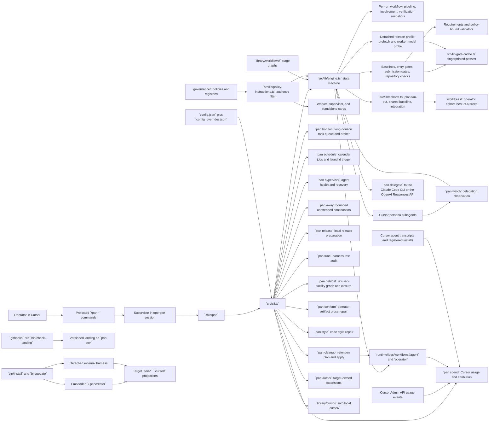

# Target repository primer

<!-- pancreator-primer-status: ready -->
<!-- generated-at: 2026-09-22T20:15:00Z -->
<!-- source-head: e0e23aacc3d82108aea612b4ec3ff36565c550bf -->

**Freshness:** `pan validate` and `pan doctor` report when this primer's `source-head` differs from the checkout; run `/pan-build-docs` to refresh it.

## Summary

Pancreator is a Cursor-native workflow harness written in strict TypeScript and Bash. Cursor supplies model execution and MCP access; the dependency-free Node.js CLI owns workflow snapshots, state transitions, deterministic gates, retries, validation evidence, and audit records. This checkout is the self-development source (`config.json.installation_mode: self_development`, version `7.23.0`). `library/` is canonical for workflows, personas, skills, Cursor projections, schemas, and templates; `governance/` holds policies, registries, criteria, and durable handbooks; `runtime/` holds generated run state and evidence, and `worktrees/` holds operator, cohort, and best-of-N checkouts. `/pan-start` and `/pan-resume` adopt the supervisor brief in the operator's session and advance one run at a time; `/pan-cohort` supervises a fan-out of chunk runs and `/pan-horizon` supervises a queue of tasks across a long absence. The supervisor delegates each worker stage to a named persona subagent, or to an external executor when the persona mapping carries the `claude-code:` or `openai:` prefix; `pan delegate --headless` dispatches a Cursor-executor stage through the harness's own `cursor-agent` path when the platform exposes no projected agent. `planning` is the default workflow and the entry point for delivery work: it runs one `plan` stage behind one operator gate, and approving that gate routes the work automatically into either one `delivery` run or a cohort of parallel `delivery-chunk` runs followed by one release run. Each run snapshots its own workflow graph, persona-model mapping, operator-involvement profile, review mode, and verification level at creation, so later configuration edits never change a run in flight. A run also renders a supervisor governance card that the supervisor must attest, and the supervisor must observe every delegated worker through `pan watch` before the harness accepts a submission. Deterministic verification is tiered: one shared `static` and `fast` baseline is captured per unit of work, agents iterate on the `impacted` profile, and the `full` profile runs only as the ship stage's release gate. The harness also keeps that work off the supervisor's critical path: a run adopts a recorded passing baseline taken at the same workspace fingerprint and verification-configuration digest, an agent's own clean profile pass is stored where the submit gate already looks, a source stage that submits into a read-only evidence stage starts a detached low-priority prefetch of the ship release profile, and a worker model probe records a `pending` marker and answers from a detached child instead of blocking the launch. Every policy instruction carries an audience, so a worker card, a supervisor card, and the harness-only audit snapshot each receive only the instructions written for them, and a delegated supervisor procedure points at per-policy section digests instead of repeating policy bodies. Optional `pan hypervisor`, `pan away`, `pan horizon`, and `pan schedule` subsystems add agent-health recovery, bounded unattended continuation, long-horizon task queues, and calendar triggers; away mode and the scheduler are disabled in `config.json`. Standalone command-backed modes cover authoring target extensions (`pan author`), auditing the harness test suite (`pan tune`), removing unused harness facilities (`pan debloat`), local release preparation (`pan release`), Simplified Technical English repair of operator-timed prose (`pan conform`), judgment-level code style repair (`pan style`), report-first retention cleanup of harness runtime state (`pan cleanup`), and Cursor token spend reporting (`pan spend`). `bin/install` packages the harness into another repository in embedded or detached mode while leaving that target the owner of application source, tracked files, existing agentic tooling, and Git state. The harness test suite is self-development-only and is not part of an installed payload. Repository validation is installation-scoped for the same reason: the audits that describe Pancreator's own source authoring run only when `config.json.installation_mode` is `self_development`, so a fresh embedded install reports zero validation errors and zero warnings.

## Administrative commands

### Install

- Node.js 22 or newer, npm, and Git are required; `package.json` declares `engines.node >= 22.0.0`. Cursor needs project commands and subagents enabled. The Claude Code CLI is needed only for a `claude-code:` persona mapping, `OPENAI_API_KEY` only for an `openai:` one, and an `admin:*`-scoped `CURSOR_ADMIN_API_KEY` only for `pan spend`.
- `npm ci` installs the locked development toolchain (TypeScript, Node types, Prettier). There are no runtime dependencies. It is also the workspace bootstrap recorded in the `setup` array of `runtime/repository-checks.json`, because a fresh worktree carries no installed dependencies.
- `npm run prepare` points `core.hooksPath` at `.githooks/`, which holds `pre-commit` and `pre-merge-commit`. Both call `bin/check-landing`, which refuses a direct installable commit on `pan-dev` or `main` and a merge whose source branch carries no new indexed release. `bin/check-landing branch <ref>` reports landability without committing.
- `./bin/pan models --sync` renders canonical Cursor assets and the active model mapping into the ignored local `.cursor/` tree. Run it after cloning and after any `active_config` or mapped-model change. `--force` with `--sync` projects the configured specs when the local Cursor model catalog is stale or incomplete.
- `./bin/install --target /path/to/target-repository` builds an embedded harness at `<target>/.pancreator`; add `--harness-dir /outside/path` for a detached installation, which must sit outside the target tree.
- `--yes`, `--repair`, `--clean`, and `--smoke` provide idempotent refresh, in-place repair, full reinstall, and the deterministic installer smoke harness. Installation writes the target's clone-local `.git/info/exclude` and never modifies a target-tracked file or the target `.gitignore`.
- The installed payload excludes `tests/` and `dist/tests/`, and `bin/install-support strip-harness-test-scripts` removes every `test` and `test:*` script from the staged `package.json`. `tests` is a retired payload entry: a refresh from an older installation deletes only the files whose recorded release digest still matches, backs up and retains anything changed or target-added, and reports both sets.
- Installation also appends a guarded `pan` shell function to the operator's Bash and Zsh rc files. `--skip-shell-alias` suppresses that step, and the installer smoke harness always passes it.
- `./bin/update --target /path/to/target-repository [--harness-dir /outside/path] [--skip-shell-alias]` fast-forwards an installation from an indexed release.

### Build

- `npm run build` calls `./bin/run-built --build-only`, which serializes builds on a per-root lock and delegates to `bin/build`. `bin/build` compares a fingerprint stamp of `tsconfig.json`, `package.json`, `package-lock.json`, and every `src/` and `tests/` TypeScript file against `dist/.build-stamp`, and rebuilds by removing `dist/` and running `tsc` only when the stamp is stale.
- A stale stamp compiles into a private `dist.build-<pid>` staging directory and swaps it into place with two renames, so `dist/` is never absent or half-written and a build never waits for a running consumer. A long-lived `pan watch` therefore cannot delay a build on its root.
- `./bin/build --stamp-fresh` reports whether `dist/` already matches its inputs, and `npm run typecheck` runs `tsc --noEmit`.
- Every `./bin/pan ...` invocation goes through `bin/run-built`, which builds when needed under a per-root lock held only for the compile, and then dispatches `dist/src/cli.js`. A caller that waits more than `PANCREATOR_BUILD_LOCK_NOTICE_SECONDS` (default 5) for that lock prints one notice naming the holder pid. `bin/openai` dispatches `dist/src/openai-cli.js` the same way.

### Test

- `npm test` is the documented default suite: it builds, then runs `node --test` over the compiled `unit`, `integration`, and `regression` lanes only, at `--test-concurrency=${PAN_TEST_WORKERS:-13}`. Every test script routes through `bin/run-tests` and the compiled `tests/reporters/failures-only.ts` reporter, so a passing run prints almost nothing. The lanes currently hold 92 unit, 146 integration, 25 regression, and 9 secondary test files.
- `npm run test:unit`, `npm run test:integration`, and `npm run test:regression` run the individual compiled subsets. `npm run test:secondary` runs the `tests/secondary/` lane, which owns the installer suites and is outside `npm test`.
- `./bin/pan tests impacted [--worktree <name>] [--changed <ref> | --staged | --worktree-dirty] [--file <path>]... [--include <glob>]... [--depth <n>] [--list] [--json] [--advisory-ratio <0..1>]` (equivalently `npm run test:impacted`) is self-development only. It builds the runtime import graph of `src/` and `tests/`, selects the mainline lane tests the changed files reach, and runs them with the failures-only reporter. It is the iteration profile (`impacted` in `runtime/repository-checks.json`) and never a gate; it appends each run to `runtime/cache/test-impact.jsonl` and advises using `fast` instead once the selection reaches 60% of the lane. Under `DEV-001`, `REMED-001`, and `VERIFY-001` it is the only profile an implementing or evidence agent runs while iterating.
- `./bin/pan tests wall` reports the rolling 24-hour fast-lane wall average against the `fast_wall` ceiling in `config.json` (120000 ms, with `max_load_average_per_cpu` and `minimum_qualified_samples` filters). `./bin/pan tests benchmark --baseline-workspace <path> --candidate-workspace <path> --population-tolerance <count>` captures both sides of a paired comparison in one session record, and `npm run benchmark` (`bin/benchmark`) times the `fast` or `full` profile three times in one workspace.
- `npm run test:coverage` runs every compiled lane, including `secondary`, and enforces 80% line and function coverage and 70% branch coverage over `dist/src/lib/**`. Because it covers every lane once, the `full` profile pairs it with `npm run check` rather than re-running `npm test`.
- `./bin/install --smoke` runs the deterministic embedded-installer smoke harness. It also asserts that a fresh install carries no `tests/`, no `dist/tests/`, and no test scripts, and that a refresh removes an unmodified retired `tests/` payload.
- `tests/secondary/embedded-installation.test.ts` is the self-development leakage guard. It installs an embedded harness, runs `pan doctor` inside it, and asserts `validation.ok` with empty `errors` and `warnings`. A new check that only makes sense for Pancreator's own source must therefore be installation-scoped, or that suite fails. Run it through `npm run test:secondary`, not `npm test`.
- `bin/run-tests` owns one scratch directory per suite run under `runtime/tmp/tests.noindex/`, exports it as `PANCREATOR_TEST_TMP`, and discards it at exit by renaming it to `discarded-<id>` and starting a detached `rm -rf`, so the command ends when its assertions end. The next run sweeps any run directory whose owner process is gone and any discarded tree whose remover is gone.
- Fixture construction is shared rather than repeated. `tests/shared-template.ts` builds one fixture template per suite run under that scratch directory, behind a lock and published by rename, and every other test process clones it; `tests/fixture-template.ts` holds the template and its clones and deliberately imports no engine module, so a fixture-only test is not dragged into the impacted selection. A test file run outside `bin/run-tests` falls back to its own per-process build.
- `TEST-001` and `governance/handbooks/eng/testing.md` define when a self-development test earns its place in the suite. `./bin/pan tune prepare|finalize|validate-audit` runs the standalone audit of that suite and writes ranked records under `runtime/tune-harness/` without editing any test.
- `npm run test:migrations` is still declared, but no `tests/migrations/` directory exists, so the script matches nothing.
- `PAN_TEST_PROFILE=<path>` makes the reporter write per-test and per-file durations to that JSON path. The harness sets it for exactly one `full`-profile gate before ship, and the result is advisory rather than a gate. The variable name lives alone in `src/lib/suite-profile-env.ts` so the reporters do not import the run layout.
- `bin/run-tests` also exports `PAN_PREFETCH_FULL=0` unless the caller already set it, because several suites assert exactly how many times a profile executed and the release-profile prefetch would make those counts depend on scheduling.

### Other

- `npm run format` and `npm run format:check` apply or verify Prettier formatting over explicit top-level paths (`bin docs evals governance library release src target-extensions tests` plus root `*.json`, `*.js`, and `*.md`) with Prettier's content cache enabled. `tests/regression/format-script-coverage.test.ts` fails when that path list stops reaching a tracked file Prettier supports.
- `npm run lint` runs `format:check`, then `bash -n` over every Bash script in `bin/`. It runs `typecheck` only when `bin/build --stamp-fresh` reports a stale build stamp; a fresh stamp proves the emitting build already type-checked the same program.
- `npm run check` runs `build`, `lint`, and `validate` in that order through `bin/check`, so the fresh build stamp lets `lint` skip its own `typecheck`. Test execution belongs to the profile commands (`npm run test:coverage`, `./bin/install --smoke`), so a passing check never runs the suite.
- `npm run validate` (equivalently `./bin/pan validate`) checks required files, workflows, stage graphs, policies and the policy lookup table, registries including `governance/registries/harness_repair_categories.json`, release metadata, model configuration and projection drift, repository-check configuration, question-tool access, canonical-command governance, eval scenarios, target-extension authoring, and operator briefs. It also runs three registry-integrity checks that fail when a policy reaches no card: policy-to-lookup-row coverage, per-row instruction delivery at that row's card audience, and audience-to-card-producer delivery, plus a handbook-coverage check that follows a standalone mode when a handbook belongs to one instead of to workflow personas. Parts of the sweep are self-development-only, behind `isSelfDevelopmentInstallation`: the directive-ownership audit, the test scratch-directory audit, the harness-instruction coverage check, the supervisor-delegation guidance check, the primer-drift warning, and three extra required files (`docs/operator-briefs/project.json`, `docs/operator-briefs/project.css`, `library/skills/review-squad-pancreator.md`).
- `npm run validate:chat-markdown` validates fenced Markdown intended for Cursor chat, from stdin or a file path.
- `./bin/pan doctor [--worktree <name>] [--json]` reports Node support, workspace and worktree resolution, Git availability and the integration branch, browser-automation readiness, Cursor authentication and its `.env` source, the active pipeline mapping, the Cursor model catalog, gate-cache state, primer freshness, repository-check probe coverage, and repository validation.
- Deterministic shell gates accept a recorded clean pass of the identical command at an unchanged Git workspace fingerprint for 24 hours (`DEV-001`); the cache lives at `runtime/cache/gate-results.json`, a result so accepted is marked `cached`, and `PAN_GATE_CACHE=0` forces every gate to execute. The cache is harness-owned, so agents must not set or clear that variable. Three behaviors feed it: baseline capture adopts an earlier passing baseline artifact taken at the same profile, workspace fingerprint, and repository-check configuration digest; `pan repository-check <profile> --run <run-id>` records its own clean pass when no command timed out and the Git fingerprint is identical before and after; and a source stage that submits into a read-only evidence stage starts one detached low-priority run of the ship entry gate's profile, recording the child pid under the run's evidence directory. `PAN_PREFETCH_FULL=0` stops that prefetch, and a killed or failed prefetch simply leaves nothing behind.
- `./bin/pan init --request runtime/inbox/queue/<file>.md [--workflow planning|delivery|prototype|design] [--title <title>] [--workspace <dir> | --worktree <name>] [--gates <file>] [--involvement <profile>] [--verification <level>] [--with-design] [--operator-artifacts] [--context-reference <file>] [--no-autostart | --autostart [--max-parallel <n>]]` starts a run; the default workflow is `planning`, and `--with-design` composes design planning into it. `prepare`, `delegate`, `watch`, `worker record|state`, `submit`, `assess`, `decide`, `pause`, `attribute`, `resume`, `set-stage`, `waive-gate`, `abort`, and `archive` cover the rest of the lifecycle.
- `./bin/pan cohort init|start|status|integrate|release|abandon|clean|route` drives the plan fan-out. `start` creates one worktree and one `delivery-chunk` run per unstarted chunk of the next cohort up to the parallelism limit, `integrate` retries the one merge that failed to advance automatically, `release` is the merge-free retry of the release continuation, and `route` is the idempotent retry of a failed plan route.
- `./bin/pan watch <run-id> [--invocation <id>] [--cadence-seconds <n>] [--stall-timeout-seconds <n>] [--timeout-seconds <n>] [--mark-background] [--launched-at <iso>] [--handle <id>] [--agent-state running|completed]` is the harness-owned worker timer. It records every arming and wake to `agent/evidence/<invocation-id>-watch.jsonl` and exits `0` on a present output, `2` on a stall, `3` at the timeout, and `4` when the completion is unverified. `--agent-state` reports what the supervisor saw when it inspected the launched agent, because the watch reads files and cannot see a worker that is still writing. `./bin/pan watch --targets <run-id>:<invocation-id>[,...]` is the multiplexed cohort wait that returns on the first target that changes, and `./bin/pan watch <run-id> --foreground-returned [--launched-at <iso>]` records a returned foreground launch instead.
- `./bin/pan worker record <run-id> --handle <platform-handle> [--invocation <id>] [--role <evidence-role>] [--new-attempt]` records the platform identity of a launched worker, and `./bin/pan worker state <run-id>` reports the last known state of every recorded worker and each declared path on disk.
- `./bin/pan attribute <run-id> --note <directive> [--role supervisor|operator] [--disposition read-only-input|commit-with-unit|operator-owned] [--paths <p,...>]` records an operator directive executed against the workspace outside a stage, so the next invocation card lists those paths as already attributed.
- `./bin/pan status <run-id> --redline --occasion <pan-start|pan-resume>` writes the platform-guidance redline record the supervisor owes at every start and resume; `--resolve <citation>` maps a stale artifact citation through the run's invocation alias map.
- `./bin/pan inbox [--json]` lists the request files under `runtime/inbox/`, which is partitioned by lifecycle status, and `./bin/pan inbox restore <inbox-file>` returns a canceled or active item to `queue/`. `./bin/pan archive [--days <n>] [--complete] [--canceled] [--json]` applies the archive tier of runtime retention, reading its window from `config.json.retention` (default 30 days) unless `--days` overrides it for one command.
- `./bin/pan cleanup [--days <positive-integer>] [--class <name>]... [--apply] [--json]` is the deletion tier. It reports the complete plan by default and mutates only with `--apply`. `CLEANUP_ARTIFACT_CLASSES` in `src/lib/cleanup.ts` names every class it touches: workflow and standalone runs, best-of-N and cohort sessions, traces, evals, horizon, hypervisor, away mode, orchestrator events, terminal inbox history, PR descriptions, research, benchmarks, scratch, and managed worktrees, plus the durable `retain` classes for the conform and style checkpoints, `runtime/release/allocations.jsonl`, and `runtime/repository-checks.json`. The apply also reconciles inbox lifecycle directories, relocates legacy loose inbox files, renames surviving loose files onto the temporal convention, and retires aged clean worktrees while keeping every branch.
- `./bin/pan spend [--days <1..365>] [--json]` fetches team usage events from the Cursor Admin API (`POST https://api.cursor.com/teams/filtered-usage-events`, Basic authentication, 1000-event pages, 60-second per-request timeout) and returns one aggregate report. The default window is 14 days. It resolves `CURSOR_ADMIN_API_KEY` from the process environment or an installation or workspace `.env`, and never emits raw events, credentials, email addresses, conversation ids, or cloud agent ids. `./bin/pan context digest <file>` prints the trimmed-content digest an audited context reference states, and `./bin/pan context card <run-id>` renders one invocation card read-only from its recorded snapshot.
- `./bin/pan hypervisor start|run|tick|status|stop [--json]` runs the agent-health loop that reconciles the agent registry and drives bounded recovery. `./bin/pan away status|evaluate|apply <run-id> [--decision <id>] [--action <action>]` drives bounded unattended continuation under `AWAY-001`.
- `./bin/pan release allocate --worktree <name> --bump <major|minor|patch> [--run <run-id>]` hands out the next release version above every published and allocated one and records it in `runtime/release/allocations.jsonl` before any release commit exists, so two concurrent release runs cannot select the same version. `./bin/pan release sync|continue|finalize --worktree <name>` then performs local release preparation: checkpoint, rebase onto a fetched main, and finalized release commits. Finalization refuses a version it holds no allocation for, and refuses one that already exists on the tip of `pan-dev` or the local default branch. In self-development it also refuses an unclean conform pass with `RELEASE_CONFORM_UNCLEAN` and an unclean style pass with `RELEASE_STYLE_UNCLEAN`, each naming its repairing command; `--allow-unclean <conform|style>` is repeatable and lands in `overridden_quality_passes` on the result. Publication stays an operator action.
- `./bin/pan horizon init|add|start|next|status|reconcile|checkpoint|resume|defer|reinstate|abandon <session-id>` drives a long-horizon session over a task queue from the operator's own chat. `HORIZON-001` closes the list of hard blocks to four (`LH-H1` through `LH-H4`), `defer` accepts only a named hard block or an operator directive, and `reinstate` returns a deferral the supervisor does not confirm. `start --headless` is the only shape a harness driver process supervises, and only there does the session arbiter run.
- `./bin/pan schedule list|status|tick|validate|install-agent|uninstall-agent` and `./bin/pan schedule run <job-id>` evaluate configured calendar jobs and manage the opt-in macOS launchd trigger; any platform can invoke `pan schedule tick` from an external trigger. `config.json.schedule.enabled` is `false` in this checkout.
- `./bin/pan installs list` and `./bin/pan installs archive <install-id> --intake <path> --item <path>` report registered installations, flag a stale one against its `harness_version`, and archive only the installation inbox items a validated consolidated intake cites.
- `./bin/pan author apply --input <draft-json>` and `./bin/pan author validate [--extension <id>]` install and check target-owned commands, skills, and personas against `library/schemas/target-authoring.schema.json`. Both refuse a self-development installation.
- `./bin/pan debloat scan|adjudicate|select|impact|verify` is self-development only. `scan` inventories the functional dependency graph, runs an independent orphan check, reads every evidence file in the usage window, and writes an operator report under `runtime/debloat/` without removing anything; `adjudicate` records an agentic verdict for one unclear candidate; `select` accumulates the operator's chosen ids; `impact` computes the exclusive-reference closure with the freed paths and symbols; and `verify` fails while a listed path, freed entry, or reference to a removed facility survives.
- `./bin/pan eval list|run|grade` executes the on-demand harness evals over the JSON scenarios in `evals/scenarios/`; see `docs/evals.md`.
- `./bin/pan pr-description context [--worktree <name>] [--json]` collects the branch facts a pull-request description needs.
- `./bin/pan involvement`, `./bin/pan verification [<run-id>]`, and `./bin/pan verification <run-id> set <level> [--confirm]` inspect gate profiles and verification levels, and change the level of a run already in flight.
- `./bin/pan repository-check <profile> [--timeout-ms <ms>] [--workspace <dir|worktree> | --worktree <name>] [--run <run-id>] [--role <evidence-role>] [--force-repeat]` runs a configured verification profile; `./bin/pan repository-check validate --json` validates the profile file without executing its commands. The resolved bound is one budget for the whole profile: probes and commands share a single deadline, and the first entry that exhausts it stops the rest. A `--run` request that matches a recorded pass for the same invocation, role, profile, and fingerprint returns that pass instead of executing, and `--force-repeat` executes anyway. `--harness-initiated` marks the execution as harness-started and suppresses streaming; the harness authorizes it with a launch token it hands the child it spawns, so a caller that passes the flag without that token is refused with `HARNESS_INITIATION_UNVERIFIED`.
- `./bin/pan conform scan|checkpoint [--since <ref> | --all] [--worktree <name>] [--json]` selects the operator artifacts and harness instruction surfaces that `STE-001` covers and reports their Simplified Technical English issues. The harness-owned `docs/issues/**/*.md`, `runtime/pr-descriptions/*.md`, and `runtime/research/*.md` are editable, and so are the instruction surfaces `AGENTS.md`, `governance/criteria/*.md`, `governance/policies/*.json`, `library/personas/*.md`, `library/skills/*.md`, `library/cursor/commands/*.md`, and `library/cursor/rules/*.mdc`. A policy file is read through its `instructions[]` entries, including the `text` of an audience-tagged entry, under the `policy-json` target type of `SIMPLIFIED-ENGLISH-VALIDATE-001`. `governance/handbooks/` stays out, because a handbook is guidance rather than instruction text. Rendered `runtime/logs/workflows/**/operator/*.html` is report-only, and so is `CHANGELOG.md`, which a ship stage and `/pan-release` own and which is scanned only in self-development. No target-tracked path is editable. `scan` honors the selection flags and compares each file against `runtime/cache/conform.json`; `checkpoint` always inspects the complete eligible set, returns `blocked` without writing while any editable file still has issues, and writes that checkpoint once the set is clean. Both subcommands exit `1` on a non-passing status. In self-development the tracked instruction surfaces and `docs/issues/` resolve against the selected workspace, so `--worktree` moves them, while the installation root keeps the runtime artifacts. In a target installation those same instruction surfaces resolve against the harness root instead.
- `./bin/pan style scan|checkpoint [--since <ref> | --all] [--worktree <name>] [--json]` is the second batch pass. It reports the countable code style issues of workspace source whose extension a detected language owns (`.ts`, `.tsx` for TypeScript, `.py`, `.pyi` for Python, and the JavaScript extensions), counted by `CODE-STYLE-VALIDATE-001`, and writes `runtime/cache/style.json` on a clean checkpoint. Unlike conform it is a workspace mode: in an embedded installation the target repository is the workspace and the harness at `<target>/.pancreator` is report-only. `npm run lint`, or the formatter the target declares, stays authoritative for mechanical style, so the pass repairs only judgment-level rules.
- `./bin/pan technologies detect [--worktree <name>] --json` reports detected target languages and unsupported evidence from Git-tracked paths.
- `./bin/pan worktree create|resolve|list|remove|reconcile` manages operator worktrees under `worktrees/operator/`.
- `./bin/pan best-of-n init|status|refresh-agents|abandon|consolidate|clean|prune` manages a best-of-N session.
- `./bin/pan governance card --mode <author|best-of-n|build-briefs|build-docs|cleanup|conform|debloat|decomposition|harden|pair|polish|qa-workflow|release|repair|research|review|shepherd|spend|spotfix|style|supervisor|target|trace|tune-harness|unbound|write-pr>` generates the governance card every non-workflow mode requires; `--mode supervisor --run <run-id>` refreshes a run's supervisor card. `--mode review` also accepts `--base <ref>` and `--dimensions <a,b,c>`. `./bin/pan governance attest-supervisor <run-id> --sha256 <digest>` records the supervisor's attestation, `./bin/pan governance review-scope --target <ref>` reports a review target's conflicts of interest by tier, and `./bin/pan governance audit-directives` reports normative directives that no policy owns.
- `./bin/pan models [--sync] [--force] [--probe] [--migrate-from <previous-config.json>] [--json]` resolves and projects the active mapping; `--force` with `--sync` projects configured specs when the local catalog is stale or incomplete; a bare `--probe` launches one minimal `cursor-agent` call per distinct model spec and needs that CLI plus credentials. `./bin/pan models --probe --run <run-id> --invocation <id> [--await-probe]` probes one worker invocation: without `--await-probe` it records a `pending` marker, starts a detached child, and returns, and the child carries `--await-probe` to perform the live call. `./bin/pan models evidence --run <run-id> --role supervisor --effective-model <model> --source <source>` records the supervisor's own effective model.
- `./bin/pan briefs build|validate|render|generate`, `./bin/pan validation-map`, `./bin/pan requirements resolve|run`, `./bin/pan output scaffold|validate`, `./bin/pan assessment scaffold`, and `./bin/pan spotfix scaffold-escalation` cover briefs, validation auditing, and artifact scaffolding.
- `./bin/pan requirements run --persona librarian --workflow standalone --stage build-docs --kind documentation --registry TARGET-REPO-PRIMER-VALIDATE-001 --target docs/target-repo-primer.md --json` validates this primer.

## Architecture

```mermaid
flowchart LR
  Operator[Operator in Cursor] --> Commands[Projected `/pan-*` commands]
  Commands --> Supervisor[Supervisor in operator session]
  Supervisor --> Pan[`./bin/pan`]
  Pan --> CLI[`src/cli.ts`]
  CLI --> Engine[`src/lib/engine.ts` state machine]
  Config[`config.json` plus `config_overrides.json`] --> CLI
  Workflows[`library/workflows/` stage graphs] --> Engine
  Governance[`governance/` policies and registries] --> Audience[`src/lib/policy-instructions.ts` audience filter]
  Audience --> Engine
  Audience --> Cards[Worker, supervisor, and standalone cards]
  Engine --> Snapshots[Per-run workflow, pipeline, involvement, verification snapshots]
  Engine --> Gates[Baselines, entry gates, submission gates, repository checks]
  Gates --> Requirements[Requirements and policy-bound validators]
  Gates --> GateCache[`src/lib/gate-cache.ts` fingerprinted passes]
  Engine --> Detached[Detached release-profile prefetch and worker model probe]
  Detached --> GateCache
  Engine --> Runtime[`runtime/logs/workflows/<run-id>/agent` and `operator`]
  Engine --> CursorWorkers[Cursor persona subagents]
  Engine --> External[`pan delegate` to the Claude Code CLI or the OpenAI Responses API]
  CursorWorkers --> Watch[`pan watch` delegation observation]
  Watch --> Engine
  Engine --> Cohorts[`src/lib/cohorts.ts` plan fan-out, shared baseline, integration]
  Cohorts --> Worktrees[`worktrees/` operator, cohort, best-of-N trees]
  CLI --> Horizon[`pan horizon` long-horizon task queue and arbiter]
  CLI --> Schedule[`pan schedule` calendar jobs and launchd trigger]
  CLI --> Hypervisor[`pan hypervisor` agent health and recovery]
  CLI --> Away[`pan away` bounded unattended continuation]
  CLI --> Release[`pan release` local release preparation]
  CLI --> Tune[`pan tune` harness test audit]
  CLI --> Debloat[`pan debloat` unused-facility graph and closure]
  CLI --> Conform[`pan conform` operator-artifact prose repair]
  CLI --> Style[`pan style` code style repair]
  CLI --> Cleanup[`pan cleanup` retention plan and apply]
  Cleanup --> Runtime
  CLI --> Spend[`pan spend` Cursor usage and attribution]
  CursorAPI[Cursor Admin API usage events] --> Spend
  Runtime --> Spend
  Transcripts[Cursor agent transcripts and registered installs] --> Spend
  CLI --> Author[`pan author` target-owned extensions]
  CLI --> Projection[`library/cursor/` into local `.cursor/`]
  Hooks[`.githooks/` via `bin/check-landing`] --> Landing[Versioned landing on `pan-dev`]
  Installer[`bin/install` and `bin/update`] --> Embedded[Embedded `<target>/.pancreator`]
  Installer --> DetachedInstall[Detached external harness]
  Embedded --> TargetCursor[Target `pan-*` `.cursor/` projections]
  DetachedInstall --> TargetCursor
```

## Project structure

- `AGENTS.md`: the universal bootstrap card. It carries the mission, the ranked operating principles, the invariants, the authority order, role routing, repository and runtime boundaries, target-installation boundaries, the release boundary, and validation authority.
- `README.md`, `CHANGELOG.md`, `VERSION`, and `docs/`: product overview, Common Changelog history, harness version, and operator/authoring documentation. `docs/` holds `operator-guide.md`, `runtime-protocol.md`, `workflow-authoring.md`, `validation-framework.md`, `validation-report.md`, `embedded-installation.md`, `best-of-n.md`, `evals.md`, `output-verbosity.md`, `operator-brief-system.md`, `operator-briefs/`, `issues/`, and this primer. `docs/issues/` is the durable intake and out-of-band-adjustment directory and currently holds only `.gitkeep`.
- `package.json`, `package-lock.json`, `tsconfig.json`, `prettier.config.js`, `.prettierignore`, `.npmrc`, `.cursorignore`, and `.githooks/`: toolchain, scripts, strict compilation, formatting, quiet npm output, the worktree instruction-file suppression list, and the `pre-commit` and `pre-merge-commit` landing hooks.
- `config.json`: the tracked workspace, model-alias, persona-model, worktree-setup, retention, fast-wall, involvement, verification, schedule, and away-mode configuration. The untracked `config_overrides.json` merges over it. `best-of-n-config.json` sits beside them at the repository root but is operator-local rather than repository content: it is untracked, listed in `.git/info/exclude` alongside `config_overrides.json` and `detached/`, and no command generates or refreshes it. `library/templates/best-of-n-config.example.json` is the committed starting point an operator copies to that path by hand. `pan best-of-n init --configs <path>` requires an explicit path with no default, so that filename is only the conventional choice.
- `bin/`: `pan`, `build`, `run-built`, `run-tests`, `run-quiet`, `check`, `check-landing`, `lint`, `benchmark`, `openai`, `install`, `install-support`, `update`, and `validate-chat-markdown`.
- `src/cli.ts`, `src/openai-cli.ts`, `src/openai-agent-cli.ts`, and `src/runtime-maintenance-cli.ts`: the public CLI dispatcher, the direct OpenAI Responses entrypoints, and the standalone runtime-maintenance entrypoint used during installation.
- `src/lib/engine.ts`, `workflow.ts`, `state.ts`, `context.ts`, `context-card.ts`, `render.ts`, `run-layout.ts`, and `workflow-artifacts.ts`: stage orchestration with entry-gate handling, baseline adoption, the detached release-profile prefetch and worker model probe, graph assembly, persistence, bounded invocation context, read-only card rendering, layout v1/v2 path resolution, and stage artifact resolution.
- `src/lib/cohorts.ts`, `design-composition.ts`, and `src/lib/validators/cohort-plan.ts`: the plan fan-out, chunk-run creation, the session-wide shared repository-check baseline, integration merges, release continuation, the `--with-design` stage composition, and the cohort-plan and child-specification validators.
- `src/lib/verification.ts`, `waivers.ts`, `operator-involvement.ts`, `gate-cache.ts`, `suite-profile.ts`, `suite-profile-env.ts`, `fast-wall-series.ts`, `known-failing.ts`, and `naming.ts`: verification-level resolution, operator gate waivers and workspace-fingerprint ratification, gate profiles, the fingerprinted gate-result cache with its shared configuration digest, the advisory suite duration profile and reporter-only environment-variable name, the rolling fast-lane wall series with its load and sample filters, known-failing classification, and sortable run naming.
- `src/lib/watch.ts`, `agent-ledger-evidence.ts`, `hypervisor.ts`, `away-mode.ts`, `away-orchestration.ts`, `horizon.ts`, `horizon-arbiter.ts`, `headless-driver.ts`, `schedule.ts`, and `inbox.ts`: the focused and multiplexed worker watch with its agent-state terminal basis, foreground-return attestation, and platform-guidance redline records; recorded worker handles and launch evidence; the agent registry with health verdicts and bounded recovery; the away-mode option evaluator and immutable decision ledger; the long-horizon session, its four-hard-block arbiter, and the headless driver; calendar jobs and the launchd trigger; and the lifecycle-partitioned request inbox with its status moves and archival.
- `src/lib/governance/supervisor-card.ts`, `command-coverage.ts`, `audit-directives.ts`, `context-audit.ts`, and `harness-repair-categories.ts`: the per-run supervisor governance card and its attestation state, the canonical-command governance guard, directive-ownership auditing, context-bloat dispositions, and the harness repair category registry loader.
- `src/lib/requirements/`, `validation.ts`, and `validators/`: policy-bound requirement resolution, repository validation, and deterministic validators including `target-repo-primer.ts`, `target-language-handbooks.ts`, `code-style.ts`, `stage-validators.ts`, `refusals.ts`, `assessment.ts`, `operator-artifact.ts`, `pr-description.ts`, `prototype-output.ts`, `markdown-validator.ts`, `autonomy-state.ts`, `tune-record.ts`, and `simplified-english.ts`.
- `src/lib/policy-instructions.ts`, `policies.ts`, `policy-guidance.ts`, `conform.ts`, and `code-style.ts`: the policy-instruction audience model with its per-card filter, the policy catalog and guidance loader with its per-process per-root parse cache, progressive guidance disclosure, the operator-artifact conformance scanner, and the code style scanner. Both batch passes share the same shape: eligible-path rules, a checkpoint cache under `runtime/cache/`, and a checksum comparison.
- `src/lib/debloat.ts` and `src/lib/debloat/`: the unused-facility subsystem. `inventory.ts` and `graph.ts` build the functional dependency graph, `usage.ts` and `intent.ts` read the evidence window and train the logistic-regression intent classifier from `library/debloat/intent-corpus.jsonl`, `orphans.ts` runs the independent unused-export and unused-file check, `adjudication.ts` records agentic verdicts, `closure.ts` computes the exclusive-reference closure and the freed set, and `session.ts` and `report.ts` own the session state under `runtime/debloat/` and the operator report.
- `src/lib/repository-checks.ts`, `setup-commands.ts`, `technologies.ts`, `git.ts`, `worktrees.ts`, `workspace-attribution.ts`, and `workspace/`: target-authoritative verification profiles with their `setup` bootstrap, capture handling, recorded agent gate passes, the optional `concurrent` profile flag, and template-adopted isolation commands; worktree preparation commands, language detection, Git-visible fingerprints, worktree management, recorded out-of-stage workspace attributions, root resolution, and protected paths.
- `src/lib/executors/`, `pipeline-config.ts`, `pipeline-config-migration.ts`, `projection.ts`, `cursor-content.ts`, `cursor-sdk-logging.ts`, `build-identity.ts`, `argv-limits.ts`, `pan-command-grammar.ts`, and `shell-alias.ts`: executor mapping, Cursor authentication and probing, the optional account-local Cursor model catalog with its compact codec, the Claude Code adapter, the OpenAI Responses client with its session, tool policy, and `write-sandbox.ts` per-path write bound, model resolution and migration, canonical-to-local Cursor projection, build identity, the 900-byte argv guard, the shared `pan` option grammar that plan and rollback steps are checked against, and the guarded `pan` shell function.
- `src/lib/best-of-n.ts`, `governance-card.ts`, `review-scope.ts`, `review-dimensions.ts`, `briefs.ts`, `operator-artifacts.ts`, `operator-artifact-generation.ts`, and `operator-artifact-profiles.ts`: best-of-N sessions, standalone-mode cards, review conflict-of-interest scoping and dimension selection, operator briefs, artifact generation, and per-artifact heading profiles.
- `src/lib/release-preparation.ts`, `release-allocation.ts`, `installations.ts`, `target-authoring.ts`, `test-tuning.ts`, `test-impact.ts`, `test-file-order.ts`, `test-scratch-audit.ts`, and `evals/`: local release checkpoint/rebase/finalize, the shared version allocation ledger, the installation registry, target-owned command and persona authoring, the harness test-tuning session, the import-graph test selector and lane ordering, the test scratch-directory audit, and the eval scenario runner and graders.
- `src/lib/cleanup.ts`: the retention deletion tier. `CLEANUP_ARTIFACT_CLASSES` is the single inventory of every ephemeral and durable runtime class, `planCleanup` reports actions, skips, worktrees, and branches without mutating, and `applyCleanup` performs exactly that plan and adds the inbox reconciliation, relocation, and rename results.
- `src/lib/token-spend.ts` and `src/lib/cursor-usage.ts`: the Cursor Admin API client with its paging, timeout, and response validation, and the aggregation that correlates usage events with local Cursor transcripts and workflow records to produce `TokenSpendReport` with its totals, token categories, daily series, eight ranked slices, per-slice coverage, and warnings.
- `src/lib/pr-description.ts`, `target-instructions.ts`, `browser-readiness.ts`, and `project-config.ts`: pull-request description context, target-instruction resolution, browser-automation readiness reporting, and project configuration loading with the `retention` window resolver.
- `src/lib/json-merge-patch.ts`, `markdown.ts`, `io.ts`, `errors.ts`, `types.ts`, and `versioning.ts`: RFC 7386 stage-output revision patching, bounded Markdown parsing, filesystem/JSON helpers, invariants, shared types, and Semantic Versioning release-metadata rules.
- `library/workflows/`: `planning`, `delivery`, `delivery-chunk`, `prototype`, `design`, `delivery-candidate`, and `metacritic` stage graphs with stage definitions and prompts. `planning` owns the single `plan` stage; `delivery` runs implement, verify, remediate, ship; `delivery-chunk` runs implement, verify, remediate and is created only by the cohort fan-out; `design` runs intake, design, review, test, handoff; `prototype` runs intake, approach, build, evaluate.
- `library/personas/`, `library/skills/`, `library/cursor/`, `library/schemas/`, `library/debloat/`, `library/operator-briefs/`, and `library/templates/`: 22 worker contracts, the reusable procedures, canonical Cursor sources (`agents/`, `commands/`, `rules/`, `mcp.json`), 13 JSON schemas, the debloat intent corpus, shared brief presentation, and installation/bootstrap templates. `library/skills/` holds 21 procedures beside its `index.md`. `library/templates/` also holds the operator-copied `best-of-n-config.example.json` and both repository-check seed files.
- `governance/policies/` (58 policies), `governance/registries/`, `governance/criteria/`, and `governance/handbooks/`: enforceable policy metadata, the validation/projection/lookup/exemption/command-governance/repair-category/context-disposition registries, the criterion-authoring catalog, and durable engineering, testing, TypeScript, Python, design, long-horizon, and writing guidance. `governance/handbooks/target/`, `governance/policies/LANG-001.json`, and `governance/policies/LANGSTYLE-001.json` are generated per detected target language, and `governance/registries/cursor_model_catalog.json` is an untracked account-local file rather than repository content.
- `tests/unit/`, `tests/integration/`, `tests/regression/`, `tests/secondary/`, `tests/fixtures/`, `tests/reporters/`, `tests/helpers.ts`, `tests/run-helpers.ts`, `tests/fixture-template.ts`, `tests/shared-template.ts`, and `tests/temp.ts`: compiled coverage alongside source, with the installer suites isolated in `secondary`, the failures-only, inventory, and fixture-profile reporters, the per-suite-run shared fixture template and its engine-free clone helpers, and the one sanctioned fixture scratch allocator, which `bin/run-tests` scopes to a per-run directory under `runtime/tmp/tests.noindex/`. This tree is self-development only and is not installed into a target.
- `evals/scenarios/` and `evals/fixtures/toy-node/`: the operator-run harness eval scenarios, including the `judgment-*` set that exercises `PRINCIPLES-001`, and the toy target repository they drive.
- `target-extensions/`: the tracked mount point for target-authored extensions, currently holding only `.gitkeep` in this checkout, and one of the explicit Prettier format paths.
- `runtime/`: `inbox/`, `logs/`, `cache/`, `debloat/`, `release/`, `pr-descriptions/`, `research/`, `benchmarks/`, `build/`, `tmp/`, `tune-harness/`, and `repository-checks.json`. `runtime/inbox/` is partitioned into `queue/`, `active/`, `complete/`, `canceled/`, and `archive/`. `runtime/cache/` holds `gate-results.json`, `test-impact.jsonl`, and the `conform.json` and `style.json` checkpoints; `runtime/release/allocations.jsonl` holds the version allocation ledger; `runtime/build/` holds the build lock; `runtime/tmp/` holds `run-quiet` capture files and the per-run test scratch directories. The whole tree is Git-ignored, and generated workflow records in it are harness-owned.
- `worktrees/`: operator worktrees under `worktrees/operator/`, cohort chunk and release worktrees, and best-of-N candidate trees under `worktrees/<bon-id>/`. Legacy installations may still hold data under `runtime/worktrees/`.
- `release/index.json`: the version-to-immutable-commit index used by embedded updates, currently holding 74 entries through `7.22.0`.

## Public interfaces

- `./bin/pan` is the primary operator and programmatic interface. Its verified top-level commands are `init`, `prepare`, `delegate`, `watch`, `worker`, `submit`, `assess`, `decide`, `pause`, `attribute`, `resume`, `set-stage`, `waive-gate`, `abort`, `hypervisor`, `away`, `technologies`, `repository-check`, `conform`, `style`, `tests`, `release`, `author`, `tune`, `debloat`, `worktree`, `status`, `list`, `inbox`, `installs`, `archive`, `cleanup`, `spend`, `models`, `validate`, `eval`, `doctor`, `requirements`, `pr-description`, `output`, `assessment`, `governance`, `best-of-n`, `schedule`, `horizon`, `cohort`, `context`, `briefs`, `validation-map`, `involvement`, `verification`, `spotfix`, and `help`.
- `library/cursor/commands/` defines the 30 projected operator commands: `/pan-start`, `/pan-resume`, `/pan-cohort`, `/pan-horizon`, `/pan-status`, `/pan-validate`, `/pan-repair`, `/pan-trace`, `/pan-decompose`, `/pan-spotfix`, `/pan-pair`, `/pan-shepherd`, `/pan-review`, `/pan-harden`, `/pan-polish`, `/pan-debloat`, `/pan-cleanup`, `/pan-spend`, `/pan-build-docs`, `/pan-build-briefs`, `/pan-summarize-context`, `/pan-qa-workflow`, `/pan-conform`, `/pan-style`, `/pan-release`, `/pan-write-pr`, `/pan-research`, `/pan-augment`, `/pan-author`, and `/pan-tune-harness`. Best-of-N is entered by invoking the projected `pan-meta-orchestrator` agent rather than a command.
- `bin/install` and `bin/update` are the supported installation interfaces for initial install, repair/clean refresh, smoke validation, and indexed fast-forward update. `bin/check-landing` is the landing guard the Git hooks call and can also be run directly as `bin/check-landing branch <ref>`.
- `config.json` is the public workspace and persona-model configuration surface. Shared `defaults` merge with the selected `active_config`, `operator_involvement` declares gate profiles (`standard`, `hands-off`, `technical-director`, `high-touch`, `long-horizon`), `verification` declares levels (`minimal`, `light`, `thorough`), `retention` declares `default_days` (30 in this checkout) and a `classes` map of per-class overrides for harness-owned ephemeral state, `fast_wall` declares the advisory rolling test-wall ceiling and its sample filters, `schedule` declares calendar jobs, `away_mode.enabled` arms bounded unattended continuation, `worktrees.setup` and `worktrees.readiness_paths` declare per-worktree preparation, and a persona value MAY carry a `claude-code:` or `openai:` executor prefix. An empty persona string in a named config inherits the `defaults` entry; an empty `defaults` entry is rejected. `config.json` carries four top-level model alias maps named `anthropic`, `oai`, `open`, and `cursor`. Each map accepts the optional keys `balanced`, `advanced`, and `ultra`, and each value MUST be an explicit executor model spec. A persona mapping MAY reference a tier alias in the form `<family>:<tier>`. Pancreator expands that alias before it snapshots a run, projects a Cursor agent, or delegates to an executor. The tracked named configurations are `balanced`, `advanced`, `ultra`, and `auto`. A named configuration carries its persona keys flat beside `summary`. The nested `personas` object remains compatibility input, and a nested entry wins over a flat key for the same persona. Pancreator emits only the flat shape. `library/schemas/config.schema.json` documents the shape.
- `library/workflows/<slug>/workflow.json`, `stages/*.json`, and `prompts/*.md` form the canonical workflow authoring surface; `library/schemas/` documents their shapes while `src/lib/workflow.ts` is the enforcer. A stage declares its own `criteria[]` inline, each with `id`, `type` (`judgment`, `shell`, or `state`), `statement`, and `hard`; `governance/criteria/index.md` is the naming catalog rather than a runtime contract. A stage MAY declare an optional `entry_gate` of `{ criterion, failure, max_loops }`: the harness runs that shell criterion when the run enters the stage, before it delegates the worker, records the pass on `state.entry_gates.<stage>`, routes a failure to the named stage, and pauses the run with an operator-only decision once `max_loops` failures have routed.
- `governance/policies/*.json` plus `governance/registries/validation_registry.json` and `governance/registries/policy_lookup_table.json` (139 rows) form the public policy-bound automation and validation authoring surface. An entry in a policy's `instructions[]` is either a plain string, which means audience `agent`, or an object `{ "text": <non-empty>, "audience": [...] }` drawn from `agent`, `supervisor`, `harness`, and `operator`. Worker and standalone cards render `agent`, supervisor cards render `agent` and `supervisor`, `operator` renders only for an operator audience, and `harness` never renders on a card while staying in the invocation JSON snapshot for audit. `harness` and `operator` are exclusive: neither may be combined with a second audience, because the filter would then render the instruction nowhere. `docs/workflow-authoring.md` and `docs/validation-framework.md` document the rules; `src/lib/policy-instructions.ts` is the enforcer.
- `governance/registries/projection_manifest.json` declares every canonical-to-`.cursor/` projection: the persona agents, the operator commands, the installation-mode rule, the self-development-only `mcp.json`, and four always-apply rules generated from policies (`pan-operating-principles.mdc` from `PRINCIPLES-001`, `pan-subagent-supervision.mdc` from `DELEGATE-001`, `pan-browser-isolation.mdc` from `BROWSER-001`, and `pan-chat-output.mdc` from `COMMS-001`).
- `governance/registries/harness_repair_categories.json` is the authoritative list of harness-audit issue categories (`out-of-band`, `performance`, `internal-consistency`, `test-issues`, `compliance`, `mechanical-friction`, `runtime-build-bugs`, `agentic-antipatterns`). It declares each category's id, filename slug, display name, scope, and next-action contract; `REPAIR-001`, the `/pan-repair` command, the harness-technician persona, and the intake validator all read it instead of restating the list. `pan validate` checks it.
- `governance/registries/cursor_model_catalog.json` is the optional account-local Cursor model catalog. It holds a `Cursor.models.list()` result in `models[]`, in either the verbatim form or the lossless compact codec form. When the file is present, `config.json` persona specs are validated against it at config load, projection, and probing; when it is absent, validation stays grammar-only. `governance/registries/directive_exemptions.json` records the normative directives excluded from ownership auditing.
- `governance/registries/command_governance.json` declares which canonical commands are read-only toward tracked source (`pan-augment`, `pan-status`, `pan-summarize-context`, `pan-validate`, `pan-cleanup`, `pan-tune-harness`), which are supervisor-owned (`pan-cohort`, `pan-horizon`, `pan-resume`, `pan-start`), which card mode each command-backed command uses, and which worktree-forwarding invocations each target-mutating command may make; `pan validate` fails a command that runs no registered card mode. `governance/registries/context_bloat_dispositions.json` records the reviewed duplication the repository keeps on purpose, such as the installer's mirrored projection and language-bundle renderers.
- `library/schemas/target-authoring.schema.json` is the target-extension authoring surface for `pan author`, and `library/schemas/tune-record.schema.json` is the record surface for `pan tune`.
- `evals/scenarios/*.json` is the eval authoring surface, validated by `pan validate` against `library/schemas/eval-scenario.schema.json`. Eval reports land under `runtime/logs/evals/<eval-id>/`.
- JSON operator briefs plus `library/operator-briefs/` and `docs/operator-briefs/` are the narrative-artifact interface; the harness renders self-contained HTML and validates stage-declared paths.
- `runtime/repository-checks.json` is the deterministic verification contract with a top-level `setup` bootstrap array and `configuration`, `static`, `fast`, `impacted`, `secondary`, and `full` profiles. Each profile MAY declare `probes`, `environment_probes`, an optional `concurrent` boolean, an `isolation_command` carrying `{file}` plus `{test_pattern}` or `{test}`, and a `timeout_ms` budget between 1000 and 86400000 milliseconds; identical non-empty `fast` and `full` command lists are rejected, and a superset profile's `timeout_ms` MUST be at least that of any profile whose commands it contains. `library/templates/repository-checks.json` and `library/templates/repository-checks.self-development.json` are the installed and self-development sources for that file.
- `runtime/inbox/` is the request surface, partitioned by lifecycle status. A request starts in `queue/` or restarts from `canceled/`, a started run moves it to `active/`, a succeeded run moves it to `complete/`, an aborted run moves it to `canceled/`, and a terminal failed run leaves it in `active/`. `pan init --request` takes the harness-relative path, normally `runtime/inbox/queue/<file>.md`, and `pan inbox restore` returns a canceled or active item to the queue.
- `runtime/logs/workflows/<run-id>/` is the durable run surface. New runs split machine records under `agent/` and operator-readable HTML, request, PR description, and QA files under `operator/`; generated records must not be hand-edited. A run's `agent/evidence/` also carries the recorded agent profile passes, launch and watch ledgers, the `prefetch-<profile>.json` marker of a started release-profile prefetch, and worker model evidence whose `result` MAY be `pending` while a detached probe is in flight. `runtime/logs/` also holds `cohorts/<cohort-id>/` with its shared baselines and integration proofs, `horizon/<session-id>/` with the arbiter ledger, `hypervisor/`, `away-mode/`, `best-of-n/`, `evals/`, `sessions/`, `traces/<trace-id>/`, `workspace-attributions.json`, and `worktrees/reconcile.jsonl`.

## Gotchas

- `.cursor/` is disposable local projection, not source of truth. Canonical content lives under `library/cursor/`, and drift is resolved with `./bin/pan models --sync`.
- The tracked `config.json` ships every `defaults` persona as an empty string, and an empty `defaults` entry is rejected at load. This checkout therefore depends on an untracked `config_overrides.json` that supplies the effective persona models; `./bin/pan doctor` reports the resolved mapping it actually loaded. The installer merges the source checkout's overrides so an install ships effective specs even though the tracked file is blank. That overrides file can also still map retired personas such as `investigator` and `repo-technician`, which `pan doctor` echoes even though no persona file exists for them.
- Cursor model availability is account-specific, so `governance/registries/cursor_model_catalog.json` stays on the operator's disk and out of shared history. `.gitignore` ignores it and `bin/install` deletes it from the staging payload, so it never reaches a target installation. The catalog is optional: with it present, an unknown model, parameter, value, or variant combination fails config loading loudly; without it, persona specs are checked for grammar only. Repository validation does not list it as a required file.
- `./bin/pan` builds before dispatch, but `bin/build` skips `tsc` when `dist/.build-stamp` still matches the TypeScript inputs, so a rebuild is not proof that compilation just ran. Verification scripts are silent on success through `bin/run-quiet`; set `PAN_VERBOSE=1` to stream output while diagnosing a failure.
- Nothing lands on `pan-dev` without a release. `.githooks/pre-commit` and `.githooks/pre-merge-commit` call `bin/check-landing`, which refuses a direct installable commit on `pan-dev` or `main` and a merge whose source branch carries no new indexed release. `npm run prepare` wires `core.hooksPath`, so a clone that never ran an npm lifecycle script has no guard.
- A supervisor session is gated twice. `pan prepare` and `pan submit` fail with `SUPERVISOR_CARD_UNATTESTED` until `pan governance attest-supervisor` records the current `agent/supervisor-card.md` digest, and with `REDLINE_MISSING` until `pan status <run-id> --redline` writes a declaration for the current session generation. Every attestation opens a new generation, so a resume needs a fresh redline even when the digest did not change.
- `pan submit` refuses a Cursor worker output with `DELEGATION_UNOBSERVED` unless a completed `pan watch` record or a `--foreground-returned` attestation proves the worker reached a terminal state. A watch that ends `unverified` (exit `4`) does not satisfy that requirement: one confirming wake could not settle the observation, because the output was younger than one cadence, the elapsed time was unreadable, or the agent was reported as running. Stages that `pan delegate` runs through an external executor are exempt only when the delegation-execution record names the run and invocation.
- Every argument the CLI passes through argv is refused at or above 900 bytes with `ARGV_ELEMENT_TOO_LARGE`, because endpoint security kills a process whose argv element reaches 1000 bytes before Node starts. Use `--note-file` instead of `--note` for a full decision packet; `decide`, `pause`, `resume`, `set-stage`, and `waive-gate` all accept it.
- `pan help` says `--timeout-ms raises the effective bound only`, but `effectiveTimeout` in `src/lib/repository-checks.ts` returns an explicit request unchanged, so the flag can also lower the bound below the profile's own timeout. The maximum rule applies only when no request is passed. The resolved bound is one budget for the whole profile rather than a per-command limit, so the `ship.full_suite` criterion's own `timeout_ms` covers all three `full` commands together. Treat `src/lib/repository-checks.ts` as authoritative and the help text as stale.
- `runtime/repository-checks.json` declares `setup: ["npm ci --no-audit --no-fund --loglevel=error", "npm run build"]`, matching `config.json.worktrees.setup`. The harness runs that sequence once per worktree-targeted run, at the first prepare of any stage, before baseline capture, and records the outcome on the run as `workspace_setup`. A fresh worktree carries no `node_modules/` and no `dist/`, so profile commands fail there without it. Neither `library/templates/repository-checks.json` nor the self-development template declares `setup`, so this array is live workspace configuration rather than template output.
- `runtime/` is Git-ignored, so `runtime/repository-checks.json` does not travel with a worktree. A new worktree starts with no profile file at all, and `/pan-build-docs` or an operator copy re-establishes it.
- The `$operator` block in `runtime/repository-checks.json` is an operator customization preserved verbatim across regenerations. Its `note` records the last operator reverification as 2026-08-31 at `source_head` `77b7279b`, while the file's own `source_head` now records the current head. That anchor is the one part of the block that fresh detection contradicts, and a regeneration leaves it alone because only the operator can reverify. Every profile command the note describes is unchanged and still matches `package.json`, `bin/check`, `bin/lint`, `bin/install`, and the self-development template, so the note is stale only in its date and hash. Its closing claim that no documented runtime bound exists, so no profile sets `timeout_ms`, also still holds; the workflow gate criteria carry their own bounds, and `config.json.fast_wall.ceiling_ms` is an advisory rolling average rather than a per-run timeout.
- A repository-check profile MAY declare `"concurrent": true`, but only the asynchronous runner acts on it. The synchronous gate path ignores the flag by design, probes stay serial because they are preconditions, and a concurrent profile's commands share the one profile deadline. No shipped template enables it, and `tests/unit/repository-check-template.test.ts` asserts that absence because the self-development `full` commands serialize their own compiles through the build lock.
- The live `runtime/repository-checks.json` declares no `isolation_command`, and it does not need one. `templateIsolationCommands` in `src/lib/repository-checks.ts` adopts the selector from `library/templates/repository-checks.self-development.json` whenever an installed profile runs exactly the template's commands, because the runtime file is untracked per-installation state that nothing regenerates. A profile an operator rewrote inherits nothing.
- The gate cache has three feeders, and each is a correctness contract rather than an optimization. Baseline capture adopts an earlier passing artifact only at the same profile, workspace fingerprint, and repository-check configuration digest, which `repositoryChecksConfigDigest` defines once for both the cache key and the reuse index. An agent's `pan repository-check --run <run-id>` records a pass only when nothing timed out and the Git fingerprint is identical before and after, and a cached `full` pass is rejected when the recorder was not permitted to run that profile. The release-profile prefetch is detached, unreferenced, and lowered in priority, and a killed or failed child leaves no entry, so the gate simply executes. Agents still must not set or clear `PAN_GATE_CACHE`.
- `bin/run-tests` exports `PAN_PREFETCH_FULL=0` unless the caller already set it, because suites that count profile executions would otherwise depend on process scheduling. A prefetch-specific test turns it back on for its own fixture. Do not set the variable in a shell that also runs the suite.
- A worker model probe is two commands. `pan models --probe --run <id> --invocation <id>` records a `pending` marker and returns; the detached child re-enters with `--await-probe` and overwrites it. A probe that never lands leaves the marker, and submission treats that exactly as it treats an unavailable probe, so `pending` never becomes usable evidence on its own. `DELEGATE-001` states that worker model evidence is best-effort, while a probed model that contradicts the run snapshot stays a hard failure.
- `bin/run-tests` discards its scratch tree by renaming it to `discarded-<id>` and starting a detached `rm -rf`, because deleting it in the foreground charged a 287-second suite run 115 seconds after its last assertion. A `.removing-<id>` marker names the remover, and the next run's sweep removes any discarded tree whose remover is gone.
- The suite profile is advisory, and so is the suite-cost gate. `PAN_TEST_PROFILE` is set for one `full`-profile gate before ship and its artifact lands in the run evidence. `ship.fast_wall_ceiling` is a non-hard criterion: a breach records a run advisory and a performance intake rather than routing the run. A sample taken above `fast_wall.max_load_average_per_cpu` or from a non-gate caller is excluded, and a window under `fast_wall.minimum_qualified_samples` reports `insufficient_samples`.
- Away mode and the scheduler are both disabled in `config.json` (`away_mode.enabled: false`, `schedule.enabled: false`), and a run reads the away setting from its own snapshot. The `long-horizon` involvement profile turns away mode on for a run that selects it, with a 12-decision budget and `waive-gate` in its allowed actions. Away mode never runs push, publication, deployment, or branch-deletion actions; the `COHORT-001` plan route may still create branches and worktrees under an away-mode approval, and `pan validate` rejects a by-id cross-reference between the two policies because no lookup row co-loads them. Away mode also cannot resume or redirect a run paused by a third ship release-gate failure.
- A long-horizon session never defers on a harness verdict. `HORIZON-001` closes the hard-block list to four ids, `LH-H1` through `LH-H4`; a cost-, speed-, or wall-time-backed criterion, a self-caused condition, a transient failure, and any ordinary judgment call are decided and recorded instead. `horizon defer` refuses without `--hard-block` or `--operator-directive`, and the arbiter runs only under `horizon start --headless`.
- Repository commands and the checked-in lock file use npm, although `package.json` declares a pnpm `packageManager`. Use the documented npm entrypoints until that metadata discrepancy is resolved.
- `package.json` still names the project `pancreator-v2-prototype` while its `version` and `VERSION` both report `7.23.0`. Treat `VERSION` as authoritative for the version and the npm `name` field as legacy metadata.
- Missing or unbuilt `docs/target-repo-primer.md` blocks substantive exploration for non-librarian agents. `/pan-build-docs` is the bounded regeneration path and also owns `runtime/repository-checks.json`. `pan doctor` and `pan validate` compare the stamped `source-head` against the checkout HEAD and the Summary version against `VERSION` at that commit, but neither can prove the body describes the stamped commit; only a regeneration establishes that.
- Run state, `events.jsonl`, snapshots, invocation records, and generated artifacts are harness-owned. Resolve a run path from the active invocation card rather than a fixed literal, because layout v1 runs keep a flat tree while layout v2 runs split `agent/` and `operator/`. A citation that resequencing left stale resolves through `pan status <run-id> --resolve <citation>`.
- Run directory names are descending-sortable UTC identifiers anchored on a future date, so the newest run sorts first and the prefix is not a date to read directly. `RUNTIME-001` reserves renaming and archival to the harness, and `./bin/pan archive` and `./bin/pan cleanup` are the supported retention commands.
- Retention has two tiers and one window. `pan archive` moves an expired artifact into an `archive/` child, and `pan cleanup` deletes from both the active root and that child. Both read `config.json.retention`, whose `default_days` is 30 and whose `classes` map is empty in this checkout; a root with no `config.json` falls back to the built-in 30 days, which is what installation does before it writes that file. A class whose name carries a temporal prefix is aged by that name rather than by mtime, so the two tiers agree on what is old.
- `pan cleanup` is destructive only with `--apply`, and its plan is the contract: the apply performs exactly the actions the plan named. It preserves state a nonterminal run or a live process owns, every `queue/` and `active/` inbox item whatever its age, and every dirty or unresolved worktree, recording a skip reason for each. It removes an aged clean worktree but always keeps the branch and reports whether that branch is an ancestor of the default branch. An unclaimed item in `active/` returns to the queue, while one in `complete/` or `canceled/` keeps its directory, because the run record ages out long before the request it finished.
- `pan spend` reaches the network, which no other `pan` command does. It needs an `admin:*`-scoped `CURSOR_ADMIN_API_KEY` from the process environment or an installation or workspace `.env`, and it sends that key only to `POST https://api.cursor.com/teams/filtered-usage-events` with Basic authentication. A missing key fails with `CURSOR_ADMIN_API_KEY_MISSING`, and the fetch layer also raises `CURSOR_USAGE_UNAUTHORIZED`, `CURSOR_USAGE_TIMEOUT`, `CURSOR_USAGE_REQUEST_FAILED`, `CURSOR_USAGE_INVALID_RESPONSE`, and `CURSOR_USAGE_PAGINATION_LIMIT`. The report is aggregate only: it carries no raw event, credential, email address, conversation id, or cloud agent id.
- Spend attribution is inference, and the report says so. Cursor's usage events expose neither Fast mode nor per-tool tokens, so Fast attribution uses an exact `fast=true` or `fast=false` model declaration and reports `unknown` otherwise, and tool rows overlap because one conversation can use several tools. Max mode is not Fast mode. Every slice carries its own `coverage` block, unmatched events stay `unattributed`, and ranked slices fold beyond ten rows into `Other`. A self-development checkout also reads each registered embedded installation's workflow records and its target workspace's Cursor transcripts, so a worker conversation id can resolve to a persona and stage; `attribution_sources` reports how many roots were scanned.
- `/pan-spend` renders through Cursor's own Canvas skill, which lives outside this repository. The command writes one `.canvas.tsx` file into Cursor's managed canvas directory and imports only from `cursor/canvas`. When Canvas creation fails, the session returns the aggregate summary and the concrete failure instead. `pan spend --days <n> --json` is the surface that needs no Canvas at all.
- `runtime/inbox/` is lifecycle-partitioned into `queue/`, `active/`, `complete/`, `canceled/`, and `archive/`. Every `/pan-*` command that captures a request writes into `queue/`, and the harness moves the item as the run reaches a terminal state. A terminal failed run deliberately leaves its item in `active/`. Older loose files still sit directly under `runtime/inbox/` and resolve as `legacy`. Pass the status directory in `--request`, not the bare directory.
- Pancreator fingerprints Git-visible source without recursively indexing the workspace. Compiled output, caches, virtual environments, dependency trees, and third-party code are outside agent remit. Operator, cohort, and best-of-N worktrees are full checkouts that contain their own `node_modules/` and `dist/`. `.cursorignore` suppresses only the instruction files inside a worktree, so worktree source stays readable.
- Every non-workflow mode takes its governance from `./bin/pan governance card --mode <mode>`, including `unbound` for an ad-hoc request outside every run and named mode. The command-backed modes are `author`, `build-briefs`, `build-docs`, `cleanup`, `conform`, `debloat`, `harden`, `polish`, `qa-workflow`, `release`, `research`, `spend`, `style`, `trace`, `tune-harness`, and `write-pr`, alongside `best-of-n`, `decomposition`, `pair`, `repair`, `review`, `shepherd`, `spotfix`, `supervisor`, and `target`. The `cleanup` and `spend` modes both resolve the `librarian` persona on `standalone`. Do not hand-assemble policy text from `governance/policies/`.
- `/pan-debug`, the `investigation` standalone mode, the `preflight` workflow, the `hypervisor`, `investigator`, and `repo-technician` personas, policies `DIAG-001` and `HYPERVISOR-001`, and the skills `hypervisor`, `manual-qa-cases`, `map-acceptance-criteria`, `modern-code-review`, and `scope-control` were all removed in 7.19.0. `src/lib/hypervisor.ts`, the `pan hypervisor` CLI, and the `hypervisor` persona key in `config.json` were kept, because away mode reads that health state. `pan requirements run --kind investigation` is still in the CLI grammar.
- `pan debloat` is a self-development scanner with a judgment layer. Its usage window counts a chat, inbox, or prose mention only when a trained intent classifier calls the line a functional direction, it excludes every transcript of a prior `/pan-debloat` session, and it marks the orphan category medium confidence because a path assembled at run time can hide a consumer. `scan` removes nothing; removal is the operator's recorded selection plus the `impact` closure, and `verify` fails while any freed entry survives.
- A harness repair audit is partitioned by issue category, not by run. `REPAIR-001` requires the technician to assess every category in `governance/registries/harness_repair_categories.json`, write at most one intake per category and none for a category with no confirmed finding, name the category in the operator lead, and use the filename `harness-repair-<UTC timestamp>-<category-slug>-<detail-slug>.md` under `runtime/inbox/queue/`. The audit category and a finding's classification are independent axes, and one intake MAY carry several findings as long as remediation addresses every finding id and every acceptance criterion names the id it satisfies. An explicit operator directive for one intake, a named subset, or a fixed count overrides the partition, and the `out-of-band` category's next action names operator-supervised execution instead of `/pan-start`.
- Conform's `--worktree` surface is live again, and its scope is split. In self-development, `docs/issues/**` and the tracked instruction surfaces resolve against the selected workspace, while runtime Markdown and the report-only operator HTML stay on the installation root. `/pan-conform` forwards `--worktree`, `governance/registries/command_governance.json` registers that forwarding, and `conform scan|checkpoint` remains in `WORKTREE_CAPABLE_SURFACES` in `src/cli.ts`. In a target installation the instruction surfaces move back to the harness root and no target-tracked path is ever editable. The `ConformRoot` doc comment in `src/lib/conform.ts` still says no `workspace` candidate is editable; treat `isEditable` as authoritative and that comment as stale.
- `pan style` scans by file extension, so `bin/install-support` is invisible to it. That file is the repository's substantive JavaScript and has no extension, which puts it outside both the style scan and `npm run typecheck`. Its correctness rests on review and on the installer suites.
- `STE-001` excludes source code, code comments, commit messages, `README.md`, the non-instruction files under `governance/`, and `docs/` from its writing rules, with two carve-outs: `docs/issues/` stays governed, because the conform boundary requires repairing those intake records, and the instruction text of `governance/policies/` and `governance/criteria/` stays governed. This primer therefore sits outside the writing rules while the intake directory beside it does not.
- `COMMS-001` owns operator-facing chat output, including a 250-word prose cap, a terminal-state report contract, and a banned-phrase list. Those rules moved out of `STE-001`, `BRIEF-001`, and `OUTPUT-001`. It is projected into every installation as the always-apply rule `.cursor/rules/pan-chat-output.mdc`, and `AGENTS.md` binds it on the first chat report, before any card is resolved. `GLOBAL-001` still governs the durable record and `OUTPUT-001` still governs deterministic execution output.
- `PRINCIPLES-001` is the mission and ranked-principles policy, projected as `.cursor/rules/pan-operating-principles.mdc` and restated at the top of `AGENTS.md`. It makes asking a question, pausing, or reporting `blocked` on a matter the agent may decide a mission failure rather than caution, and it forbids abdicating a decision to a harness refusal, a validator message, or an error string. The `evals/scenarios/judgment-*.json` set exercises it.
- `AGENTS.md` orders the governance-card requirement ahead of the orientation list: an unbound agent runs `./bin/pan governance card --mode unbound` and reads that card before its first substantive response. Reading `AGENTS.md`, this primer, and `runtime/repository-checks.json` does not satisfy that step, because none of them carries a policy body.
- `./bin/pan init --workflow` accepts any workflow slug that resolves, including `delivery-candidate` and `metacritic`. Governance restricts those two to a best-of-N session, so only `planning` (the default), `prototype`, and `design` are ordinary starting points; `delivery` is an explicit escape hatch for an operator who brings a ratified specification, and `delivery-chunk` is created only by the cohort fan-out.
- Approving the `planning` plan gate is the routing point, not a separate operator choice. A plan of one chunk starts one `delivery` run and inherits the planning worktree when one exists; a plan of two or more chunks opens a cohort session and refuses to branch away from uncommitted planning work. The session then advances by itself: when the last chunk run of a cohort succeeds, the harness commits each chunk worktree that still holds work, merges the chunk branches, and starts the next cohort or the release run. `pan cohort integrate` retries that advance, and a failed route or release continuation is retried with `pan cohort route --plan-run <id>` or `pan cohort release <cohort-id>` rather than by hand.
- A non-trivial UI/UX delivery runs the `design` workflow first, or composes design stages into planning and delivery with `pan init --with-design`.
- A run snapshots its workflow graph, persona mapping, involvement profile, and verification level at creation. Editing `config.json` never changes a run in flight; `./bin/pan verification <run-id> set <level>` is the only supported in-flight change, and `--confirm` is required when the new level disables the evidence producer of a ratified acceptance criterion.
- The `full` repository-check profile runs only as the ship stage's release gate. `delivery/ship` and `metacritic/ship` declare `entry_gate: { criterion: "ship.full_suite", failure: "remediate", max_loops: 2 }`, so the harness runs `pan repository-check full` when the run enters ship, before it delegates the release steward. The pass is recorded on `state.entry_gates.ship`, covers that visit, and is reused by the ship submission. A failure routes to `remediate`, and that remediation returns along its own success transition to verify, which retakes its evidence before ship runs the gate again. A third failure pauses the run with an `operator_decision` marked `operator_only`. No verify or remediate gate runs `full`, and the `minimal` verification level skips even the release gate. `full` is never baselined, so it is judged on its own result rather than by delta.
- A unit of work holds exactly one baseline per interior gate profile (`static` and `fast`). A cohort session shares one: the first run of the session that prepares a source-allowed stage captures it in its own worktree and records it under `runtime/logs/cohorts/<cohort-id>/baselines/`, and every other chunk run and the release run adopts that pointer instead of capturing its own. Outside a cohort, a run still adopts any recorded passing baseline artifact taken at the same fingerprint and configuration digest, and says which artifact it adopted.
- Agents never run `full`. A verify-stage evidence worker that tries is refused by name. The coder, remediator, reviewer, and QA worker iterate on the `impacted` profile plus the tests they added, and each runs `fast` exactly once as final validation. The consolidating verifier runs neither profile and cites prior gate evidence instead.
- A stage whose write roots exclude the workspace gets no shell tool on any external executor, and an OpenAI prompt task is bounded further by a generated `sandbox-exec` write profile on macOS. `scope.no_unapproved_changes` remains the gate of record for workspace mutation, and the delegation record names the granted roots when the executor exposes no per-path control.
- Target installations use two path spaces: embedded filesystem references live under `.pancreator/`, detached projections use the absolute harness path, and CLI request/output arguments stay harness-relative such as `runtime/inbox/queue/request.md`. Detached root discovery from the target needs an absolute harness command or `PANCREATOR_ROOT`. A spawned worker no longer inherits `PANCREATOR_EXEC_ROOT` or the `PANCREATOR_ROOT` that `bin/pan` pins beside it.
- An installed harness carries no `tests/`, no `dist/tests/`, and no `test` or `test:*` package scripts, so `./bin/pan tests impacted`, `./bin/pan tune`, `./bin/pan debloat`, and the harness suites exist only in this checkout. A target's `fast`, `secondary`, and `full` profiles must name that target's own commands. Refreshing an installation from a release that still shipped `tests/` removes only unmodified release-owned files and retains, backs up, and reports anything changed or target-added.
- `pan author` is the inverse boundary: it refuses a self-development installation and writes target-owned commands, skills, and personas only in an embedded or detached install.
- Target `.cursor/` projections are namespaced (`pan-*` or `pancreator.*`) and coexist with target-owned `AGENTS.md`, `CLAUDE.md`, `.claude/`, `.cursorrules`, Copilot instructions, MCP settings, and non-conflicting Cursor files. Installation reports but never modifies or removes those surfaces.
- Installation edits operator shell rc files to add a guarded `pan` function unless `--skip-shell-alias` is passed. That is the one installer side effect outside the target repository and the harness directory.
- Browser inspection rules live only in `BROWSER-001`. Read the policy on the active card and the procedure it references; personas, prompts, and docs deliberately do not duplicate it. `library/cursor/mcp.json` now starts `chrome-devtools-mcp@latest --browserUrl=http://127.0.0.1:9222` with no `--isolated`, and declares a Playwright fallback server, so `./bin/pan doctor` reports browser automation as ready when Chrome for Testing is installed.
- Release publication is a two-commit protocol: prepare synchronized version metadata, create the immutable release commit, then map that hash in `release/index.json`. `VERSION`, `package.json`, and `package-lock.json` agree on `7.23.0`. `release/index.json` holds 74 entries and maps `7.22.0` to `17d7dc15`. Concurrent release worktrees take distinct versions from `pan release allocate`, which records the allocation in `runtime/release/allocations.jsonl` before any release commit exists, and finalization refuses a version it holds no allocation for.
- A self-development release now has a quality precondition. `VERSION-001` requires the candidate to pass the conform scan and the style scan before the release commit, `finalizeLocalRelease` enforces both with `RELEASE_CONFORM_UNCLEAN` and `RELEASE_STYLE_UNCLEAN`, and the `delivery/ship` prompt returns `blocked` with `data.blocked.missing_precondition` and `data.blocked.supplying_command` rather than repairing the files. The release steward may not make those repairs, because they fall outside its `release_metadata_only` boundary; the librarian's `/pan-conform` and `/pan-style` passes own them. `--allow-unclean <conform|style>` is an explicit operator override and is recorded on the finalization result.
- `package.json` retains a `test:migrations` entrypoint while no `tests/migrations/` directory exists. Do not treat it as an active suite. `.gitignore` also excludes `src/migrations/` and `tests/migrations/`.
- Harness evals (`./bin/pan eval list|run|grade`, scenarios under `evals/scenarios/`, toy fixtures under `evals/fixtures/`) are operator-run and never part of `npm test` or any repository-check profile. `pan eval run` drives only harness-owned steps and external-executor stages; it stops with operator steps when a Cursor persona is next. `/pan-trace` is the cheaper end-to-end smoke of a newly merged harness feature, and `/pan-qa-workflow` is the driven workflow validation. See `docs/evals.md`.
- `README.md` names only twelve of the 30 projected commands, across its quick start and its command list. It omits `/pan-status`, `/pan-pair`, `/pan-shepherd`, `/pan-decompose`, `/pan-qa-workflow`, `/pan-review`, `/pan-cohort`, `/pan-horizon`, `/pan-trace`, `/pan-debloat`, `/pan-harden`, `/pan-polish`, `/pan-research`, `/pan-conform`, `/pan-style`, `/pan-augment`, `/pan-author`, `/pan-tune-harness`, and the best-of-N entry point. Treat `library/cursor/commands/` and `AGENTS.md` as the current command inventory.
- `AGENTS.md` no longer carries the policy-authoring, projection, and writing-policy rules inline. It points at `docs/workflow-authoring.md`, which now owns them together with the instruction-audience rules. Its shell-and-chat section points at `/pan-conform` and `/pan-style` instead of naming `npm run validate:chat-markdown`; that script still exists and still works, but the command-backed modes are the documented path.
- `docs/validation-report.md` records a one-time migration validation dated 2026-06-22 against Node.js 22.16.0. It is a historical record, not a current statement of repository state.
- Invocation cards use progressive policy disclosure: policy summaries, instructions, requirements, inputs, outputs, and boundaries are inline, while handbook and skill guidance arrives as an audited reference carrying source path, selected range, content digest, and read trigger. Digests cover the selection after surrounding whitespace is trimmed, and stage output must attest each referenced read or the reason it was skipped. Cards prepared before this change keep inline guidance bodies, and validation accepts both shapes.
- Reading a policy JSON file is not the same as reading the card. Of 727 instructions across the 58 policies, 81 are audience-tagged objects rather than plain strings, covering 47 `harness`, 28 `supervisor`, and 6 `agent` audiences. Seven policies carry a `harness` instruction: `BRIEF-001`, `COHORT-001`, `CONTRACT-001`, `DELEGATE-001`, `OUTPUT-001`, `RUNTIME-001`, and `VALID-001`. No policy currently carries an `operator` audience. A `harness` instruction never reaches a worker card, so an agent that greps `governance/policies/` sees rules that its own card deliberately withholds. `bin/install-support` mirrors the same filter for the generated `.cursor/` policy rules, because it runs before the harness is built and cannot import `src/lib/policy-instructions.ts`.
- `harness` and `operator` are exclusive audiences. Each suppresses an instruction at every other audience, so `normalizePolicyInstruction` rejects either one paired with a second audience rather than letting the card filter render the instruction nowhere.
- `pan validate` fails when a policy reaches no card. Three ungated registry-integrity checks run in every installation: every catalog policy must be named by at least one lookup row, no lookup row may resolve a policy whose filtered instruction list is empty at that row's card audience, and no policy may carry an audience with no card producer. The producers are derived from the mode table and the card filter rather than restated.
- Handbook coverage follows the owner, not the persona list. A handbook a standalone mode owns is checked against that mode's resolved card instead of against workflow-stage personas, because a batch-pass handbook stays out of ordinary stage context by design. `governance/handbooks/typescript/style-guide.md` and `governance/handbooks/python/style-guide.md` are checked this way, through the `style` mode.
- Every `harness` instruction must name a requirement id from its own policy or cite coverage in the exact `` `tests/<path>::<test name>` `` form. A bare `tests/` path is rejected, one citation must not stand in for two rules, and the cited name must open a `test(` or `it(` call at the start of a line. Like the directive-ownership audit, this check runs only under `isSelfDevelopmentInstallation`, so an installed target never reports it. A test suite reorganization therefore breaks governance validation, not just the suite: renaming or splitting a cited test requires updating the citing policy in the same change.
- A delegated supervisor procedure no longer inlines delivery-policy bodies. `renderSupervisorProcedureBody` emits one `` `<POLICY-ID>`: `sha256:<digest>` `` pointer per policy from `supervisor_card.policy_sections`, and validation checks the pointer instead of the instruction text. The supervisor reads the full text from its own governance card. A run whose recorded card state predates `policy_sections` falls back to the older inline shape, and validation accepts both.
- `PRIMER-001` was split. It now holds only the four bounded-orientation instructions every agent obeys, while the librarian's authoring duties, the deterministic section labels, and the primer and language-handbook validator requirements moved to `LIBRARIAN-001`. The `librarian/standalone/build-docs` lookup row resolves `LIBRARIAN-001` and `REPO-001`; `PRIMER-001` still arrives through a broader row. Cite `LIBRARIAN-001` for authoring rules and `PRIMER-001` for reading rules.
- `TS-001` and `PY-001` were split the same way. `TS-001` now delivers only `governance/handbooks/typescript/node.md` to the delivery personas, and `TSTYLE-001` and `PYSTYLE-001` carry the durable style guides on the single `librarian/standalone/style` row. A delivery persona no longer resolves a style guide, so a coder writing TypeScript reads the Node.js guidance and the `/pan-style` pass owns style repair.
- A stage retry MAY submit an RFC 7386 merge patch instead of a whole document. The harness applies the patch and validates the merged result exactly as a full submission, so a partial patch that drops a required field still fails. `pan validate` also fails a stage validator that blocks on a field its `enforced_fields` does not declare, and `src/lib/validators/refusals.ts` is the canonical refusal declaration for every live stage-output validator.
- `./bin/pan validate` reports unowned advisory directives as warnings rather than errors, and only in this checkout. The `validateRepository` sweep calls `auditDirectives` only under `isSelfDevelopmentInstallation`, so an installed target sees neither the `unowned advisory directive` warnings nor the `stale disposition evidence` errors from `pan validate` or `pan doctor`. The `./bin/pan governance audit-directives` command and the `directiveAuditHandler` requirement validator stay ungated and still report in any installation. `governance/registries/directive_exemptions.json` records intentional exclusions.
- `docs/embedded-installation.md` still documents target context-bloat dispositions under `governance/registries/context_bloat_dispositions.d/<extension-id>.json`. That target-owned mechanism still exists and `pan governance audit-directives` still evaluates it, but a target's `pan validate` sweep no longer does. Treat `src/lib/validation.ts` as authoritative for which checks an installation actually runs and run the focused command explicitly when a target needs that report.
- `governance/handbooks/target/<language>/style-guide.md`, `governance/policies/LANG-001.json`, `governance/policies/LANGSTYLE-001.json`, and the `generated_by: pancreator-target-language-handbooks` lookup rows are generated by `/pan-build-docs`. Do not hand-edit them; regenerate the bundle when detected languages or target conventions change. They are intentionally absent from the hand-maintained `governance/policies/index.md` and `governance/handbooks/index.md`. `./bin/pan technologies detect --json` currently reports `javascript` and `typescript` with no unsupported evidence, which is the bundle this checkout carries.
- The generated bundle is split. `LANG-001` carries the toolchain instructions and MUST declare no `guidance_sources`; it binds to `coder`, `qa-tester`, `reviewer`, and `spotfixer` on `*`/`*`. `LANGSTYLE-001` carries every generated handbook as its `guidance_sources` and binds to exactly one row, `librarian`/`standalone`/`style`. That style row sits beside the unmarked `librarian`/`standalone`/`style` row for `TSTYLE-001` and `PYSTYLE-001`; the two coexist because a lookup-row identity includes its policy list.
- `validateTargetLanguageHandbooks` returns `passed` immediately when the root is not a target installation, so the bundle's coverage is not deterministically enforced in this self-development checkout even though the bundle exists here.
- `bin/install` copies `governance/` wholesale into the target staging tree, so a fresh install carries this checkout's JavaScript and TypeScript handbooks until `/pan-build-docs` regenerates them against the real target. `preserveLanguageGovernance` in `bin/install-support` keeps a complete marked split bundle across refresh and discards a malformed one for rebuild. That function is a deliberate mirror of `src/lib/validators/target-language-handbooks.ts` and must change with it.
