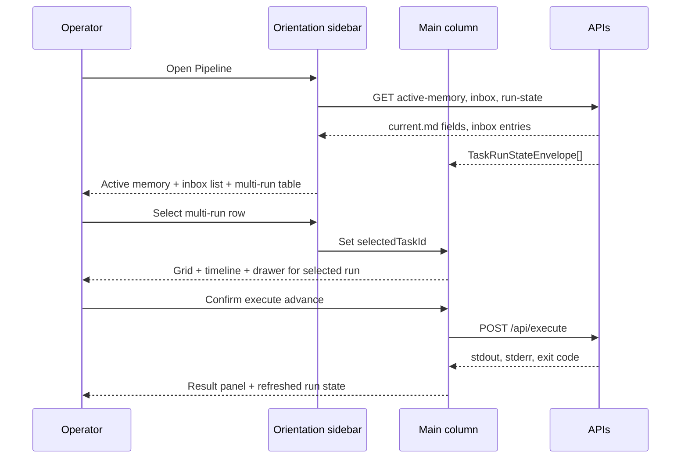

# Cockpit v2 active memory, inbox triage, and multi-run view UX Spec

## Overview

This feature adds Pipeline orientation surfaces so operators monitor active memory, triage inbox directives, prioritize concurrent feature-delivery runs, and invoke allowlisted `pan` commands without leaving the dashboard. Three sidebar panels—active memory header, inbox triage list, and conditional multi-run table—load from new read APIs and sit above the read-only config panel. Row selection in the multi-run table drives the main-column stage grid, timeline, and artifact drawer. Mutating execute actions require an explicit confirmation modal; results render in a monospace panel and trigger run-state refresh. Shell layout, live polling, human gate queue, Next Action, and P10 Files safety inherit unchanged from shipped Cockpit v2 features.

## Layout and navigation

- **Shell authority** — `CockpitShell`, module tabs, and Pipeline two-column body remain as shipped. This feature adds orientation components inside the right sidebar column only; it does not alter Automations or Maintenance placeholders.
- **Right sidebar stack (≥1024px)** — top to bottom: `ActiveMemoryHeader` → `InboxTriagePanel` → `MultiRunTable` (when more than one non-terminal task) → `ConfigReadOnlyPanel`. Below 1024px, the stack follows the parent breakpoint order: banner → Next Action → orientation panels → config → grid → timeline.
- **Main column unchanged** — Human Gate Queue, Next Action (extended with guarded execute affordances), live indicator, 10-stage grid, run-event timeline, and artifact drawer remain in the left column per the live-artifacts feature.
- **Multi-run visibility** — when `GET /api/run-state` returns zero or one non-terminal task, omit `MultiRunTable` and retain interim first-non-terminal selection. When two or more non-terminal tasks exist, render the table and expose explicit row selection.
- **Files deep links** — inbox triage and active-memory refresh guidance navigate to the secondary Files tab and open paths in the existing P10 artifact modal (read-only default).

```
┌──────────────────────────────────────────────────────────┐
│ [Pipeline*] [Automations] [Maintenance]        Files ›   │
├──────────────────────────────────────────────────────────┤
│ ▲ Human Gate Queue                                       │
├─────────────────────────┬────────────────────────────────┤
│ Next Action · execute   │ Active memory header           │
│ 10-stage grid · Live ●  │ Inbox triage                   │
│ run-event timeline      │ Multi-run table (if 2+ runs)   │
│     Artifact drawer     │ Config (read-only)             │
└─────────────────────────┴────────────────────────────────┘
```

**Breakpoints:** inherit parent Cockpit v2 rules (≥1024px two-column; 768–1023px stacked; <768px horizontal scroll on tables).

## Visual design tokens

Reuse Cockpit v2 tokens from `client/src/app/globals.css`. Add scoped classes under `/* cockpit-v2 orientation */` without altering existing stage-status or live-refresh semantics.

| Token / class | Treatment | Use |
|---|---|---|
| `.active-memory-header` | `--surface-elevated`, `--space-3` padding, bottom border `--text-muted` 25% | Compact orientation strip |
| `.active-memory-path` | ui-monospace, `0.75rem`, truncate + `title` tooltip | Active Feature inbox path |
| `.active-memory-blockers` | `--text-primary`, `0.85rem`, max 3 lines with `-webkit-line-clamp` | Risks and blockers summary |
| `.active-memory-refreshed` | `--text-muted`, `0.72rem` | Operator-notes refresh timestamp |
| `.inbox-triage-panel` | `--surface-primary`, dashed border | Scrollable list container, max `40vh` |
| `.inbox-row-age` | `--text-muted`, tabular nums | Whole hours since mtime |
| `.multi-run-table` | full width, `0.85rem`, horizontal scroll on narrow viewports | Sortable run prioritization |
| `.multi-run-gate-badge` | `--surface-attention`, uppercase `0.65rem` pill | Active `human_approval` gate |
| `.multi-run-expanded-grid` | inset `--surface-elevated`, `--space-2` padding | Accordion preview grid |
| `.execute-result-panel` | ui-monospace, `0.75rem`, `--surface-elevated` | stdout / stderr / exit code |
| `.execute-confirm-modal` | existing modal shell tokens | Mutating command confirmation |

Typography for paths, commands, and execute output follows ui-monospace; panel headings use ui-sans-serif at `0.85rem` semibold.

## Interaction requirements

### Active memory header (`data-testid="active-memory-header"`)

- **Data source** — `GET /api/active-memory` on Pipeline mount; parse `lib/memory/active/current.md` server-side.
- **Fields displayed** — Active Feature path (from `## Active Feature` bullet), compact blockers summary (from `## Risks and blockers` body, first three list items or 240 characters with ellipsis), refresh timestamp from operator-notes auto block when present.
- **Refresh procedure link** — inline text action opens `OPERATION.md` or `AGENTS.md` section documenting `pnpm -w exec pan refresh-active-memory` in the Files tab modal (read-only default). Link label: `Refresh procedure`.
- **Stale indicator** — when refresh timestamp is absent, show muted `Refresh timestamp unavailable` instead of a fabricated date.
- **Loading / error** — shared skeleton (`aria-busy="true"`) on first load; inline error with retry on fetch failure. After `pan refresh-active-memory` and dashboard reload, displayed values SHALL match updated `current.md`.

### Inbox triage panel (`data-testid="inbox-triage-panel"`)

- **Data source** — `GET /api/inbox` on Pipeline mount; enumerate every Markdown file under `lib/inbox/in/**`; exclude all paths under `lib/inbox/notes/**`.
- **Row content** — directive title (first `#` heading or filename fallback), slug derived from filename (semantic segment after SID/time prefix), age in whole hours since file mtime (e.g. `3h`, `0h` for under one hour).
- **Copy path** — `CopyCommandButton` copies full repo-relative path (e.g. `lib/inbox/in/172967_06-08-26/54352_0854_cockpit-v2-pipeline-orientation.md`); 2s Copied tooltip with `aria-live="polite"`.
- **Copy run command** — copies `pnpm -w exec pan run feature-delivery <path>` where `<path>` is relative to `lib/inbox/in/`.
- **Open in Files** — switches to Files tab, sets browse path to the inbox entry directory, opens the Markdown file in the P10 modal with `data-testid="readonly-indicator"` visible.
- **Sort order** — default ascending by age (oldest first) so stale directives surface at the top; list is scrollable inside the panel.
- **Empty state** — dashed empty with `No pending inbox directives` when the active queue is empty.
- **Loading / error** — shared loading and error patterns consistent with config panel.

### Multi-run table (`data-testid="multi-run-table"`)

- **Visibility** — render only when more than one non-terminal task envelope is returned; otherwise omit entirely.
- **Columns** — task label (`taskDisplayLabel`), active stage name (`findActiveStage`), human-gate badge when any stage has `humanGate === "human_approval"` with status `active`, last event time from newest `runEvents` timestamp (relative when under 24h, absolute ISO date otherwise).
- **Sort controls** — column header buttons for `Last event` (newest first) and `Human gate` (gated rows first, then last-event tie-break). Active sort shows `--accent` underline; sort state persists for the session.
- **Row selection** — activating a row sets `selectedTaskId` for `StageMachineGrid`, `RunEventTimeline`, and `ArtifactDrawer`; selected row shows `aria-selected="true"` and `--accent` left border.
- **Row expand** — chevron toggles an accordion section rendering the full 10-stage grid for that task only (`data-testid="multi-run-expanded-grid"`); expand SHALL NOT change `selectedTaskId` or timeline/drawer context.
- **Keyboard** — rows are focusable; Enter selects; Space toggles expand when focus is on the expand control.
- **Single-run fallback** — with zero or one non-terminal task, selection behavior matches shipped interim default-to-first-non-terminal without rendering the table.

### Guarded execute affordances

- **Placement** — extend `NextActionPanel` with an execute action row below the existing copy/open controls (`data-testid="execute-action-bar"`).
- **Allowlisted verbs** — `advance`, `pause`, `resume`, `abort`, `check`, `batch status` only; commands outside the allowlist are not offered as Run buttons in the UI.
- **Mutating actions** — `advance`, `pause`, `resume`, `abort` open `ExecuteConfirmModal` (`role="dialog"`, `aria-modal="true"`) summarizing the exact `pnpm -w exec pan …` command, task label, and irreversibility note; Confirm and Cancel buttons; Escape closes without executing.
- **Read-adjacent actions** — `check` and `batch status` invoke `POST /api/execute` immediately without confirmation modal.
- **Batch status deferral** — when the CLI subcommand is unavailable, disable the Batch status button and show muted helper text `Batch status subcommand not yet available`; do not surface a broken Run affordance.
- **Result panel** — after execute completes, render `ExecuteResultPanel` below the action bar with labeled stdout, stderr, and exit code in monospace scrollable blocks; failed exit codes use `--stage-failed` border accent.
- **Run-state refresh** — on successful HTTP response, Pipeline module triggers the existing run-state reload so multi-run table, grid, and timeline reflect command outcome.
- **Concurrent guard** — disable execute buttons while a prior execute request is in flight (`aria-busy="true"` on action bar).

### Pipeline integration and regression

- **Sidebar order** — `PipelineModule` renders `ActiveMemoryHeader`, `InboxTriagePanel`, conditional `MultiRunTable`, then `ConfigReadOnlyPanel` in the right column.
- **P10 safety** — all Files tab handoffs from orientation panels preserve read-only default, explicit Edit, diff confirmation, and write-guard on pipeline-owned paths.
- **Inherited behavior** — live polling, artifact drawer, human gate queue, Next Action copy/open, and config panel behavior from sibling features remain unchanged except where multi-run selection replaces interim-only selection when the table is visible.

### Primary flow



## Accessibility minimums

WCAG 2.2 Level AA for all surfaces introduced or touched by this feature.

| Criterion | Requirement |
|---|---|
| **1.4.3** | 4.5:1 contrast on header, inbox rows, table cells, and execute result text |
| **1.4.11** | 3:1 non-text contrast on sort controls, selected-row border, and modal focus ring |
| **2.1.1** | Full keyboard operability for inbox actions, table sort/select/expand, and execute modal |
| **2.4.3** | Focus order: orientation panels top-to-bottom → config → main column execute bar → modal trap on confirm |
| **2.4.7** | 2px `--accent` `:focus-visible` outline with 2px offset on all interactive controls |
| **2.4.11** | Execute modal and expanded grid accordion do not fully obscure the triggering control |
| **4.1.2** | Multi-run table uses `role="grid"` with `aria-selected` on rows; confirm modal labelled-by command summary |

**Motion:** accordion expand and modal enter/exit ≤200ms `ease-out`; honor `prefers-reduced-motion` (instant open/close).

```yaml
contract:
  id: cockpit-v2-active-memory-inbox-triage-multi-run-view.ux.multi-run-row-selection
  kind: llm-judge
  severity: block
  applies_to:
    kind: artifact-symbol
    path: /lib/memory/features/cockpit-v2-active-memory-inbox-triage-multi-run-view/ux-spec.md
    symbol: "Multi-run table"
  owner: design-engineer
  description: |
    When GET /api/run-state returns two or more non-terminal tasks and the
    operator activates a multi-run table row, the Pipeline module SHALL set
    selectedTaskId for StageMachineGrid, RunEventTimeline, and ArtifactDrawer
    to that task without requiring a browser reload; expanding a row SHALL render
    a preview stage grid without changing selectedTaskId.
  references:
    - kind: lines
      path: /lib/memory/features/cockpit-v2-active-memory-inbox-triage-multi-run-view/ux-spec.md
      range: [108, 118]
      note: Row selection and expand-without-select behavior.
    - kind: lines
      path: /lib/memory/features/cockpit-v2-active-memory-inbox-triage-multi-run-view/spec.md
      range: [148, 167]
      note: Engineering acceptance for multi-run sort and selection.
  runtime:
    rubric:
      scale: [1.0, 0.5, 0.0]
      threshold: 0.75
      examples:
        good:
          - text: "Row click updates grid and timeline; expand shows nested grid; selection unchanged on expand."
            rationale: Operators prioritize runs without losing timeline context on preview.
        bad:
          - text: "Table visible but grid stays on first task; expand changes timeline selection."
            rationale: Row-driven selection contract broken.
    panel:
      quorum: 2-of-3
      judges: [haiku, haiku, sonnet]
      seed: 42
      cost_ceiling_usd: 0.50
  metadata:
    pancreator.contract_id: cockpit-v2-active-memory-inbox-triage-multi-run-view.ux.multi-run-row-selection
    pancreator.applies_to: artifact-symbol:/lib/memory/features/cockpit-v2-active-memory-inbox-triage-multi-run-view/ux-spec.md#Multi-run-table
    pancreator.wcag-criteria: ["2.1.1", "4.1.2"]
```

```yaml
contract:
  id: cockpit-v2-active-memory-inbox-triage-multi-run-view.ux.execute-confirm-modal
  kind: llm-judge
  severity: block
  applies_to:
    kind: artifact-symbol
    path: /lib/memory/features/cockpit-v2-active-memory-inbox-triage-multi-run-view/ux-spec.md
    symbol: "Guarded execute affordances"
  owner: design-engineer
  description: |
    When the operator activates a mutating execute action (advance, pause,
    resume, or abort), the UI SHALL open a confirmation modal before POST
    /api/execute and SHALL display stdout, stderr, and exit code in a monospace
    result panel after the command completes; read-adjacent check and batch
    status actions MAY skip the modal.
  references:
    - kind: lines
      path: /lib/memory/features/cockpit-v2-active-memory-inbox-triage-multi-run-view/ux-spec.md
      range: [120, 131]
      note: Execute confirmation, result panel, and read-adjacent exceptions.
    - kind: lines
      path: /lib/memory/features/cockpit-v2-active-memory-inbox-triage-multi-run-view/spec.md
      range: [169, 186]
      note: Engineering acceptance for guarded execute API.
  runtime:
    rubric:
      scale: [1.0, 0.5, 0.0]
      threshold: 0.75
      examples:
        good:
          - text: "Advance opens confirm modal; confirm shows exit code panel; check runs without modal."
            rationale: Mutating commands gated; operators see subprocess outcome.
        bad:
          - text: "Advance fires immediately with no modal; no stdout or exit code shown."
            rationale: Violates guarded execute and feedback requirements.
    panel:
      quorum: 2-of-3
      judges: [haiku, haiku, sonnet]
      seed: 42
      cost_ceiling_usd: 0.50
  metadata:
    pancreator.contract_id: cockpit-v2-active-memory-inbox-triage-multi-run-view.ux.execute-confirm-modal
    pancreator.applies_to: artifact-symbol:/lib/memory/features/cockpit-v2-active-memory-inbox-triage-multi-run-view/ux-spec.md#Guarded-execute-affordances
    pancreator.wcag-criteria: ["2.1.1", "2.4.3"]
```

```yaml
contract:
  id: cockpit-v2-active-memory-inbox-triage-multi-run-view.ux.active-memory-fields
  kind: llm-judge
  severity: warn
  applies_to:
    kind: artifact-symbol
    path: /lib/memory/features/cockpit-v2-active-memory-inbox-triage-multi-run-view/ux-spec.md
    symbol: "Active memory header"
  owner: design-engineer
  description: |
    When the active memory header renders after GET /api/active-memory succeeds,
    the UI SHALL display the Active Feature path, a compact blockers summary,
    and the operator-notes refresh timestamp when present in current.md.
  references:
    - kind: lines
      path: /lib/memory/features/cockpit-v2-active-memory-inbox-triage-multi-run-view/ux-spec.md
      range: [93, 101]
      note: Active memory header fields and refresh link.
    - kind: lines
      path: /lib/memory/features/cockpit-v2-active-memory-inbox-triage-multi-run-view/spec.md
      range: [114, 129]
      note: Engineering acceptance for active memory parsing and display.
  runtime:
    rubric:
      scale: [1.0, 0.5, 0.0]
      threshold: 0.75
      examples:
        good:
          - text: "Header shows inbox path, blocker bullets, UTC refresh timestamp, and refresh procedure link."
            rationale: Operators orient from current.md without opening the file tree.
        bad:
          - text: "Header shows static placeholder text unrelated to current.md."
            rationale: Active memory strip fails orientation purpose.
    panel:
      quorum: 2-of-3
      judges: [haiku, haiku, sonnet]
      seed: 42
      cost_ceiling_usd: 0.50
  metadata:
    pancreator.contract_id: cockpit-v2-active-memory-inbox-triage-multi-run-view.ux.active-memory-fields
    pancreator.applies_to: artifact-symbol:/lib/memory/features/cockpit-v2-active-memory-inbox-triage-multi-run-view/ux-spec.md#Active-memory-header
    pancreator.wcag-criteria: ["1.4.3"]
```
