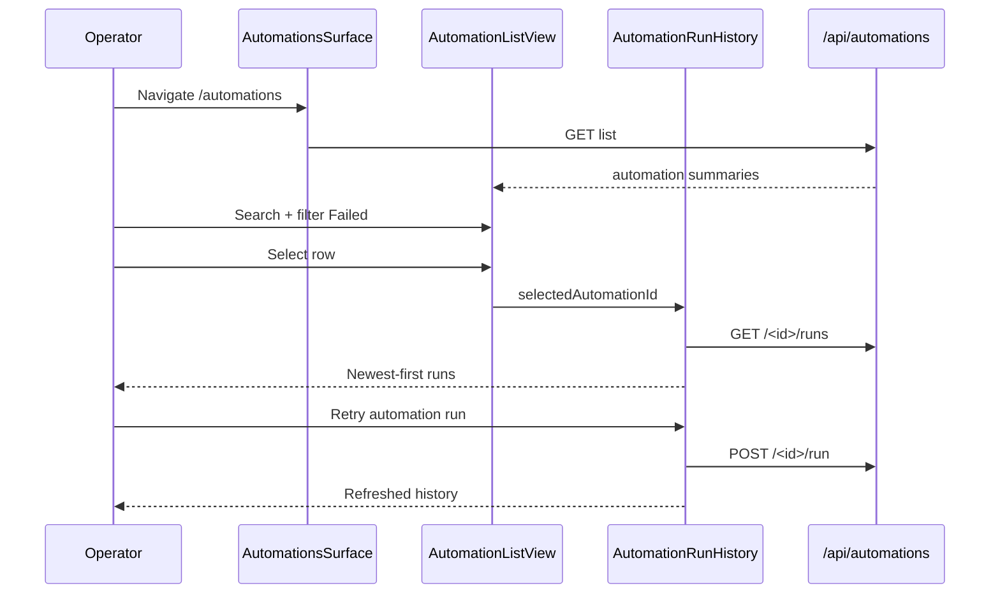

# Cockpit v2 Automations list and run history under ten-surface shell UX Spec

## Overview

This feature re-homes the shipped Automations registry and scheduler run-history experience into the Cockpit v2 ten-surface shell at `/automations`. Operators browse scheduled agent work, search and filter the list, create or edit automations through the four-step wizard, inspect newest-first run history with expandable output, retry failed runs, and pause or resume automations with guarded confirmation—without leaving the left-rail shell. Layout, tokens, shared loading/empty/error affordances, and Mobbin-fidelity list rows inherit from the ratified parent ux-spec §4.11 and design-craft standards; dashed wireframe panels from the superseded three-module mount are replaced with solid elevated cards.

## Layout and navigation

- **Shell authority** — `AutomationsSurface` (or a thin wrapper around migrated `AutomationsModule`) mounts in `client/src/app/(cockpit)/automations/page.tsx`, replacing `CockpitSurfacePlaceholder`. The ten-surface left rail shows Automations with `aria-current="page"` while route `/automations` is active.
- **Superseded tab migration** — when an operator selects the legacy three-module Automations tab on `DashboardPage`, the client SHALL navigate to `/automations` or render a single elevated banner with primary CTA **Open automations surface** that deep-links to `/automations`. The banner SHALL NOT duplicate the full list.
- **Main body (≥1024px)** — two-column card grid inside the shell main region: left card (2fr) holds list toolbar, search, filters, and rows; right card (1fr) holds run history for the selected automation. Below 1024px, cards stack list → history. Content SHALL stay within card bounds at 1280×900 and 375×812.
- **Wizard overlay** — create and edit open a full-width in-surface elevated panel with linear stepper header and footer actions; closing returns to the list without losing rail context.
- **Command Center reuse** — recent-automations card on Command Center continues to consume existing summary helpers; this feature SHALL NOT redesign that card region.
- **Out of scope** — complex automation templates, visual workflow builder, Activity Log event emission, scheduler tick or JSONL schema changes, and full CockpitShell removal.

```
┌─ Automations surface (/automations) ─────────────────────────────┐
│ [Left rail · Automations selected]                             │
├───────────────────────────────┬────────────────────────────────┤
│ [Automation list card]        │ [Run history card]             │
│ · Create automation (primary) │ · selected automation name     │
│ · search · All/Failed/Paused  │ · Refresh run history          │
│ · row* (selected)             │ · run rows (newest first)      │
│   · meta: last · next run     │   · Retry automation run       │
│   · Run automation now        │   · Open mission control       │
│   · overflow ⋯                │                                │
└───────────────────────────────┴────────────────────────────────┘
```

**Breakpoints** — inherit parent shell rules (≥1280px persistent rail; 1024–1279px collapsible rail; <1024px bottom tab bar for first-slice surfaces). Automations body uses ≥1024px two-column cards; <1024px single-column stack with horizontally scroll-safe list rows inside the card.

## Visual design tokens

Reuse Cockpit v2 operator tokens from the ratified parent ux-spec and `client/src/app/globals.css`. Extend scoped classes under `/* cockpit-v2 automations */` without per-surface one-offs.

| Token group | Names | Automations use |
|---|---|---|
| **Surfaces** | `--color-background`, `--color-surface`, `--color-surface-elevated`, `--color-border` | Shell background; list and history panels on solid elevated cards with `--radius-md` and `--shadow-sm` (no dashed wireframe borders in shipped views) |
| **Text** | `--color-text-primary`, `--color-text-secondary`, `--color-text-muted` | Row name semibold; schedule, persona, and timing meta muted |
| **Accent / CTA** | `--color-accent-primary`, `--color-cta-background`, `--color-cta-text` | Exactly one accent-filled primary button per card region |
| **Status** | `--color-status-{error,warning,success}` + `-bg` + `-border` | Failed, paused, running, and scheduled badges; always pair color with text label |
| **Spacing** | `--space-xs` through `--space-2xl` (4px base) | Card padding `--space-md`; row gap `--space-sm`; column gutter `--space-lg`; toolbar gap `--space-sm` |
| **Radii** | sm 6px, md 10px, full 999px | Cards md; filter chips and trigger pills full |
| **Type** | `theme.typography.size` xs–xl | ≤5 sizes per screen: card title `sm` semibold; row label `sm` semibold; meta `xs`; CTA `sm`; empty copy `sm` |
| **Shadow** | sm / md | Elevated list and history cards |

**List row anatomy** — `.automation-row` Mobbin pattern: primary line `.automation-row-label` (automation name, truncate ≤60 chars with `title` when clipped); meta row `.automation-row-meta` shows schedule label, optional persona chip, status badge, relative last-run phrase, and relative or absolute next-run label when enabled, separated by middle dots. Selected row uses 3px left `--color-accent-primary` bar plus `--color-surface-elevated` fill. Failed (`error`) rows use `--color-status-error` border tint; paused rows use dashed `--color-border` at 0.72 opacity—distinct from failed treatment.

**Run-history row anatomy** — collapsed row shows status badge, relative start time (absolute timestamp only in `title` on `<time>`), duration when finished, trigger pill, one primary action, and overflow only when a second action is required. Expanded region uses monospace excerpts for stdout/stderr inside the card bounds with scroll when needed.

**Motion** — row selection, filter chip toggle, dialog open/close, and run-row expand/collapse ≤200ms `ease-out`; running badge pulse 2s ease-in-out; honor `prefers-reduced-motion` (instant expand, static badges, no pulse).

## Interaction requirements

### Surface load and shared states (`data-testid="automations-surface"`)

- **Load** — on `/automations` mount, fetch `GET /api/automations`; show shared `LoadingState` with `aria-busy="true"` within 400ms.
- **Error** — fetch failure shows shared `ErrorState` with primary CTA **Retry automations load**.
- **Empty registry** — list card shows guided empty copy plus primary **Create automation**; history card shows its no-selection empty state independently.

### Automation list card (`data-testid="automations-list-card"`)

- **Toolbar** — card header with title **Automations**, search field (`aria-label="Search automations"`), status filter control offering **All**, **Failed**, and **Paused** (combine with search text client-side; no full page reload), and one accent primary **Create automation** above the row list.
- **Search** — filters rows by automation name, persona slug, or schedule label as the operator types.
- **Row select** — clicking the row main area (not action buttons) sets selection and loads run history; action buttons do not change selection.
- **Row meta** — each row SHALL show human-readable schedule label, status badge with precedence `paused` > `running` > `error` > `scheduled`, relative last-run time when a run exists (via shared relative-time helper), and relative or absolute next-run label when `enabled: true`.
- **Primary row action** — exactly one accent button **Run automation now** for enabled rows; disabled with explanatory `title` when paused or already running (`aria-busy` while dispatch pending). Secondary actions (Edit automation, Pause automation, Resume automation, Delete automation) live in a ⋯ overflow menu at ≥32px hit target—not as equal peer buttons (Hick's Law).
- **Pause automation** — disabling an enabled automation from toggle or overflow SHALL open a guarded confirm dialog naming the automation; confirm primary **Pause automation** calls `PUT` with `enabled: false`; secondary **Keep automation enabled** dismisses without mutation. Resume SHALL persist `enabled: true` without confirm.
- **Delete automation** — destructive confirm dialog with **Confirm delete automation** and **Cancel delete automation**; focus trapped until dismissed.
- **Row errors** — mutation failures show inline beneath the affected row; list remains usable.

### Create and edit wizard (`data-testid="automation-wizard"`)

- **Step order** — linear stepper: Schedule → Persona → Prompt → Review; active step uses `aria-current="step"`.
- **Schedule step** — name, cron presets, custom 5-field cron; invalid schedule blocks **Next step** with inline field hint.
- **Review step** — read-only summary including human-readable schedule, persona, prompt excerpt (≤120 characters), policy defaults, and **preview next run** computed from draft cron before save.
- **Save** — primary **Save automation** on Review; create posts with `enabled: true` unless operator chose save disabled; edit updates via `PUT` without unrelated field mutation. Success closes wizard and refreshes list.
- **Scope** — agent-trigger wizard only; omit complex templates and visual workflow builder affordances.

### Run history card (`data-testid="automation-run-history"`)

- **No selection** — guided empty state: `Select an automation to view run history.` with muted secondary hint linking **Open OPERATION.md** for scheduler setup (link label only; no raw path as body copy).
- **Load** — selection fetches `GET /api/automations/[id]/runs`; `LoadingState` while first fetch in flight; prior rows stay visible on refresh.
- **Header** — shows selected automation name and secondary text button **Refresh run history** (not bare "Refresh").
- **Run rows** — newest first; collapsed row shows status badge, relative start time, duration when finished, trigger label (`manual` / `scheduled` as human pills), and expand control **Show run output** / **Hide run output**.
- **Expand** — reveals stdout/stderr excerpts or `No output captured.` Skipped runs show lock reason summary, not raw config dumps.
- **Retry automation run** — when a run row status is `error` and the owning automation is enabled, expose accent primary **Retry automation run** on that row; POST `/api/automations/[id]/run`, show in-flight `aria-busy`, refresh history on success, inline error on failure.
- **Open related artifacts** — when `taskId` or artifact paths exist on an expanded row, show human-label links **Open mission control** (FD Mission Control for `taskId`) and **Open repo explorer** when artifact paths resolve—never a visible raw path, raw task id, or ISO timestamp as default row text. Raw values MAY appear only behind closed-by-default **Show technical details** disclosure or copy-only **Copy run identifier** control.
- **Empty runs** — `No runs yet. Run automation now or wait for the next scheduled tick.` plus optional **Open OPERATION.md** link.

### Data boundaries

- Browser calls Next.js routes under `/api/automations` only; no `pnpm` or `pan` from the client. Command Center recent-automations preview continues using existing helpers unchanged.

### Primary flows



## Accessibility minimums

WCAG 2.2 Level AA for all Automations surfaces introduced or migrated by this feature.

| Criterion | Requirement |
|---|---|
| **1.4.3** | 4.5:1 contrast on list body, wizard labels, filter chips, log excerpts, and all status badges |
| **1.4.11** | 3:1 non-text contrast on selected-row accent bar, focus rings, toggle track, and CTA boundaries |
| **2.1.1** | Full keyboard operability for rail navigation, search, filters, list rows, overflow menus, wizard steps, pause/delete confirms, run-history refresh, expand toggles, and retry |
| **2.4.3** | Focus order: left rail → surface header → Create automation → search → filters → list rows → row actions → history refresh → run rows → expand/retry |
| **2.4.7** | 2px `--color-accent-primary` `:focus-visible` outline with 2px offset on interactive controls |
| **2.4.11** | Pause and delete confirms trap focus until dismissed; wizard panel does not trap when closed |
| **4.1.2** | Left rail Automations entry exposes `aria-current="page"` on `/automations`; wizard stepper uses `aria-current="step"`; run expand toggles expose `aria-expanded`; enabled toggle exposes `aria-checked` |

**Motion** — transitions ≤200ms; disable pulse and use instant expand when `prefers-reduced-motion: reduce`.

```yaml
contract:
  id: cockpit-v2-automations-list-and-run-history-under-ten-surface-shell.ux.ten-surface-solid-cards
  kind: llm-judge
  severity: block
  applies_to:
    kind: artifact-symbol
    path: /lib/memory/features/cockpit-v2-automations-list-and-run-history-under-ten-surface-shell/ux-spec.md
    symbol: "Layout and navigation"
  owner: design-engineer
  description: |
    When an operator navigates to /automations, the ten-surface shell SHALL render
    AutomationsSurface instead of CockpitSurfacePlaceholder; the left rail Automations
    entry SHALL expose aria-current="page"; the list and run-history regions SHALL
    use solid elevated card surfaces without dashed wireframe borders; and legacy
    three-module Automations tab selection SHALL route to /automations.
  references:
    - kind: lines
      path: /lib/memory/features/cockpit-v2-automations-list-and-run-history-under-ten-surface-shell/ux-spec.md
      range: [52, 78]
      note: Shell authority, migration, and solid card layout.
    - kind: lines
      path: /lib/memory/features/cockpit-v2-automations-list-and-run-history-under-ten-surface-shell/spec.md
      range: [120, 136]
      note: Engineering acceptance for ten-surface shell integration.
  runtime:
    rubric:
      scale: [1.0, 0.5, 0.0]
      threshold: 0.75
      examples:
        good:
          - text: "/automations shows two elevated cards inside the ten-surface shell; rail marks Automations current; no placeholder copy."
            rationale: Satisfies shell migration and finished-product card treatment.
        bad:
          - text: "CockpitSurfacePlaceholder remains or run-history panel uses dashed scaffold border."
            rationale: Leaves migration incomplete and violates wireframe gate-blocking condition.
    panel:
      quorum: 2-of-3
      judges: [haiku, haiku, sonnet]
      seed: 42
      cost_ceiling_usd: 0.50
  metadata:
    pancreator.contract_id: cockpit-v2-automations-list-and-run-history-under-ten-surface-shell.ux.ten-surface-solid-cards
    pancreator.applies_to: artifact-symbol:/lib/memory/features/cockpit-v2-automations-list-and-run-history-under-ten-surface-shell/ux-spec.md#Layout-and-navigation
    pancreator.wcag-criteria: ["4.1.2"]
```

```yaml
contract:
  id: cockpit-v2-automations-list-and-run-history-under-ten-surface-shell.ux.list-search-pause-confirm
  kind: llm-judge
  severity: block
  applies_to:
    kind: artifact-symbol
    path: /lib/memory/features/cockpit-v2-automations-list-and-run-history-under-ten-surface-shell/ux-spec.md
    symbol: "Interaction requirements"
  owner: design-engineer
  description: |
    When the automation list renders, each row SHALL show the automation name,
    schedule label, status badge, relative last-run and next-run labels when
    applicable, one accent Run automation now primary action, and secondary
    actions in an overflow menu; search and All/Failed/Paused filters SHALL
    combine client-side; pausing an enabled automation SHALL require a guarded
    confirm dialog with Pause automation before PUT enabled false.
  references:
    - kind: lines
      path: /lib/memory/features/cockpit-v2-automations-list-and-run-history-under-ten-surface-shell/ux-spec.md
      range: [108, 131]
      note: List card toolbar, row meta, pause confirm, and Mobbin row actions.
    - kind: lines
      path: /lib/memory/features/cockpit-v2-automations-list-and-run-history-under-ten-surface-shell/spec.md
      range: [138, 199]
      note: Engineering acceptance for list, filters, and pause/disable.
  runtime:
    rubric:
      scale: [1.0, 0.5, 0.0]
      threshold: 0.75
      examples:
        good:
          - text: "Failed filter hides scheduled rows; pause opens confirm; row shows Last run 2h ago and Next run in 45m."
            rationale: Matches search/filter, timing labels, and guarded pause per §4.11.
        bad:
          - text: "Four equal accent buttons on each row or toggle disables without confirm dialog."
            rationale: Choice overload and missing pause guard violate design-craft gates.
    panel:
      quorum: 2-of-3
      judges: [haiku, haiku, sonnet]
      seed: 42
      cost_ceiling_usd: 0.50
  metadata:
    pancreator.contract_id: cockpit-v2-automations-list-and-run-history-under-ten-surface-shell.ux.list-search-pause-confirm
    pancreator.applies_to: artifact-symbol:/lib/memory/features/cockpit-v2-automations-list-and-run-history-under-ten-surface-shell/ux-spec.md#Interaction-requirements
    pancreator.wcag-criteria: ["2.1.1", "4.1.2"]
```

```yaml
contract:
  id: cockpit-v2-automations-list-and-run-history-under-ten-surface-shell.ux.history-retry-artifacts
  kind: llm-judge
  severity: block
  applies_to:
    kind: artifact-symbol
    path: /lib/memory/features/cockpit-v2-automations-list-and-run-history-under-ten-surface-shell/ux-spec.md
    symbol: "Interaction requirements"
  owner: design-engineer
  description: |
    When a failed run row renders for an enabled automation, the panel SHALL
    expose Retry automation run that POSTs /api/automations/[id]/run and
    refreshes history; expanded rows with taskId SHALL show Open mission control
    using human labels without a visible raw task id or repo path as default text;
    wizard Review SHALL show preview next run before save.
  references:
    - kind: lines
      path: /lib/memory/features/cockpit-v2-automations-list-and-run-history-under-ten-surface-shell/ux-spec.md
      range: [133, 152]
      note: Run history retry, artifact links, and wizard review preview.
    - kind: lines
      path: /lib/memory/features/cockpit-v2-automations-list-and-run-history-under-ten-surface-shell/spec.md
      range: [173, 187]
      note: Engineering acceptance for history panel and artifact deep links.
  runtime:
    rubric:
      scale: [1.0, 0.5, 0.0]
      threshold: 0.75
      examples:
        good:
          - text: "Error run shows Retry automation run; expanded row links Open mission control; Review lists Next run tomorrow at 9:00 AM."
            rationale: Operator-readable remediation and preview without raw-data exposure.
        bad:
          - text: "Monospace task id chip visible by default; no retry on failed runs; Review omits next-run preview."
            rationale: Violates raw-data gate and §4.11 history requirements.
    panel:
      quorum: 2-of-3
      judges: [haiku, haiku, sonnet]
      seed: 42
      cost_ceiling_usd: 0.50
  metadata:
    pancreator.contract_id: cockpit-v2-automations-list-and-run-history-under-ten-surface-shell.ux.history-retry-artifacts
    pancreator.applies_to: artifact-symbol:/lib/memory/features/cockpit-v2-automations-list-and-run-history-under-ten-surface-shell/ux-spec.md#Interaction-requirements
    pancreator.wcag-criteria: ["2.1.1", "1.4.3"]
```
