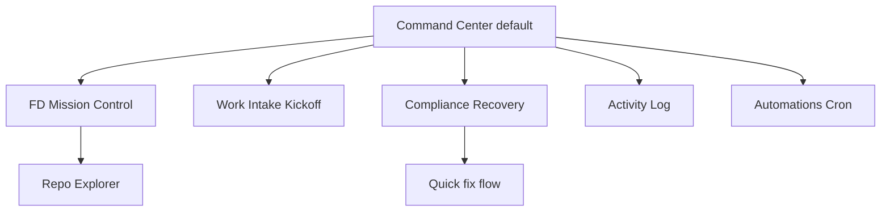

# Cockpit v2 UX philosophy, information architecture, and user stories UX Spec

## Overview

Cockpit v2 is a state-first operator console for an autonomous feature-delivery factory. The dominant pattern is select or create work, kick off feature-delivery, walk away, inspect state and artifacts on demand, remediate exceptions, and close with compliance and archival rituals. Chat is auxiliary; runs, stages, artifacts, and recovery actions are primary. This spec supersedes the prior three-module shell (Pipeline, Automations, Maintenance) with ten operational surfaces, seven UX principles, cross-cutting taxonomies, and a first implementation slice focused on Command Center, FD Mission Control, unified kickoff, compliance recovery, activity log, quick fix, and automations history. Downstream Cockpit v2 code SHALL consume this document as sole UX authority.

## UX philosophy

1. **Mission control, not decoration** — every surface answers what exists, runs, blocks, fails, changed, needs the operator, can retry, or supports shipping.
2. **Fire-and-forget with on-demand inspectability** — calm default; stage, persona, output, artifacts, retries, and logs one click away on failure.
3. **State-first, chat-second** — primary objects are backlog, inbox, runs, stages, artifacts, compliance, repo files, sandboxes, automations, and activity events.
4. **Every problem has a next action** — missing artifacts, retry limits, hanging tasks, and violations each expose a remediation CTA.
5. **Artifacts first-class** — spec through archive entry are browsable, previewable, and actionable evidence.
6. **Progressive disclosure** — normal view (status, stage, next action, key artifact); expanded (output, retry loop, config); verbose (live logs, tool events) behind explicit affordances.
7. **Local-native, repo-aware** — browse, open, edit, and trigger runs from repo objects; Cockpit is the operational layer over the repo substrate.

## Layout and navigation

- **App shell** — persistent left rail with ten primary surfaces; Command Center is default landing. Global header shows app title, active theme mode toggle, and one accent **Start feature delivery** CTA.
- **Breakpoints** — ≥1280px left rail + main + optional right inspector (320px); 1024–1279px collapsible rail; <1024px bottom tab bar for first-slice surfaces only.
- **Object linking** — preserve navigable links among backlog items, inbox items, feature runs, pipeline stages, persona invocations, artifacts, files changed, compliance findings, automation runs, and activity events. Every list row links to its owning object; breadcrumbs use human labels, not raw paths in default view.

| Surface | Primary jobs | Key contents (first-read) |
|---|---|---|
| **Command Center** | See attention queue; jump to run; start work; quick fix | Active runs, human gates, failures, violations, hanging tasks, recent activity, upcoming automations |
| **Feature Backlog** | Browse, filter, launch from backlog | Searchable table, detail drawer, readiness chips, link indicators |
| **Work Intake / Kickoff** | Normalize and launch FD | Source picker, directive preview, model presets, sandbox target, **Launch feature delivery** |
| **FD Mission Control** | Inspect and remediate one run | Stage rail, current persona, artifacts by stage, remediation strip, verbose log drawer |
| **Compliance + Recovery** | Group and fix violations | Severity-grouped issues, rule excerpt, remediation actions, re-run check |
| **Repo Explorer / Editor** | Browse and edit repo | Tree, search, P10-safe editor, artifact badges, provenance chip when known |
| **Agent Chat + Persona Console** | Ad-hoc persona help | Persona selector, scope attachments, save-to-artifact actions |
| **Sandbox Manager** | Isolated delivery | Sandbox list, create/archive, scoped run indicator |
| **Activity Log** | Real-time factory events | Filterable stream, severity styling, deep links |
| **Automations / Cron** | Schedule recurring work | List, create wizard, run history, enable/disable |



**First-slice navigation** — ship Command Center, FD Mission Control, Work Intake, Compliance + Recovery, Activity Log, Automations list + history, and cross-surface quick fix. Defer full Feature Backlog UX, Sandbox comparison, rich multi-file IDE, complex automation templates, and analytics dashboards.

**Prior-art supersession** — `lib/memory/features/cockpit-v2-ux-spec-and-information-architecture/ux-spec.md` three-module tabs (Pipeline, Automations, Maintenance) and secondary Files tab are replaced by the ten-surface rail. **Preserve unchanged:** `GET /api/run-state` aggregation (P9), P10 read-only default, edit activation, diff confirmation, and write-guard on pipeline-owned paths. **Migration:** Pipeline command center → Command Center + FD Mission Control; Pipeline orientation panels → Command Center sidebar cards; Automations module → Automations surface; Maintenance compliance → Compliance + Recovery; Files tab → Repo Explorer. Shipped P9 `StageMachineGrid` and `RunEventTimeline` migrate into FD Mission Control.

## Visual design tokens

Implement operator `theme.ts` via `getCssVariables(mode)` on `:root` and `[data-theme="dark"]`. Brand: `inkBlack` `#060313`, `apricotCream` `#EEC584`, `mintLeaf` `#61C9A8`.

| Token group | Names | Use |
|---|---|---|
| **Surfaces** | `--color-background`, `--color-surface`, `--color-surface-elevated`, `--color-border` | Shell, cards, inset panels (solid elevated surfaces; no dashed wireframe chrome in shipped views) |
| **Text** | `--color-text-primary`, `--color-text-secondary`, `--color-text-muted` | Hierarchy; primary labels ≤60 chars |
| **Accent / CTA** | `--color-accent-primary`, `--color-accent-secondary`, `--color-cta-background`, `--color-cta-text` | One accent-filled primary CTA per region |
| **Status** | `--color-status-{error,warning,success}` + `-bg` + `-border` | Pair color with text label; map to status taxonomy |
| **Spacing** | `theme.spacing` xs–2xl (4px base) | `--space-xs` through `--space-2xl`; no off-scale one-offs |
| **Radii** | sm 6px, md 10px, lg 16px, xl 24px, full 999px | Cards md; pills full |
| **Type** | sans `theme.typography.size` xs–3xl; mono for commands only in secondary/copy rows | ≤5 distinct sizes per screen |
| **Shadow** | sm / md / lg | Elevated cards and drawers |

Light mode default; dark mode via header toggle. List rows use Mobbin-fidelity pattern: human-readable primary line, muted meta (severity · age · owning feature), one primary action, overflow menu for secondary actions.

## Cross-cutting requirements

**Status taxonomy** — Draft, Ready, Running, Waiting for human, Blocked, Failed, Retrying, Complete, Cancelled, Archived. Render as text + pill; never color-only.

**Severity taxonomy** — Info, Warning, Needs attention, Blocking, Critical. Command Center sorts Blocking and Critical first.

**Action taxonomy** — Open, Preview, Edit, Launch, Retry, Retry with config, Quick fix, Re-run check, Pause, Cancel, Archive, Mark resolved, Copy output. Labels SHALL be verb plus concrete object (for example **Open mission control**, **Retry implement stage**, **Copy run command**).

**Human intervention** — every stop shows (1) why execution stopped, (2) evidence chips linking artifacts or findings, (3) safe remediation actions with destructive actions separated (Fitts's Law).

**Real-time behavior** — default views show state transitions only; verbose logs open in drawer within 400ms loading skeleton (Doherty Threshold).

**Progressive disclosure tiers** — Tier 1 default cards; Tier 2 expanded accordion per run/stage; Tier 3 verbose log drawer. Raw paths, task ids, and ISO timestamps SHALL NOT appear as readable primary content; expose via **Copy path** or closed-by-default **Show technical details** disclosure.

## Interaction requirements

### Command Center (4.1)

Card regions on `--color-surface-elevated`: **Needs you** (human gates, retry-limit failures), **Running now**, **Compliance issues**, **Hanging tasks**, **Recent automations**, **Recent activity**. Each row: feature label, status pill, severity, relative age, one primary CTA (**Open mission control**, **Run quick fix**, **Re-run compliance check**). Empty: guided **Start feature delivery**. Loading: skeleton within 400ms. Error: inline retry.

### Feature Backlog (4.2) — deferred full UX; spec retained

Scannable table with search and filters (status, priority, area, source, readiness). Detail drawer: title, description, tags, related links, actions **Launch feature delivery**, **Convert to inbox item**, **Archive backlog item**.

### Work Intake / Kickoff (4.3)

Stepper: **Choose source** (backlog, inbox, URL, raw text, interactive intake) → **Preview directive** (editable) → **Configure models** (cheap/fast, balanced, high-quality presets) → **Review and launch**. Primary CTA **Launch feature delivery**; secondary **Save inbox directive**. Interactive intake optional; never forced.

### FD Mission Control (4.4)

Stage rail: intake, plan, implement, review, test, report, compliance, ship, index. Current stage: accent border + label. Failed/retry: count badge + `--color-status-error` treatment. Retry-limit banner at top with loop history summary and actions **Retry stage**, **Retry with config**, **Run quick fix**, **Mark issue resolved**, **Cancel run**. Artifacts grouped by stage; missing required artifacts show Blocking severity. Verbose logs in right drawer; default view stays calm. Preserve P9 grid/timeline data from `GET /api/run-state`.

### Compliance + Recovery (4.5)

Grouped list by severity default. Row: rule label, violated requirement excerpt (≤60 chars), status, owning feature label. Primary **Run quick fix** on missing-artifact issues; **Re-run compliance check** on all open violations. Hanging tasks: stale heartbeat chip + **Inspect activity log**, **Cancel run**.

### Repo Explorer (4.6)

Tree + search; file opens in P10 modal (**Open file in editor**). Dirty state banner; save errors inline. Stage/run provenance chip when available. Defer rich multi-file IDE.

### Agent Chat (4.7) — defer full console

Global **Open agent chat** entry; persona dropdown; contextual **Ask persona** from run/artifact/violation rows.

### Sandbox Manager (4.8) — defer advanced comparison

Create from branch/worktree; list with status; kickoff accepts sandbox target.

### Activity Log (4.9)

Real-time stream with filters (run, feature, persona, stage, severity, automation, time range). Row: event label, actor, relative time, deep link. High-volume: virtualized scroll inside bounded container.

### Quick fix (4.10)

Cross-cutting action on violations, retry-limit failures, hanging tasks. Flow: confirm scope → invoke out-of-band persona → show diff/output → **Accept quick fix** / **Reject quick fix** / **Retry quick fix**. Records in activity log.

### Automations / Cron (4.11)

List: name, schedule label, status badge, next/last run (relative human time). Failed rows distinct. Create wizard (type, schedule, persona, input, preview). History panel with **Retry automation run**. **Pause automation** guarded confirm.

### Shared states

All first-slice surfaces specify empty (guided next step), loading (skeleton `aria-busy`), hover/focus/active on interactive rows, disabled with reason tooltip, success toast on remediation, error inline with retry. Drawers and banners ≤200ms `ease-out`; honor `prefers-reduced-motion`.

## Accessibility minimums

WCAG 2.2 Level AA on all first-slice surfaces.

| Criterion | Requirement |
|---|---|
| **1.4.3** | 4.5:1 text contrast on `--color-surface` and elevated cards |
| **1.4.11** | 3:1 non-text contrast on focus rings, status borders, CTA boundaries |
| **2.1.1** | Keyboard operable rail, tables, steppers, drawers, modals |
| **2.4.3** | Focus order: rail → main → inspector → modal trap |
| **2.4.7** | 2px `--color-accent-primary` focus outline, 2px offset |
| **2.4.11** | Drawers do not fully obscure focused trigger |
| **4.1.2** | `role="navigation"` on rail; `aria-current="page"` on active surface |

## Craft standards

Per `lib/memory/handbook/engineering/design-craft.md`: 4px spacing scale; one primary accent CTA per region; no raw paths/IDs/timestamps as default list content; no internal prose dumps; solid card surfaces; list rows ≤2 visible actions plus overflow; primary labels ≤60 characters; content contained at 1280×900 and 375×812.

```yaml
contract:
  id: cockpit-v2-ux-philosophy-information-architecture-and-user-stories.ux.command-center-operational-state
  kind: llm-judge
  severity: block
  applies_to:
    kind: artifact-symbol
    path: /lib/memory/features/cockpit-v2-ux-philosophy-information-architecture-and-user-stories/ux-spec.md
    symbol: "Command Center (4.1)"
  owner: design-engineer
  description: |
    When Command Center renders with run-state data, the default view SHALL show
    card regions for active runs, blocked or human-gate runs, compliance
    violations, and hanging tasks; each surfaced row SHALL display a human-readable
    feature label, status pill, severity, relative age, and exactly one primary
    verb-plus-object remediation CTA without a visible raw repo path as primary text.
  references:
    - kind: lines
      path: /lib/memory/features/cockpit-v2-ux-philosophy-information-architecture-and-user-stories/ux-spec.md
      range: [118, 120]
      note: Command Center operational state section.
  runtime:
    rubric:
      scale: [1.0, 0.5, 0.0]
      threshold: 0.75
      examples:
        good:
          - text: "Retry-limit row shows feature title, Critical pill, Open mission control CTA."
            rationale: Operator-readable queue with next action.
        bad:
          - text: "Monospace .pan/work path as primary line; three equal accent buttons."
            rationale: Raw-data exposure and choice overload.
    panel:
      quorum: 2-of-3
      judges: [haiku, haiku, sonnet]
      seed: 42
      cost_ceiling_usd: 0.50
  metadata:
    pancreator.contract_id: cockpit-v2-ux-philosophy-information-architecture-and-user-stories.ux.command-center-operational-state
    pancreator.applies_to: artifact-symbol:/lib/memory/features/cockpit-v2-ux-philosophy-information-architecture-and-user-stories/ux-spec.md#Command-Center-41
```

```yaml
contract:
  id: cockpit-v2-ux-philosophy-information-architecture-and-user-stories.ux.fd-mission-control-stage-rail
  kind: llm-judge
  severity: block
  applies_to:
    kind: artifact-symbol
    path: /lib/memory/features/cockpit-v2-ux-philosophy-information-architecture-and-user-stories/ux-spec.md
    symbol: "FD Mission Control (4.4)"
  owner: design-engineer
  description: |
    When FD Mission Control renders a run with a retry-limit failure, the stage rail
    SHALL include all FD stages, SHALL mark the current stage with accent treatment,
    SHALL show retry count on retried stages, and SHALL surface an unmistakable
    retry-limit banner with failed stage, loop history summary, and remediation
    actions including Retry stage and Run quick fix.
  references:
    - kind: lines
      path: /lib/memory/features/cockpit-v2-ux-philosophy-information-architecture-and-user-stories/ux-spec.md
      range: [130, 132]
      note: FD Mission Control stage rail and retry-limit surfacing.
  runtime:
    rubric:
      scale: [1.0, 0.5, 0.0]
      threshold: 0.75
      examples:
        good:
          - text: "Implement stage shows retry badge 3; banner offers Retry with config."
            rationale: Retry-limit visible with remediation path.
        bad:
          - text: "Failed stage same styling as complete; no retry banner."
            rationale: Silent stall violates mission-control philosophy.
    panel:
      quorum: 2-of-3
      judges: [haiku, haiku, sonnet]
      seed: 42
      cost_ceiling_usd: 0.50
  metadata:
    pancreator.contract_id: cockpit-v2-ux-philosophy-information-architecture-and-user-stories.ux.fd-mission-control-stage-rail
    pancreator.applies_to: artifact-symbol:/lib/memory/features/cockpit-v2-ux-philosophy-information-architecture-and-user-stories/ux-spec.md#FD-Mission-Control-44
```

```yaml
contract:
  id: cockpit-v2-ux-philosophy-information-architecture-and-user-stories.ux.kickoff-flow-inputs
  kind: llm-judge
  severity: block
  applies_to:
    kind: artifact-symbol
    path: /lib/memory/features/cockpit-v2-ux-philosophy-information-architecture-and-user-stories/ux-spec.md
    symbol: "Work Intake / Kickoff (4.3)"
  owner: design-engineer
  description: |
    When Work Intake kickoff opens, the flow SHALL accept at minimum inbox item,
    raw URL, and raw text sources; SHALL show an editable directive preview before
    launch; SHALL offer model presets; and SHALL expose a primary Launch feature
    delivery CTA without requiring chat unless the operator selects interactive intake.
  references:
    - kind: lines
      path: /lib/memory/features/cockpit-v2-ux-philosophy-information-architecture-and-user-stories/ux-spec.md
      range: [126, 128]
      note: Unified kickoff flow inputs and launch affordance.
  runtime:
    rubric:
      scale: [1.0, 0.5, 0.0]
      threshold: 0.75
      examples:
        good:
          - text: "Inbox source selected; preview editable; Launch feature delivery enabled."
            rationale: Unified kickoff with review gate.
        bad:
          - text: "Chat-only intake; launch button labeled Submit."
            rationale: Missing sources and ambiguous CTA.
    panel:
      quorum: 2-of-3
      judges: [haiku, haiku, sonnet]
      seed: 42
      cost_ceiling_usd: 0.50
  metadata:
    pancreator.contract_id: cockpit-v2-ux-philosophy-information-architecture-and-user-stories.ux.kickoff-flow-inputs
    pancreator.applies_to: artifact-symbol:/lib/memory/features/cockpit-v2-ux-philosophy-information-architecture-and-user-stories/ux-spec.md#Work-Intake--Kickoff-43
```

```yaml
contract:
  id: cockpit-v2-ux-philosophy-information-architecture-and-user-stories.ux.compliance-remediation-actions
  kind: llm-judge
  severity: block
  applies_to:
    kind: artifact-symbol
    path: /lib/memory/features/cockpit-v2-ux-philosophy-information-architecture-and-user-stories/ux-spec.md
    symbol: "Compliance + Recovery (4.5)"
  owner: design-engineer
  description: |
    When Compliance + Recovery lists an open missing-artifact violation, the row
    SHALL show a summarized rule label and violated requirement excerpt, SHALL link
    to the owning run, and SHALL expose Run quick fix as the primary remediation
    action plus Re-run compliance check as a secondary action.
  references:
    - kind: lines
      path: /lib/memory/features/cockpit-v2-ux-philosophy-information-architecture-and-user-stories/ux-spec.md
      range: [134, 136]
      note: Compliance violation remediation actions.
  runtime:
    rubric:
      scale: [1.0, 0.5, 0.0]
      threshold: 0.75
      examples:
        good:
          - text: "Missing test-report row shows Run quick fix primary, Re-run compliance check secondary."
            rationale: Every violation has remediation path.
        bad:
          - text: "Violation shows full spec excerpt only; no actions."
            rationale: Internal prose dump without next action.
    panel:
      quorum: 2-of-3
      judges: [haiku, haiku, sonnet]
      seed: 42
      cost_ceiling_usd: 0.50
  metadata:
    pancreator.contract_id: cockpit-v2-ux-philosophy-information-architecture-and-user-stories.ux.compliance-remediation-actions
    pancreator.applies_to: artifact-symbol:/lib/memory/features/cockpit-v2-ux-philosophy-information-architecture-and-user-stories/ux-spec.md#Compliance--Recovery-45
```

```yaml
contract:
  id: cockpit-v2-ux-philosophy-information-architecture-and-user-stories.ux.theme-token-application
  kind: llm-judge
  severity: block
  applies_to:
    kind: artifact-symbol
    path: /lib/memory/features/cockpit-v2-ux-philosophy-information-architecture-and-user-stories/ux-spec.md
    symbol: "Visual design tokens"
  owner: design-engineer
  description: |
    When any first-slice Cockpit v2 surface renders, the shell SHALL apply CSS
    variables from getCssVariables for background, surface, surface-elevated, text
    primary, accent primary, CTA background, and status error/warning/success tokens
    derived from inkBlack, apricotCream, and mintLeaf brand palette.
  references:
    - kind: lines
      path: /lib/memory/features/cockpit-v2-ux-philosophy-information-architecture-and-user-stories/ux-spec.md
      range: [85, 100]
      note: Theme token application on primary surfaces.
  runtime:
    rubric:
      scale: [1.0, 0.5, 0.0]
      threshold: 0.75
      examples:
        good:
          - text: "Command Center cards use --color-surface-elevated; primary CTA uses --color-cta-background mint on dark."
            rationale: Operator brand tokens applied consistently.
        bad:
          - text: "Legacy eggshell/deep-teal only; no getCssVariables mapping."
            rationale: Theme spec not applied to v2 surfaces.
    panel:
      quorum: 2-of-3
      judges: [haiku, haiku, sonnet]
      seed: 42
      cost_ceiling_usd: 0.50
  metadata:
    pancreator.contract_id: cockpit-v2-ux-philosophy-information-architecture-and-user-stories.ux.theme-token-application
    pancreator.applies_to: artifact-symbol:/lib/memory/features/cockpit-v2-ux-philosophy-information-architecture-and-user-stories/ux-spec.md#Visual-design-tokens
    pancreator.wcag-criteria: ["1.4.3"]
```
