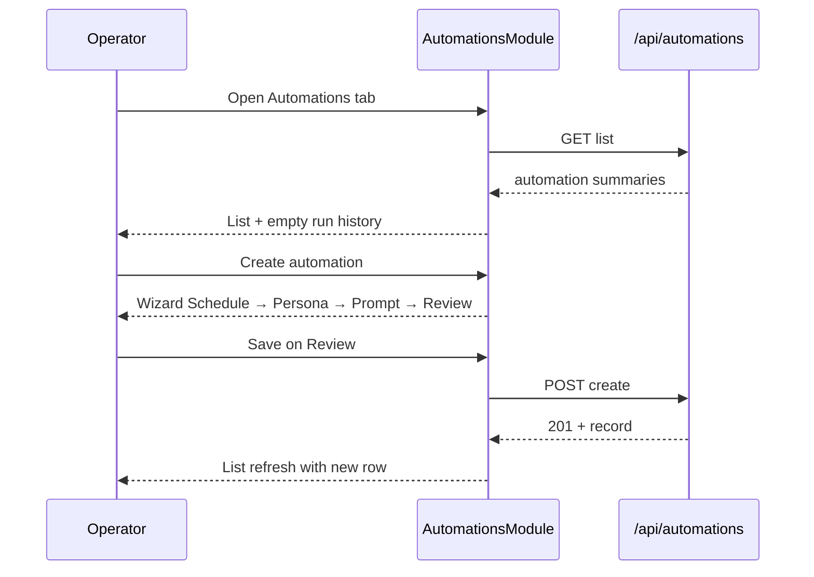
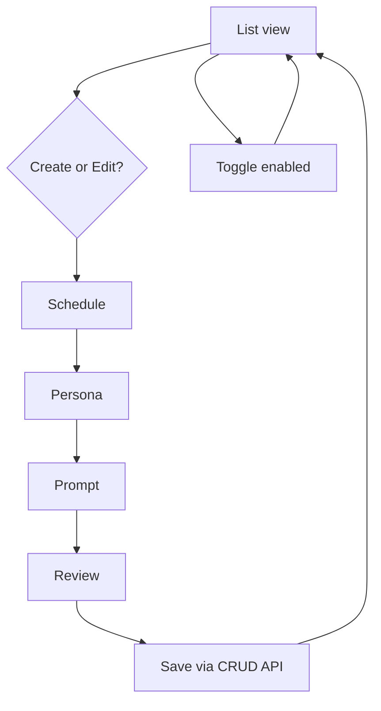

# Command Center automation registry and management UI UX Spec

## Overview

This feature replaces the Command Center Automations placeholder with a full registry management surface so operators create, edit, pause, and delete recurring agent automations without OS cron or ad-hoc scripts. The Automations module loads validated records from `GET /api/automations`, persists changes through CRUD routes to `.pan/automations/<id>.yaml`, and presents a list view with inline enable toggles plus a four-step create/edit wizard (Schedule → Persona → Prompt → Review). Run now and run-history population remain stubbed until `command-center-automations-scheduler` ships. Shell layout, module tabs, design tokens, and shared loading/empty/error affordances inherit from the ratified Command Center UX spec.

## Layout and navigation

- **Shell authority** — `DashboardModuleShell` renders `AutomationsModule` when the operator selects the Automations tab; Pipeline and Maintenance modules remain unchanged.
- **Automations body (≥1024px)** — two-column layout: left column (2fr) holds the automation list and Create CTA; right column (1fr) holds run history. Below 1024px, columns stack: list → run history.
- **Wizard overlay** — create and edit open a full-width in-module panel (not a modal) with a linear stepper header and Back / Next / Save footer; closing the wizard returns to the list without losing module tab context.
- **Empty registry** — when `GET /api/automations` returns an empty array, the list region shows a dashed empty state with primary Create automation CTA; run history shows its own empty state independently.
- **Out of scope in this layout** — scheduler tick controls, live run-status polling, LangGraph wiring, and Cursor Automations import.

```
┌──────────────────────────────────────────────────────────┐
│ [Pipeline] [Automations*] [Maintenance]        Files ›   │
├─────────────────────────┬────────────────────────────────┤
│ Automation list         │ Run history (stub empty state) │
│ · Create automation     │                              │
│ · rows: name · schedule │                              │
│   · persona · badge     │                              │
│   · enabled toggle      │                              │
│   · row actions         │                              │
├─────────────────────────┴────────────────────────────────┤
│ [Wizard when open] Schedule → Persona → Prompt → Review  │
└──────────────────────────────────────────────────────────┘
```

**Breakpoints:** inherit parent Command Center rules (≥1024px two-column; 768–1023px stacked; <768px horizontal scroll on list table).

## Visual design tokens

Reuse Command Center tokens from `client/src/app/globals.css` (`--surface-primary`, `--surface-elevated`, `--surface-attention`, `--text-primary`, `--text-muted`, `--accent`, `--space-*`). Add scoped classes under `/* command-center automations */` without altering Pipeline or Maintenance semantics.

| Surface / class | Token / treatment | Use |
|---|---|---|
| `.automations-list` | `--surface-primary`, `--space-4` padding | List container |
| `.automation-row` | bottom border `--text-muted` 20%; hover `--surface-elevated` | Table/list rows |
| `.automation-schedule` | `--text-muted`, `0.85rem` | Human-readable cron label |
| `.automation-persona` | ui-monospace, `0.75rem` | Persona slug chip |
| `.automation-enabled-toggle` | `--accent` when on | Inline switch bound to `enabled` |
| `.automation-wizard` | `--surface-elevated`, `--space-4` padding | Wizard panel |
| `.automation-wizard-stepper` | `--accent` active step indicator | Linear step header |
| `.automation-prompt-editor` | ui-monospace, `min-height: 8rem` | Multiline prompt textarea |
| `.automation-run-history` | dashed border, `--text-muted` | Stub sidebar panel |
| Status badge `scheduled` | teal border + 12% fill (reuse `.stage-cell-active` tone) | `enabled: true` |
| Status badge `paused` | dashed, 0.72 opacity (reuse `.stage-cell-pending` tone) | `enabled: false` |

Reserved badge tokens `running` and `error` SHALL NOT render until scheduler execution ships; list rows in this feature display only `scheduled` or `paused`.

## Interaction requirements

### Data source and list view (`data-testid="automations-module"`)

- **Load** — on Automations tab mount, fetch `GET /api/automations`; show `LoadingState` with `aria-busy="true"` while in flight.
- **List columns** — each row SHALL display automation `name`, human-readable `schedule` label derived from the stored 5-field cron string, persona slug (when `trigger.kind` is `agent`), status badge (`scheduled` or `paused` from `enabled`), and an inline enabled toggle.
- **Enabled toggle** — flipping the toggle SHALL call `PUT /api/automations` with the updated `enabled` value; optimistic UI with rollback and inline error on failure; toggling off maps to Pause, toggling on maps to Resume in row actions.
- **Create CTA** — primary button above the list opens the wizard in create mode with schema defaults (`schemaVersion: 1`, `enabled: true`, `policy.maxConcurrent: 1`, `policy.timeoutMinutes: 60`, `trigger.kind: agent`).
- **Row actions** — Edit (opens wizard prefilled), Pause/Resume (same as toggle), Run now (disabled), Delete (confirm). Secondary actions render in a compact action cluster per row.
- **Delete confirm** — destructive action requires an inline confirm dialog naming the automation `name`; confirm calls `DELETE /api/automations`; cancel dismisses without mutation.
- **Error surface** — fetch failure shows `ErrorState` with retry; row-level mutation errors show inline beneath the affected row.

### Run now stub (`data-testid="automation-run-now-disabled"`)

- **Run now** — every Run now control SHALL render disabled (`aria-disabled="true"`) with helper text: "Run now ships with command-center-automations-scheduler." Helper text uses `--text-muted` and appears on hover/focus of the disabled control.

### Run history stub (`data-testid="automation-run-history"`)

- **Empty state** — panel title "Run history"; body shows dashed `EmptyState` with copy: "No runs yet. Execution history populates when the scheduler Feature ships." No expandable log rows in this feature.

### Create/edit wizard (`data-testid="automation-wizard"`)

- **Step order** — linear stepper with exactly four steps: Schedule, Persona, Prompt, Review. Footer provides Back (hidden on step 1), Next (steps 1–3), and Save (step 4 only).
- **Step indicator** — active step uses `aria-current="step"`; completed steps show a check marker; future steps are inert.

#### Schedule step (`data-testid="automation-wizard-schedule"`)

- **Fields** — automation `name` (required text input), `id` (slug; auto-derived from name on create, read-only on edit), cron preset radio group, custom cron text input (5-field cron string).
- **Presets** — at minimum: Hourly (`0 * * * *`), Daily at midnight (`0 0 * * *`), Weekly on Monday (`0 0 * * 1`), and Custom (reveals editable cron input).
- **Validation** — invalid cron or empty name blocks Next; inline hint names the failing field.
- **Empty / loading / error** — preset group shows placeholder skeleton only during initial persona preload on later steps; schedule step itself has no async load; API validation errors on save surface on Review.

#### Persona step (`data-testid="automation-wizard-persona"`)

- **Dropdown** — `<select>` or combobox listing every persona slug discovered from `lib/personas/*.md`, excluding `rules/` and `skills/` subdirectories; sorted alphabetically by slug.
- **Empty personas** — if discovery returns zero slugs, show dashed empty state with guidance to add persona files under `lib/personas/`.
- **Selection** — required before Next; binds to `trigger.persona`.

#### Prompt step (`data-testid="automation-wizard-prompt"`)

- **Editor** — multiline textarea for `trigger.prompt`; required non-empty string; monospace font; minimum four visible rows.
- **Scope** — this feature's acceptance path covers `trigger.kind: agent` only; pan-subcommand trigger editing remains out of UI scope.

#### Review step (`data-testid="automation-wizard-review"`)

- **Summary** — read-only blocks for name, id, enabled default, human-readable schedule, persona slug, prompt excerpt (first 120 characters with ellipsis), and policy defaults (`maxConcurrent`, `timeoutMinutes`).
- **Save** — primary Save calls `POST /api/automations` on create or `PUT /api/automations` on edit; button shows in-flight spinner and is disabled while saving.
- **Success** — on HTTP 201/200, close wizard and refresh list; new row appears with `scheduled` badge when `enabled: true`.
- **Validation errors** — HTTP 400 `errors` array maps to inline field hints on Review and re-enables Save after correction; messages cite the failing field path from the API.

### Component inventory

Extract under `client/src/components/command-center/automations/`:

- `AutomationsModule` — list + run history layout, wizard mount point.
- `AutomationListView` — table/list rows, toggles, row actions, Create CTA.
- `AutomationWizard/Shell` — stepper chrome, navigation footer, open/close lifecycle.
- `AutomationWizard/Schedule`, `Persona`, `Prompt`, `Review` — step bodies.
- `AutomationRunHistory` — stub empty-state panel.

Reuse shared `LoadingState`, `EmptyState`, `ErrorState`. Introduce or reuse a `StatusBadge` for `scheduled` / `paused`.

### Primary flows





## Accessibility minimums

WCAG 2.2 Level AA for all Automations surfaces introduced by this feature.

| Criterion | Requirement |
|---|---|
| **1.4.3** | 4.5:1 contrast on list body, wizard labels, and helper text |
| **1.4.11** | 3:1 non-text contrast on toggle track, stepper indicators, and row focus rings |
| **2.1.1** | Full keyboard operability for list rows, toggles, wizard steps, preset radios, dropdown, and confirm dialog |
| **2.4.3** | Focus order: module tabs → Create CTA → list rows → run history → wizard stepper → step fields → footer actions |
| **2.4.7** | 2px `--accent` `:focus-visible` outline with 2px offset on interactive controls |
| **2.4.11** | Wizard panel SHALL NOT obscure module tab focus when closed |
| **4.1.2** | Wizard stepper `aria-current="step"`; enabled toggle exposes `aria-checked`; disabled Run now exposes `aria-disabled="true"`; delete confirm traps focus until dismissed |

**Motion:** wizard step transitions and toggle feedback ≤200ms `ease-out`; honor `prefers-reduced-motion` (instant step swap, no slide animation).

```yaml
contract:
  id: command-center-automation-registry-and-management-ui.ux.list-enabled-toggle
  kind: llm-judge
  severity: block
  applies_to:
    kind: artifact-symbol
    path: /lib/memory/features/command-center-automation-registry-and-management-ui/ux-spec.md
    symbol: "Interaction requirements"
  owner: design-engineer
  description: |
    When the Automations list renders a row for an automation record, the row
    SHALL display the automation name, a human-readable schedule label, and
    an enabled toggle bound to the registry enabled field via PUT
    /api/automations; toggling SHALL update the status badge between
    scheduled and paused without a full page reload.
  references:
    - kind: lines
      path: /lib/memory/features/command-center-automation-registry-and-management-ui/ux-spec.md
      range: [95, 103]
      note: List columns and enabled toggle behavior.
    - kind: lines
      path: /lib/memory/features/command-center-automation-registry-and-management-ui/spec.md
      range: [139, 143]
      note: Engineering acceptance for list view fields and toggle binding.
  runtime:
    rubric:
      scale: [1.0, 0.5, 0.0]
      threshold: 0.75
      examples:
        good:
          - text: "Row shows name, schedule label, toggle; flip calls PUT and badge updates to paused."
            rationale: Matches CRUD-bound toggle and human-readable schedule requirements.
        bad:
          - text: "Enabled state shown as static text only; no API call on toggle."
            rationale: Operators cannot pause automations from the list surface.
    panel:
      quorum: 2-of-3
      judges: [haiku, haiku, sonnet]
      seed: 42
      cost_ceiling_usd: 0.50
  metadata:
    pancreator.contract_id: command-center-automation-registry-and-management-ui.ux.list-enabled-toggle
    pancreator.applies_to: artifact-symbol:/lib/memory/features/command-center-automation-registry-and-management-ui/ux-spec.md#Interaction-requirements
    pancreator.wcag-criteria: ["2.1.1", "4.1.2"]
```

```yaml
contract:
  id: command-center-automation-registry-and-management-ui.ux.wizard-four-steps
  kind: llm-judge
  severity: block
  applies_to:
    kind: artifact-symbol
    path: /lib/memory/features/command-center-automation-registry-and-management-ui/ux-spec.md
    symbol: "Interaction requirements"
  owner: design-engineer
  description: |
    When an operator starts create or edit from the Automations module, the
    wizard SHALL present four linear steps in order—Schedule, Persona,
    Prompt, and Review—with aria-current="step" on the active step, an
    hourly cron preset on the Schedule step, a persona dropdown populated
    from lib/personas/*.md, a multiline prompt editor on the Prompt step,
    and a read-only summary that persists the automation on Save via the
    CRUD API.
  references:
    - kind: lines
      path: /lib/memory/features/command-center-automation-registry-and-management-ui/ux-spec.md
      range: [115, 145]
      note: Wizard step order, field requirements, and save behavior.
    - kind: lines
      path: /lib/memory/features/command-center-automation-registry-and-management-ui/spec.md
      range: [144, 157]
      note: Engineering acceptance for wizard steps and hourly preset.
  runtime:
    rubric:
      scale: [1.0, 0.5, 0.0]
      threshold: 0.75
      examples:
        good:
          - text: "Four labeled steps; hourly preset; persona select; prompt textarea; Review saves via POST."
            rationale: Satisfies linear wizard and hourly agent automation acceptance path.
        bad:
          - text: "Single-form create with no stepper or missing persona dropdown."
            rationale: Violates ratified Automations wizard IA and persona discovery requirement.
    panel:
      quorum: 2-of-3
      judges: [haiku, haiku, sonnet]
      seed: 42
      cost_ceiling_usd: 0.50
  metadata:
    pancreator.contract_id: command-center-automation-registry-and-management-ui.ux.wizard-four-steps
    pancreator.applies_to: artifact-symbol:/lib/memory/features/command-center-automation-registry-and-management-ui/ux-spec.md#Interaction-requirements
    pancreator.wcag-criteria: ["2.1.1", "4.1.2"]
```

```yaml
contract:
  id: command-center-automation-registry-and-management-ui.ux.run-now-stub
  kind: llm-judge
  severity: warn
  applies_to:
    kind: artifact-symbol
    path: /lib/memory/features/command-center-automation-registry-and-management-ui/ux-spec.md
    symbol: "Interaction requirements"
  owner: design-engineer
  description: |
    When list row secondary actions render Run now, the control SHALL be
    disabled with aria-disabled="true" and SHALL expose helper text citing
    command-center-automations-scheduler; the run-history panel SHALL render
    an empty state until scheduler execution ships.
  references:
    - kind: lines
      path: /lib/memory/features/command-center-automation-registry-and-management-ui/ux-spec.md
      range: [105, 112]
      note: Run now stub and run-history empty state.
    - kind: lines
      path: /lib/memory/features/command-center-automation-registry-and-management-ui/spec.md
      range: [155, 157]
      note: Engineering acceptance for stubbed execution surfaces.
  runtime:
    rubric:
      scale: [1.0, 0.5, 0.0]
      threshold: 0.75
      examples:
        good:
          - text: "Run now disabled with scheduler helper text; run history shows dashed empty state."
            rationale: Defers execution to sibling scheduler feature without dead-end affordances.
        bad:
          - text: "Run now button enabled or run history shows fabricated log rows."
            rationale: Implies execution capability that this feature explicitly excludes.
    panel:
      quorum: 2-of-3
      judges: [haiku, haiku, sonnet]
      seed: 42
      cost_ceiling_usd: 0.50
  metadata:
    pancreator.contract_id: command-center-automation-registry-and-management-ui.ux.run-now-stub
    pancreator.applies_to: artifact-symbol:/lib/memory/features/command-center-automation-registry-and-management-ui/ux-spec.md#Interaction-requirements
```
