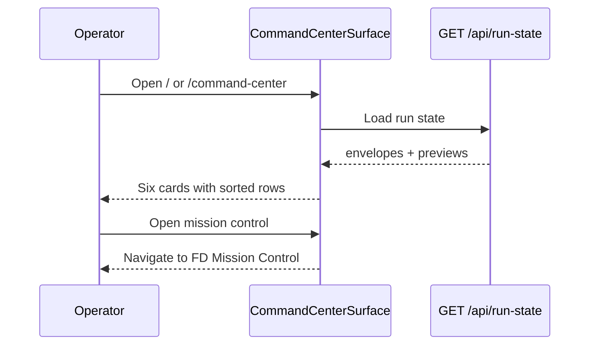

# Command Center Command Center operational state surface UX Spec

## Overview

This feature ships **Command Center** as the Command Center default landing surface so operators scan active runs, human gates, failures, compliance violations, hanging tasks, recent automations, and recent activity without opening chat or raw logs. Six elevated card regions present Mobbin-fidelity list rows: one human-readable primary line, muted meta, exactly one accent primary action, and an overflow menu for secondary remediation. Human gate queue and next-action overflow patterns migrate from the superseded Pipeline module into `client/src/components/command-center/command-center/` without restoring three-module tabs. Data consumes existing `GET /api/run-state` aggregation and shared `run-state-shared.ts` helpers.

## Layout and navigation

- **Shell authority** — `CommandCenterSurface` mounts inside the ten-surface shell from `command-center-shell-theme-foundation`. Routes `/` and `/command-center` both resolve Command Center as the active default landing per `surface-config.ts`. Left rail shows Command Center selected with `aria-current="page"`.
- **Main column** — full-width card grid (`data-testid="command-center-grid"`) below the shell header. No right inspector on this surface in the first slice.
- **Card order (fixed)** — **Needs you** → **Running now** → **Compliance issues** → **Hanging tasks** → **Recent automations** → **Recent activity**. Cards SHALL NOT reorder dynamically.
- **Grid rhythm** — at ≥1024px, two equal columns with `--space-lg` gutter; at <1024px, single column stack. Each card uses solid `--color-surface-elevated` background, `--radius-md`, `--shadow-sm`, and `--space-md` internal padding. No dashed or placeholder borders in shipped views.
- **Page-level empty** — when run-state returns zero non-terminal tasks and no compliance, automation, or activity preview rows, replace the grid with one centered guided empty panel and primary CTA **Start feature delivery** linking to Work Intake kickoff.
- **Out of scope in this layout** — FD Mission Control stage rail, compliance recovery grouped view, activity log stream, quick-fix diff flow, and Pipeline module grid or timeline.

```
┌─ Command Center (default landing) ─────────────────────────────┐
│ [Needs you]              │ [Running now]                        │
│  row · row               │  row · row                           │
├──────────────────────────┼──────────────────────────────────────┤
│ [Compliance issues]      │ [Hanging tasks]                      │
├──────────────────────────┼──────────────────────────────────────┤
│ [Recent automations]     │ [Recent activity]                    │
└──────────────────────────┴──────────────────────────────────────┘
```

## Visual design tokens

Reuse Command Center tokens from the ratified parent ux-spec and `client/src/app/globals.css`. Do not introduce per-card one-off spacing.

| Token group | Names | Command Center use |
|---|---|---|
| **Surfaces** | `--color-background`, `--color-surface`, `--color-surface-elevated`, `--color-border` | Shell background; card bodies on elevated surface |
| **Text** | `--color-text-primary`, `--color-text-secondary`, `--color-text-muted` | Primary label semibold; meta row muted |
| **Accent / CTA** | `--color-accent-primary`, `--color-cta-background`, `--color-cta-text` | One accent-filled button per row |
| **Status** | `--color-status-{error,warning,success}` + `-bg` + `-border` | Severity chip and status pill; always pair color with text label |
| **Spacing** | `--space-xs` through `--space-2xl` (4px base) | Card padding `--space-md`; row gap `--space-sm`; grid gutter `--space-lg` |
| **Radii** | sm 6px, md 10px, full 999px | Cards md; pills full |
| **Type** | `theme.typography.size` xs–xl | ≤5 sizes: card title `sm` semibold; row label `sm` semibold; meta `xs`; CTA `sm`; empty copy `sm` |
| **Shadow** | sm / md | Card elevation sm |

**Row anatomy** — `.command-center-row` flex column with `min-width: 0`. Primary line `.command-center-row-label` single-line truncate ≤60 chars with `title` tooltip when clipped. Meta row `.command-center-row-meta` shows status pill, severity chip, and relative age separated by middle dots. Actions row aligns one `.command-center-row-cta` accent button and one overflow trigger `.command-center-row-overflow` at ≥32px hit target.

## Interaction requirements

### Shared list-row pattern (`data-testid="command-center-row"`)

Every populated row SHALL show: (1) human-readable feature label from `featureDisplayLabel`, (2) status pill from parent taxonomy, (3) severity chip, (4) relative age via human phrasing (for example `12 minutes ago`), and (5) exactly one accent primary CTA using the parent action taxonomy. Raw repo paths, task ids, and ISO timestamps SHALL NOT appear as readable primary or meta text. Overflow menu (⋯) exposes secondary actions only: **Copy run command**, **Copy path**, **Open next-prompt**, artifact preview links when present, and **Show technical details** disclosure closed by default. Rows with secondary needs SHALL NOT show more than one accent button.

**Sorting within a card** — Blocking and Critical severity rows sort above Info and Warning; ties break by recency (newest first). Page scan priority across cards: retry-limit failures and human gates in **Needs you** precede compliance and automation failures before informational hanging rows.

### Needs you (`data-testid="command-center-needs-you"`)

- **Population** — list every stage with `humanGate === "human_approval"` and status `active` or `ready` across all non-terminal runs; list retry-limit failures with Critical severity.
- **Primary CTA** — **Open mission control** deep-links to FD Mission Control for the owning task.
- **Status pill** — **Waiting for human** for gates; **Failed** for retry-limit rows.
- **Empty copy** — `No approvals or retry-limit failures right now` beneath the card header; header remains visible.

### Running now (`data-testid="command-center-running-now"`)

- **Population** — non-terminal runs with an active stage not waiting on `human_approval`.
- **Primary CTA** — **Open mission control**.
- **Status pill** — **Running** or **Retrying** per active stage.
- **Empty copy** — `No active stages running`.

### Compliance issues (`data-testid="command-center-compliance"`)

- **Population** — each open finding from the latest compliance audit preview.
- **Primary CTA** — **Run quick fix** for missing-artifact issues; **Re-run compliance check** for other open violations. CTAs MAY deep-link to `/compliance` until quick-fix invocation ships.
- **Empty copy** — `No open compliance findings`.

### Hanging tasks (`data-testid="command-center-hanging"`)

- **Population** — runs where `classifyHangingTask` returns stale-heartbeat or long-running-stage; severity Warning or higher.
- **Primary CTA** — **Open mission control**.
- **Empty copy** — `No stale or long-running tasks`.

### Recent automations (`data-testid="command-center-automations"`)

- **Population** — recent automation runs with failed rows before healthy rows.
- **Primary CTA** — **Retry automation run** on failed rows; **Open automations** on healthy rows.
- **Empty copy** — `No recent automation runs`.

### Recent activity (`data-testid="command-center-activity"`)

- **Population** — preview pipeline or automation events sorted by severity then recency.
- **Primary CTA** — **Open activity log**.
- **Empty copy** — `No recent pipeline events`.

### Loading, error, and hover states

- **Loading** — within 400ms of mount, render skeleton placeholders per card (`aria-busy="true"` on the grid). Skeleton rows mimic label, meta, and CTA blocks without lorem paths.
- **Error** — inline error banner above the grid with message and **Retry fetch** button that re-invokes data loading without full page reload.
- **Row hover / focus** — subtle `--color-surface` inset or border brighten; `:focus-visible` 2px `--color-accent-primary` outline with 2px offset on CTA and overflow controls.
- **Motion** — row hover and overflow open ≤200ms `ease-out`; honor `prefers-reduced-motion`.

### Pipeline migration

- **Extract** — refactor `HumanGateBanner.tsx` gate listing and `NextActionPanel.tsx` overflow affordances into `client/src/components/command-center/command-center/` (or shared helpers consumed by Command Center rows). Gate dismiss from the prior banner is out of scope; all gates remain visible in **Needs you** until remediated.
- **Preserve** — import `collectHumanGateQueue`, `classifyHangingTask`, `featureDisplayLabel`, severity and status pill helpers from `run-state-shared.ts`; do not duplicate classification logic.
- **Regression boundary** — Pipeline module grid, timeline, inbox triage, and config panels MAY remain on legacy routes but SHALL NOT duplicate Command Center card regions as the primary orientation surface.



## Accessibility minimums

WCAG 2.2 Level AA for Command Center surfaces introduced by this feature.

| Criterion | Requirement |
|---|---|
| **1.4.3** | 4.5:1 text contrast on card titles, row labels, and meta |
| **1.4.11** | 3:1 non-text contrast on card borders, pill outlines, CTA boundaries, focus rings |
| **2.1.1** | Keyboard operability for card rows, primary CTAs, overflow menus, and **Retry fetch** |
| **2.4.3** | Focus order: shell rail → page error banner (if present) → cards top-to-bottom, left-to-right → row CTA → overflow |
| **2.4.7** | 2px `--color-accent-primary` `:focus-visible` outline with 2px offset on interactive controls |
| **2.4.11** | Overflow menus do not fully obscure the triggering row |
| **4.1.2** | Card regions use `role="region"` with `aria-labelledby` pointing to card headers; loading grid sets `aria-busy="true"` |

## Craft standards

Per `lib/memory/handbook/engineering/design-craft.md`: 4px spacing scale; one accent primary CTA per row; no raw paths, ids, or ISO timestamps as default list content; no internal prose dumps; solid elevated card surfaces; ≤2 visible row actions plus overflow; primary labels ≤60 characters; content contained at 1280×900 and 375×812.

```yaml
contract:
  id: command-center-command-center-operational-state-surface.ux.command-center-operational-state
  kind: llm-judge
  severity: block
  applies_to:
    kind: artifact-symbol
    path: /lib/memory/features/command-center-command-center-operational-state-surface/ux-spec.md
    symbol: "Interaction requirements"
  owner: design-engineer
  description: |
    When Command Center renders with run-state data, the default view SHALL show
    six card regions in fixed order (Needs you, Running now, Compliance issues,
    Hanging tasks, Recent automations, Recent activity); each populated row SHALL
    display a human-readable feature label, status pill, severity chip, relative
    age, and exactly one verb-plus-object primary CTA without a visible raw repo
    path, task id, or ISO timestamp as primary text.
  references:
    - kind: lines
      path: /lib/memory/features/command-center-command-center-operational-state-surface/ux-spec.md
      range: [88, 130]
      note: Shared row pattern and card region requirements.
    - kind: lines
      path: /lib/memory/features/command-center-ux-philosophy-information-architecture-and-user-stories/ux-spec.md
      range: [118, 121]
      note: Parent Command Center §4.1 authority.
  runtime:
    rubric:
      scale: [1.0, 0.5, 0.0]
      threshold: 0.75
      examples:
        good:
          - text: "Needs you row shows feature title, Waiting for human pill, Critical chip, Open mission control CTA."
            rationale: Operator-readable queue with one remediation action.
        bad:
          - text: "Monospace run directory as primary line; three equal accent buttons on one row."
            rationale: Raw-data exposure and choice overload violate craft gates.
    panel:
      quorum: 2-of-3
      judges: [haiku, haiku, sonnet]
      seed: 42
      cost_ceiling_usd: 0.50
  metadata:
    pancreator.contract_id: command-center-command-center-operational-state-surface.ux.command-center-operational-state
    pancreator.applies_to: artifact-symbol:/lib/memory/features/command-center-command-center-operational-state-surface/ux-spec.md#Interaction-requirements
    pancreator.wcag-criteria: ["1.4.3", "2.1.1", "4.1.2"]
```

```yaml
contract:
  id: command-center-command-center-operational-state-surface.ux.loading-error-empty
  kind: llm-judge
  severity: block
  applies_to:
    kind: artifact-symbol
    path: /lib/memory/features/command-center-command-center-operational-state-surface/ux-spec.md
    symbol: "Interaction requirements"
  owner: design-engineer
  description: |
    When Command Center loads run-state data, skeleton placeholders SHALL appear
    within 400ms with aria-busy on the card grid; when fetch fails, an inline
    error banner SHALL expose Retry fetch without full page reload; when no
    operational rows exist, a guided empty state SHALL show Start feature
    delivery as the primary CTA.
  references:
    - kind: lines
      path: /lib/memory/features/command-center-command-center-operational-state-surface/ux-spec.md
      range: [132, 138]
      note: Loading, error, and page-level empty requirements.
  runtime:
    rubric:
      scale: [1.0, 0.5, 0.0]
      threshold: 0.75
      examples:
        good:
          - text: "Skeleton cards within 400ms; error banner with Retry fetch; zero-data empty with Start feature delivery."
            rationale: Required states guide the operator through latency and failure.
        bad:
          - text: "Blank main column while loading; full page reload on retry; hollow grid with no CTA when empty."
            rationale: Missing required states block operator orientation.
    panel:
      quorum: 2-of-3
      judges: [haiku, haiku, sonnet]
      seed: 42
      cost_ceiling_usd: 0.50
  metadata:
    pancreator.contract_id: command-center-command-center-operational-state-surface.ux.loading-error-empty
    pancreator.applies_to: artifact-symbol:/lib/memory/features/command-center-command-center-operational-state-surface/ux-spec.md#Interaction-requirements
    pancreator.wcag-criteria: ["2.4.7", "4.1.2"]
```
