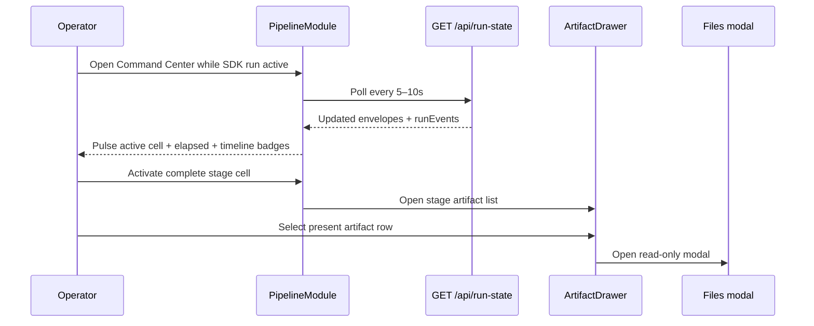

# Command Center live run refresh and stage artifact drawer UX Spec

## Overview

This feature makes the Pipeline module feel live during SDK runs. Operators watch stage progress, elapsed time, and run-log telemetry without pasting terminal output or reloading the tab. Non-pending stage cells open a slide-over artifact drawer mapped to `stageArtifactContract`; present files open in the existing P10 read-only modal. The stage grid gains the canonical `compliance` stage between `report` and `ship`. Shell layout, module tabs, Next Action, human gate queue, and config panel inherit unchanged from the shipped command-center and parent Command Center UX specs.

## Layout and navigation

- **Shell authority** — `DashboardModuleShell` and Pipeline column layout remain as shipped. This feature adds behavior inside `PipelineModule`, `StageMachineGrid`, `RunEventTimeline`, and net-new `ArtifactDrawer`; it does not introduce inbox triage, multi-run table, or orientation surfaces.
- **Pipeline main column** — order unchanged: Human Gate Queue → Next Action → 10-stage grid + timeline for the selected run. When polling is active, a compact live indicator sits in the grid header row (`data-testid="live-refresh-indicator"`).
- **Artifact drawer placement** — ≥1024px: right slide-over (`480px` max width) overlaying the config column without hiding the module tabs; 768–1023px: full-width slide-over below the grid; <768px: bottom sheet occupying up to 70vh with scrollable artifact list. Drawer stacks above grid content and below the Files artifact modal.
- **Stage grid density** — ten pipeline stages (`intake` through `index`) plus terminal `complete` cell. Desktop uses a 4-column grid; tablet 3 columns; mobile 2 columns per parent breakpoints.
- **Task selection** — interim default-to-first-non-terminal behavior from the command-center feature persists until the orientation inbox item ships a multi-run table.

```
┌──────────────────────────────────────────────────────────┐
│ [Pipeline*] [Automations] [Maintenance]        Files ›   │
├──────────────────────────────────────────────────────────┤
│ ▲ Human Gate Queue                                       │
├─────────────────────────┬────────────────────────────────┤
│ Next Action             │ Config (read-only)             │
│ 10-stage grid · Live ●  │                                │
│ run-event timeline      │     ┌──────────────────────┐   │
│                         │     │ Artifact drawer      │   │
│                         │     │ (stage artifacts)    │   │
│                         │     └──────────────────────┘   │
└─────────────────────────┴────────────────────────────────┘
```

## Visual design tokens

Reuse Command Center tokens from `client/src/app/globals.css`. Add scoped classes under `/* command-center live refresh */` without altering existing P9 stage-status semantics.

| Token / class | Treatment | Use |
|---|---|---|
| `--stage-active` | existing teal border + 12% fill | Active cell shell (`.stage-cell-active`) |
| `.stage-status-badge-active` | 2px `--accent` border, 12% fill, pulse | Status pill on active cells only |
| `@keyframes stage-active-pulse` | opacity 1 → 0.72 → 1, 2s ease-in-out infinite | Badge pulse; disabled when `prefers-reduced-motion: reduce` |
| `.stage-elapsed-time` | ui-monospace, `0.68rem`, `--text-muted` | Elapsed duration beside active badge |
| `.stage-telemetry-chip` | uppercase `0.65rem`, rounded pill | Newest escalation/retry/deferral on active cell |
| `.telemetry-escalation` | `#8b2f2f` border + 8% fill | Model escalation chip and timeline badge |
| `.telemetry-retry` | `--accent` border + 12% fill | Pipeline advance retry chip and badge |
| `.telemetry-deferral` | dashed `--text-muted` border | Deferral chip and badge |
| `.live-refresh-indicator` | `--accent` dot + "Live" label, `0.72rem` | Visible only while polling interval is active |
| `.artifact-drawer` | `--surface-elevated`, left border `--accent` | Drawer panel shell |
| `.artifact-row-missing` | `0.55` opacity, dashed border, not-allowed cursor | Missing on-disk artifact rows |

Typography for drawer paths and elapsed time follows ui-monospace at `0.75rem`. Timeline event badges sit inline after the event title, never replacing the message body.

## Interaction requirements

### Live polling

- **Start** — when `PipelineModule` mounts and `GET /api/run-state` returns at least one task whose pipeline status is non-terminal with an active stage cell, start an interval between 5s and 10s inclusive.
- **Stop** — when every returned task is terminal or has no active stage cell, clear the interval and hide the live indicator.
- **Merge** — each successful tick merges the new envelope into React state without remounting `DashboardPage` or reloading the browser tab. Prior selected task and dismissed gate keys persist across ticks.
- **Failure** — on tick failure, retain the prior task snapshot and surface the existing inline error affordance with retry; polling continues while non-terminal runs remain.
- **Initial load** — first fetch uses the shared loading skeleton (`aria-busy="true"`); subsequent poll ticks SHALL NOT replace the grid with a full-page skeleton.

### Running-stage indicator

- **Active badge pulse** — when `stage.status === "active"`, render a status badge with class `.stage-status-badge-active` and visible pulse per `--stage-active` tokens.
- **Elapsed time** — display elapsed duration since the newest `run.log.jsonl` record whose stage id matches the active stage name (human-readable, e.g. `2m 14s`). Omit the elapsed element entirely when no matching timestamp exists; never render `0s` or a placeholder dash.
- **Telemetry chip** — when the selected task run log contains escalation, retry, or deferral records matching the active stage, show a compact `.stage-telemetry-chip` naming the newest matching event type (`Escalation`, `Retry`, or `Deferral`) with the matching telemetry class.

### Run-event timeline merge

- **Append-only** — when polling returns a task whose `runEvents` array grew, `RunEventTimeline` prepends only the new events at the top of the list without discarding previously rendered entries or remounting the timeline container.
- **Order** — within each render pass, events display reverse-chronological (newest first).
- **Badges** — render inline badges on matching records:
  - `cursor.runner.escalation` → `.telemetry-escalation` label from `attributes.escalation` when present, else `Escalation`.
  - `pancreator.pipeline.advance` with transition `must_fix`, `qa_fails`, `qa_fails_plan_invalidating`, `compliance_fails`, or `compliance_fails_plan_invalidating` → `.telemetry-retry` label `Retry`.
  - records whose `status.message` includes `deferred` or whose `attributes` include a deferral code → `.telemetry-deferral` label `Deferral`.
- **Live observation** — during an active SDK run fixture, new timeline entries appear before manual browser refresh.

### Stage artifact drawer

- **Open** — activating a stage cell whose status is not `pending` opens `ArtifactDrawer` for that stage (`data-testid="artifact-drawer"`). Pending cells remain non-interactive for drawer open (no hover affordance implying clickability).
- **Header** — show stage name, owner persona chip, stage status pill, and task `featureId` decoded from run state.
- **Artifact list** — enumerate every `requiredAfterStageWork` path from `stageArtifactContract` for the stage name and task `featureId`. Rows show basename plus truncated relative path with full path in `title`.
- **Present row** — activating a row whose file exists on disk switches to the Files tab and opens the artifact in the existing P10 modal with read-only default (`data-testid="readonly-indicator"` visible).
- **Missing row** — rows whose file is absent render disabled with explicit `Missing` label (`.artifact-row-missing`); they do not navigate or open the modal.
- **Close** — drawer closes via close button, Escape, or backdrop click without clearing selected run or grid scroll position.
- **Concurrent state** — opening a different stage cell replaces drawer content in place; only one drawer instance is visible.

### Stage order fix

- **Canonical order** — `FEATURE_DELIVERY_STAGE_ORDER` lists `compliance` immediately after `report` and before `ship`.
- **Grid cells** — dogfood fixtures render ten stage cells covering `intake` through `index` plus terminal `complete` (`data-testid="stage-cell-compliance"` required).
- **Regression** — existing P9 stage-grid, timeline, Next Action, and human-gate tests pass or gain equivalent coverage.

### P10 safety (drawer path)

- Drawer-opened artifacts preserve P10 read-only default, explicit Edit before Save, diff confirmation, and write-guard on pipeline-owned paths (`write-guard-error` when applicable). No drawer control bypasses the Files modal editing contract.

### Primary flow



## Accessibility minimums

WCAG 2.2 Level AA for all surfaces introduced or touched by this feature.

| Criterion | Requirement |
|---|---|
| **1.4.3** | 4.5:1 contrast on drawer body text, elapsed time, and telemetry badge labels |
| **1.4.11** | 3:1 non-text contrast on active pulse badge border and drawer focus ring |
| **2.1.1** | Keyboard operability for stage cells (non-pending), drawer close, and artifact rows |
| **2.4.3** | Focus order: grid cell → drawer panel → artifact rows → Files modal trap on open |
| **2.4.7** | 2px `--accent` `:focus-visible` outline with 2px offset on cells, drawer controls, and rows |
| **2.4.11** | Drawer and bottom sheet do not fully obscure the focused stage cell header |
| **4.1.2** | Drawer `role="dialog"` with `aria-modal="true"` and labelled-by stage header; live indicator `aria-live="polite"` |

**Motion:** drawer slide and backdrop fade ≤200ms `ease-out`; badge pulse honors `prefers-reduced-motion` (static badge, no animation). Timeline prepend does not auto-scroll unless motion is allowed and the operator is pinned to the top of the feed.

```yaml
contract:
  id: command-center-live-run-refresh-and-stage-artifact-drawer.ux.active-stage-live-indicator
  kind: llm-judge
  severity: block
  applies_to:
    kind: artifact-symbol
    path: /lib/memory/features/command-center-live-run-refresh-and-stage-artifact-drawer/ux-spec.md
    symbol: "Running-stage indicator"
  owner: design-engineer
  description: |
    When a stage cell status is active during a non-terminal SDK run, the cell
    SHALL render a pulsing status badge per --stage-active tokens and SHALL
    display elapsed time derived from the newest matching run-log timestamp;
    when no timestamp exists, elapsed time SHALL be omitted rather than shown
    as zero.
  references:
    - kind: lines
      path: /lib/memory/features/command-center-live-run-refresh-and-stage-artifact-drawer/ux-spec.md
      range: [95, 103]
      note: Active badge pulse and elapsed-time rules.
    - kind: lines
      path: /lib/memory/features/command-center-live-run-refresh-and-stage-artifact-drawer/spec.md
      range: [123, 131]
      note: Engineering acceptance for running-stage indicator.
  runtime:
    rubric:
      scale: [1.0, 0.5, 0.0]
      threshold: 0.75
      examples:
        good:
          - text: "Active cell shows pulsing badge, 2m 14s elapsed; no timestamp omits elapsed row."
            rationale: Operators perceive live progress without misleading zero values.
        bad:
          - text: "Active cell identical to complete styling; shows 0s elapsed with no log timestamp."
            rationale: Fails live-run observability and risks false duration signal.
    panel:
      quorum: 2-of-3
      judges: [haiku, haiku, sonnet]
      seed: 42
      cost_ceiling_usd: 0.50
  metadata:
    pancreator.contract_id: command-center-live-run-refresh-and-stage-artifact-drawer.ux.active-stage-live-indicator
    pancreator.applies_to: artifact-symbol:/lib/memory/features/command-center-live-run-refresh-and-stage-artifact-drawer/ux-spec.md#Running-stage-indicator
    pancreator.wcag-criteria: ["1.4.3", "1.4.11"]
```

```yaml
contract:
  id: command-center-live-run-refresh-and-stage-artifact-drawer.ux.artifact-drawer-p10-readonly
  kind: llm-judge
  severity: block
  applies_to:
    kind: artifact-symbol
    path: /lib/memory/features/command-center-live-run-refresh-and-stage-artifact-drawer/ux-spec.md
    symbol: "Stage artifact drawer"
  owner: design-engineer
  description: |
    When an operator activates a non-pending stage cell and selects a present
    artifact row in the drawer, the UI SHALL open the Files artifact modal with
    data-testid="readonly-indicator" visible by default and SHALL keep P10
    write guards enforced on pipeline-owned paths.
  references:
    - kind: lines
      path: /lib/memory/features/command-center-live-run-refresh-and-stage-artifact-drawer/ux-spec.md
      range: [115, 131]
      note: Drawer open, list, and P10 modal handoff.
    - kind: lines
      path: /lib/memory/features/command-center-ux-spec-and-information-architecture/ux-spec.md
      range: [124, 126]
      note: Parent P10 artifact viewing guards.
  runtime:
    rubric:
      scale: [1.0, 0.5, 0.0]
      threshold: 0.75
      examples:
        good:
          - text: "Drawer lists contract paths; present row opens modal with Read-only indicator."
            rationale: Stage artifacts remain safe to inspect before explicit edit.
        bad:
          - text: "Drawer downloads raw file or modal opens in editable mode without indicator."
            rationale: Violates P10 read-only default for pipeline artifacts.
    panel:
      quorum: 2-of-3
      judges: [haiku, haiku, sonnet]
      seed: 42
      cost_ceiling_usd: 0.50
  metadata:
    pancreator.contract_id: command-center-live-run-refresh-and-stage-artifact-drawer.ux.artifact-drawer-p10-readonly
    pancreator.applies_to: artifact-symbol:/lib/memory/features/command-center-live-run-refresh-and-stage-artifact-drawer/ux-spec.md#Stage-artifact-drawer
    pancreator.wcag-criteria: ["2.1.1", "4.1.2"]
```

```yaml
contract:
  id: command-center-live-run-refresh-and-stage-artifact-drawer.ux.timeline-telemetry-badges
  kind: llm-judge
  severity: warn
  applies_to:
    kind: artifact-symbol
    path: /lib/memory/features/command-center-live-run-refresh-and-stage-artifact-drawer/ux-spec.md
    symbol: "Run-event timeline merge"
  owner: design-engineer
  description: |
    When run.log.jsonl fixtures contain escalation, pipeline advance retry, or
    deferral records, the timeline SHALL render the corresponding telemetry
    badge on each matching event and the active stage cell SHALL show the
    newest matching compact chip while that stage remains active.
  references:
    - kind: lines
      path: /lib/memory/features/command-center-live-run-refresh-and-stage-artifact-drawer/ux-spec.md
      range: [105, 113]
      note: Timeline badge mapping and active-cell chip.
    - kind: lines
      path: /lib/memory/features/command-center-live-run-refresh-and-stage-artifact-drawer/spec.md
      range: [164, 178]
      note: Engineering escalation and retry telemetry criteria.
  runtime:
    rubric:
      scale: [1.0, 0.5, 0.0]
      threshold: 0.75
      examples:
        good:
          - text: "Escalation log line shows Escalation badge; active implement cell shows matching chip."
            rationale: Operators see retry and escalation context without reading raw JSONL.
        bad:
          - text: "Escalation records render as plain text only; active cell has no telemetry chip."
            rationale: Telemetry requirements are invisible in the Command Center surface.
    panel:
      quorum: 2-of-3
      judges: [haiku, haiku, sonnet]
      seed: 42
      cost_ceiling_usd: 0.50
  metadata:
    pancreator.contract_id: command-center-live-run-refresh-and-stage-artifact-drawer.ux.timeline-telemetry-badges
    pancreator.applies_to: artifact-symbol:/lib/memory/features/command-center-live-run-refresh-and-stage-artifact-drawer/ux-spec.md#Run-event-timeline-merge
```
