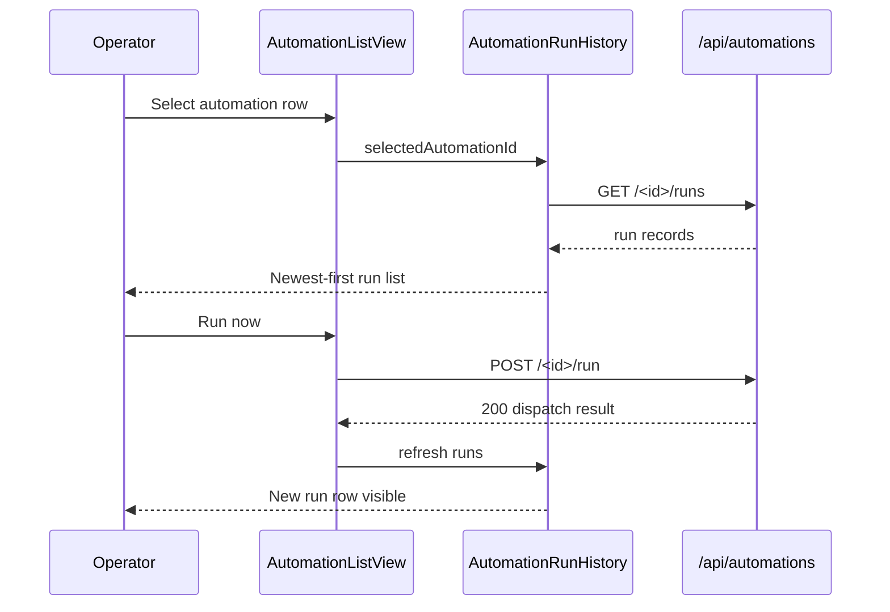

# Command Center local scheduler tick and run history UX Spec

## Overview

This feature completes the Automations execution loop: operators trigger on-demand runs and inspect append-only JSONL history without leaving the Command Center. Run now calls `POST /api/automations/<id>/run`; run history loads via `GET /api/automations/<id>/runs`. List rows gain selection, `running`/`error` badges, and expandable stdout/stderr excerpts. Layout, wizard CRUD, tokens, and shared affordances inherit from ratified Command Center and registry specs. CLI tick and OS cron remain external; their outcomes surface as run records and status transitions.

## Layout and navigation

- **Shell authority** — `AutomationsModule` two-column body unchanged; this feature adds row selection, enables Run now, and replaces the run-history stub.
- **Automations body (≥1024px)** — left (2fr): list with selectable rows; right (1fr): run history for selection. Below 1024px: list → history stacked.
- **Row selection** — row main area selects and fetches history; action buttons do not change selection. Selected row uses `.automation-row-selected` (accent bar + elevated fill).
- **Run history header** — title plus refresh when selected (`data-testid="automation-run-history-refresh"`). Wizard overlay unchanged.
- **Out of scope** — in-app daemon, LangGraph, cloud scheduler UI, Pipeline navigation for `taskId` (display-only chip).

```
┌──────────────────────────────────────────────────────────┐
│ [Pipeline] [Automations*] [Maintenance]        Files ›   │
├─────────────────────────┬────────────────────────────────┤
│ Automation list         │ Run history                    │
│ · Create automation     │ · selected automation name     │
│ · row* (selected)       │ · refresh                      │
│   · badge: running      │ · run rows (newest first)      │
│   · Run now [active]    │   · expand → stdout/stderr     │
│ · row (unselected)      │                                │
├─────────────────────────┴────────────────────────────────┤
│ [Wizard when open — unchanged]                           │
└──────────────────────────────────────────────────────────┘
```

**Breakpoints:** inherit parent Command Center rules (≥1024px two-column; 768–1023px stacked; <768px horizontal scroll on list rows).

## Visual design tokens

Reuse Command Center tokens from `client/src/app/globals.css` (`--surface-primary`, `--surface-elevated`, `--surface-attention`, `--text-primary`, `--text-muted`, `--accent`, `--space-*`). Extend scoped classes under `/* command-center automations */` without altering Pipeline or Maintenance semantics.

| Surface / class | Token / treatment | Use |
|---|---|---|
| `.automation-row-selected` | 3px left border `--accent`, `--surface-elevated` fill | Selected list row |
| `.automation-run-history` | dashed border, `--text-muted` (existing) | Run-history panel shell |
| `.automation-run-row` | border `--text-muted` 20%; hover elevated | Collapsed run entry |
| `.automation-run-log-stdout` / `-stderr` | ui-monospace; stderr uses `#8b2f2f` on 8% fill | Expanded excerpts |
| `.automation-run-task-id` | ui-monospace, `--text-muted` | Optional `taskId` chip |
| List badge `running` | `--accent` border + 12% fill, subtle pulse | Active concurrency lock or in-flight run |
| List badge `error` | `#8b2f2f` border + 8% fill | Latest terminal run `status: error` |
| Run badge `success` | teal border + 12% fill (reuse `.automation-status-scheduled` tone) | Terminal success |
| Run badge `error` | `#8b2f2f` border + 8% fill | Terminal error |
| Run badge `aborted` | dashed `--text-muted` border, 0.72 opacity | Intervention abort |
| Run badge `skipped` | dashed `--text-muted` border, 0.55 opacity | `maxConcurrent` lock skip |
| Run badge `running` | `--accent` border + pulse | Run without `finishedAt` |

**Motion:** Run now in-flight spinner and run-row expand/collapse ≤200ms `ease-out`; list `running` badge pulse 2s ease-in-out; honor `prefers-reduced-motion` (instant expand, static badges).

## Interaction requirements

### Row selection and run-history load (`data-testid="automation-run-history"`)

- **Initial state** — no selection shows empty state A; auto-select only after successful Run now, not on mount.
- **Select / load** — row main click sets `selectedAutomationId` and fetches `GET /api/automations/<id>/runs`; `LoadingState` with `aria-busy` during fetch; prior rows stay visible on refresh.
- **Order** — newest-first matching API; timestamps from `startedAt`. Header refresh re-fetches without clearing selection. Fetch errors use panel-scoped `ErrorState` with retry.

### Empty states

- **No selection** (`data-testid="automation-run-history-no-selection"`) — "Select an automation to view run history."
- **No runs** (`data-testid="automation-run-history-no-runs"`) — "No runs yet. Use Run now or wait for the OS scheduler tick." plus muted OPERATION.md hint.

### Run history entries (`data-testid="automation-run-row-<runId>"`)

- **Collapsed** — status badge, timestamp, duration when `finishedAt` present, trigger pill (`manual`/`scheduled`), expand toggle.
- **Expand** — toggles `aria-expanded` region with `stdoutSummary`/`stderrSummary` or "No output captured." Skipped runs show lock reason from `stderrSummary` or fallback text.
- **Task metadata** — optional `taskId` chip (copy via `title`); no Pipeline navigation. Expand toggles are keyboard-operable buttons.

### Run now (`data-testid="automation-run-now-<automation-id>"`)

- **Enabled** — for `enabled: true` rows; remove registry stub helper and `aria-disabled`. Paused rows disable with title "Resume automation to run manually."
- **In-flight** — spinner, disabled, `aria-busy` during `POST /api/automations/<id>/run`.
- **Success** — select row if needed, refresh history, scroll newest run into view. Non-2xx shows inline row error. Skipped runs still refresh history with skipped badge.

### List status badges

- **`scheduled`/`paused`** — unchanged (`enabled` drives badge). **`running`** — in-flight or non-terminal latest run. **`error`** — latest terminal run failed. Precedence: `paused` > `running` > `error`.

### Data boundaries

- Routes: `POST .../run`, `GET .../runs` → `{ runs: RunRecord[] }` reverse chronological. Out of scope: wizard changes, Pipeline polling, run-log editing.

### Primary flows



## Accessibility minimums

WCAG 2.2 Level AA for all Automations execution surfaces introduced or activated by this feature.

| Criterion | Requirement |
|---|---|
| **1.4.3** | 4.5:1 contrast on run timestamps, log excerpts, helper text, and all status badges including `error` and `skipped` |
| **1.4.11** | 3:1 non-text contrast on selected-row accent bar, expand toggles, and focus rings |
| **2.1.1** | Full keyboard operability for row selection, Run now, run-history refresh, and expand toggles |
| **2.4.3** | Focus order: module tabs → Create CTA → list rows → row actions → run-history refresh → run rows → expand toggles |
| **2.4.7** | 2px `--accent` `:focus-visible` outline with 2px offset on Run now, refresh, and expand controls |
| **2.4.11** | Expanded run excerpts SHALL NOT trap focus; selection highlight remains visible when run-history panel scrolls |
| **4.1.2** | Run expand toggles expose `aria-expanded`; Run now exposes `aria-busy` while dispatch pending; empty states use distinct `data-testid` hooks for assistive testing |

**Motion:** badge pulse and expand animation ≤200ms; disable pulse and use instant expand when `prefers-reduced-motion: reduce`.

```yaml
contract:
  id: command-center-local-scheduler-tick-and-run-history.ux.run-now-enabled
  kind: llm-judge
  severity: block
  applies_to:
    kind: artifact-symbol
    path: /lib/memory/features/command-center-local-scheduler-tick-and-run-history/ux-spec.md
    symbol: "Interaction requirements"
  owner: design-engineer
  description: |
    When an enabled automation row renders in AutomationListView, the Run now
    control SHALL be enabled (not aria-disabled), SHALL NOT show the registry
    stub helper text citing command-center-automations-scheduler, and SHALL call
    POST /api/automations/<id>/run on activation with aria-busy while the
    request is in flight; on success the module SHALL refresh run history for
    that automation.
  references:
    - kind: lines
      path: /lib/memory/features/command-center-local-scheduler-tick-and-run-history/ux-spec.md
      range: [118, 128]
      note: Run now enabled, in-flight, and refresh behavior.
    - kind: lines
      path: /lib/memory/features/command-center-local-scheduler-tick-and-run-history/spec.md
      range: [163, 165]
      note: Engineering acceptance for Run now API and history refresh.
  runtime:
    rubric:
      scale: [1.0, 0.5, 0.0]
      threshold: 0.75
      examples:
        good:
          - text: "Enabled Run now on scheduled row; click shows spinner; history panel gains new run after POST succeeds."
            rationale: Replaces registry stub with wired manual dispatch and history refresh.
        bad:
          - text: "Run now still disabled with scheduler stub helper text or no API call on click."
            rationale: Leaves execution surfaces incomplete after scheduler feature ships.
    panel:
      quorum: 2-of-3
      judges: [haiku, haiku, sonnet]
      seed: 42
      cost_ceiling_usd: 0.50
  metadata:
    pancreator.contract_id: command-center-local-scheduler-tick-and-run-history.ux.run-now-enabled
    pancreator.applies_to: artifact-symbol:/lib/memory/features/command-center-local-scheduler-tick-and-run-history/ux-spec.md#Interaction-requirements
    pancreator.wcag-criteria: ["2.1.1", "4.1.2"]
```

```yaml
contract:
  id: command-center-local-scheduler-tick-and-run-history.ux.run-history-expandable
  kind: llm-judge
  severity: block
  applies_to:
    kind: artifact-symbol
    path: /lib/memory/features/command-center-local-scheduler-tick-and-run-history/ux-spec.md
    symbol: "Interaction requirements"
  owner: design-engineer
  description: |
    When an automation is selected and GET /api/automations/<id>/runs returns
    records, AutomationRunHistory SHALL list runs newest-first with per-run
    status badges and expandable regions that reveal stdoutSummary and
    stderrSummary excerpts; when no automation is selected the panel SHALL
    show the no-selection empty state distinct from the no-runs-yet empty state.
  references:
    - kind: lines
      path: /lib/memory/features/command-center-local-scheduler-tick-and-run-history/ux-spec.md
      range: [95, 116]
      note: Selection load, empty states, and expandable run rows.
    - kind: lines
      path: /lib/memory/features/command-center-local-scheduler-tick-and-run-history/spec.md
      range: [166, 173]
      note: Engineering acceptance for runs API and run-history panel behavior.
  runtime:
    rubric:
      scale: [1.0, 0.5, 0.0]
      threshold: 0.75
      examples:
        good:
          - text: "Select row loads runs; expand toggles show monospace stdout/stderr; no-selection and no-runs copy differ."
            rationale: Satisfies ratified expandable run history and distinguishable empty states.
        bad:
          - text: "Run history still shows registry stub copy or runs render without expand affordance."
            rationale: Panel does not surface append-only run-log content to operators.
    panel:
      quorum: 2-of-3
      judges: [haiku, haiku, sonnet]
      seed: 42
      cost_ceiling_usd: 0.50
  metadata:
    pancreator.contract_id: command-center-local-scheduler-tick-and-run-history.ux.run-history-expandable
    pancreator.applies_to: artifact-symbol:/lib/memory/features/command-center-local-scheduler-tick-and-run-history/ux-spec.md#Interaction-requirements
    pancreator.wcag-criteria: ["2.1.1", "4.1.2"]
```

```yaml
contract:
  id: command-center-local-scheduler-tick-and-run-history.ux.list-running-error-badges
  kind: llm-judge
  severity: warn
  applies_to:
    kind: artifact-symbol
    path: /lib/memory/features/command-center-local-scheduler-tick-and-run-history/ux-spec.md
    symbol: "Interaction requirements"
  owner: design-engineer
  description: |
    When run history or concurrency state indicates an in-flight or failed run
    for an enabled automation, the list row StatusBadge SHALL render running
    or error respectively using the reserved automation-status-running and
    automation-status-error classes rather than remaining on scheduled only.
  references:
    - kind: lines
      path: /lib/memory/features/command-center-local-scheduler-tick-and-run-history/ux-spec.md
      range: [130, 136]
      note: List badge precedence for running and error states.
    - kind: lines
      path: /lib/memory/features/command-center-automation-registry-and-management-ui/ux-spec.md
      range: [84, 87]
      note: Reserved running and error tokens deferred to this feature.
  runtime:
    rubric:
      scale: [1.0, 0.5, 0.0]
      threshold: 0.75
      examples:
        good:
          - text: "During POST run dispatch row badge shows running; after error run log latest row shows error badge."
            rationale: Operators see execution health on the list without opening history.
        bad:
          - text: "Row badge stays scheduled while a run is active or after terminal error."
            rationale: Reserved status tokens never activate despite run-log evidence.
    panel:
      quorum: 2-of-3
      judges: [haiku, haiku, sonnet]
      seed: 42
      cost_ceiling_usd: 0.50
  metadata:
    pancreator.contract_id: command-center-local-scheduler-tick-and-run-history.ux.list-running-error-badges
    pancreator.applies_to: artifact-symbol:/lib/memory/features/command-center-local-scheduler-tick-and-run-history/ux-spec.md#Interaction-requirements
    pancreator.wcag-criteria: ["1.4.3"]
```
