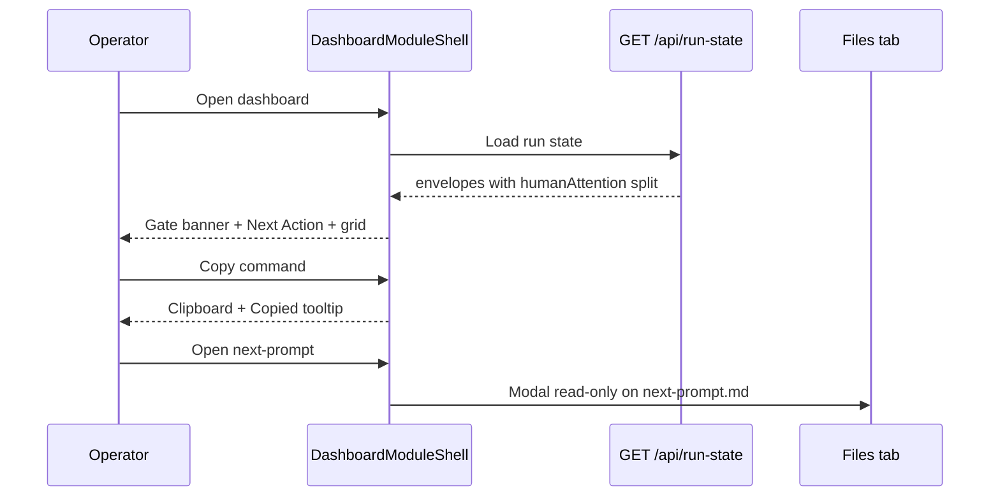

# Command Center Pipeline command center and human gate queue UX Spec

## Overview

This feature implements the Pipeline module command center so operators see the next human action, the next machine command, and every waiting human-approval gate without pasting `pan status` into chat. It introduces `DashboardModuleShell` with Pipeline as the default module, a sticky Next Action panel, a global human gate queue, and a read-only runtime configuration panel fed by `GET /api/config`. Run-state data SHALL expose `humanAttention` separately from `nextCommand`. Inbox triage, multi-run table, live polling, and Automations or Maintenance module bodies remain out of scope; those surfaces ship in sibling inbox items. Shell layout, design tokens, and shared affordances inherit from the ratified Command Center UX spec.

## Layout and navigation

- **Shell authority** — `DashboardModuleShell` renders the three primary module tabs (`Pipeline` default, `Automations` and Maintenance placeholders) plus the de-emphasized secondary `Files` tab per parent ux-spec. `DashboardPage` delegates to the shell without restoring P9 domain cards on module views.
- **Pipeline column (≥1024px)** — two-column body: left column (2fr) stacks Human Gate Queue banner, Next Action panel, then 9-stage grid and run-event timeline for the selected run; right column (1fr) holds the read-only config panel. Below 1024px, columns stack: banner → Next Action → config → grid → timeline.
- **Task selection (interim)** — until the orientation inbox item ships a multi-run table, the selected run SHALL default to the first non-terminal envelope from `GET /api/run-state`, SHALL update when the operator activates a gate-queue row or a task section header in the stage grid, and SHALL expose `aria-selected="true"` on the active task section.
- **Run directory path** — Next Action displays `.pan/work/<day>/<task-id>/` decoded from the selected task id; monospace, truncated with `title` tooltip on overflow.
- **Out of scope in this layout** — inbox triage panel, multi-run table, artifact drawer extraction, and live refresh controls.

```
┌──────────────────────────────────────────────────────────┐
│ [Pipeline*] [Automations] [Maintenance]        Files ›   │
├──────────────────────────────────────────────────────────┤
│ ▲ Human Gate Queue (role=status, per-row dismiss)        │
├─────────────────────────┬────────────────────────────────┤
│ Next Action · sticky    │ Config (read-only)             │
│ human action + command  │ invocation · design_steps      │
│ Copy · next-prompt ·    │ remediation · escalation tiers │
│ run folder              │                                │
├─────────────────────────┴────────────────────────────────┤
│ 9-stage grid + run-event timeline (selected run)         │
└──────────────────────────────────────────────────────────┘
```

**Automations / Maintenance placeholders** — single dashed empty state with module name and “Coming in a later Command Center item”; no wizard or audit UI in this feature.

## Visual design tokens

Reuse Command Center tokens from `client/src/app/globals.css` (`--surface-primary`, `--surface-elevated`, `--surface-attention`, `--text-primary`, `--text-muted`, `--accent`, `--space-*`). Do not alter existing P9 stage-status classes (`.stage-cell-pending`, `.stage-cell-active`, `.stage-cell-complete`, `.stage-cell-failed`).

| Surface | Token / class | Use |
|---|---|---|
| Next Action panel | `--surface-elevated`, `--space-4` padding | Sticky command center card |
| Human gate banner | `--surface-attention`, `AttentionBanner` | Global queue container |
| Config panel | `--surface-primary`, dashed border | Read-only policy summary |
| Commands / paths | ui-monospace, `0.85rem` | `nextCommand`, run directory |
| Copy tooltip | `--accent` on `--surface-elevated` | 2s “Copied” feedback |

Stage cells SHALL continue pairing color tokens with text labels; after the API split, completed or failed cells MAY show `humanAttention` in `.stage-cell-action` while active cells show `nextHumanAction` and `nextCommand` in distinct blocks.

## Interaction requirements

### Run-state field presentation

- **Active stage cell** — render `nextHumanAction` as operator guidance and `nextCommand` in monospace; leave `humanAttention` hidden unless the persisted stage record supplies a non-empty value.
- **Complete or failed stage cell** — render persisted `humanAttention` in the action block; hide `nextCommand` unless the task-level envelope supplies one.
- **Next Action panel** — for the selected run, surface the highest-priority active-stage `nextHumanAction`, task-level `nextCommand`, `taskDisplayLabel(task)`, and run directory path. When the selected run has a dismissed gate, the panel SHALL still show that gate’s stage name, `humanGate`, and `humanAttention` or `nextHumanAction` beneath the primary action block.

### Next Action panel (`data-testid="next-action-panel"`)

- **Copy command** — `CopyCommandButton` adjacent to `nextCommand`; copies the task-level string to the clipboard; shows a 2-second “Copied” tooltip with `aria-live="polite"`; disabled with muted label when `nextCommand` is empty.
- **Open next-prompt** — navigates the Files tab and opens `.pan/work/<day>/<task-id>/next-prompt.md` in the P10 artifact modal (read-only default).
- **Open run folder** — switches to Files and sets browse path to the task run directory without opening a file.
- **Loading / empty / error** — skeleton while `GET /api/run-state` is in flight (`aria-busy="true"`); dashed empty state when no active runs; inline error with retry on fetch failure.

### Human gate queue (`data-testid="human-gate-banner"`)

- **Visibility** — render when at least one stage across all non-terminal runs has `humanGate === "human_approval"` and status `active` or `ready`; show on initial load before task selection.
- **Queue list** (`data-testid="human-gate-queue"`) — one row per matching stage with task label, stage name, persona chip, and status pill; rows are keyboard-focusable buttons that select the parent run.
- **Artifact links** — inline text links for `plan.md`, `review.md`, and `test-report.md` when present under the run directory; link to inbox source path from run state when recorded; missing artifacts render as muted unavailable text, not dead links.
- **Dismiss** — per-row dismiss control hides that row from the banner only; dismissed gates remain visible in Next Action for the selected task; banner container uses `role="status"`.

### Runtime configuration panel (`data-testid="config-readonly-panel"`)

- **Data source** — `GET /api/config` on Pipeline mount; no edit controls.
- **Fields displayed** — runner invocation mode (`sdk` vs `manual`), effective `design_steps` default, `stage_remediation` flag, SDK sampling summary when enabled, and persona escalation tier badges parsed from `pancreator-model-escalation.yaml` (persona slug + active tier label).
- **Refresh** — full page reload after on-disk edits to `pancreator.yaml` or escalation yaml; panel reflects new values without server restart.
- **Loading / error** — muted loading row; inline error with retry consistent with shared empty/error patterns.

### Component extraction and regression

- **Extracted components** — `layout/DashboardModuleShell`, `pipeline/NextActionPanel`, `pipeline/HumanGateBanner`, `pipeline/ConfigReadOnlyPanel`, and `shared/CopyCommandButton`, `shared/AttentionBanner`, `shared/LoadingState`, `shared/EmptyState`, `shared/ErrorState`.
- **Retained P9 surfaces** — `StageMachineGrid` and `RunEventTimeline` migrate unchanged into `pipeline/`; existing tests for grid and timeline SHALL pass.
- **P10 Files actions** — modal opened from Next Action actions SHALL show `data-testid="readonly-indicator"`, require `edit-button` before save, show `diff-view` before confirm, and surface `write-guard-error` on guarded paths.

### Primary flow



## Accessibility minimums

WCAG 2.2 Level AA for all surfaces introduced or touched by this feature.

| Criterion | Requirement |
|---|---|
| **1.4.3** | 4.5:1 contrast on Next Action, banner, and config body text |
| **1.4.11** | 3:1 non-text contrast on banner border, copy button focus ring, stage cell borders |
| **2.1.1** | Keyboard operability for module tabs, gate-queue rows, copy/open actions, and artifact links |
| **2.4.3** | Focus order: module tabs → gate banner → Next Action actions → config → grid |
| **2.4.7** | 2px `--accent` `:focus-visible` outline with 2px offset on interactive controls |
| **2.4.11** | Sticky Next Action SHALL NOT fully obscure focused grid cells when scrolled |
| **4.1.2** | Gate banner `role="status"`; selected task section `aria-selected="true"`; copy feedback `aria-live="polite"` |

**Motion:** banner dismiss and copy tooltip ≤200ms `ease-out`; honor `prefers-reduced-motion` (instant tooltip hide/show).

```yaml
contract:
  id: command-center-pipeline-command-center-and-human-gate-queue.ux.copy-command-feedback
  kind: llm-judge
  severity: block
  applies_to:
    kind: artifact-symbol
    path: /lib/memory/features/command-center-pipeline-command-center-and-human-gate-queue/ux-spec.md
    symbol: "Interaction requirements"
  owner: design-engineer
  description: |
    When the operator activates Copy command in the Next Action panel and
    nextCommand is non-empty, the UI SHALL copy the task-level nextCommand
    string to the clipboard and SHALL expose a visible Copied tooltip with
    aria-live="polite" for approximately two seconds.
  references:
    - kind: lines
      path: /lib/memory/features/command-center-pipeline-command-center-and-human-gate-queue/ux-spec.md
      range: [95, 102]
      note: Next Action Copy command affordance.
    - kind: lines
      path: /lib/memory/features/command-center-ux-spec-and-information-architecture/ux-spec.md
      range: [117, 120]
      note: Parent copy-command pattern.
  runtime:
    rubric:
      scale: [1.0, 0.5, 0.0]
      threshold: 0.75
      examples:
        good:
          - text: "Copy click fills clipboard; Copied tooltip with aria-live=polite for ~2s."
            rationale: Matches spec copy-command pattern and acceptance criteria.
        bad:
          - text: "Command shown as static code only; no clipboard or live region."
            rationale: Operators cannot act on nextCommand without chat paste.
    panel:
      quorum: 2-of-3
      judges: [haiku, haiku, sonnet]
      seed: 42
      cost_ceiling_usd: 0.50
  metadata:
    pancreator.contract_id: command-center-pipeline-command-center-and-human-gate-queue.ux.copy-command-feedback
    pancreator.applies_to: artifact-symbol:/lib/memory/features/command-center-pipeline-command-center-and-human-gate-queue/ux-spec.md#Interaction-requirements
    pancreator.wcag-criteria: ["4.1.2"]
```

```yaml
contract:
  id: command-center-pipeline-command-center-and-human-gate-queue.ux.human-gate-banner
  kind: llm-judge
  severity: block
  applies_to:
    kind: artifact-symbol
    path: /lib/memory/features/command-center-pipeline-command-center-and-human-gate-queue/ux-spec.md
    symbol: "Interaction requirements"
  owner: design-engineer
  description: |
    When at least one active run has a stage with humanGate equal to
    human_approval and status active or ready, the Pipeline module SHALL
    render a global attention banner listing every matching stage across
    non-terminal runs with role="status" and per-row dismiss that hides
    the row from the banner without removing it from Next Action for the
    selected task.
  references:
    - kind: lines
      path: /lib/memory/features/command-center-pipeline-command-center-and-human-gate-queue/ux-spec.md
      range: [104, 112]
      note: Human gate queue visibility, listing, and dismiss behavior.
  runtime:
    rubric:
      scale: [1.0, 0.5, 0.0]
      threshold: 0.75
      examples:
        good:
          - text: "Banner lists all approval gates; dismiss hides row; Next Action retains gate context."
            rationale: Satisfies global queue and dismiss persistence requirements.
        bad:
          - text: "Only selected run gates shown; dismiss removes all trace of the gate."
            rationale: Operators lose cross-run visibility and selected-task context.
    panel:
      quorum: 2-of-3
      judges: [haiku, haiku, sonnet]
      seed: 42
      cost_ceiling_usd: 0.50
  metadata:
    pancreator.contract_id: command-center-pipeline-command-center-and-human-gate-queue.ux.human-gate-banner
    pancreator.applies_to: artifact-symbol:/lib/memory/features/command-center-pipeline-command-center-and-human-gate-queue/ux-spec.md#Interaction-requirements
    pancreator.wcag-criteria: ["2.1.1", "4.1.2"]
```

```yaml
contract:
  id: command-center-pipeline-command-center-and-human-gate-queue.ux.config-readonly
  kind: llm-judge
  severity: warn
  applies_to:
    kind: artifact-symbol
    path: /lib/memory/features/command-center-pipeline-command-center-and-human-gate-queue/ux-spec.md
    symbol: "Interaction requirements"
  owner: design-engineer
  description: |
    When the Pipeline module renders the configuration panel, every control
    SHALL be read-only, data SHALL load from GET /api/config, and a page
    refresh after editing pancreator.yaml on disk SHALL update displayed
    invocation mode, design_steps default, stage remediation, and escalation
    tier badges without a server restart.
  references:
    - kind: lines
      path: /lib/memory/features/command-center-pipeline-command-center-and-human-gate-queue/ux-spec.md
      range: [114, 120]
      note: Config panel data source, fields, and refresh behavior.
  runtime:
    rubric:
      scale: [1.0, 0.5, 0.0]
      threshold: 0.75
      examples:
        good:
          - text: "Panel shows yaml-derived badges; no inputs; refresh picks up edited invocation."
            rationale: Read-only runtime policy surface matches acceptance criteria.
        bad:
          - text: "Editable yaml textarea or stale values after refresh."
            rationale: Violates read-only contract and live config requirement.
    panel:
      quorum: 2-of-3
      judges: [haiku, haiku, sonnet]
      seed: 42
      cost_ceiling_usd: 0.50
  metadata:
    pancreator.contract_id: command-center-pipeline-command-center-and-human-gate-queue.ux.config-readonly
    pancreator.applies_to: artifact-symbol:/lib/memory/features/command-center-pipeline-command-center-and-human-gate-queue/ux-spec.md#Interaction-requirements
```
