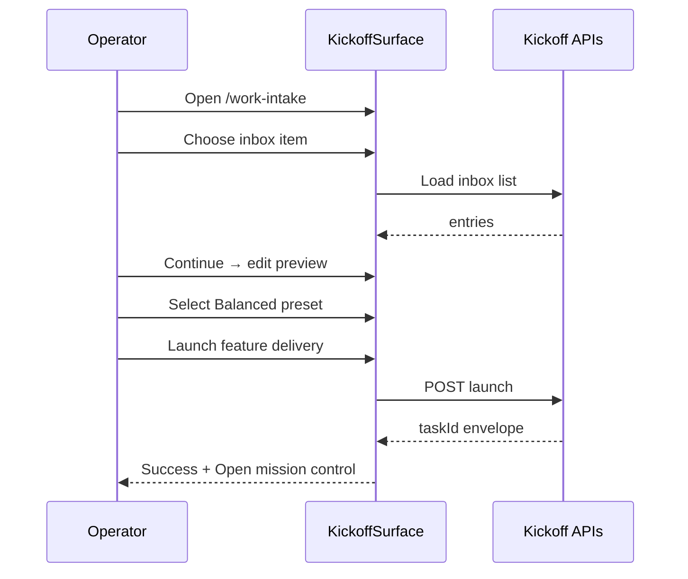

# Command Center unified Work Intake and kickoff flow UX Spec

## Overview

This feature replaces the Work Intake kickoff stub with a guided four-step flow so operators start feature-delivery from the Command Center without copy/paste or a terminal `pan run` invocation. Operators choose a work source, review and edit the directive, pick a model preset, and launch from one calm surface mounted at `/work-intake`. The global header **Start feature delivery** link and Command Center empty states converge on this route. Chat is optional via interactive intake; the default path never requires Agent Chat to reach launch.

## Layout and navigation

- **Shell authority** — `KickoffSurface` mounts inside the ten-surface shell from `command-center-shell-theme-foundation`. Left rail marks Work Intake active with `aria-current="page"`. Global header shows one accent **Start feature delivery** link targeting `/work-intake` on every first-slice route per parent layout §53.
- **Main column** — single centered workflow column (`data-testid="kickoff-surface"`) max-width 720px with `--space-lg` horizontal inset. No right inspector in the first slice.
- **Stepper chrome** — horizontal step indicator (`data-testid="kickoff-stepper"`) fixed order: **Choose source** → **Preview directive** → **Configure models** → **Review and launch**. Completed steps show check icon; current step uses accent underline; future steps muted. Step labels remain visible at all breakpoints; on <1024px labels truncate to one word with full label in `aria-label`.
- **Step panel** — each step renders inside one solid `--color-surface-elevated` card (`--radius-md`, `--shadow-sm`, `--space-lg` padding). Footer action bar separates navigation: secondary **Go back** (hidden on step 1) left; primary **Continue** right on steps 1–3.
- **Cross-surface entry** — Command Center guided empty and Mission Control empty **Start feature delivery** links SHALL target `/work-intake` after kickoff ships.
- **Out of scope in this layout** — Feature Backlog browse table, sandbox target picker beyond stub, FD Mission Control run detail, full Agent Chat console, and widening `POST /api/execute`.

```
┌─ Work Intake / Kickoff ────────────────────────────────────────┐
│ ① Choose source ─ ② Preview ─ ③ Models ─ ④ Review              │
├────────────────────────────────────────────────────────────────┤
│  [ elevated step card — source picker | editor | presets ]     │
│                                    [Go back]  [Continue →]     │
└────────────────────────────────────────────────────────────────┘
```

## Visual design tokens

Reuse Command Center tokens from the ratified parent ux-spec and `client/src/app/globals.css`. Do not introduce per-step one-off spacing.

| Token group | Names | Kickoff use |
|---|---|---|
| **Surfaces** | `--color-background`, `--color-surface`, `--color-surface-elevated`, `--color-border` | Shell background; step card and source tiles on elevated surface |
| **Text** | `--color-text-primary`, `--color-text-secondary`, `--color-text-muted` | Step titles semibold; helper copy secondary; meta muted |
| **Accent / CTA** | `--color-accent-primary`, `--color-cta-background`, `--color-cta-text` | One accent-filled primary per region: **Continue**, **Launch feature delivery** |
| **Status** | `--color-status-{error,warning,success}` + `-bg` + `-border` | Inline launch errors; success toast border |
| **Spacing** | `--space-xs` through `--space-2xl` (4px base) | Card padding `--space-lg`; source tile gap `--space-sm`; footer bar `--space-md` top margin |
| **Radii** | sm 6px, md 10px, full 999px | Step card md; source tiles md; preset chips full |
| **Type** | `theme.typography.size` xs–xl | ≤5 sizes: page title `lg`; step label `sm`; body `sm`; meta `xs`; CTA `sm` |
| **Shadow** | sm / md | Step card sm; success toast md |

**Source tile anatomy** — selectable inset cards with icon, title, and one-line description. Selected tile adds accent border and `--color-surface` fill. **Inbox row anatomy** — Mobbin-fidelity list inside bounded scroll container: human-readable directive title (from frontmatter or first heading), muted meta (relative age · intake status), one **Select inbox item** accent action per row; overflow exposes **Copy inbox path** only (copy-only; path never rendered as visible row text).

## Interaction requirements

### Step 1 — Choose source (`data-testid="kickoff-step-source"`)

- **Source tiles (fixed order)** — **Inbox item**, **Raw URL**, **Raw text**, **Feature backlog**, **Interactive intake**. Exactly five tiles in a responsive grid: two columns ≥768px, single column below.
- **Inbox item** — fetch `GET /api/inbox`; show skeleton list within 400ms (`aria-busy="true"`). Empty inbox: guided panel with copy `No inbox directives yet` and secondary **Paste raw text** linking selection to raw text tile. Populated: scrollable list sorted per `loadInboxEntries`; selecting a row sets source and enables **Continue**.
- **Raw URL** — single URL field with label `Paste page URL`; validate HTTP/HTTPS on blur. **Fetch page context** secondary button triggers kickoff API summarization; loading shows inline skeleton on preview seed fields. Original URL stored in source metadata, not shown as primary label.
- **Raw text** — multiline markdown textarea min-height 240px; placeholder guides Problem / Goal structure without dumping template prose.
- **Feature backlog (deferred)** — guided empty card naming deferred backlog browse UX; offers **Choose inbox item**, **Paste page URL**, or **Paste raw text** as alternate tiles (Fitts's Law separation from primary grid selection).
- **Interactive intake** — optional info callout with **Open agent chat** link; selecting this tile SHALL NOT block **Continue** on other tiles; operator MAY switch back without losing other source input.
- **Disabled forward** — **Continue** disabled until one valid source is bound; `aria-describedby` explains missing requirement.

### Step 2 — Preview directive (`data-testid="kickoff-step-preview"`)

- **Editor** — editable markdown preview of directive body including frontmatter fields required for feature-delivery launch. Monospace editing confined to editor region; surrounding chrome stays sans. Line length capped ~80ch inside editor for readability.
- **Secondary CTA** — **Save inbox directive** in card footer (secondary styling). Persists preview to inbox bucket using `pan intake new` naming contract without starting a run.
- **Save success** — toast `Inbox directive saved` with **Copy inbox path** action (copy-only; path not visible as toast body text). Operator remains on preview step with edited content preserved.
- **Save error** — inline banner above editor with message and **Retry save**; no navigation away.
- **State carry-forward** — edits become launch payload for subsequent steps; backward navigation preserves edits.

### Step 3 — Configure models (`data-testid="kickoff-step-models"`)

- **Preset cards** — three equal selectable cards: **Cheap / fast**, **Balanced** (default selected), **High quality**. Each shows one-line operator-facing summary, not raw model ids.
- **Advanced settings** — collapsed disclosure **Show advanced model settings** closed by default. Expanded: per-persona override dropdowns; overrides appear on review summary only; persona markdown files never mutate in UI.
- **Selection feedback** — selected preset card uses accent border; keyboard Space/Enter toggles selection.

### Step 4 — Review and launch (`data-testid="kickoff-step-review"`)

- **Summary sections** — chunked review card: **Work source** (human label, not raw path), **Directive excerpt** (first ~120 chars with **Expand directive preview** disclosure closed by default), **Model preset** (preset name plus persona override chips if any).
- **Primary CTA** — one accent **Launch feature delivery** in footer. Secondary **Save inbox directive** repeats preview-step behavior.
- **Launch in flight** — button shows loading label `Launching feature delivery…` within 400ms; step panel `aria-busy="true"`.
- **Launch success** — success panel with human feature title, status pill **Running**, and primary **Open mission control** deep-link. Secondary **Copy run command** in overflow (copy-only). Optional tertiary **Return to command center**. Post-launch navigation MAY deep-link to `/mission-control` but full run-detail UX remains out of scope.
- **Launch failure** — inline error region with summarized reason and **Retry launch**; remain on review step; no route change.

### Shared states

- **Loading** — skeleton placeholders inside active step card within 400ms; `aria-busy="true"` on panel during fetch, URL summarize, save, or launch.
- **Empty** — each step defines guided next action per gate-blocking conditions (no hollow panels).
- **Hover / focus / active** — source tiles, preset cards, inbox rows, and CTAs show subtle surface brighten; `:focus-visible` 2px `--color-accent-primary` outline with 2px offset.
- **Disabled** — **Continue** and **Launch feature delivery** use muted styling plus tooltip/`aria-describedby` reason when validation fails.
- **Motion** — step transitions and tile selection ≤200ms `ease-out`; honor `prefers-reduced-motion`.

### Shell header wiring

- When `(command-center)/layout.tsx` renders first-slice routes, global header includes accent **Start feature delivery** link to `/work-intake`, visually matching Command Center empty-state CTA treatment (one accent control in header region).



## Accessibility minimums

WCAG 2.2 Level AA for Work Intake kickoff surfaces introduced by this feature.

| Criterion | Requirement |
|---|---|
| **1.4.3** | 4.5:1 text contrast on step labels, source tiles, editor chrome, and summary text |
| **1.4.11** | 3:1 non-text contrast on stepper indicators, tile borders, CTA boundaries, focus rings |
| **2.1.1** | Keyboard operability for stepper, source tiles, inbox list, URL field, textarea, preset cards, disclosures, and all CTAs |
| **2.4.3** | Focus order: shell rail → header CTA → stepper → step card fields → footer actions |
| **2.4.7** | 2px `--color-accent-primary` `:focus-visible` outline with 2px offset on interactive controls |
| **2.4.11** | Advanced settings disclosure and directive expander do not fully obscure triggering control |
| **4.1.2** | Stepper uses `role="navigation"` with `aria-current="step"` on active step; loading panels set `aria-busy="true"` |

## Craft standards

Per `lib/memory/handbook/engineering/design-craft.md`: 4px spacing scale; one accent primary CTA per region; no raw repo paths, task ids, or ISO timestamps as default readable content; summarize directive and URL context into operator labels; solid elevated card surfaces only; Mobbin-fidelity inbox rows with one primary action plus overflow; CTA labels verb plus concrete object; content contained at 1280×900 and 375×812.

```yaml
contract:
  id: command-center-unified-work-intake-and-kickoff-flow.ux.kickoff-flow-inputs
  kind: llm-judge
  severity: block
  applies_to:
    kind: artifact-symbol
    path: /lib/memory/features/command-center-unified-work-intake-and-kickoff-flow/ux-spec.md
    symbol: "Interaction requirements"
  owner: design-engineer
  description: |
    When Work Intake kickoff renders at /work-intake, the surface SHALL expose
    a four-step stepper (Choose source, Preview directive, Configure models,
    Review and launch); SHALL accept inbox item, raw URL, and raw text sources
    with an editable directive preview before launch; SHALL offer Cheap / fast,
    Balanced, and High quality model presets; SHALL show primary CTA Launch
    feature delivery and secondary Save inbox directive on the review step; and
    SHALL NOT require Agent Chat unless the operator selects interactive intake.
    Default views SHALL NOT show raw repo paths, task ids, or ISO timestamps as
    readable primary text.
  references:
    - kind: lines
      path: /lib/memory/features/command-center-unified-work-intake-and-kickoff-flow/ux-spec.md
      range: [88, 168]
      note: Step panels, source tiles, preview, presets, review, and launch states.
    - kind: lines
      path: /lib/memory/features/command-center-ux-philosophy-information-architecture-and-user-stories/ux-spec.md
      range: [127, 129]
      note: Parent Work Intake / Kickoff §4.3 baseline.
  runtime:
    rubric:
      scale: [1.0, 0.5, 0.0]
      threshold: 0.75
      examples:
        good:
          - text: "Inbox source selected; editable preview visible; Balanced preset chosen; Launch feature delivery enabled without chat."
            rationale: Unified kickoff with review gate and unambiguous CTAs.
        bad:
          - text: "Chat-only intake; preview read-only; launch button labeled Submit; inbox row shows monospace path."
            rationale: Missing sources, ambiguous CTA, and raw-data exposure.
    panel:
      quorum: 2-of-3
      judges: [haiku, haiku, sonnet]
      seed: 42
      cost_ceiling_usd: 0.50
  metadata:
    pancreator.contract_id: command-center-unified-work-intake-and-kickoff-flow.ux.kickoff-flow-inputs
    pancreator.applies_to: artifact-symbol:/lib/memory/features/command-center-unified-work-intake-and-kickoff-flow/ux-spec.md#Interaction-requirements
    pancreator.wcag-criteria: ["1.4.3", "2.1.1", "2.4.7", "4.1.2"]
```
