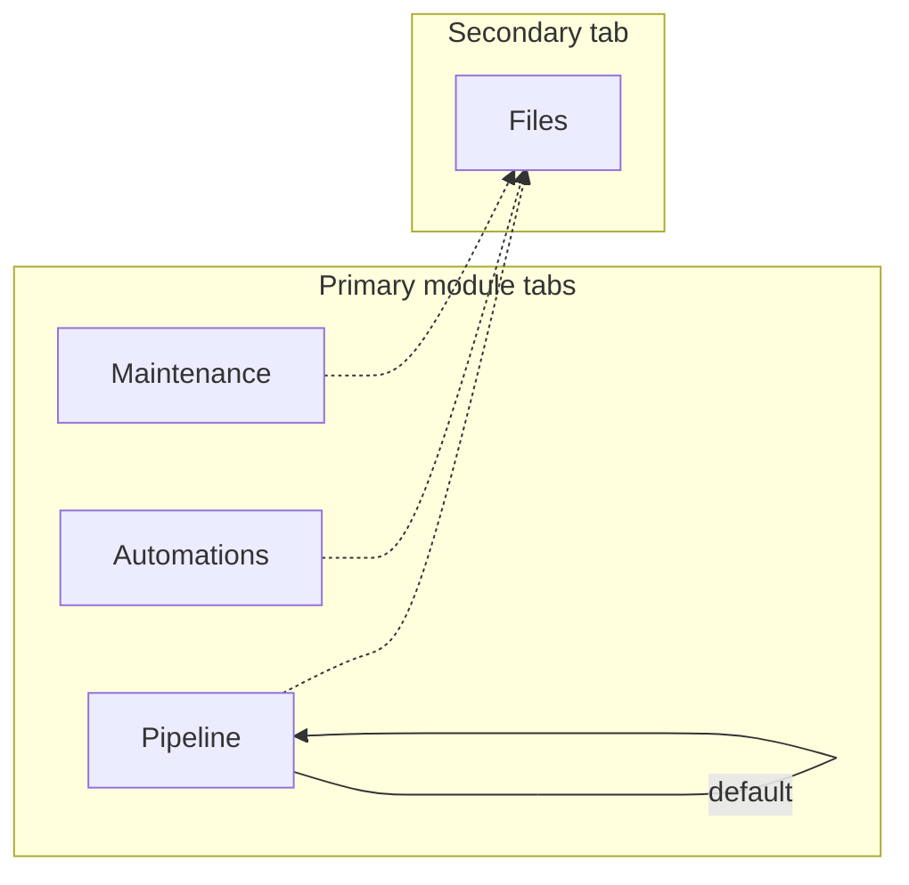
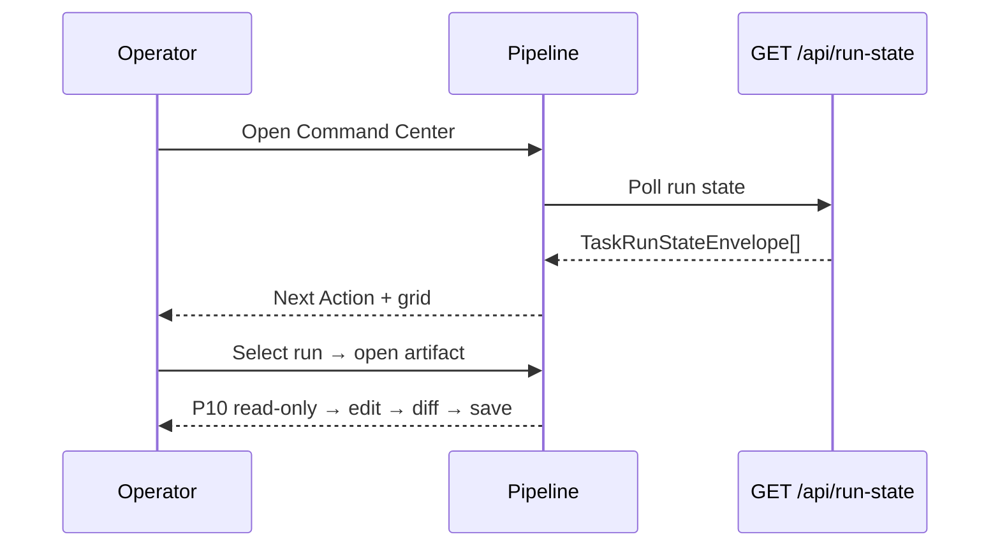
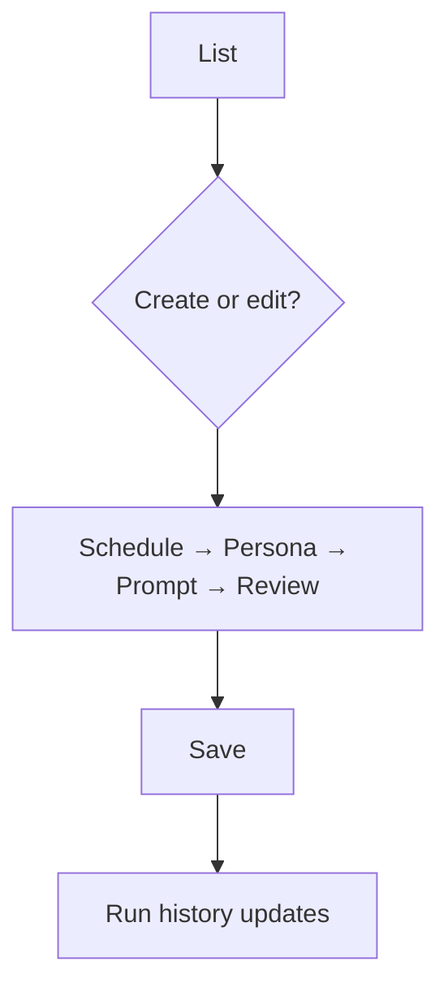

# Command Center UX Spec

## Overview

Command Center is the operator control plane for Pancreator feature-delivery runs. It replaces the P9 domain-card landing with a three-module shell—Pipeline, Automations, and Maintenance—so operators orient, act on human gates, schedule agent work, and run compliance checks without leaving the dashboard. Pipeline is the default landing with a Next Action command center; Files remains a secondary tab. Run state composes atop existing `GET /api/run-state` and P10 safe-editing contracts. This spec is the sole UX authority for downstream implementation.

## Layout and navigation

- **App header** — unchanged from P9 (title, eyebrow, summary).
- **Primary module tabs** — exactly three pill tabs: `Pipeline` (default), `Automations`, `Maintenance`. Single `role="tablist"`; `aria-selected` on active tab.
- **Secondary tab** — `Files` is visually de-emphasized (trailing, smaller) and SHALL NOT be the default view. Opens the P9/P10 file browser and artifact modal.
- **Domain cards demoted** — P9 left-rail `Domains` grid SHALL NOT appear on primary module views (Tier 4). Paths reachable via Files or module deep links.

**Breakpoints:** ≥1024px two-column (2fr + 1fr sidebar/drawer); 768–1023px single column with bottom-sheet drawer; <768px stacked panels, 2-column stage grid, horizontal table scroll.



### Module wireframes

**Pipeline (default):** Human-gate banner → Next Action panel (left) + inbox triage / multi-run table / read-only config (right) → 9-stage grid + live timeline for selected run → artifact drawer (slide-over).

**Automations:** List view (name, schedule, persona, status badge, Create CTA) + run-history sidebar; create/edit wizard stepper (Schedule → Persona → Prompt → Review).

**Maintenance:** Compliance audit + test-suite picker (unit, lint, compliance, full pre-close) → streamed output viewer → pre-close validation CTA (`pnpm -w exec pan check`) with OPERATION.md link.

```
┌──────────────────────────────────────────────────────────┐
│ [Pipeline*] [Automations] [Maintenance]        Files ›   │
├──────────────────────────────────────────────────────────┤
│ ▲ Human Gate Queue                                       │
├─────────────────────────┬────────────────────────────────┤
│ Next Action · copy cmds │ Inbox triage · multi-run table │
│ 9-stage grid · timeline │ Config panel (read-only)       │
├─────────────────────────┴────────────────────────────────┤
│ Artifact drawer                                          │
└──────────────────────────────────────────────────────────┘
```

## Visual design tokens

Extend `client/src/app/globals.css` under `/* command-center */`. Preserve `--eggshell`, `--midnight-violet`, `--deep-teal`.

**Spacing:** `--space-1` 0.25rem through `--space-6` 1.5rem (badge gaps → shell padding).

**Surfaces:** `--surface-primary` (eggshell), `--surface-elevated` (30% white mix), `--surface-attention` (8% `#8b2f2f` mix), `--text-primary`, `--text-muted` (65% mix), `--accent` (deep-teal).

**Stage status** (pair color with text label; map to P9 classes):

| Token | Treatment | Class |
|---|---|---|
| `--stage-pending` | dashed, 0.72 opacity | `.stage-cell-pending` |
| `--stage-active` | teal border + 12% fill | `.stage-cell-active` |
| `--stage-complete` | 55% teal border | `.stage-cell-complete` |
| `--stage-failed` | `#8b2f2f` border + 8% fill | `.stage-cell-failed` |

**Typography:** Iowan Old Style display (1.75rem); ui-sans-serif UI (0.85rem); ui-monospace for commands, IDs, streamed output.

## Interaction requirements

### Shared affordances

- **Copy-command buttons** — adjacent to every `nextCommand`; clipboard copy + 2s "Copied" tooltip (`aria-live="polite"`).
- **Attention banners** — `--surface-attention`, `role="status"`; per-gate dismiss; dismissed gates remain in Next Action.
- **Loading / empty / error** — all panels: skeleton or muted loading (`aria-busy`), dashed empty with recovery CTA, inline error with retry.
- **Stage status badges** — name + persona chip + status pill; keyboard focus ring on active cell.

### Artifact viewing (P10)

Files modal and Pipeline artifact drawer SHALL enforce: (1) read-only default with `data-testid="readonly-indicator"`; (2) explicit Edit (`edit-button`) before Save; (3) diff view (`diff-view`) + Confirm/Cancel before write; (4) write guard on pipeline-owned paths (`write-guard-error`).

### Pipeline

- **Next Action** — highest-priority action across runs (gate > stale prompt > advance-ready); primary CTA copies/executes command.
- **Human gate banner** — aggregates `StageCell.humanGate`; links to stage cells.
- **9-stage grid + timeline** — per selected run from multi-run table; data from `GET /api/run-state` only.
- **Artifact drawer** — stage artifacts; opens P10 modal.
- **Inbox triage** — open inbox entries with Files deep link.
- **Multi-run table** — sortable; row drives grid, timeline, drawer.
- **Config panel** — read-only `pancreator.yaml` and feature `index.json` excerpts.

### Automations

List row actions: Edit, Pause/Resume, Run now, Delete (confirm). Status badges: `scheduled`, `running`, `paused`, `error`. Wizard: linear stepper; each step documents empty (placeholder + CTA), loading (spinner), and error (inline hint + retry). Run history: chronological with expandable log excerpt.

### Maintenance

Compliance audit mirrors `run-compliance.mjs` checks (pass/fail badge, re-run). Test presets map to OPERATION.md §474–495. Streamed output: monospace, auto-scroll, copy selection. Pre-close CTA runs `pan check`; results feed audit panel.

### Primary flows





## Component inventory

```
client/src/components/command-center/
├── layout/       DashboardModuleShell, ModuleTabs, SecondaryFilesTab
├── pipeline/     PipelineModule, NextActionPanel, HumanGateBanner,
│                 StageMachineGrid*, RunEventTimeline*, ArtifactDrawer,
│                 InboxTriagePanel, MultiRunTable, ConfigReadOnlyPanel
├── automations/  AutomationsModule, AutomationListView,
│                 AutomationWizard/{Shell,Schedule,Persona,Prompt,Review},
│                 AutomationRunHistory
├── maintenance/  MaintenanceModule, ComplianceAuditPanel, TestSuitePicker,
│                 StreamedOutputViewer, PreCloseValidationPanel
└── shared/       ArtifactModal, CopyCommandButton, AttentionBanner,
                  StatusBadge, LoadingState, EmptyState, ErrorState
```
`*` migrate from `DashboardPage` (P9). Automations data source is a future API (out of scope).

## Accessibility minimums

WCAG 2.2 Level AA for all operator surfaces.

| Criterion | Requirement |
|---|---|
| **1.4.3** | 4.5:1 text contrast; status never color-only |
| **1.4.11** | 3:1 non-text contrast on focus rings and borders |
| **2.1.1** | Full keyboard operability for tabs, tables, wizard, modals |
| **2.4.3** | Focus order: module tabs → content → Files → modal trap |
| **2.4.7** | 2px `--accent` outline, 2px offset |
| **2.4.11** | Banners/drawers do not obscure focused element |
| **4.1.2** | `role="tab"`, `aria-selected`, `aria-current="step"` on wizard |

**Motion:** drawer/banner ≤200ms `ease-out`; honor `prefers-reduced-motion`; timeline smooth-scroll only when motion allowed.

```yaml
contract:
  id: command-center-ux-spec-and-information-architecture.ux.module-tab-focus
  kind: llm-judge
  severity: block
  applies_to:
    kind: artifact-symbol
    path: /lib/memory/features/command-center-ux-spec-and-information-architecture/ux-spec.md
    symbol: "Accessibility minimums"
  owner: design-engineer
  description: |
    When any Command Center module tab receives keyboard focus, the tab SHALL
    display a visible 2px --accent focus outline with 2px offset and SHALL
    activate on Enter or Space.
  references:
    - kind: lines
      path: /lib/memory/features/command-center-ux-spec-and-information-architecture/ux-spec.md
      range: [186, 198]
      note: Focus visible and keyboard-operable module tabs.
  runtime:
    rubric:
      scale: [1.0, 0.5, 0.0]
      threshold: 0.75
      examples:
        good:
          - text: ":focus-visible outline in --accent; Enter switches module."
            rationale: Meets WCAG 2.4.7 and 2.1.1.
        bad:
          - text: "No focus ring; module changes only on click."
            rationale: Keyboard operators cannot perceive or operate tabs.
    panel:
      quorum: 2-of-3
      judges: [haiku, haiku, sonnet]
      seed: 42
      cost_ceiling_usd: 0.50
  metadata:
    pancreator.contract_id: command-center-ux-spec-and-information-architecture.ux.module-tab-focus
    pancreator.applies_to: artifact-symbol:/lib/memory/features/command-center-ux-spec-and-information-architecture/ux-spec.md#Accessibility-minimums
    pancreator.wcag-criteria: ["2.1.1", "2.4.7"]
```

```yaml
contract:
  id: command-center-ux-spec-and-information-architecture.ux.stage-status-contrast
  kind: llm-judge
  severity: block
  applies_to:
    kind: artifact-symbol
    path: /lib/memory/features/command-center-ux-spec-and-information-architecture/ux-spec.md
    symbol: "Visual design tokens"
  owner: design-engineer
  description: |
    When a stage cell renders, status text SHALL accompany color tokens and
    body text SHALL meet WCAG 2.2 AA 4.5:1 contrast on the cell background.
  references:
    - kind: lines
      path: /lib/memory/features/command-center-ux-spec-and-information-architecture/ux-spec.md
      range: [95, 111]
      note: Stage-status semantic colors with redundant text labels.
  runtime:
    rubric:
      scale: [1.0, 0.5, 0.0]
      threshold: 0.75
      examples:
        good:
          - text: "active label + --stage-active border; 4.5:1 persona text."
            rationale: Redundant status encoding with sufficient contrast.
        bad:
          - text: "Red border only; low-contrast persona label."
            rationale: Color-only status; contrast failure.
    panel:
      quorum: 2-of-3
      judges: [haiku, haiku, sonnet]
      seed: 42
      cost_ceiling_usd: 0.50
  metadata:
    pancreator.contract_id: command-center-ux-spec-and-information-architecture.ux.stage-status-contrast
    pancreator.applies_to: artifact-symbol:/lib/memory/features/command-center-ux-spec-and-information-architecture/ux-spec.md#Visual-design-tokens
    pancreator.wcag-criteria: ["1.4.3", "1.4.11"]
```

**P9 migration:** domain cards removed; Command Center/Files tabs → module tabs + secondary Files; `StageMachineGrid` and `RunEventTimeline` retained in Pipeline; P10 file modal → `shared/ArtifactModal`; `GET /api/run-state` unchanged.
