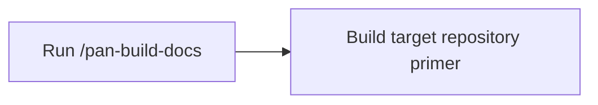

# Target repository primer

<!-- pancreator-primer-status: unbuilt -->
<!-- generated-at: unavailable -->
<!-- source-head: unavailable -->

## Summary

This primer has not been built. Run `/pan-build-docs` before substantive repository work.

## Administrative commands

### Install

Unavailable until the primer is built.

### Build

Unavailable until the primer is built.

### Test

Unavailable until the primer is built.

### Other

Unavailable until the primer is built.

## Architecture

## Project structure

Unavailable until the primer is built.

## Public interfaces

Unavailable until the primer is built.

## Gotchas

The repository has not yet been scanned by the librarian.
