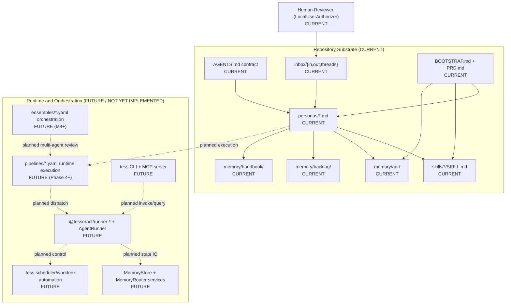

## Context

Tesseract requires one architecture map that operators can inspect before every
phase-boundary ratification. The map MUST separate current implemented
repository substrate from runtime elements that are planned but not yet landed.
Without that separation, operators cannot validate scope or phase claims
deterministically.

The current repository already contains authoritative docs, persona specs,
skills, inbox queues, ADR memory, and backlog memory. The current repository
does not yet run those assets through a fully implemented pipeline runtime.

## Decision

Tesseract SHALL adopt this ADR as the baseline architecture system map for
bootstrap operations. Every architecture-facing operator document MUST reference
this ADR when it describes cross-component relationships in the current
repository state.

Architecture statements in this ADR SHALL use the following boundary rule:

- CURRENT means the path or artifact class exists in the repository now.
- FUTURE means the capability is declared in PRD or BOOTSTRAP but not yet
  implemented as an executable runtime flow in this repository.

Any future architecture map revision MUST preserve explicit CURRENT versus
FUTURE labels for every major node so phase-gate review remains testable.

## Status

Status is proposed on 2026-04-25 and awaits human ratification at the next
bootstrap phase boundary.

## Consequences

- positive: Operators gain one canonical diagram for current system orientation
  before authoring or ratifying new artifacts.
- positive: CURRENT versus FUTURE boundaries reduce phase-claim ambiguity and
  support deterministic scope review.
- negative: Architecture updates now require ADR maintenance whenever scaffold
  state changes materially.
- negative: Any document that describes runtime behavior without the CURRENT and
  FUTURE distinction MUST be corrected before phase-exit ratification.
- neutral: This ADR maps architecture state; it does not change execution logic
  or bootstrap phase ordering.
