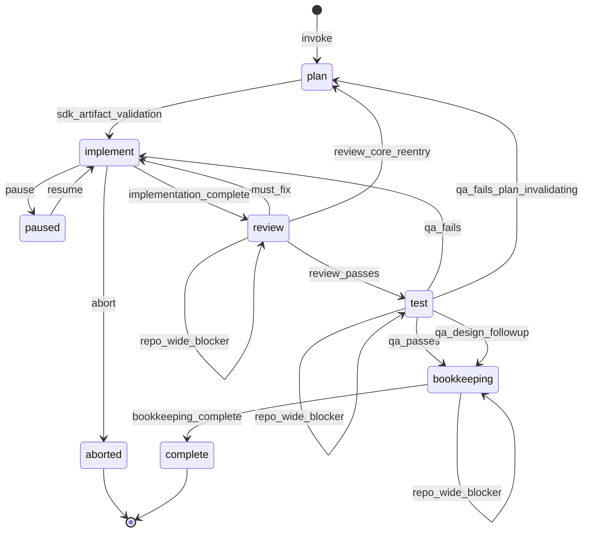

---
slug: feature-delivery-pipeline-overview
stability: experimental
bootstrap-only: false
phase: "0b"
owners: [supervisor, tech-lead]
purpose: "Human-readable walkthrough of the feature-delivery pipeline stages, validation duties, and runtime transitions."
related:
  - /AGENTS.md
  - /lib/memory/handbook/pipeline-state-contract.md
  - /lib/pipelines/feature-delivery.yaml
...

# Operator section
- 👀 **In this file:** Human-readable overview of the `feature-delivery` pipeline.
- ⚖️ **Why it matters:** Explains what each stage expects, validates, and emits without requiring a full read of the pipeline YAML and every owner persona.
- 🧭 **See also:**
  - /lib/memory/handbook/pipeline-state-contract.md
  - /lib/pipelines/feature-delivery.yaml
  - /lib/memory/handbook/agent-document-registry.md

# Feature-Delivery Pipeline Overview

This page is an orientation layer for the `feature-delivery` pipeline. The
binding contract remains `lib/pipelines/feature-delivery.yaml`, the stage-owner
persona specs under `lib/personas/`, and the machine-checkable gate rules in
`lib/internal/packages/@pancreator/cli/src/feature-delivery-gate-validation.ts`.

The overview below distinguishes:

- declared stage contracts in the pipeline YAML;
- owner-persona duties in the persona specs; and
- actual runtime transitions implemented by the CLI runner.

## Shared contract baseline

Every declared stage resolves the same base contract set before it acts:

- `AGENTS.md`
- `DOC.REGISTRY`
- `DOC.PERSONA_CONTRACTS`
- `DOC.OUTPUT_MANIFEST`
- `PIPE.FEATURE_DELIVERY`

Each stage then adds its own stage-specific docs such as
`DOC.PIPELINE_STATE`, `DOC.ENG_SOFTWARE`, `DOC.DESIGN_CRAFT`, or
`DOC.RUN_LOG_SCHEMA`.

For shell-based repository inspection, every stage owner MUST apply RTK-first
retrieval per `DOC.CONTEXT_ECONOMY` and MUST record rationale before escalating
to raw shell output.

The pipeline state contract adds the shared transition rule: before a stage
advances, the validator MUST confirm that required outputs exist, output
manifests are present, definitions of done are evidenced, bounded amendments are
valid and ratified, and the gate predicate is satisfied.

## Declared stages

| Stage | Owner persona | Main output | Default pass event |
| --- | --- | --- | --- |
| `plan` | `tech-lead` | `touch-set.json` (plus consolidated plan bundle) | `sdk_artifact_validation` |
| `implement` | `coder` | `implementation-report.md` | `implementation_complete` |
| `review` | `reviewer` | `review.md` | `review_passes` |
| `test` | `qa-tester` | `test-report.md` | `qa_passes` |
| `bookkeeping` | `librarian` | `delivery-report.md` + durable feature `index.json` | `bookkeeping_complete` |

## Stage-by-stage walkthrough

### `plan`

**Expected inputs**

- `lib/inbox/in/<day>/<directive>.md`
- `.pan/work/<day>/<task-id>/product/plan-prompt.md`
- `.pan/work/<day>/<task-id>/design/plan-prompt.md`
- active run ledger data such as `state.json`
- companion planning artifacts from `product-engineer` and `design-engineer`

**Owner validation**

- `plan.md` includes `## Acceptance criteria` and `## Shared-layer impact`
- `touch-set.json` includes `paths`, `tests`, `shared_paths`,
  `integration_prerequisites`, `acceptance_criteria`,
  `manual_qa_test_cases`, and `amendments`
- acceptance criteria are measurable and mapped across product, design, and tech
- `manual-qa-test-cases.md` covers user-visible behavior or explicitly states
  `none`
- `handoff.md` includes `## Validation commands`

**Loaded context**

- shared contract baseline
- `DOC.PIPELINE_STATE`
- `DOC.ENG_SOFTWARE`
- `DOC.ENG_TYPESCRIPT`
- `DOC.COMPLIANCE_RUNS`
- `DOC.DOC_IMPACT`
- `DOC.GLOSSARY`
- `DOC.CONTRACT_STYLE`
- `DOC.CONTRACT_FORMAT`

**Actions**

- consolidates product, design, and tech planning into a bounded execution bundle
- emits tech plan and technical acceptance criteria
- emits manual QA cases, consolidated `plan.md`, ADR draft, touch-set, and handoff
- leaves executor scope bounded while preserving a narrow auto-amend lane
- the runner also regenerates `next-prompt.md` and the companion prompt artifacts

**Done criteria**

- product, design, and tech plans exist with acceptance criteria
- `touch-set.json` declares all required arrays and starts `amendments` at `[]`
- `handoff.md` names validation commands
- every durable Markdown artifact includes `## Output manifest`

**Transition states and criteria**

- pass: `human_approval -> implement`
  - criteria: all required plan outputs exist and their content validators pass
- fail/hold: `plan_remediation`
  - criteria: missing or malformed planning artifacts; runtime holds the stage
    until `tech-lead` repairs it

### `implement`

**Expected inputs**

- `.pan/work/<day>/<task-id>/next-prompt.md`
- `.pan/work/<day>/<task-id>/handoff.md`
- `.pan/work/<day>/<task-id>/touch-set.json`
- plan and acceptance-criteria artifacts for product, design, and tech
- `.pan/work/<day>/<task-id>/manual-qa-test-cases.md`

**Owner validation**

- every changed path stays inside `paths`, `shared_paths`, or ratified amendments
- every changed public symbol gains or updates at least one test
- lint, typecheck, test, coverage, and required compliance evidence are recorded
- every `P-AC-`, `D-AC-`, and `T-AC-` criterion maps to changed-file or test evidence
- any bounded scope amendment is recorded in both `touch-set.json` and
  `implementation-report.md`

**Loaded context**

- shared contract baseline
- `DOC.PIPELINE_STATE`
- `DOC.ENG_SOFTWARE`
- `DOC.ENG_TYPESCRIPT`
- `DOC.COMPLIANCE_RUNS`
- full bounded plan bundle before code changes begin

**Actions**

- implements production code and tests inside the bounded touch-set
- records low-risk paired-file amendments when the contract allows them
- emits `implementation-report.md` with acceptance and validation evidence

**Done criteria**

- `implementation-report.md` records `implement_gate_passes: true`
- acceptance-criteria matrix covers every product, design, and tech criterion
- automated checks and coverage evidence are recorded
- required compliance checks are recorded when triggered

**Transition states and criteria**

- pass: `implementation_complete -> review`
  - criteria: `implementation-report.md` exists and records
    `implement_gate_passes: true`
- fail/hold: `implementation_remediation`
  - criteria: the stage cannot satisfy scope, criteria, or validation requirements
- special runtime controls:
  - `pause -> paused`
  - `resume -> implement`
  - `abort -> aborted`

### `review`

**Expected inputs**

- `.pan/work/<day>/<task-id>/handoff.md`
- `.pan/work/<day>/<task-id>/touch-set.json`
- `.pan/work/<day>/<task-id>/implementation-report.md`
- product, design, and tech acceptance-criteria artifacts
- `.pan/work/<day>/<task-id>/manual-qa-test-cases.md`
- current local diff

**Owner validation**

- every `P-AC-`, `D-AC-`, and `T-AC-` criterion is verified
- every touch-set `tests` command passes before `review_passes: true`
- every Spec Contract pulled in by `contracts:from_feature` is executed
- bounded amendments are valid, recorded, and ratified
- `must fix` findings remain unresolved only when the stage fails

**Loaded context**

- shared contract baseline
- `DOC.ENG_SOFTWARE`
- `DOC.ENG_TYPESCRIPT`
- `DOC.COMPLIANCE_RUNS`
- `modern-code-review` skill

**Actions**

- performs bounded code review against the touch-set and implementation evidence
- writes `review.md` with verdict, findings, Spec Contract results, coverage delta,
  and touch-set test outcomes

**Done criteria**

- `review.md` declares `review_passes` and `scope_amendments_ratified`
- every product, design, and tech criterion is either evidenced or routed to re-entry
- output manifest is present and echoed

**Transition states and criteria**

- `review_passes -> test`
  - criteria: `review_passes: true` and `scope_amendments_ratified: true`
- `must_fix -> implement`
  - criteria: issues are fixable inside the current plan/touch-set
- `review_core_reentry -> plan`
  - criteria: `core_reentry_required: true`; plan or touch-set is invalid
- `review_spot_fix -> review`
  - criteria: valid artifact-only spot-fix justification
- `repo_wide_blocker -> review`
  - criteria: unrelated repository blocker is recorded without advancing

### `test`

**Expected inputs**

- `.pan/work/<day>/<task-id>/review.md`
- `.pan/work/<day>/<task-id>/touch-set.json`
- `.pan/work/<day>/<task-id>/manual-qa-test-cases.md`
- `.pan/work/<day>/<task-id>/ux-spec.md` when design steps are enabled
- current diff and validation output

**Owner validation**

- every touch-set gate command is executed and recorded
- every full-repository visibility command is recorded, even when excluded from gate
- every manual QA case is exercised and logged
- `design_qa_passes: true` is also required when design steps are enabled
- qualifying spot fixes remain narrow and in-scope

**Loaded context**

- shared contract baseline
- `DOC.ENG_SOFTWARE`
- `DOC.ENG_TYPESCRIPT`
- `DOC.DESIGN_CRAFT`
- `DOC.COMPLIANCE_RUNS`
- parallel design-QA companion artifacts when applicable

**Actions**

- runs automated verification for touch-set and full-repository visibility
- executes manual QA proportional to the touch-set
- may apply bounded straightforward fixes
- aggregates design QA from `design-reviewer` when the run enables design steps

**Done criteria**

- `test-report.md` declares `qa_passes`
- manual QA evidence is recorded
- `design-qa-report.md` declares `design_qa_passes` when design QA runs
- output manifests are present in the emitted reports

**Transition states and criteria**

- `qa_passes -> report`
  - criteria: `qa_passes: true`; if design steps are on, `design_qa_passes: true`
- `qa_design_followup -> report`
  - criteria: functional QA passed, design QA returned
    `design_qa_passes: false` with `excluded_from_gate: true`
- `qa_spot_fix -> test`
  - criteria: valid bounded spot-fix justification
- `qa_fails -> implement`
  - criteria: touch-set failure needs coder remediation
- `qa_fails_plan_invalidating -> plan`
  - criteria: QA finding changes intended behavior or scope
- `repo_wide_blocker -> test`
  - criteria: unrelated repository blocker is recorded without advancing

### `report`

**Expected inputs**

- `.pan/work/<day>/<task-id>/implementation-report.md`
- `.pan/work/<day>/<task-id>/review.md`
- `.pan/work/<day>/<task-id>/test-report.md`
- cited plan, ADR, source, and test artifacts referenced by the report template

**Owner validation**

- `delivery-report.md` contains the required six sections in order
- claims are citation-backed
- citation objects use canonical JSON formatting
- summary and full-body word-count limits hold

**Loaded context**

- shared contract baseline
- `DOC.OPERATOR_OUTPUT`
- `DOC.RUN_LOG_SCHEMA`
- `DOC.DELIVERY_REPORT_TEMPLATE`
- `DOC.GLOSSARY`
- `DOC.CONTRACT_STYLE`

**Actions**

- writes a delivery report for the feature as an operator-facing artifact
- summarizes implementation, interfaces, tradeoffs, usage guidance, and testing

**Done criteria**

- `delivery-report.md` summarizes implementation, review, QA, compliance, and
  remaining operator work
- claims cite source artifacts
- output manifest is present and echoed

**Transition states and criteria**

- `report_ready -> compliance`
  - criteria: `delivery-report.md` exists and satisfies content plus manifest checks
- fail/hold: `report_remediation`
  - criteria: the report is missing or malformed; runtime holds the stage
- `repo_wide_blocker -> report`
  - criteria: unrelated repository blocker is recorded without advancing

### `compliance`

**Expected inputs**

- `.pan/work/<day>/<task-id>/touch-set.json`
- `.pan/work/<day>/<task-id>/review.md`
- `.pan/work/<day>/<task-id>/test-report.md`
- `.pan/work/<day>/<task-id>/delivery-report.md`
- current diff
- optional audit baseline or focused run-log selector

**Owner validation**

- final gate command results are recorded under `final_gate`
- compliance descriptors run when `DOC.COMPLIANCE_RUNS` says the surface is in scope
- baseline-delta drift, documentation impact, style, and active-memory drift are reviewed
- gate recommendation follows the canonical compliance rubric

**Loaded context**

- shared contract baseline
- `DOC.PIPELINE_STATE`
- `DOC.COMPLIANCE_RUNS`
- `DOC.RUN_LOG_SCHEMA`
- `DOC.OPERATOR_OUTPUT`
- `DOC.DOC_IMPACT`
- `DOC.CONTRACT_STYLE`
- `DOC.CONTRACT_FORMAT`

**Actions**

- runs the compliance-stage exit bundle
- runs descriptor-backed compliance checks when required
- performs judgment-based policy review
- emits `compliance-result.json`
- may also emit audit and remediation reports

**Done criteria**

- `compliance-result.json` declares `compliance_passes`
- `final_gate` records command results
- output manifest is present and echoed

**Transition states and criteria**

- `compliance_passes -> ship`
  - criteria: `compliance_passes: true` and all final-gate commands pass
- `compliance_spot_fix -> compliance`
  - criteria: valid bounded spot-fix justification
- `compliance_fails -> implement`
  - criteria: non-plan-invalidating compliance failure
- `compliance_fails_plan_invalidating -> plan`
  - criteria: compliance issue invalidates the current plan
- `repo_wide_blocker -> compliance`
  - criteria: unrelated repository blocker is recorded without advancing

### `ship`

**Expected inputs**

- local diff
- `.pan/work/<day>/<task-id>/delivery-report.md`
- `.pan/work/<day>/<task-id>/compliance-result.json` when the compliance stage is present

**Owner validation**

- the diff has been human-ratified before the stage advances
- local staging happens only after ratification
- the run log, checkpoints, and operator-visible status remain consistent

**Loaded context**

- shared contract baseline
- `DOC.PIPELINE_STATE`
- `DOC.RUN_LOG_SCHEMA`
- `DOC.OPERATOR_OUTPUT`
- `DOC.PANCREATOR_CONFIG`

**Actions**

- orchestrates the ship gate
- prepares local ship artifacts
- blocks for human ratification before any push or PR creation

**Done criteria**

- `ship-ratification.json` records `human_ratified_diff: true`
- local diff is staged only after ratification

**Transition states and criteria**

- `human_ratifies_local_diff -> index`
  - criteria: `ship-ratification.json` records `human_ratified_diff: true`
- fail/hold: `ship_blocked`
  - criteria: ratification is missing or withheld; runtime remains blocked at ship

### `index`

**Expected inputs**

- delivery report and accepted ship artifacts
- active run-directory paths under `.pan/work/<day>/<task-id>/`

**Owner validation**

- durable feature index JSON shape is correct
- `artifact_index` points at acceptance-criteria sources, gate evidence, audit logs,
  and compliance artifacts
- `pipeline-close.md` and `operator-verification.md` exist
- active work and inbox artifacts are ready for closure

**Loaded context**

- shared contract baseline
- `DOC.PIPELINE_STATE`
- `DOC.MEMORY_TIERS`
- `DOC.RUN_LOG_SCHEMA`
- `DOC.OPERATOR_OUTPUT`

**Actions**

- refreshes durable feature memory
- writes `pipeline-close.md`
- writes or finalizes `operator-verification.md`
- prepares the run for `pnpm -w exec pan close-artifacts <task-id>` during complete

**Done criteria**

- durable feature index is refreshed with artifact pointers
- pipeline close and operator verification artifacts exist
- active work is ready for closure

**Transition states and criteria**

- `artifacts_indexed -> complete`
  - criteria: index artifacts exist and validate
- fail/hold: `index_remediation`
  - criteria: index artifacts are missing or malformed; runtime holds the stage

## Runtime state machine

The runner includes control and terminal states beyond the YAML's declared stages:

- entry state: `created`
- control states: `paused`, `aborted`
- terminal state: `complete`

The runtime graph for the default bookkeeping-based pipeline is:

## Implementation notes

- `plan_remediation`, `implementation_remediation`, `report_remediation`,
  `ship_blocked`, and `index_remediation` are important contract outcomes, but
  they are not all distinct runtime graph edges. Several behave as hold-and-fix
  gate states rather than a transition to a different stage node.
- `next-prompt.md`, `design-qa-prompt.md`, checkpoints, and run-log updates are
  runner-owned helper artifacts. They are part of the pipeline's operation, but
  they are not all owner-persona-authored deliverables.
- In SDK mode, the runner may auto-chain pass events and some remediation events
  after it validates the current stage artifacts. Retry-budget enforcement can
  halt repeated remediation loops.
